# Knowledge Catalog MVP 系统设计白皮书

**Knowledge Ingress、Knowledge Repository、Knowledge Access 与版本化联合视图**  
**版本：v5.0 · 日期：2026-08-16 · 状态：MVP Architecture Candidate**

> **系统主张**：Knowledge Catalog 不是一个放大版 Repository，也不是“跨 Repo 文件覆盖系统”。它是多个独立权威 Knowledge Repository 的注册、发现和版本化联合视图边界。Ingress 是薄的强类型写入边界；Repository 以 Git 语义维护权威知识；Access 在精确 ViewGeneration 上提供来源保留的读取与检索；Application 与主动控制平面在其上消费、分析和提出维护候选。

本文恢复并统一整个系统设计，而不是 Repository/View 专题稿：先给出整体架构愿景，再完整设计 Knowledge Ingress、Knowledge Repository 和 Knowledge Access 三层；Application 与主动控制平面只描述交互边界。设计坚持 MVP，冻结长期稳定的身份、版本、写入和读取语义，同时为规模化、语义算子与主动维护保留扩展点。

v5.0 的关键修正是：`public / group / personal` 是权威、权限和维护边界，默认对应独立 Repository；它们不是目录层级，也没有覆盖优先级。Catalog 通过 `ViewDefinition → ViewGeneration` 联合精确 Commit；普通跨 Repo 关系使用 `KnowledgeRef`；Candidate 测试绑定完整 `PreviewGeneration`；上游升级不触发跨 Repo Git merge。

## 文档规范

本文使用以下规范性措辞：

| 词 | 含义 |
|---|---|
| **MUST / 必须** | 跨 Catalog Profile 不得改变的语义不变量 |
| **SHOULD / 应当** | MVP 默认选择；改变时应有明确设计决策 |
| **MAY / 可以** | 可选能力或规模优化 |
| **Canonical** | 某个 Repository 内的权威状态；不意味着只有一种物理 Backend |
| **Projection** | 从明确 Repository Commit / ViewReadVersion 可重建的访问状态 |
| **Profile** | 一组 Backend、Provider 与能力保证的实现组合 |
| **KnowledgeRef** | `RepositoryIdentity + ObjectIdentity`；跨 Repo 稳定知识身份 |
| **ViewGeneration** | `RepositoryIdentity → CommitIdentity` 的不可变联合快照锁 |
| **Write Surface** | Ingress 的 `COMMIT / PROPOSAL / APPEND` 三种写入意图 |
| **Binding** | Principal 可通过哪个 Surface 写入哪个 Repository/Ref/Scope 的授权契约 |
| **Repository Release** | 对一个精确 Repository Commit 的不可变发布描述 |

***

# 0. 执行摘要

## 0.1 最终架构

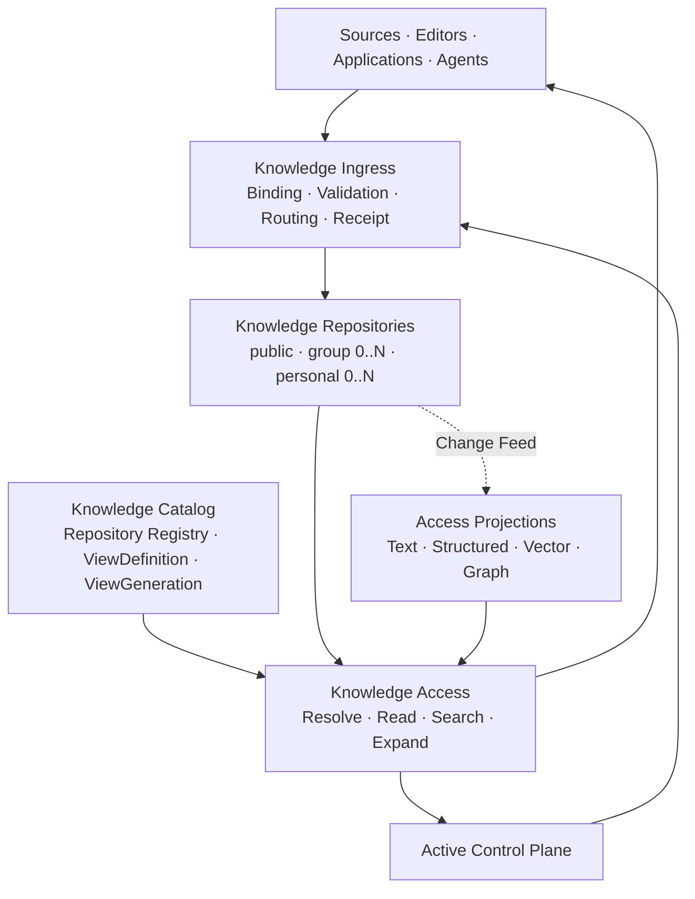

系统有四个核心领域边界：

1. **Knowledge Catalog**：注册 Repository、管理 Catalog 生命周期、保存 ViewDefinition，并发布不可变 ViewGeneration；不拥有成员知识。
2. **Knowledge Ingress**：接收已明确目标的 COMMIT / PROPOSAL / APPEND，机械执行鉴权、Binding、Schema、前置条件、幂等、写路由与 Receipt。
3. **Knowledge Repository**：独立身份、ACL、Object/Tree/Commit/Ref/Release、Stream 和保留策略的权威边界。
4. **Knowledge Access**：解释精确 Repository Commit、ViewGeneration 或 ViewReadVersion 上的读取；索引、图和模型只是 Projection Provider。

应用与主动控制平面只做轻量定位：

- Application 通过 Access 读、通过 Ingress 写；Context Assembly 和最终回答属于应用。
- 主动控制平面可以 Watch、Diff、评估、发现分歧并提交 PROPOSAL，但不能绕过 Ingress，也不能让 Ingress 临时做语义分析。

## 0.2 MVP 的语义压缩

| 维度 | MVP 冻结内容 |
|---|---|
| **4 个 Catalog 核心对象** | RepositoryRegistration、ViewDefinition、ViewGeneration、Promotion |
| **3 个 Ingress Surface** | `COMMIT`、`PROPOSAL`、`APPEND` |
| **Git 状态内核** | Object、Tree、Commit、Ref、Release、CAS RefUpdate |
| **4 类 Canonical Collection** | Snapshot、Append、Derived、Artifact |
| **4 个 Structural Pattern** | Record、Keyed Collection、Ordered Artifact、Relation Set |
| **3 种跨 Repo 引用** | KnowledgeRef、PinnedKnowledgeRef、FileRef |
| **2 个 View 对象** | ViewDefinition、ViewGeneration；含 Stream 时再扩展 ViewReadVersion |
| **12 个 Access Operation** | CAPABILITIES、DESCRIBE_SCHEMA/INDEX、RESOLVE、READ_OBJECT、LIST_TREE、LOG、DIFF、ORIGIN、SEARCH、EXPAND_RELATIONS、WATCH_UPDATES |
| **2 个可选语义精炼算子** | SEM_FILTER、SEM_RERANK；输入输出保持 KnowledgeRef |

MVP 不重新实现 Git：Repository 的创建、修改、分支、合并、发布和回滚复用 Git 语义。Catalog 只补充 Git 不提供的稳定知识身份、多 Repo 精确联合、明确 Write Routing 与 Candidate Preview。`Mount` 最多是实现内部“物化一个 RepositorySnapshot”的术语，不是覆盖、复制或跨 Repo 修改协议。

## 0.3 四个核心域与两个上层职责

```text
Catalog       对“有哪些独立 Repository、如何组成一个精确联合视图”作出承诺。
Ingress       对“谁能以哪种写语义向哪个 Repository/Ref/Scope 写，并得到什么 Receipt”作出承诺。
Repository    对“知识怎样以 Git 语义原子演化、发布、回滚并保留历史”作出承诺。
Access        对“在什么 Commit/Generation/Stream Cut 上，以什么覆盖率和来源读取”作出承诺。
Application   对“如何组装上下文、完成任务和生成最终输出”负责。
Control Plane 对“如何发现维护需求、形成候选、测试、审批和 Promote”负责。
```

## 0.4 本次相对既有设计的关键修订

| 修订 | 最终决定 | 原因 |
|---|---|---|
| Catalog / Repository | Catalog 是注册与组合边界；Repository 恢复为公开权威边界 | public/group/personal 有独立 ACL、Branch、Release 与维护节奏 |
| 写入语义 | Ingress 使用 `COMMIT / PROPOSAL / APPEND` 三种明确 Surface | Producer 必须选择稳定写入意图；Ingress 不推断意图 |
| Repository 内核 | Object / Tree / Commit / Ref / Release + Stream | 多数维护复用 Git；仅高频 Append 保留非 Git 语义 |
| Pattern 轴 | 删除 `Append Log` 与 `Derived Signal` 作为结构 Pattern，只保留四个纯结构 Pattern | Append / Derived 是 Collection 演化语义，不应与内容结构混为一轴 |
| View 组合 | `ViewDefinition → ViewGeneration(repo→commit)` | 多个独立权威快照联合，不使用目录覆盖和层级优先级 |
| 跨 Repo 引用 | KnowledgeRef / PinnedKnowledgeRef 高于 Path；FileRef 只定位原始文件 | 对象移动不破坏引用；审计仍可精确复现 |
| 本地分歧 | 创建本地 Assertion/Relation；知识 OverlayPatch 不进 MVP | 不静默覆盖 public；各来源断言并存 |
| Candidate 测试 | ValidationReport 绑定完整 PreviewGeneration | 测试依赖组合环境，不能只绑定单个 Commit |
| Fork / Vendor | Fork 新身份并可三方同步；Vendor 保留只读精确副本 | 普通引用升级不做 merge |
| Semantic Refinement | 保留协议方向，但降为 Access 的可选 Capability | Base Profile 必须能以 Files + Git + grep 实现；模型不能成为兼容前提 |
| Proposal | 指向 Candidate Branch/Commit 的治理对象，不复制知识状态 | 候选历史由 Git 表达，审批结果绑定精确 Commit |
| Projection | 完全归属 Access 实现状态，不进入 Repository 逻辑知识树 | 避免索引、向量、图邻接成为隐性权威 |
| Governance | 不给每条知识附加统一复杂状态机；Accepted 由 Collection/Revision 位置表达 | 控制 MVP 复杂度，避免 `status` 字段混合候选、生命周期与冲突状态 |

## 0.5 推荐 MVP Profile

```text
Catalog Registry / View Lock    SQLite 或 Git-tracked manifest
Repository Snapshot / Contract  Files + Git
Append / Receipt / Proposal Metadata  SQLite WAL；Candidate 内容仍在 Git
Artifact                        Local content-addressed directory
Access                          Address map + file read + ripgrep + Git history
Optional Projection             SQLite FTS5；后续可替换 Search / Vector / Graph Provider
```

第一阶段明确不需要：Kafka、OpenSearch、通用 Graph DB、跨 Repo 分布式事务、知识语义 OverlayPatch、自动冲突裁决、通用工作流 DSL、任意图路径语言和全库 `LLM_QUERY`。

***

# Part I　分析与设计推导

# 1. 问题定义

## 1.1 真正的问题不是“知识存哪里”

通用知识底座长期面对的是一组相互耦合、但不能用单一数据库抽象覆盖的问题：

- 同一个对象内部，不同部分由不同来源维护，变化频率与冲突粒度不同；
- 原始观察、正式定义、动态事实、派生摘要和访问索引具有不同认识论地位；
- 权威系统变更、用户编辑、维护建议和运行事件不是同一种写入；
- 小规模时文件、Git 与 grep 最经济，规模扩大后可能需要 SQL、全文、向量和图投影；
- Agent 需要稳定引用、版本和来源，而不只是“返回一段相似文本”；
- 模型可以辅助判断和派生，但不能模糊“读取、推断、提交”的边界。

因此，目标不是选择一个万能 Store，而是定义一套与 Store 无关的逻辑语义：

> **稳定身份 + 精确地址 + 类型化演化语义 + 薄写入协议 + 稳定读取协议。**

## 1.2 哪些必须稳定，哪些必须可替换

| 必须稳定 | 可以替换 |
|---|---|
| CatalogIdentity、RepositoryIdentity、KnowledgeRef | 部署方式、进程边界、服务发现 |
| Commit/Ref/Release 与 ViewGeneration 语义 | Git、数据库、对象存储或混合实现 |
| COMMIT / PROPOSAL / APPEND 与 Receipt | HTTP、gRPC、MCP、进程内 SDK |
| Candidate / Validation / Approval / MergeGate | Review UI、队列、审批组织方式 |
| Collection 演化语义 | 具体表、目录、对象桶与索引 |
| Pattern 的维护单位 | YAML、JSON、Markdown、SQL 行 |
| Repository Commit / ViewGeneration / Stream Cut | Commit ID、Cursor、Hash 的具体编码 |
| Core Read Operation 与 Result Type | grep、FTS、OpenSearch、向量 Provider |
| Provenance 的最小语义 | W3C PROV、OpenLineage 或内部格式的映射 |
| Refine 的 Ref 封闭性 | LLM、Cross-Encoder、规则或人工 Judge |

架构的长期可演化性来自这条分界，而不是来自预先设计更多组件。

## 1.3 四个根本区分

### 区分一：Ingress Surface 不等于 Repository Primitive

```text
COMMIT    权威写入意图；路由为目标 Repo 的 ChangeSet + CAS RefUpdate
PROPOSAL  候选写入意图；路由为 Candidate Branch/Commit + Proposal
APPEND    不可变记录意图；路由为目标 Repo Stream Append
```

Surface 是 Producer 需要选择的协议语义；Object/Tree/Commit/Ref/Release 是 Repository 状态语义。Ingress 不把三种 Surface 重新解释成知识类型，也不在写入时推断用户意图。

### 区分二：Catalog 不等于 Repository，也不等于 Projection

```text
Knowledge Catalog
  Repository Registry / ViewDefinition / ViewGeneration

Knowledge Repository
  Identity / ACL / Commit / Ref / Release / Stream

Backend
  Files / Git / SQLite / PostgreSQL / Object Store

Access Projection
  Lexical / Vector / Graph / Fragment / Cache
```

Catalog 组合多个独立 Repository；Repository 才是知识权威和写入边界；Backend 可以迁移；Projection 可以丢失和重建。三者不能合并成一个“全局 Repo”。

### 区分三：Release 不等于 Ref / View Promote

```text
CREATE_RELEASE  产生不可变、可引用的 Repository 版本
UPDATE_REF      原子移动 Repository Branch/Head
PROMOTE_VIEW    原子移动 Catalog Serving View 到精确 ViewGeneration
```

创建 public R18 不自动改变任何 group/personal View；必须构造、验证并 Promote 新 ViewGeneration。Repository Branch 与 Catalog Serving View 是两类不同 CAS 指针。

### 区分四：Structure 不等于 Epistemic Role，也不等于 Collection

例如“用户偏好素食”可以同时出现为：

```text
原始对话 Episode                    Append + Observation
模型提取的偏好候选                  Derived + Assertion
被正式接受的当前偏好                Snapshot + Assertion
用于检索的 user→prefers→vegetarian  Graph Projection
```

同一个“知识主题”并不能决定它应如何持久化、更新、冲突或访问。

## 1.4 MVP 非目标

本白皮书第一阶段不试图：

- 构建通用本体或统一 KnowledgeType 大枚举；
- 让 Ingress 执行来源解析、Identity Resolution、LLM 抽取、冲突分析或影响分析；
- 公开完整 SQL / GraphQL / SPARQL / GQL 式查询语言；
- 为所有类型定义自动 Merge、Resolution 与 Admission；
- 把所有内容变成三元组或向量；
- 支持知识语义 Overlay、运行时跟随 latest 或跨 Repo 原子写；
- 保证所有 Profile 具有相同性能和高级能力；
- 用分布式事务制造一个虚假的跨 Store 全局 Commit。

# 2. 设计原则

## 2.1 第一性原则

### P1：知识系统首先是可寻址、可版本化的状态系统

没有稳定身份、精确地址、Commit/Ref/Release 和显式写入语义，系统无法可靠表达创建、修改、追加、发布、回滚、Diff 与来源。

### P2：Catalog 与 Repository 是两个公开领域边界

Catalog 负责注册、发现与组合；Repository 负责身份、ACL、历史、发布和维护。public/group/personal 默认是独立 Repository，不是 Catalog 内目录。

### P3：统一逻辑表面不要求统一物理存储

统一发生在 Contract：Catalog、Repository、KnowledgeRef、Schema、Collection、版本和读写协议；不是“所有内容进入同一个数据库”。

### P4：Ingress 必须语义薄、执行强

Ingress 不理解知识含义，也不推断 Surface；但必须严格执行 target Repository、Binding、Schema、Scope、幂等、前置条件、Producer Ordering 和 Durable Receipt。

### P5：Repository State Kernel 只维护状态不变量

Repository 可以拒绝非法 ChangeSet、地址、Schema、Commit 前置条件与引用；它不负责判断两个不同 Repository 的断言谁更可信。

### P6：Release、RefUpdate 与 View Promote 必须分离

不可变版本存在不等于已进入 Branch 或 Serving View。Repository Ref 与 Catalog View Ref 的移动必须分别 CAS 和审计。

### P7：Access 应表达稳定用户任务，而不是暴露执行流水线

`RESOLVE`、`READ_OBJECT`、`SEARCH`、`EXPAND_RELATIONS` 是稳定任务；Locate、Index Scan、Hydrate、Rerank 是内部阶段或可选扩展。

### P8：原始记录不能被摘要或推断替代

Observation / Evidence 应可回到原始来源；Derived Value 必须携带输入版本与生成活动。

### P9：不允许静默 Last-Write-Wins

“更晚到达”不等于“更正确”。并发由 Precondition 处理；语义冲突应保留并由上层提出 Resolution。

### P10：完整值 Mutation 比通用 PATCH 更适合 MVP

Patch 语义依赖 JSON Path、Markdown Section、数组策略和 Schema 演化。MVP 使用精确地址 + 完整值 + CAS；编辑器可在外部把局部编辑编译成 PUT / REMOVE。

### P11：能力差异必须显式

不支持 Vector、Refine、多跳 Graph 或复杂 Predicate 时，Profile 必须声明，调用方不能收到静默伪装的结果。

### P12：模型介导能力必须有封闭输入输出

Filter / Rerank 只能操作调用前确定的 CandidateSet；一旦能发现新 Ref、调用工具或改变计划，它就是 Application / Agent，而不是 Access Operator。

## 2.2 核心不变量

```text
K-01  每个 Ingress Command 必须指定唯一 target_repository；View 不可写。
K-02  每个 Repository 具有独立身份、ACL、Commit 图、Ref、Release 和生命周期。
K-03  public/group/personal 是治理 Scope，不是目录优先级。
K-04  KnowledgeRef 不依赖文件路径；PinnedKnowledgeRef 固定 Commit；FileRef 还固定 Path/Digest。
K-05  Object、Tree、Commit、Release 和已接受 Stream Record 不可变。
K-06  RefUpdate 必须带 expected-old；Change 必须带 expected Object/Commit 前置条件。
K-07  Proposal 指向 Candidate Branch/Commit；Proposal Durable 不表示 main 已改变。
K-08  Review、Validation、Approval 与 MergeGate 必须绑定精确候选 Commit。
K-09  ValidationReport 必须绑定完整 PreviewGeneration，而非只绑定候选 Commit。
K-10  ViewGeneration 是 RepositoryIdentity→CommitIdentity 的不可变 Map；同一 Repo 只能出现一次。
K-11  Branch/Release 只可出现在 ViewDefinition 和解析证据中；稳定读取不得运行时跟随 latest。
K-12  联合结果必须保留 source Repository/Commit/Object/Scope/Provenance。
K-13  同一主题的多来源 Assertion 并存；不得按 Scope 静默覆盖。
K-14  普通知识引用升级不修改引用方 Repo，也不产生跨 Repo merge。
K-15  Fork 创建新 KnowledgeRef；只有 Fork sync 使用 Base/Upstream/Local 三方比较。
K-16  Vendor 保留来源精确 pin 与只读副本；本地编辑必须转为 Fork。
K-17  APPEND Entry 不原地修订；Correction/Retraction 通过新 Entry 表达。
K-18  相同幂等键与相同 Command Digest 返回原 Receipt；不同 Digest 冲突。
K-19  Projection 不属于 Canonical Repository，必须声明 basis 和 coverage。
K-20  ViewGeneration 锁数据，不锁用户权限；授权审计另存 AuthorizationDecisionRef。
K-21  Application 与主动控制平面不得绕过 Ingress 直接写 Backend/Ref。
K-22  不构造跨 Repository 的虚假单一事务。
K-23  Profile 迁移不得改变 RepositoryIdentity、KnowledgeRef、版本和读写协议语义。
```

## 2.3 被明确拒绝的设计

| 方案 | 拒绝原因 |
|---|---|
| Ingress = ETL + LLM + Conflict Analyzer | 将来源消费、语义分析和状态写入耦合，无法形成稳定写入边界 |
| Catalog = Git Repo 或 Catalog = PostgreSQL | 把一种 Profile 当作领域抽象，规模或工作负载变化即重写上层 |
| `write(payload)` / `PUT anything` | 隐藏 COMMIT、PROPOSAL、APPEND 和目标 Repository 的不同不变量 |
| 所有知识一个 JSON Payload | 无法推导独立维护单位、冲突、历史、索引与来源义务 |
| 每条知识统一复杂 status | 混淆治理、生命周期、冲突与有效性；状态机先于真实需求 |
| Projection 作为权威 | 索引错误或重建会反向改变知识事实 |
| 通用 PATCH DSL | 过早绑定物理格式，并破坏跨 Profile 语义一致性 |
| 完整图查询语言 | MVP 不具备授权穿越、循环、成本、路径排序和优化器需求 |
| `LLM_QUERY(prompt, whole_repo)` | 查询范围、版本、Ref 来源、成本和副作用不可审计 |
| 审批只绑定 Branch 名 | Branch 前移后审批对象漂移，旧测试被错误复用 |
| Knowledge OverlayPatch | 把来源分歧误写成字段覆盖，并制造非 Git 的伪三方冲突 |
| View 跟随 latest | 无法重放、Diff 或证明实际消费的 Repository 版本 |

***

# Part II　整体架构愿景

# 3. 系统上下文与边界

## 3.1 Catalog 组合多个独立权威 Repository

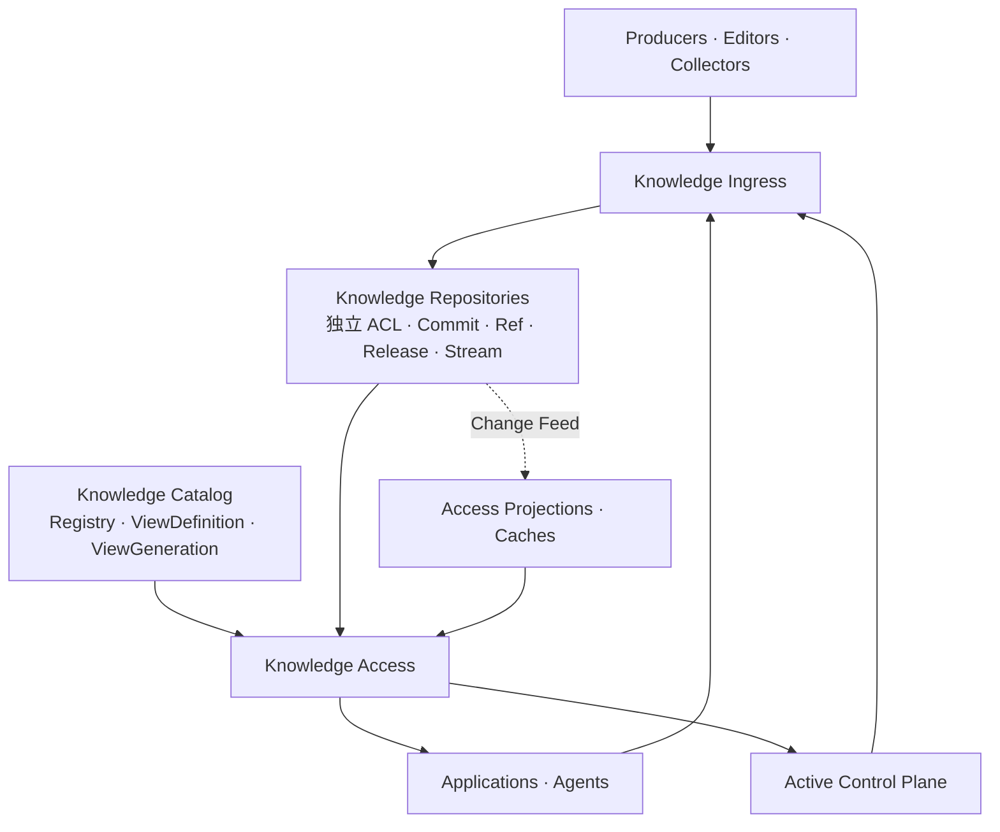

`Knowledge Catalog` 与 `Knowledge Repository` 都是公开领域对象，但职责不同：

```text
Catalog
  Catalog Identity / Lifecycle
  Repository Registry / Membership
  ViewDefinition / ViewGeneration / Serving View Ref

Repository
  Repository Identity / Scope / ACL / Lifecycle
  Object / Tree / Commit / Branch / Release
  Snapshot / Append / Derived / Artifact
  Provenance / Retention / Change Feed
```

一个 Catalog 可以包含一个 public Repository、零到多个 group Repository、零到多个 personal Repository，以及其他领域 Repository。它们可以物理共享 Object Database 或数据库集群，但协议上必须保持独立身份、Commit 图、ACL 和生命周期。

### Knowledge Ingress

负责：

```text
Capability Negotiation
WriteBinding
COMMIT / PROPOSAL / APPEND
Explicit target Repository / Ref Routing
Schema / Scope / Operation Enforcement
Idempotency / Preconditions / Ordering
Durable Receipt
```

不负责：

```text
采集、解析、目标地址生成、Identity Resolution、LLM 抽取、语义冲突、影响分析、审批判断
```

### Knowledge Repository

负责：

```text
RepositoryIdentity / KnowledgeRef / KnowledgeAddress
Entity / Aspect / Pattern / Schema
Snapshot / Append / Derived / Artifact
Object / Tree / Commit / Ref / RepositoryRelease
Time / Provenance
Repository Lifecycle / Profile Contract
ChangeSet / RefUpdateLog / Change Feed
```

不负责：

```text
跨 Repo 真值裁决、搜索排序、向量化、Prompt 组装、主动发现矛盾、自动维护策略
```

### Knowledge Access

负责：

```text
Repository Commit / ViewGeneration / ViewReadVersion 解析
稳定读取与检索操作
授权投影、版本和覆盖率约束
Provider 选择与能力协商
来源保留的 Typed Result / Completeness / Explain
```

不负责：

```text
最终回答、任务规划、模型上下文压缩、知识写入、自动派生
```

## 3.2 应用与主动控制平面的轻量愿景

Application 的最小关系：

```text
Read:  Application → Knowledge Access → Catalog View / Repository / Projection
Write: Application → Knowledge Ingress → target Repository
```

主动控制平面可以在未来承担：

- 读取 Append Records、Access Trace、Repository Change 与 View Diff；
- 发现陈旧、冲突、缺失或高价值维护点；
- 向明确 Repository 的 Candidate Branch 提交 PROPOSAL；
- 构造完整 PreviewGeneration，运行 Validation，形成 Approval 与 MergeGate；
- 合并后生成新的稳定 ViewGeneration 并 Promote；
- 运行 Derived 计算、管理 Binding、Schema/Pattern 演化与 Projection Rebuild。

但它必须遵守两个约束：

1. 所有状态变化仍经 Ingress；
2. 分析发生在写入之前或之外，Ingress 不成为语义流水线。

## 3.3 逻辑架构与物理架构分离

逻辑架构只出现：

```text
Knowledge Catalog / Repository / Ingress / Access
KnowledgeRef / ViewDefinition / ViewGeneration
Collection / Pattern / Address / Commit / Ref / Release / Stream
Command / Receipt / ReadResult / Capability
```

物理 Profile 才出现：

```text
Files / Git / SQLite / PostgreSQL / S3 / OpenSearch / Vector Provider
```

这意味着 Portable Profile 与 Managed Profile 可以共享同一 Ingress、Repository 和 Access Protocol，而不要求相同部署形态或性能。

***
# Part III　Knowledge Ingress

# 4. Ingress 的最终定义

## 4.1 核心定义

> **Knowledge Ingress 是一个传输无关、可协商、强类型的抽象写入协议，以及对该协议进行机械执行约束的 Write Boundary。**

公式化表达：

```text
Ingress
  = Capability Negotiation
  + Single-Surface Write Binding
  + Typed Write Commands
  + Contract Enforcement
  + Idempotency / Concurrency / Ordering
  + Durable Receipt
```

Producer 在调用前必须已经知道：

```text
写什么
写到哪个 Repository、Ref、KnowledgeAddress 或 StreamRef
使用什么 Schema
采用哪一种 Write Surface
```

Ingress 只判断：

```text
当前 Principal 是否拥有该 Binding
Binding 是否允许目标 Repository/Ref、范围、Schema 与操作
请求能否按声明的原子性、并发、顺序和持久化保证执行
```

## 4.2 Ingress 输入与可读状态

Ingress 输入是已经完成目标编码的 Typed Command。例如数据库元数据 Collector 应提交：

```text
COMMIT(
  target_repository = kr://acme/groups/data-platform,
  target_ref = refs/heads/main,
  address = dataset/customer/column/email,
  schema  = urn:schema:physical-column:v2,
  value   = {...}
)
```

而不是把原始 `ALTER TABLE`、网页 HTML 或自然语言编辑意图交给 Ingress 解析。

Ingress 只能读取协议执行所必需的状态：

- WriteBinding；
- Schema Contract；
- Scope / Operation 限制；
- Idempotency Record；
- 当前 Commit / Object ID / Digest；
- Producer Ordering Position；
- 请求大小、速率与 Durable Profile。

必须区分：

```text
并发冲突：expected Commit/Object 与当前值不一致     → Ingress / Repo 执行范围
语义冲突：两个定义在含义上互相矛盾                  → Ingress 范围外
```

“薄”指语义职责薄，不意味着省略可靠性。

# 5. 三种 Write Surface

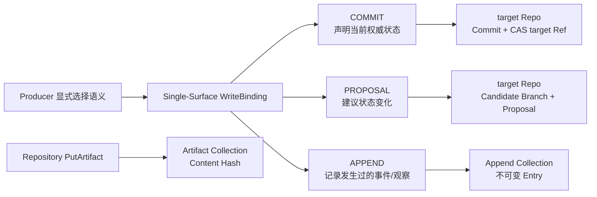

## 5.1 `COMMIT`：权威当前状态变化

`COMMIT` 表达：

> Producer 有权声明目标范围的当前状态应当发生变化。

典型调用方：

- 库表/服务元数据的权威 Collector；
- 用户编辑器；
- 拥有特定 Derived Output 写权的计算器；
- 受控的配置或 Schema 管理工具。

MVP 变更代数只有：

```text
PUT(address, full_value)
REMOVE(address)
```

创建、更新与 Upsert 由 Precondition 表达：

```text
Create  = PUT + IF_ABSENT
Update  = PUT + IF_OBJECT_EQUALS / IF_DIGEST_EQUALS
Upsert  = PUT + 无目标前置条件（仅当 Binding 明确允许）
```

COMMIT 的成功 Receipt 表示：

> 该 ChangeSet 已越过 Binding 声明的 Durable Boundary，并在唯一目标 Repository 产生确定 Commit；若 Surface 契约包含 RefUpdate，则目标 Ref 已通过 CAS 移动。

### 为什么不提供通用 PATCH

通用 PATCH 会引入格式相关语义：

- JSON Pointer 与数组合并；
- Markdown Section 与顺序；
- SQL AST 与字段 ID；
- Schema 演化后的路径解释。

MVP 使用 `READ_OBJECT → 本地修改 → PUT(full_value, precondition)`。Repo-native 编辑器可以生成细粒度 Diff，但进入 Ingress 时必须归一化为 PUT / REMOVE。

## 5.2 `PROPOSAL`：建议状态变化

`PROPOSAL` 表达：

> Producer 建议执行一个 ChangeSet，但并不通过本次调用声明当前状态已经改变。

它与 COMMIT 使用同一变更代数：

```text
ChangeSet = PUT / REMOVE
```

但必须携带：

```text
target_repository
candidate_ref
target_ref
base_commit
operations
rationale
```

可选携带：

```text
evidence_refs
analysis_run_ref
labels
```

Ingress 在 target Repository 中固化 Candidate Commit，并让 Proposal 指向 CandidateRef/Commit。它不判断：

- rationale 是否合理；
- evidence 是否充分；
- Proposal 是否应被接纳；
- 应如何 Rebase 或 Merge。

这些属于主动控制平面或 Review Application。Proposal Receipt 绝不等于 target/main 已改变。Candidate Branch 可以继续提交，但所有 Review、Validation 和 Approval 必须绑定某次解析出的精确 Candidate Commit。

## 5.3 `APPEND`：追加不可变记录

`APPEND` 表达：

> 某个事件、观察、来源声明、日志或测量值发生过。

典型内容：

- Observation / Evidence；
- Usage / Search / Click Event；
- Access / Decision Trace；
- 外部来源快照记录；
- 质量检测结果；
- 反馈与 Outcome。

核心语义：

```text
Append-only
每个 Entry 有稳定 Event ID
已有 Entry 不通过 UPDATE 修改
允许批量传输
支持可选 Producer Position
修正/撤回通过新 Entry 表达
```

修正与撤回：

```text
correction_of
retraction_of
supersedes
```

而不是更新或删除旧 Entry。

## 5.4 Artifact：Repository 辅助内容协议

Artifact 上传不是第四种 Ingress Surface；它是 Repository 的辅助内容端点：

```text
PutArtifact(bytes, media_type, expected_digest?)
→ ArtifactRef{content_hash, size, media_type}
```

只有后续 COMMIT、PROPOSAL 或 APPEND 引用该 ArtifactRef，内容才进入知识语义。Ingress Core 只校验引用，不代理大文件传输。

# 6. Write Binding 与能力协商

## 6.1 一个 Binding 只对应一个 Surface

这是 Ingress 最重要的权限与语义不变量：

```text
WriteBinding.surface = COMMIT | PROPOSAL | APPEND
```

一个同时需要写 COMMIT 与 APPEND 的 Producer 必须持有两个 Binding。这样才能保证：

- 最小权限；
- 幂等命名空间稳定；
- 监控、限流与错误按 Surface 分离；
- 请求不能在运行时切换语义。

## 6.2 两阶段协商

### 能力发现

```text
DescribeIngress() → IngressOffer
```

`IngressOffer` 描述系统支持的：

```text
protocol_versions
address_profiles
surfaces
preconditions
ordering_profiles
idempotency_profiles
schema_profiles
durability_profiles
limits
```

它不表示当前 Producer 已获授权。

### Binding 协商

```text
NegotiateWrite(WriteIntent) → WriteBinding
```

`WriteIntent` 声明 Producer 所需能力；服务端根据认证 Principal 与策略返回一个收窄后的 Binding。

```yaml
kind: WriteBinding
binding_ref: urn:binding:warehouse-schema-commit:v4
principal_ref: urn:principal:warehouse-collector
surface: COMMIT
protocol_profile: knowledge.ingress/v1
target_repository: kr://acme/groups/data-platform
allowed_target_refs:
  - refs/heads/main
allowed_address_patterns:
  - urn:knowledge:dataset:*/physical-schema/**
  - urn:knowledge:dataset:*/columns/**
allowed_schema_refs:
  - urn:schema:physical-column:v2
allowed_operations: [PUT, REMOVE]
precondition_profile: OPTIONAL_ADDRESS_CAS
ordering_profile: MONOTONIC_PER_PARTITION
idempotency_namespace: warehouse-catalog
idempotency_retention: P30D
durability_boundary: SNAPSHOT_REVISION_COMMITTED
limits:
  max_operations: 500
  max_request_bytes: 4194304
```

## 6.3 不允许静默降级

Producer 请求：

```text
COMMIT + CHANGESET_ATOMIC + REVISION_REQUIRED
```

而实现只能逐条 Best Effort 写入，则协商必须失败：

```text
CAPABILITY_UNSATISFIED
```

不能把强语义请求悄悄降级为弱语义。

# 7. Ingress 协议

## 7.1 顶层接口

```text
interface IngressProtocol {
  DescribeIngress() -> IngressOffer
  NegotiateWrite(WriteIntent) -> WriteBinding

  Commit(CommitChangeSet) -> CommitReceipt
  Propose(SubmitProposal) -> ProposalReceipt
  Append(AppendEntries) -> AppendReceipt

}
```

传输层可以使用 HTTP、gRPC、MCP 或进程内调用；传输不得改变 Surface 语义。Artifact 上传属于 Repository 辅助端点，不属于 Ingress Core；MVP 也不公开执行状态查询面。

## 7.2 公共 Command Envelope

```yaml
protocol_version: knowledge.ingress/v1
binding_ref: urn:binding:warehouse-schema-commit:v4
command_id: command-01K...
correlation_ref: optional
causation_ref: optional
source_context:
  source_ref: urn:source:warehouse-prod
  source_event_ref: ddl-event-98127
  producer_position:
    partition: catalog-main
    value: "98127"
provenance:
  artifact_refs: []
extensions: {}
```

可信身份由认证上下文解析；请求体中的 `actor_ref` 或 `source_ref` 只能作为声明，与 Binding 约束核对。

## 7.3 `CommitChangeSet`

```yaml
protocol_version: knowledge.ingress/v1
binding_ref: urn:binding:warehouse-schema-commit:v4
command_id: command-01K...
body:
  target_repository: kr://acme/groups/data-platform
  target_ref: refs/heads/main
  base_commit: G17
  expected_target_commit: G17
  operations:
    - op: PUT
      address:
        kind: MemberAddress
        entity_ref: urn:knowledge:dataset:customer
        aspect_name: columns
        member_key: email
      schema_ref: urn:schema:physical-column:v2
      value:
        type: STRING
        nullable: true
        length: 255
      precondition:
        type: IF_ABSENT
```

规则：

- 一条 Commit Command 只能修改一个 target Repository，是一个原子 ChangeSet；
- 同一 ChangeSet 不得对同一 Address 提交互相矛盾的操作；
- Precondition 检查、Producer Position 检查、状态变更和 Receipt 生成必须处于同一执行契约；
- 对 Derived Output 的 COMMIT，Binding 与目标 Schema 必须要求完整 Derivation Envelope，Repository 负责生成不可变 Object/Commit 并 CAS 移动目标 Ref。

## 7.4 `SubmitProposal`

```yaml
protocol_version: knowledge.ingress/v1
binding_ref: urn:binding:maintenance-proposal:v2
command_id: proposal-command-01K...
body:
  target_repository: kr://acme/groups/payments
  target_ref: refs/heads/main
  candidate_ref: refs/heads/candidates/PR-42
  base_commit: G17
  rationale: 修订退款定义以排除已撤销退款
  evidence_refs:
    - urn:artifact:sha256:...
  operations:
    - op: PUT
      address:
        kind: AspectAddress
        entity_ref: urn:knowledge:metric:refund_amount
        aspect_name: definition
      schema_ref: urn:schema:metric-definition:v2
      value:
        title: Refund Amount
        definition: 已完成且未撤销退款的订单金额
```

成功只产生：

```text
proposal_ref
candidate_ref
candidate_commit
target_commit_at_open
request_digest
durable_at
```

## 7.5 `AppendEntries`

```yaml
protocol_version: knowledge.ingress/v1
binding_ref: urn:binding:knowledge-usage-append:v3
command_id: batch-01K...
body:
  stream_ref: urn:stream:knowledge-usage
  entries:
    - event_id: usage-event-98391
      event_type: KNOWLEDGE_VIEWED
      subject_refs:
        - urn:knowledge:dataset:customer
      observed_at: 2026-08-14T08:00:00Z
      schema_ref: urn:schema:knowledge-usage:v1
      payload:
        channel: search
        session_ref: session-113
```

Entry 幂等身份：

```text
binding.idempotency_namespace + stream_ref + event_id
```

相同 Event ID + 相同 Canonical Digest：返回原结果；相同 ID + 不同 Digest：`EVENT_ID_CONFLICT`。

## 7.6 Receipt

```yaml
kind: CommitReceipt
receipt_ref: urn:receipt:commit:01K...
protocol_version: knowledge.ingress/v1
binding_ref: urn:binding:warehouse-schema-commit:v4
command_id: command-01K...
surface: COMMIT
request_digest: sha256:...
disposition: APPLIED
received_at: 2026-08-14T08:00:00.010Z
durable_at: 2026-08-14T08:00:00.032Z
durability_boundary: SNAPSHOT_REVISION_COMMITTED
result:
  repository_id: kr://acme/groups/data-platform
  commit_id: G18
  target_ref: refs/heads/main
  old_commit: G17
  new_commit: G18
```

MVP 默认：

> 成功响应 = 已越过 Durable Boundary。

仅“已接收”不能返回普通成功 Receipt。大请求若未来支持异步执行，必须在 Binding 中预先协商，并最终产生同一种 Durable Receipt。

# 8. Ingress 执行流程与错误

## 8.1 机械执行流程

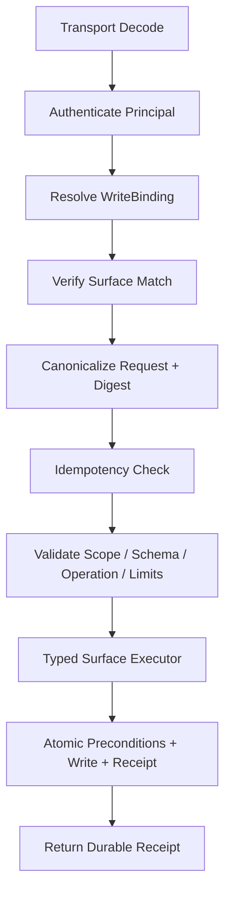

Ingress 中不存在：

```text
Semantic Router
Content Classifier
LLM Compiler
Conflict Reasoner
```

Typed Dispatcher 只是对显式 Surface 做封闭分派。

## 8.2 精确重试

超时后 Producer 必须使用：

```text
相同 idempotency namespace
相同 command_id
相同逻辑 Payload
```

结果：

```text
尚未执行          → 执行并返回 Receipt
已经成功          → 返回原 Receipt，disposition=REPLAYED
相同 ID 不同内容   → IDEMPOTENCY_CONFLICT
```

请求摘要必须基于规范化逻辑消息，而不是原始 JSON 字节。

## 8.3 最小错误模型

| Error | 含义 | Retry Class |
|---|---|---|
| `PROTOCOL_UNSUPPORTED` | 协议版本不支持 | NON_RETRYABLE |
| `BINDING_EXPIRED / REVOKED` | Binding 不可用 | REFRESH_BINDING |
| `SURFACE_MISMATCH` | Command 与 Binding 不一致 | NON_RETRYABLE |
| `SCOPE_DENIED` | 地址或 Stream 超出范围 | NON_RETRYABLE |
| `SCHEMA_UNSUPPORTED` | Schema 不在 Binding 中 | NON_RETRYABLE |
| `WRITE_TARGET_REQUIRED` | 未显式指定唯一目标 Repository / Ref | NON_RETRYABLE |
| `TARGET_REPOSITORY_DENIED` | Binding 不允许写入该 Repository / Ref | NON_RETRYABLE |
| `PRECONDITION_FAILED` | Commit / Object / Digest 条件不满足 | REBASE_REQUIRED |
| `POSITION_REGRESSION` | Producer Position 回退 | NON_RETRYABLE |
| `IDEMPOTENCY_CONFLICT` | 相同 Command ID 对应不同内容 | NON_RETRYABLE |
| `EVENT_ID_CONFLICT` | 相同 Event ID 对应不同 Entry | NON_RETRYABLE |
| `CAPABILITY_UNSATISFIED` | 无法满足协商保证 | NON_RETRYABLE |
| `TEMPORARY_UNAVAILABLE` | 临时 Backend 故障 | SAFE_RETRY_SAME_REQUEST |

## 8.4 可观测性与审计

Ingress 只输出低基数运行指标：

```text
knowledge_ingress_requests_total{surface,outcome}
knowledge_ingress_duration_seconds{surface}
knowledge_ingress_rejections_total{surface,code}
knowledge_ingress_replays_total{surface}
```

`command_id`、`binding_ref`、Repository、Address、Schema 和 payload 不得进入 metric label。根 Trace Span 为 `knowledge.ingress.accept`，内部只保留 `resolve_binding`、`admit` 和 `write` 等执行阶段，不记录 value、content 或 rationale 全文。

最小审计记录必须包含：

```yaml
principal_ref: principal://catalog-editor
binding_ref: binding://group/research/editor
target_repository: kr://acme/groups/research
target_ref: refs/heads/main
command_id: cmd-commit-001
surface: COMMIT
decision: ACCEPTED
receipt_ref: receipt://01J5...
error_code: null
trace_id: 4bf92f3577b34da6a3ce929d0e0e4736
```

旁路观测失败不能把已经持久化的写入改判为失败。若部署要求不可丢失的合规审计，Repository/Gateway 必须把 Audit Outbox 纳入同一原子事务；Ingress 不模拟这一保证。

# 9. Ingress MVP 冻结范围

## 9.1 必须实现

```text
DescribeIngress / NegotiateWrite
COMMIT / PROPOSAL / APPEND
Single-Surface WriteBinding
PUT / REMOVE
显式 target_repository / target_ref
IF_ABSENT / IF_OBJECT_EQUALS / IF_DIGEST_EQUALS
Command 与 Entry 幂等
可选 Producer Position
Durable Receipt
结构化错误
低基数 Metrics / Trace / Audit
```

## 9.2 明确延后

```text
来源 Connector 协议
Artifact 二进制上传协议（由 Repository 辅助端点提供）
采集调度与来源 Profiling
Scope Snapshot Reconciliation
通用 PATCH
自动 Proposal 处理
语义冲突与影响分析
LLM 抽取或目标地址生成
跨 Surface 原子事务
新的 DERIVED Surface
```

***
# Part IV　Knowledge Repository

# 10. Repository 的最终定义

## 10.1 核心抽象

```text
KnowledgeRepository
  = RepositoryIdentity / Ownership / ACL
  + Git State Kernel (Object / Commit / Ref / Merge / Release)
  + AddressSpace
  + TypedCanonicalCollections
  + KnowledgeStructureContracts
  + Append / Derived / Artifact Side Collections
  + Provenance / Time
  + CapabilityManifest
```

Repository 是一个独立权威、权限和维护边界，不是 Catalog 中的目录，也不是某个产品的别名。public、每个 group 和每个 personal 空间默认拥有不同的 `RepositoryIdentity`、ACL、Commit Graph、Branch、Release 和 Review 生命周期。它保证：

- 同一逻辑对象跨文件移动、Backend 切换和版本变化仍可通过 `ObjectIdentity` 引用；
- 每个维护单元具有明确结构、Schema 与演化语义；
- 权威状态、发生记录、派生结果与大对象不会互相覆盖；
- Snapshot 的创建、修改、分支、合并、发布和回滚直接复用 Git 语义；
- 读取可以绑定确定 Commit，跨 Repo 读取可以绑定确定 `ViewGeneration`；
- 物理 Adapter 不能破坏协议层不变量。

这里的“Git 语义”是领域契约，不要求每个 Profile 都通过命令行调用 Git。Managed Profile 可以用数据库实现等价的 immutable object、commit graph、ref CAS 和 merge-base，但不得改变其外部语义。

### 10.1.1 Repository 动作语义

Repository 对内容变化复用 Ingress，对版本治理提供受保护的 Git-like Control API：

| Operation | 输入要点 | 状态效果 | 关键约束 |
|---|---|---|---|
| `CREATE_REPOSITORY` | repository identity、owner、ACL、default branch、profile | 初始化独立 Object Store/Commit Graph/Ref Namespace | Identity 不可复用；ACL 与历史边界独立 |
| `CREATE_COMMIT` | parent commit、PUT/REMOVE、author、message | 创建 immutable objects/tree/commit | 不自动移动 Ref；通常由 Ingress COMMIT/PROPOSAL 调用 |
| `CREATE_REF` | ref name、exact commit | 新建 Branch/Tag 指针 | 受命名空间与 ACL 约束 |
| `UPDATE_REF` | ref、expected old commit、new commit | CAS 移动 Branch | 禁止 silent last-write-wins |
| `MERGE` | target ref、candidate commit、expected target、strategy | 生成 Merge/Fast-forward Commit 并 CAS 目标 Ref | Review/Validation 必须绑定被合并的精确候选与 PreviewGeneration |
| `REBASE_CANDIDATE` | candidate ref、new base | 生成新的 Candidate Commit 序列 | 新 Commit 使旧 Approval/Validation 失效 |
| `PUBLISH_RELEASE` | release identity、exact commit、metadata | 创建不可变 Repo Release | Release 不能指向活动 Branch；不自动 Promote Catalog View |
| `REVERT` | target ref、commit/range、expected head | 创建反向变更 Commit | 保留历史，不删除已发布 Commit |
| `ARCHIVE_REPOSITORY` | repository identity、reason | 禁止新写并保留可审计历史 | Catalog 新 Generation 默认不再选入；已存在 Generation 按保留策略读取 |

`CLONE/FETCH/PUSH` 可以作为传输 Binding 暴露，但不是新的领域语义：Push 必须被分解为对象上传和逐 Ref 的授权 CAS。强制覆盖受保护 Ref、删除已发布 Release 和跨 Repo 原子 Merge 不属于 MVP。

动作入口由职责分开：

```text
常规内容 PUT/REMOVE       → Ingress COMMIT
建议内容                  → Ingress PROPOSAL → Candidate Ref/Commit
Branch/Merge/Rebase/Release → Repository Control API
Repo 注册/View/Promote     → Catalog API
读取/检索/历史/Watch       → Access
```

## 10.2 Canonical、Proposal 与 Projection

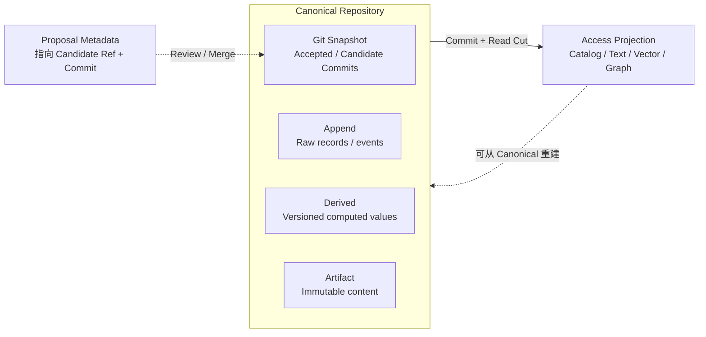

三者不能混淆：

| 类别 | 是否属于 Canonical Knowledge | 是否可直接作为当前权威状态 | 是否必须可重建 |
|---|---:|---:|---:|
| Snapshot | 是 | 是 | 否，需保留历史 |
| Append | 是 | 不是当前快照，但是真实记录 | 否，需保留记录语义 |
| Derived | 是，属于派生知识 | 仅作为声明的 Derived Head | 可重算，但历史 Revision 仍可审计 |
| Artifact | 是，属于不可变内容 | 需由 Manifest/Record 引用 | 内容本身不从索引重建 |
| Candidate Commit | 是，但尚未 Accepted | 否 | 否，保留 Git 历史 |
| Proposal Metadata | 否 | 否 | 可由 Review 系统保存；必须锁定 Candidate Commit |
| Projection | 否 | 否 | 是 |

这里的 “Canonical Derived” 表示系统正式保存“某个算法在某个输入 `ViewReadVersion` 上计算出了什么”，不表示其语义等同于 Accepted Definition。Candidate Commit 也不因为已经进入 Git 对象库就自动成为 Accepted Knowledge；是否生效由目标 Ref 或 Release 决定。

# 11. 四类 Canonical Collection

## 11.1 Snapshot Collection

适用于需要当前状态、版本、Diff、回滚和原子 ChangeSet 的知识：

```text
definitions
policies / norms
procedures
accepted assertions
entity manifests
relations
schemas / patterns / vocabularies
```

MVP Contract：

```text
resolve_ref(ref_or_release) -> CommitIdentity
get(address, commit)
list(parent, commit)
commit(parent_commit, changeset) -> CommitIdentity
compare_and_swap_ref(ref, expected_commit, new_commit)
branch / merge / tag / release / history / diff
```

Snapshot 的外部变化只来自 `COMMIT`；Proposal 创建 Candidate Commit/Ref，但不直接移动目标 Ref。Repository Release 是已命名、不可变、可审计的 Repo Commit；它与 Catalog View Promotion 是两个动作。

## 11.2 Append Collection

适用于不可静默覆盖的发生记录：

```text
observations
evidence
feedback
source snapshots
usage events
access traces
decision traces
corrections / retractions
```

MVP Contract：

```text
append(entries) -> RecordRef[] + Cursor
get(record_ref)
scan(stream / subject / type / time, cursor)
correct(old_ref, correction_entry)
retract(old_ref, retraction_entry)
```

旧 Entry 不原地更新。系统可以在保留逻辑审计语义的前提下执行隐私 Erasure，但 Erasure 是独立治理能力，不是普通 REMOVE。

## 11.3 Derived Collection

适用于由明确输入和算法生成、需要版本化与失效的结果：

```text
summaries
extracted entities / relations
health / freshness
popularity
conflict summaries
evaluations
recommendation signals
resolved views
```

MVP Contract：

```text
put_revision(output_key, input_view_read_version, derivation_spec, value)
compare_and_swap_head(output_key, expected_head, new_revision)
get_head(output_key)
get_revision(derived_revision)
invalidate(output_key_or_revision, reason)
```

Derived 写入通过受限 `COMMIT` Binding 执行。Repository 必须原子完成：

```text
创建 Immutable Derived Revision
+ 校验 Input ViewReadVersion / Derivation Envelope
+ CAS 更新 Derived Head
```

Derived 不能通过覆盖旧 Revision“修改历史”。

## 11.4 Artifact Collection

适用于不可变富内容：

```text
PDF / Markdown / Image / Audio / Video
Dataset Snapshot
Large JSON / Table
Compiled Bundle / Model Artifact
```

MVP Contract：

```text
put_if_absent(bytes, digest?) -> ArtifactRef
stat(content_hash)
get(content_hash, range?)
verify(content_hash)
```

Artifact 使用内容 Hash 寻址。业务身份、版本说明、来源和用途通过 Snapshot / Append / Derived 中的 Manifest 或引用表达。

# 12. 知识结构内核

## 12.1 正交描述模型

本设计不使用一个 `KnowledgeType` 决定所有行为，而使用以下组合：

```text
Knowledge Unit
  = Epistemic Role      它在认知上是什么
  × Structural Pattern 内容怎样独立变化
  × Collection Kind    状态怎样持久化和演化
  × Schema             字段与约束是什么
  × Time Semantics     何时发生/成立/生效
  × Provenance         从哪里来、怎样产生
```

为控制 MVP 复杂度：

- Governance 不作为每个 Aspect 的统一状态机；Accepted 由目标 Ref/Release 表达，Proposal 由 Candidate Ref/Commit 加 Proposal Metadata 表达；
- Retention 默认在 Collection / Stream / Artifact Policy 上定义，而不是每个知识单元单独配置；
- 权限与 Producer Authority 编码在 Ingress Binding，不在 Payload 中放 `authority=true`。

## 12.2 Entity

Entity 是跨版本、来源和物理布局保持稳定身份的 Subject：

```yaml
api_version: knowledge.repo/v1
kind: Entity
metadata:
  ref: urn:knowledge:metric:refund_amount
  type_ref: urn:knowledge:type:metric
  aliases: [refund_amount, 退款金额]
  lifecycle: active
spec:
  aspects:
    definition:
      collection_ref: urn:krepo:collection:knowledge
      pattern_ref: urn:knowledge:pattern:record
      schema_ref: urn:knowledge:schema:metric-definition:v2
      epistemic_role_ref: urn:knowledge:role:definition
      time_semantics: EFFECTIVE_DATED
      path_hint: aspects/definition.yaml
    formulas:
      collection_ref: urn:krepo:collection:knowledge
      pattern_ref: urn:knowledge:pattern:keyed-collection
      schema_ref: urn:knowledge:schema:metric-formula:v1
      epistemic_role_ref: urn:knowledge:role:definition
      path_hint: aspects/formulas/
    dependencies:
      collection_ref: urn:krepo:collection:knowledge
      pattern_ref: urn:knowledge:pattern:relation-set
      schema_ref: urn:knowledge:schema:dependency-relation:v1
      epistemic_role_ref: urn:knowledge:role:assertion
```

Entity Manifest 主要保存：身份、类型、Alias、生命周期与 AspectBinding；不应成为包含所有内容的巨型 Payload。

## 12.3 Aspect

Aspect 是：

> **Entity 内一个有名字、可以独立维护、绑定明确 Pattern 与 Schema 的知识分区。**

拆分依据应是：

- 权威来源是否不同；
- 是否需要独立 PUT / REMOVE；
- 变化频率是否不同；
- 冲突是否应在不同粒度检测；
- 是否使用不同 Schema、时间或来源要求；
- 是否需要不同的访问方式。

Aspect 不是 UI Tab，也不是任意属性分组。

## 12.4 四个 Structural Pattern

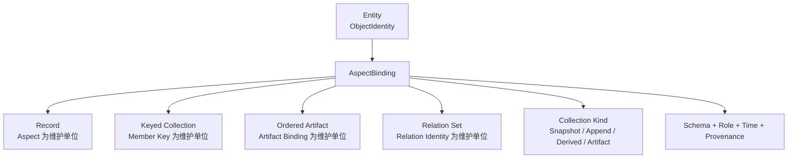

### Record

适合定义、配置、单一属性集合：

```text
维护单位：AspectAddress
PUT：替换完整 Record
冲突：同 Address 的 Object / Digest
Diff：字段级或内容 Hash
```

### Keyed Collection

适合规则项、字段、术语、公式集合：

```text
维护单位：MemberAddress(parent + aspect + member_key)
PUT：Upsert 一个 Member
REMOVE：删除一个 Member
冲突：同 Member Key
Diff：Member added / removed / changed
```

### Ordered Artifact

适合文档、手册、代码和有顺序内容：

```text
维护单位：Artifact Binding / Artifact Revision
PUT：绑定新的 ArtifactRef
REMOVE：移除或退役绑定
Diff：Artifact Hash + 可选结构化 Section Diff
```

源文档不应为了检索被物理拆成大量小文件；Fragment 属于 Access Projection。

### Relation Set

适合需要独立查询、反向访问、Qualifier、有效期或来源的连接：

```text
维护单位：RelationAddress
PUT：Upsert 单条 Relation
REMOVE：删除单条 Relation
冲突：Relation Identity
Diff：Edge added / removed / qualifier changed
```

### 为什么没有 Append Log 与 Derived Signal Pattern

这是本次设计的主动简化：

- Append-only 是 Collection 的演化语义，不是内容结构；
- Derived 是知识地位与版本语义，不是结构；
- Derived Value 可以使用 Record、Keyed Collection 或 Relation Set；
- Append Entry 由 Stream Schema 定义，不需要额外 Pattern 轴。

这样 Pattern 保持纯粹，只回答“最小独立维护单位是什么”。

## 12.5 PatternContract

```yaml
api_version: knowledge.repo/v1
kind: PatternContract
metadata:
  ref: urn:knowledge:pattern:keyed-collection
  revision: 1
spec:
  address_unit: MEMBER
  allowed_snapshot_ops: [PUT, REMOVE]
  conflict_identity:
    - parent_ref
    - aspect_name
    - member_key
  diff_semantics: KEYED_MEMBER_DIFF
  validation_obligations:
    - key_uniqueness
    - member_schema
```

MVP 不要求通用 Pattern-aware 三方 Merge。Proposal Rebase 可以先由应用做 `READ_OBJECT + DIFF + 重新生成 ChangeSet`；只有实际冲突数据证明必要时，再为特定 Pattern 增加 Merge Contract。

# 13. Epistemic Role、时间与来源

## 13.1 Epistemic Role

`epistemic_role_ref` 是可扩展词汇，不决定存储。MVP 提供基线角色：

| Role | 含义 | 常见 Collection |
|---|---|---|
| `SOURCE` | 原始文档、网页、数据快照、工具原始输出 | Artifact + Append Manifest |
| `OBSERVATION` | 某主体在某时观察到什么 | Append |
| `EVIDENCE` | 支持或反驳某主张的记录 | Append |
| `ASSERTION` | 关于对象、属性或关系的主张 | Snapshot / Derived / Append 均可能 |
| `DEFINITION` | 正式概念定义 | Snapshot |
| `NORM` | 政策、规则、约束、标准 | Snapshot |
| `PROCEDURE` | 可执行步骤、技能和工作流 | Snapshot / Artifact |
| `DERIVATION` | 基于输入和算法计算的值 | Derived |
| `SIGNAL` | 健康、热度、新鲜度等指标 | Derived |
| `META` | Schema、Pattern、词汇与 Repo Contract | Snapshot |

系统不得从 Role 自动推断“是否可信”；可信状态来自 Collection、Revision、Binding 与 Provenance。

## 13.2 时间语义

所有 Canonical 状态都有系统时间；领域时间按 Schema 声明：

| 语义 | 字段 | 适用 |
|---|---|---|
| System Time | `recorded_at / committed_at` | 所有状态，由系统分配 |
| Event Time | `observed_at` | Observation、Event、工具输出 |
| Valid Time | `valid_from / valid_to` | 动态事实、偏好、关系 |
| Effective Time | `effective_from / effective_to` | Policy、Norm、发布内容 |

MVP 不要求所有知识都采用 Bitemporal。只有动态 Assertion Profile 才同时要求 Valid Time 与 System Revision。

## 13.3 最小 Provenance Envelope

```yaml
provenance:
  origin_kind: DERIVED
  actor_ref: urn:principal:preference-extractor
  activity_ref: urn:activity:run-19391
  source_refs:
    - urn:source:conversation-service
  evidence_refs:
    - urn:record:episode-19382
  input_view_read_version_ref: urn:kc:view-read-version:991
  algorithm:
    derivation_spec_ref: urn:derivation:preference-extractor:v4
    model_ref: urn:model:extractor:2026-08
    code_hash: sha256:...
  produced_at: 2026-08-14T09:22:10Z
```

最低义务按知识族决定：

- Accepted Definition：至少 actor / repository / commit / evidence or rationale；
- Observation：source / observed_at / record identity；
- Derived：input version / derivation spec / activity；
- Artifact：content hash / media type / capture source；
- Relation：source or derivation basis，若不是纯结构引用。

内部不强制 RDF，但 SHOULD 可映射到 W3C PROV 的 Entity / Activity / Agent。

# 14. 身份、地址与版本

## 14.1 三种跨 Repo 引用

知识对象的身份必须与文件路径、Branch 名称和显示名称分离。

```text
KnowledgeRef
  = RepositoryIdentity + ObjectIdentity

PinnedKnowledgeRef
  = RepositoryIdentity + CommitIdentity + ObjectIdentity

FileRef
  = RepositoryIdentity + CommitIdentity + Path + Digest(optional)
```

示例：

```text
kc://public/core/policy/P-103
kc://public/core@p42/policy/P-103
kc-file://public/core@p42/docs/refund.md#sha256:...
```

`KnowledgeRef` 在某个 `ViewGeneration` 内解析，适合长期关系；`PinnedKnowledgeRef` 永远指向当时的对象版本，适合证据、审计、评估与 Derived 输入；`FileRef` 只用于附件、代码片段或原始文件。路径移动不应破坏前两者。

每个 Repo 内仍可使用紧凑的 `ObjectIdentity`：

```text
policy/P-103
metric/refund_amount
schema/metric-definition/v2
artifact/refund-handbook
```

历史实现中的 `StableRef` 可作为 `ObjectIdentity` 的序列化别名，但跨 Repo API 必须补齐 `RepositoryIdentity`，不能只传裸 URN。

## 14.2 KnowledgeAddress

`KnowledgeAddress` 精确定位一个 Repository 内的维护或读取单元；Repository 来自请求上下文或 `KnowledgeRef`，不能靠 Path 推断：

```yaml
repository_id: kr://public/core
kind: AspectAddress
object_id: metric/refund_amount
aspect_name: definition
```

```yaml
repository_id: kr://group/research
kind: MemberAddress
object_id: model/sales
aspect_name: metrics
member_key: refund_amount
```

MVP Address Kind：

```text
EntityAddress
AspectAddress
MemberAddress
RelationAddress
RecordAddress
DerivedOutputAddress
ArtifactAddress / FragmentAddress
```

`PathHint` 只是某个 Checkout 的便利位置，不参与身份、引用解析或权限判断。

## 14.3 Repository 版本对象

```text
CommitIdentity       repo kr://public/core 的 p42
BranchRef            refs/heads/main / refs/heads/candidates/PR-42
Tag / Release        release/2026.08 → immutable commit p42
AppendCursor         stream:knowledge-usage@829183
DerivedRevision      derived:user-42-food-profile@r19
ArtifactRevision     artifact:sha256:...
ProposalRef          proposal:91 → candidate ref + exact commit
```

Branch 是可移动指针，不能直接充当可复现证据。Review、Validation、Approval 与 Release 必须落到精确 Candidate Commit。

## 14.4 ViewGeneration 与完整 Read Cut

Catalog 把多个 Repo 的符号选择器解析为不可变的 `ViewGeneration`：

```yaml
kind: ViewGeneration
generation_id: generation-721
repositories:
  kr://public/core: p42
  kr://group/research: g17
  kr://group/platform: g31
  kr://personal/alice: u9
created_at: 2026-08-14T09:30:00Z
```

它只锁定每个权威 Snapshot 的 Git Commit。若一次读取还包含 Append 与 Derived，则返回额外的 `ViewReadVersion`：

```yaml
kind: ViewReadVersion
view_generation: generation-721
append_cuts:
  kr://group/research/streams/evidence: cursor:84219
derived_heads_manifests:
  kr://personal/alice: derived-heads:generation-227
projection_generations:
  text: text-index:991
authorization_decision_ref: authz-decision:8f2...
```

`ViewGeneration` 解决“多个 Repo 的权威知识版本是什么”；`ViewReadVersion` 解决“这次查询实际看到了哪些 Append/Derived/Projection 边界”。两者不能再被合并成一个虚假的全局 Commit。Artifact 无需全局 Head；被引用的内容 Hash 已经进入 Commit、Append 或 Derived Revision。

# 15. 单个 Repository 的逻辑组织

## 15.1 逻辑目录

```text
knowledge-repo/
├── repo.yaml
├── .git/                         # Commit graph / refs / tags
├── contracts/                    # Snapshot Meta Knowledge
│   ├── schemas/
│   ├── patterns/
│   └── roles/
├── knowledge/                    # Accepted Snapshot
│   ├── entities/
│   │   └── <namespace>/<entity-id>/
│   │       ├── entity.yaml
│   │       └── aspects/
│   └── relations/
├── records/                      # Append Collections / Streams
│   └── <stream-id>/
├── derived/                      # Derived Revisions + Heads
│   └── <output-key>/
├── artifacts/                    # Content-addressed immutable bytes
│   └── sha256/<prefix>/<hash>
├── proposals/                    # Non-canonical review metadata；指向 Candidate Commit
└── .krepo/                       # Adapter-owned operational state
    ├── heads/
    ├── receipts/
    └── address-map.json
```

这是一棵逻辑树：

- Portable Profile 可以真实物化为目录；
- Managed Profile 可以把不同分支映射到不同 Backend；
- `proposals/` 与 `.krepo/` 不属于 Accepted Knowledge；Candidate 内容位于 Git Commit 中；
- Access Projection 不在该语义树中，Portable Provider 可以把本地缓存放入 `.krepo/access/`，但它仍是可删除实现状态。

这个目录描述的是**一个 Repo**，不是 public/group/personal 的共同根目录。Catalog 自己只保存 Registry、ViewDefinition、ViewGeneration、Promotion 与授权可见性元数据，例如：

```text
knowledge-catalog/
├── repositories.yaml
├── views/
├── generations/
└── promotions/
```

同一进程或同一对象存储桶可以物理托管多个 Repo，但逻辑上仍必须保持独立 Identity、ACL 与 Commit Graph；“放在一个目录下”只是部署布局，不得变成同一个 Repository 的子目录权限约定。

## 15.2 Repository Manifest

```yaml
api_version: knowledge.repo/v1
kind: KnowledgeRepository
metadata:
  repository_ref: kr://group/research
  scope_kind: GROUP
  owner_ref: group://research
  profile_ref: urn:krepo:profile:portable-file
collections:
  knowledge:
    kind: SNAPSHOT
    logical_root: knowledge/
  records:
    kind: APPEND
    logical_root: records/
  derived:
    kind: DERIVED
    logical_root: derived/
  artifacts:
    kind: ARTIFACT
    logical_root: artifacts/
contracts_root: contracts/
proposal_metadata_root: proposals/
capabilities_ref: urn:krepo:capabilities:portable-file:v1
```

## 15.3 Repository Profile

```text
RepositoryProfile
  = CollectionBindings
  + Revision Guarantees
  + Checkout Capability
  + Capacity Limits
  + Export / Import Contract
```

MVP Profile：

| Logical Area | Portable Implementation |
|---|---|
| Snapshot / Contracts | Files + Git |
| Append | SQLite WAL |
| Derived Revision / Head | SQLite WAL + optional files |
| Artifact | Local content-addressed directory |
| Candidate Snapshot | Git branch / commit |
| Proposal Metadata / Receipt | SQLite WAL 或 Review System |
| Address Map | Generated JSON / SQLite Catalog |

# 16. Repository 状态转移

## 16.1 COMMIT 到 Snapshot

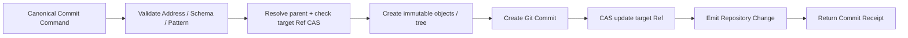

Repository 的验证是结构和状态不变量：

```text
Address 存在或允许创建
Schema Revision 可解析
Pattern 与 Address Kind 匹配
引用满足声明的完整性约束
Parent Commit 与 Ref CAS 原子成立
```

Repository 不判断新定义是否“更合理”。

## 16.2 PROPOSAL 与 Candidate Branch

```text
Ingress 验证 Binding / Schema / Scope
→ 以 base_commit 为父节点创建 Candidate Commit
→ CAS 更新 refs/heads/candidates/<proposal-id>
→ Proposal Metadata 记录 target_ref、candidate_ref、candidate_commit、rationale
→ 返回 ProposalReceipt
```

Candidate Commit 位于目标 Repository 中，但不移动 `main` 或 Release，因此不触发“假装已生效”的稳定 Access 结果。主动控制平面执行：

```text
读取精确 Candidate Commit
→ 构造替换该 Repo Commit 的 PreviewGeneration
→ Validate / Review / Approve exact commit
→ 必要时 rebase 或 merge，生成新的 candidate commit 并重验
→ merge 到 target_ref
→ 可选创建 Repository Release
→ 构造并 Promote 新的稳定 ViewGeneration
```

Branch 只适合协作中的活动指针；测试报告不能只绑定 Branch 名，也不能只绑定 Candidate Commit，因为结果还依赖完整的 PreviewGeneration。

## 16.3 APPEND

```text
Validate Stream / Schema / Event ID
→ Atomic idempotency check + append
→ assign RecordRef / recorded_at / cursor
→ return AppendReceipt
```

模型抽取、Entity Resolution 和 Candidate 生成不阻塞 Append Durable ACK。

## 16.4 Derived Commit

```text
Read fixed input ViewReadVersion
→ Compute value outside Repository
→ COMMIT to DerivedOutputAddress with DerivationEnvelope
→ create immutable DerivedRevision
→ CAS Derived Head
```

输入更改、Correction、Retraction 或算法升级时，旧 Revision 被标记为 stale/invalid 或 Head 被替换，但历史仍保留。

## 16.5 Artifact

```text
PutArtifact
→ verify content hash
→ store immutable bytes
→ ArtifactReceipt
→ later referenced by COMMIT / PROPOSAL / APPEND
```

## 16.6 冲突语义

| 冲突 | Repository 行为 |
|---|---|
| 同 Repo Ref 已前移 | 拒绝 COMMIT，返回 Precondition Failed；调用方 rebase/merge |
| 同 Repo 内容冲突 | 使用 Git merge-base 和 Pattern-aware diff；未解决不得移动目标 Ref |
| 同 Event ID 不同内容 | 拒绝 APPEND，返回 Event ID Conflict |
| ObjectIdentity / Member Key 重复 | 按 Pattern/Schema 拒绝或要求显式同一地址更新 |
| 不同 Repo 的 Assertion 含义矛盾 | 作为不同来源对象并存；不静默覆盖，也不触发 Git merge |
| 有效期重叠 | 由 Assertion Schema/控制面形成冲突或 Resolution Proposal |
| Derived 使用不同算法 | 保留不同 Revision；Head 选择显式 CAS |
| 普通 KnowledgeRef 随 public 升级 | 重新解析和验证新 ViewGeneration；不修改 group Repo，不做跨 Repo merge |
| Fork/Vendor 后同步上游 | `Base=fork 时上游`、`Upstream=新上游`、`Local=本地派生`，执行显式三方同步 |

# 17. 不同知识族的维护方式

| 知识族 | Canonical 落点 | 必备描述 | 默认写入路径 |
|---|---|---|---|
| 定义、术语、政策、规则 | Snapshot Record / Keyed Collection | Schema、Role、有效期、来源/理由 | COMMIT 或 PROPOSAL |
| 手册、论文、代码、流程文档 | Artifact + Snapshot Manifest | Hash、媒体类型、版本、来源 | PutArtifact → COMMIT/PROPOSAL |
| 观察、反馈、工具输出、轨迹 | Append | Event ID、observed_at、source、schema | APPEND |
| 动态事实、用户偏好 | Append Evidence + Snapshot Assertion Profile + Derived Resolution | valid time、evidence、conflict identity | APPEND → 控制面 Proposal/Derived |
| LLM 提取的实体、关系、摘要 | Derived | input version、spec、model/code、basis | 受限 COMMIT 到 Derived |
| 热度、新鲜度、健康度 | Derived | input cut、algorithm revision、Head | 受限 COMMIT 到 Derived |
| Schema、Pattern、Role Contract | Snapshot Meta Knowledge | compatibility、revision、rationale | COMMIT/PROPOSAL，通常更严格 Binding |

### Assertion Profile：保留但不扩展 Core

动态 Assertion 常需要：

```text
subject + predicate/slot + value
valid_from / valid_to
evidence_refs
conflict_group
resolution status
```

MVP 将其定义为 **Keyed Collection 或 Relation Set 的标准 Schema Profile**，而不是新增 Collection 或 Pattern。只有真实用例出现后，才冻结完整冲突与 Resolution Contract。

# 17A. Catalog 的多 Repository 组合语义

## 17A.1 为什么 public / group / personal 默认是独立 Repo

这三个名称表达的是权威、权限和维护边界，而不是优先级层次：

| Scope | 典型所有者 | 自己要维护的信息 | 可以引用 |
|---|---|---|---|
| public | 平台或公共维护者 | 公共定义、政策、Schema、共享关系 | 其他授权 Repo |
| group | 一个组织/项目组 | 组内判断、补充、适用范围、工作成果 | public 与其他获授权 Repo |
| personal | 一个用户 | 私人笔记、偏好、个人断言、草稿 | public 与用户有权访问的 group |

一个人可能属于多个 group；不同 group 的 Review、Release 和数据权限也不同。如果把它们放进同一 Repo 的三个目录，Branch、Merge、Clone、Release 与权限边界会被迫共用，既不能表达独立演化，也容易在 Git 历史中泄漏不可见对象。因此默认模型是多个 Repo；只有在所有权、ACL、Release 节奏和历史可见性都一致时，才可以把若干命名空间放进同一 Repo。

## 17A.2 ViewDefinition 与 ViewGeneration

`ViewDefinition` 声明一个主体希望联合哪些来源：

```yaml
kind: ViewDefinition
view_id: alice-default
sources:
  - repository: kr://public/core
    selector: release/stable
  - repository: kr://group/research
    selector: refs/heads/main
  - repository: kr://group/platform
    selector: refs/heads/main
  - repository: kr://personal/alice
    selector: refs/heads/main
```

它含有可移动选择器，只用于解析。每次稳定读取先生成不可变 `ViewGeneration`：

```text
generation-721
├── public/core       → p42
├── group/research    → g17
├── group/platform    → g31
└── personal/alice    → u9
```

同一个 `RepositoryIdentity` 在一个 Generation 中只能出现一个 Commit。联合结果是授权快照的集合，不是覆盖栈：

```text
EffectiveView(G, principal)
  = union AuthorizedSnapshot(repo_i, commit_i, principal)
```

每个结果必须保留 `repository_id`、`commit_id`、`object_id`、`scope` 与 `provenance`。系统不定义 `personal > group > public` 的真假优先级；若应用需要首选结论，必须通过显式 Resolution Policy 或 Derived Result 表达，并保留被裁决的候选。

## 17A.3 引用、补充、分歧与修改

group/personal 引用 public 时写 `KnowledgeRef`，不复制 public 内容。若 group 想补充、限定或反对 public 对象，应创建本地对象：

```yaml
repository_id: kr://group/research
object_id: assertion/A-27
about: kc://public/core/policy/P-103
relation: qualifies       # 也可以是 contradicts / appliesWithin / supports
statement: 该规则只适用于受监管生产环境
```

这不是 Overlay，也不会改写 public 对象。只有展示名称、排序、隐藏/高亮和本地 UI 分类等非知识含义设置可以使用 Presentation Preference；通用知识 `OverlayPatch` 不进入 MVP。

所有写入必须显式路由到一个目标 Repo：

```text
write(target_repository, target_ref, base_commit, changes)
```

- 写 group 只产生 group Commit；
- 写 personal 只产生 personal Commit；
- 修改 public 必须在 public Repo 中获得权限并创建 Commit 或 Proposal；
- 联合 View 永远只读，不存在“写回合成结果”；
- 一条命令不跨 Repo 原子提交。

## 17A.4 Reference、Fork 与 Vendor 是三种不同关系

| 语义 | 本地是否复制对象 | 对象身份 | 上游升级 |
|---|---:|---|---|
| Reference | 否 | 仍是上游 `KnowledgeRef` | 新 Generation 重新解析并验证 |
| Fork | 是 | 新的本地 `ObjectIdentity`，记录 `wasDerivedFrom` | 显式三方同步，可冲突 |
| Vendor | 是 | 本地受管副本，锁定来源 Commit/Digest | 显式 update，不能假装自动跟随 |

普通引用升级没有 Git merge，因为下游 Repo 没有被修改；只有 Fork/Vendor 产生本地副本后才存在 Upstream/Base/Local 三方关系。

## 17A.5 Candidate / Preview / Promotion

测试未合并 Branch 的标准流程是：

```text
stable generation-721: public/core → p42
candidate commit:       public/core → p43-candidate

preview generation-722:
  public/core       → p43-candidate
  group/research    → g17
  group/platform    → g31
  personal/alice    → u9
```

`ValidationReport` 必须绑定 `preview generation-722`、测试套件版本和授权/数据条件。通过后把 Candidate Commit merge 到 public 的目标 Ref；随后 Catalog 创建新的稳定 Generation 并 Promote。Promote 只移动 Catalog 的 View 指针，不修改任何 Repo。

public 从 p42 发布到 p50 时，也先构造新 Generation，重新解析 Stable `KnowledgeRef`，检查删除、Schema 兼容、约束、索引和回归测试，再决定 Promote。失败时旧 Generation 继续服务；不对 group/personal 做跨 Repo Git merge。

## 17A.6 Catalog 动作语义

Catalog 只改变登记与联合视图状态，不修改任何 Repository 内容：

| Operation | 输入 | 输出/效果 | 不变量 |
|---|---|---|---|
| `REGISTER_REPOSITORY` | RepositoryIdentity、endpoint、owner、visibility metadata | RepositoryRegistration | 校验身份唯一；不复制 Repo 内容 |
| `UPDATE_REGISTRATION` | expected metadata revision、endpoint/capability/owner metadata | 新 Registration Revision | 不能借此改变 Repo ACL 或 Git 历史 |
| `DEFINE_VIEW` | source Repo + symbolic selectors + policy | ViewDefinition Revision | 调用方必须有权发现这些 Repo |
| `RESOLVE_VIEW` | Definition Revision、principal、resolution time | immutable ViewGeneration | 每个 Repo 解析到精确 Commit；失败不产生部分稳定 Generation |
| `CREATE_PREVIEW` | base Generation、repo→candidate commit substitutions | PreviewGeneration | 替换必须显式；其余 Repo Commit 不变 |
| `VALIDATE_GENERATION` | Generation、suite/spec revisions | ValidationReport | 报告绑定完整 Generation，不自动 Promote |
| `PROMOTE_GENERATION` | channel、expected current generation、approved generation | CAS 移动稳定 Channel | 只移动 Catalog 指针；不写 Repo |
| `ROLLBACK_PROMOTION` | channel、expected current、prior generation | CAS 指回旧 Generation | 旧 Generation 必须仍在保留期内 |
| `RETIRE_DEFINITION` | ViewDefinition、reason | 禁止新解析 | 不删除既有 Generation/审计链 |

Repository 删除、归档、权限变化或不可达时，Catalog 不在运行时偷偷替换成“最新可用版本”。新的 Resolve 必须显式失败或按 Definition 中声明的 Optional Source Policy 产生带 Degradation 的 Generation；已发布 Generation 的可读取性仍受当前授权与保留策略约束。

# 18. Repository MVP 冻结范围

## 18.1 必须实现

```text
RepositoryIdentity / ObjectIdentity / KnowledgeAddress
KnowledgeRef / PinnedKnowledgeRef / FileRef
Git Object / Commit / Ref CAS / Branch / Merge / Tag / Release
ViewDefinition / ViewGeneration / ViewReadVersion
Snapshot / Append / Derived / Artifact
Entity / AspectBinding
Record / KeyedCollection / OrderedArtifact / RelationSet
SchemaDefinition / PatternContract
Provenance Envelope
Files+Git / SQLite / local Artifact Profile
Candidate Ref/Commit + Proposal Metadata 隔离
Projection 非权威边界
显式 Write Routing
Reference / Fork / Vendor 区分
```

## 18.2 明确延后

```text
知识语义 OverlayPatch
跨 Repo 分布式事务与自动 Merge
通用 Pattern-aware 三方 Merge Engine（MVP 只复用 Git 基础合并并允许人工解决）
自动 Resolution Policy
完整 Bitemporal Query Language
跨 Collection 原子事务
Graph DB 作为默认 Canonical Store
每条知识独立 Governance / Retention 状态机
通用 Erasure 工作流
```

***
# Part V　Knowledge Access

# 19. Access 的最终定义

## 19.1 核心抽象

```text
KnowledgeAccess
  = Core Read Operations
  + Common Read Context
  + Capability Resolution
  + Provider Execution
  + Typed Results
  + Optional Semantic Refinement
```

Access 是读取协议与 Provider 适配层，不必天然是远程服务。Portable Profile 可以是进程内 Library / CLI；Managed Profile 可以是独立服务。

Access 只回答：

```text
系统有什么
某个地址当前/历史值是什么
哪些对象满足条件或与文本相关
与某个对象直接相连的关系是什么
它怎样变化、由什么产生
```

Access 不生成最终业务回答，不决定任务步骤，也不把所有结果自动压缩成 Prompt。

## 19.2 维护闭环需要的十二个操作

Access 不只服务“找一段知识”，还必须支持发现版本、定位变化、测试 Candidate、追踪来源和持续维护。MVP 冻结十二个任务语义：

| 维度 | 问题 | Operation |
|---|---|---|
| Capability | 这个 Provider 能做什么 | `CAPABILITIES` |
| Contract | 对象结构和检索字段是什么 | `DESCRIBE_SCHEMA` |
| Catalog/View | 当前 View 组合了哪些 Repo/Commit | `DESCRIBE_INDEX` |
| Identity | 某个 KnowledgeRef 在此 Generation 指向什么 | `RESOLVE` |
| Exact Read | 精确对象/地址的值是什么 | `READ_OBJECT` |
| Browse | 一个命名空间/Entity 的直接子级是什么 | `LIST_TREE` |
| History | Repo、Ref 或对象如何演化 | `LOG` |
| Change | 两个 Commit/Generation 之间变了什么 | `DIFF` |
| Provenance | 值来自哪个 Repo/Commit/来源链 | `ORIGIN` |
| Retrieval | 哪些对象满足结构化/文本/向量条件 | `SEARCH` |
| Topology | 与种子直接相连的关系是什么 | `EXPAND_RELATIONS` |
| Maintenance | 哪些 Ref/Generation/Projection 发生了更新 | `WATCH_UPDATES` |

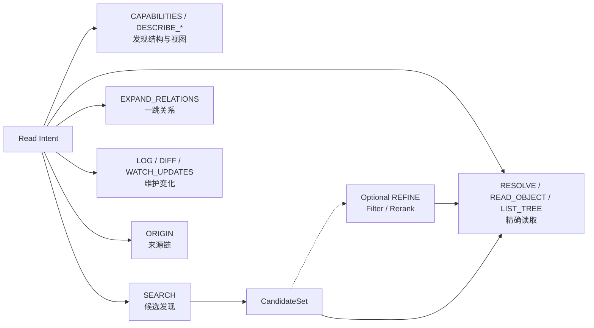

# 20. 公共 Read Protocol

## 20.1 `ReadContext`

```yaml
principal_context_ref: auth-context:current
read_target:
  mode: VIEW_GENERATION       # VIEW_GENERATION | REPOSITORY_COMMIT
  view_generation: generation-721
  repository_id: null
  commit_id: null
consistency: PROJECTION_OK    # PROJECTION_OK | CANONICAL
scope:
  repository_ids: []
  namespace_prefixes: []
  address_prefixes: []
page:
  limit: 50
  cursor: null
budget:
  max_items: 100
  max_edges: 200
  max_bytes: 1048576
  timeout_ms: 2000
explain: BASIC                # NONE | BASIC | FULL
fallback_policy: []
```

稳定 View 读取必须提供 `view_generation`；直接测试某个 Repo 的 Candidate 时可以提供精确 `repository_id + commit_id`，或更常见地先由 Catalog 构造 PreviewGeneration。Branch/Release 等符号名只能在请求开始时解析一次，实际结果仍返回 Commit 和 Generation。

规则：

- `read_target` 约束该次 Read 中的所有 Canonical Hydration；
- 授权按读取时 Principal 和当前 Policy 重新判断；Generation 锁定数据版本，不冻结 ACL；
- `budget` 是 items/edges/bytes/time 约束，不等于 LLM Token Budget；
- 不支持的能力只能失败或按显式 `fallback_policy` 降级；
- Access Result 必须返回实际使用的 `ViewReadVersion`、授权决策引用、Coverage 与 Degradation；
- 无权访问的 Repo 不得通过计数、错误差异、搜索片段、关系边或 Provenance 旁路泄漏。

## 20.2 `ProjectionSpec`

```yaml
projection:
  aspects: [identity, definition]
  fields:
    - identity.title
    - identity.type_ref
    - definition.description
  include_identity: true
  include_revision: true
  include_provenance_summary: false
```

Projection 是返回遮罩，不改变命中集合，也不是独立根操作。

> 术语说明：`ProjectionSpec` 是**结果字段投影**；后文的 Access Projection 是**可重建索引/访问状态**。二者共享“从更完整状态映射出部分视图”的一般含义，但不是同一个协议对象。

## 20.3 Wire Envelope

```text
Read(ReadRequest{operation, context, spec, projection})
→ KnowledgeReadResult
```

`operation` 是封闭枚举：

```text
CAPABILITIES | DESCRIBE_SCHEMA | DESCRIBE_INDEX | RESOLVE
READ_OBJECT | LIST_TREE | LOG | DIFF | ORIGIN
SEARCH | EXPAND_RELATIONS | WATCH_UPDATES
```

`spec` 必须是按 Operation 区分的封闭联合类型，不能退化成任意 JSON 查询语言。

# 21. 十二个 Core Access Operation

## 21.1 `CAPABILITIES`

```text
CAPABILITIES(context) → AccessCapabilityManifest
```

返回支持的 Operation、Search Channel、Predicate、最大批量/深度、可用 Projection、Consistency 与 Watch 能力。它描述实现能力，不等于 Principal 已获授权。

## 21.2 `DESCRIBE_SCHEMA`

```text
DESCRIBE_SCHEMA(schema_or_type_ref, context) → SchemaDescriptor
```

描述 Entity/Aspect Type、Schema Revision、Pattern、Role、字段 `AccessHints`、兼容性和校验规则。它承担最小 Introspection，不复制完整 GraphQL Schema Runtime。

## 21.3 `DESCRIBE_INDEX`

```text
DESCRIBE_INDEX(view_generation, context) → ViewDescriptor
```

返回授权后可见的 View 来源、每个 Repository 的 Commit/Release、Projection Generation、Coverage、Lag 与缺失原因。未授权 Repo 不出现在结果中；调用方不能通过 Source Count 推断隐藏来源。

## 21.4 `RESOLVE`

```text
RESOLVE(knowledge_refs[1..N], context) → ResolutionSet
```

把 `KnowledgeRef` 在指定 Generation 中解析为：

```text
RepositoryIdentity + CommitIdentity + ObjectIdentity + KnowledgeAddress
```

若对象已删除、当前 Generation 不含该 Repo、Principal 无权访问或引用歧义，返回不同的结构化状态，但外部错误呈现必须遵守防旁路泄漏策略。PinnedKnowledgeRef 不重新跟随上游；它只验证目标仍可访问。

## 21.5 `READ_OBJECT`

```text
READ_OBJECT(targets[1..N], projection, context)
→ KnowledgeValue | KnowledgeValueSet
```

按 `KnowledgeRef`、`PinnedKnowledgeRef` 或 Address 精确读取 Entity、Aspect、Member、Relation、Record、Derived Revision、Artifact Manifest 或 Fragment。批量读取只是传输优化，不提供跨 Target 事务；每项都返回来源 Repo、Commit、ObjectIdentity、Schema、地址、授权与错误。

## 21.6 `LIST_TREE`

```text
LIST_TREE(parent_address, list_spec, context) → Page<RefSummary>
```

只枚举直接子级：View 中授权 Repo、Namespace 下的 Entity、Entity 的 Aspect、Keyed Collection 的 Member、Schema Revision 或 Stream 摘要。它不递归抓取整个 Repo，也不把文件目录当知识身份。

## 21.7 `LOG`

```text
LOG(repository_or_ref_or_object, log_spec, context) → Page<RevisionSummary>
```

对 Snapshot 返回 Git Commit/Ref 历史和 Merge Parent；对 Append、Derived、Artifact 分别声明 `APPEND_CURSOR`、`DERIVED_REVISION`、`ARTIFACT_REVISION`。对象 Log 通过 ObjectIdentity 跨路径追踪，不能只依赖文件名。

## 21.8 `DIFF`

```text
DIFF(from_commit_or_generation, to_commit_or_generation, target?, context)
→ RepositoryDiff | ViewDiff
```

同 Repo Diff 使用 Git Commit 与 Pattern-aware 解释；跨 Generation Diff 先报告 Repo Added/Removed/Commit Changed，再对调用方有权访问且支持比较的 Repo 展开对象差异：

| Pattern / Collection | Diff 结果 |
|---|---|
| Record | 字段变化或内容 Hash |
| Keyed Collection | Member added / removed / changed |
| Ordered Artifact | Artifact Revision + 可选 Section Diff |
| Relation Set | Edge added / removed / qualifier changed |
| Append | Cursor Range，不把事件解释成快照 Diff |
| Derived | Revision / Input View / Algorithm / Value 差异 |

## 21.9 `ORIGIN`

```text
ORIGIN(target_address, origin_spec, context) → ProvenanceTrace
```

最小链：

```text
Current Value
← Repository / Commit / Object
← Commit / Append / Derivation Activity
← Source Record / Evidence / Artifact / Pinned Input
← Principal / System / Algorithm
```

跨 Repo 关系必须保留双方 KnowledgeRef；MVP 不做完整 PROV 推理，只返回可审计回链。

## 21.10 `SEARCH`

```text
SEARCH(search_spec, context) → CandidateSet
```

MVP `SearchSpec`：

```yaml
kinds: [ENTITY, ASPECT, MEMBER, FRAGMENT]
text:
  query: 退款超时
  mode: LEXICAL              # LEXICAL required; VECTOR/HYBRID optional
  target_fields: [title, description, body]
where:
  and:
    - path: identity.lifecycle
      op: EQ
      value: ACTIVE
    - path: identity.type_ref
      op: IN
      value: [policy, procedure]
repositories: []             # 空表示 View 中全部授权来源
```

基础 Predicate 为 `EQ / NEQ / IN / EXISTS / LT / LTE / GT / GTE / AND / OR / NOT`。结果默认是带来源的引用与轻量 Summary，不自动 Hydrate 全对象。不同 Repo 中的同题对象不能因标题相同而去重；Dedup Key 至少是 `RepositoryIdentity + ObjectIdentity + Address`。

## 21.11 `EXPAND_RELATIONS`

```text
EXPAND_RELATIONS(seed_refs, expansion_spec, projection, context) → GraphSlice
```

```yaml
predicates: [depends_on, defined_by, contradicts]
direction: OUTGOING          # OUTGOING | INCOMING | BOTH
depth: 1
include_edges: true
```

Base MVP 只保证一跳。跨 Repo Edge 的两端独立做授权裁剪；如果另一端不可见，不得返回可用于猜测其身份的半边 Edge。任意路径、最短路和多跳授权穿越不进入 Core。

## 21.12 `WATCH_UPDATES`

```text
WATCH_UPDATES(watch_spec, cursor, context) → ChangeBatch + next_cursor
```

可观察的事件包括：Repository RefUpdate、Release Published、ViewGeneration Created/Promoted、Proposal Candidate Advanced、Append Cursor Advanced、Derived Head Changed 和 Projection Ready。事件只表示“可能需要重读/重算”，不携带未经授权的完整 payload。

Watch 至少一次投递；消费者用 `event_id/cursor` 幂等，并用 `DESCRIBE_INDEX`、`DIFF` 或 `READ_OBJECT` 获取确定状态。它完成“发现变化 → 定位差异 → 生成 Candidate → Preview 验证 → Promote”的维护闭环，而不是把维护逻辑塞进 Access。

## 21.13 兼容名称映射

早期 API 可以保留薄适配：

| 旧名称 | 规范操作 |
|---|---|
| `DESCRIBE` | `CAPABILITIES` / `DESCRIBE_SCHEMA` / `DESCRIBE_INDEX` |
| `LIST` | `LIST_TREE` |
| `GET` | `RESOLVE` + `READ_OBJECT` |
| `FIND` | `SEARCH` |
| `EXPAND` | `EXPAND_RELATIONS` |
| `HISTORY` | `LOG` |
| `PROVENANCE` | `ORIGIN` |

适配器不能改变版本、授权、来源和 Coverage 语义。

# 22. Typed Result Model

## 22.1 `RefSummary`

```yaml
knowledge_ref: kc://public/core/metric/refund_amount
repository_id: kr://public/core
commit_id: p42
object_id: metric/refund_amount
address:
  kind: EntityAddress
  object_id: metric/refund_amount
kind: ENTITY
schema_ref: urn:knowledge:schema:metric:v1
summary:
  title: Refund Amount
  lifecycle: ACTIVE
```

## 22.2 `KnowledgeValue`

```yaml
knowledge_ref: kc://public/core/metric/refund_amount
repository_id: kr://public/core
commit_id: p42
address:
  kind: AspectAddress
  object_id: metric/refund_amount
  aspect_name: definition
schema_ref: urn:knowledge:schema:metric-definition:v2
pattern_ref: urn:knowledge:pattern:record
value:
  title: Refund Amount
  definition: 已完成且未撤销退款的订单金额
```

## 22.3 `CandidateSet`

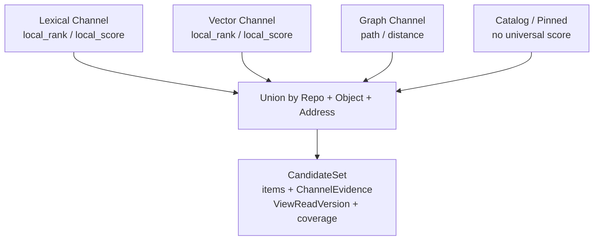

CandidateSet 保留各通道局部证据，而不是伪造统一概率：

```yaml
view_read_version:
  view_generation: generation-721
  projection_generations: {text: text-index:991}
dedup_key: repository_id+object_id+knowledge_address
items:
  - repository_id: kr://public/core
    commit_id: p42
    object_id: metric/refund_amount
    knowledge_ref: kc://public/core/metric/refund_amount
    address: metric/refund_amount#definition
    summary:
      title: Refund Amount
    channel_evidence:
      - channel: lexical
        provider_ref: urn:provider:fts-main
        local_rank: 2
        local_score: 12.83
        matched_fields: [description]
      - channel: vector
        provider_ref: urn:provider:vector-main
        local_rank: 7
        local_score: 0.81
channels:
  - channel: lexical
    complete: true
  - channel: vector
    complete: false
completeness:
  status: PARTIAL
  reasons: [VECTOR_BUDGET_REACHED]
coverage:
  visible_repositories: [kr://public/core, kr://group/research]
  projection_lag: {text: PT4S}
```

BM25、Cosine、Graph Distance 和人工 Pin 没有天然共同尺度。Access 可以使用 RRF、归一化或 Provider 策略产生展示顺序，但必须保留原始 ChannelEvidence，并在 Explain 中说明策略。

## 22.4 `GraphSlice`

```yaml
nodes: [RefSummary]
edges:
  - relation_ref: kc://public/core/relation/refund-depends-refunds
    source_ref: kc://public/core/metric/refund_amount
    predicate_ref: urn:knowledge:predicate:depends_on
    target_ref: kc://group/research/dataset/refunds
    qualifiers: {}
frontier: []
truncated: false
continuation: null
```

## 22.5 `KnowledgeReadResult`

```yaml
operation: SEARCH
result_kind: CANDIDATE_SET
result: {...}
view_read_version: {...}
authorization_decision_ref: authz-decision:8f2...
execution:
  providers: [ripgrep]
  consistency: BEST_AVAILABLE
  degraded: false
  missing_capabilities: []
completeness:
  status: COMPLETE
  truncated: false
explain: null
```

所有结果必须显式表达：

```text
repository / commit / object provenance
view_generation / view_read_version
authorization_decision_ref
complete / partial
coverage / projection lag
truncated
continuation
missing_capabilities
degradation
```

# 23. Optional Semantic Refinement

## 23.1 定位

Semantic Refinement 是可选 Capability，不是 Base Read Operation：

```text
SEARCH / EXPAND_RELATIONS / Pinned Refs
→ CandidateSet
→ REFINE { SEMANTIC_FILTER | SEMANTIC_RERANK }
→ READ_OBJECT / ORIGIN
```

Portable Profile 可以合法声明：

```yaml
refine:
  supported: false
```

## 23.2 为什么只保留 Filter 与 Rerank

```text
SEMANTIC_FILTER  Natural-language Predicate → 输入 Ref 的子集
SEMANTIC_RERANK  Natural-language Ordering  → 输入 Ref 的 RankGroup
```

它们属于 Ref-preserving Access Operator。

`EXTRACT_TYPED` 会产生新值，因此属于 Application / Control Plane 的 Derivation，不进入 Access。

## 23.3 `SemanticOperatorSpec`

```yaml
kind: SemanticOperatorSpec
metadata:
  spec_ref: urn:semantic-spec:refund-diagnostic-rank
  revision: 3
spec:
  operator: SEMANTIC_RERANK
  criterion: >
    按候选知识对退款超时根因诊断的直接帮助程度排序；
    优先能够解释失败机制、给出可验证信号并包含处理步骤的知识。
  evaluation_projection:
    aspects: [identity, definition, diagnostic_steps]
    fields:
      - identity.title
      - definition.description
      - diagnostic_steps.items
  context_refs:
    - urn:knowledge:policy:refund-sla
  output_contract:
    top_k: 10
    allow_ties: true
    allow_unjudged: true
```

协议冻结 Criterion、EvaluationProjection、ContextRefs 与 OutputContract；模型名、Prompt、Batch、Cascade 属于 Provider。

## 23.4 Filter 三值与未判断

```text
MATCH       可见知识足够支持 Predicate
NO_MATCH    可见知识足够否定 Predicate
UNKNOWN     已判断，但信息不足或语义不可判定
UNJUDGED    因预算/中断尚未完成判断
```

UNKNOWN 与 UNJUDGED 必须分开；默认不能强迫二值猜测。

## 23.5 Rerank 使用 RankGroup

```yaml
groups:
  - rank: 1
    refs: [urn:knowledge:procedure:refund-timeout-diagnosis]
  - rank: 2
    refs:
      - urn:knowledge:policy:refund-sla
      - urn:knowledge:metric:refund-processing-latency
unjudged:
  - urn:knowledge:doc:legacy-payment-notes
complete: false
truncation_reason: CANDIDATE_BUDGET
```

不要求输出伪精确概率；并列与未判断是合法结果。

## 23.6 Operator 与 Agent 边界

| 判断 | Semantic Operator | Application / Agent |
|---|---|---|
| 输入候选 | 调用前固定 | 可以持续 SEARCH |
| 可见字段 | EvaluationProjection 固定 | 可继续 READ_OBJECT / EXPAND_RELATIONS |
| 输出 | 子集 / 排序 | 任务答案、计划、建议 |
| 新 Ref | 禁止创造 | 可通过 Access 发现 |
| 工具调用 | 禁止 | 可以 |
| 副作用 | 禁止 | 只能经 Ingress |

# 24. Access Provider 与 Projection

## 24.1 Projection 属于 Access 实现状态

MVP 允许以下可重建 Projection：

```text
Object Catalog Projection
Content / Fragment Projection
Relation Adjacency Projection
Record / Provenance Projection
Vector Projection（可选）
```

它们必须：

- 记录 Source ViewReadVersion；
- 对联合视图记录 Source `ViewGeneration` 以及逐 Repo Commit；
- 可从 Canonical 重建；
- 不成为 KnowledgeRef/ObjectIdentity 的来源；
- 失败时不能反向修改 Repository；
- 切换 Generation 时显式报告。

## 24.2 AccessHints

Schema 只声明稳定访问意图，不绑定物理索引：

```yaml
fields:
  title:
    type: string
    access: [key, text, summary]
  description:
    type: string
    access: [text, summary]
  status:
    type: enum
    access: [filter, summary]
  valid_from:
    type: timestamp
    access: [filter, sort]
  internal_payload:
    type: object
    access: [stored]
```

MVP Hint：

```text
key / filter / text / sort / summary / stored
```

HNSW、GIN、B-tree、Analyzer 和 Embedding Model 都属于 Provider / Profile。

## 24.3 Provider 映射

| Operation | Portable File | Embedded Indexed | Managed Scale |
|---|---|---|---|
| CAPABILITIES / DESCRIBE_* | Manifest + Catalog lock files | SQLite Catalog | Catalog Service / SQL |
| RESOLVE / READ_OBJECT / LIST_TREE | Address map + file read | File / SQLite | Repository Service / Object Store |
| SEARCH lexical | ripgrep | SQLite FTS5 | OpenSearch inverted index |
| SEARCH predicate | Manifest scan | SQLite index | SQL / OpenSearch filter |
| SEARCH vector | unsupported | optional local vector | vector provider |
| EXPAND_RELATIONS | relation files | SQLite adjacency | SQL / graph projection |
| LOG / DIFF | Git | Git / SQLite | Git / repository service |
| ORIGIN | manifest + SQLite scan | SQLite | PostgreSQL / lineage projection |
| WATCH_UPDATES | Git ref scan + cursors | SQLite change log | Event stream / CDC |
| REFINE | unsupported by default | optional local judge | model / reranker provider |

`grep` 是合法 Provider，但必须把路径映射回 RepositoryIdentity、ObjectIdentity 与 KnowledgeAddress，并声明无语义分词、同义词和跨 Repo 全局排名保证。

# 25. Access MVP 冻结范围

## 25.1 必须实现

```text
ReadRequest / KnowledgeReadResult
ReadContext / ProjectionSpec
CAPABILITIES / DESCRIBE_SCHEMA / DESCRIBE_INDEX / RESOLVE
READ_OBJECT / LIST_TREE / LOG / DIFF / ORIGIN
SEARCH / EXPAND_RELATIONS / WATCH_UPDATES
ViewGeneration / ViewReadVersion / AuthorizationDecisionRef
LEXICAL SEARCH
一跳 EXPAND_RELATIONS
基础 Predicate AST
Provenance / Coverage / Completeness / Degradation
Portable Provider: file + grep + Git
```

## 25.2 可选但语义已定义

```text
VECTOR / HYBRID SEARCH
CandidateSet 多通道合并
SEMANTIC_FILTER / SEMANTIC_RERANK
SQLite FTS / local vector
Managed Search Provider
```

## 25.3 明确延后

```text
公开通用 LogicalPlan / SQL / Graph DSL
任意多跳路径
跨 Store Join / Federation
Aggregate / Group / Semantic Join
Context Packing / Prompt Rendering
模型自由探索整个 Repository
```

***
# Part VI　端到端流程与模块组织

# 26. 端到端流程

## 26.1 权威库表元数据变化

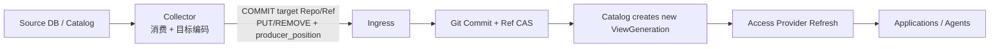

边界要点：

1. Collector 在 Ingress 之前解析来源格式、映射身份并计算变化；
2. Collector 持有范围受限的 COMMIT Binding；
3. Ingress 不判断内容权威性，只执行 Binding；
4. Repo 创建新 Commit，并以 CAS 移动明确的目标 Ref；
5. Catalog 创建或 Promote 引用该 Commit 的新 ViewGeneration；
6. Access Projection 异步刷新，强读可直接绑定新 Generation/Commit。

## 26.2 用户编辑

```text
Access READ_OBJECT(target, generation)
→ Editor 本地修改
→ COMMIT target_repository + target_ref
         PUT(full_value, IF_OBJECT_EQUALS)
→ Git Commit + CAS Ref
→ Commit Receipt
```

用户编辑被视为目标 Repo 的权威写入时直接使用 COMMIT，而不是强制经过 Proposal。没有 public 写权限的 group/personal 用户可以在自己的 Repo 创建本地 Assertion/Fork，或向 public Repo 提交 PROPOSAL；联合 View 本身不可写。

## 26.3 主动维护建议


Ingress 不在 Proposal 与 Commit 之间自动转换；控制平面必须使用目标 Repo 授权执行 Merge/RefUpdate，并单独请求 Catalog Promote。任何 Candidate 更新都会产生新 Commit，使旧 Validation 失效。

## 26.4 Observation / Feedback

```text
Source Event
→ APPEND durable record
→ immediate AppendReceipt
→ optional async extraction / evaluation
→ Derived Value or target-repo PROPOSAL
→ optional Preview / Validation / Merge / View Promote
```

原始记录的 Durable ACK 不等待模型分析、Projection 或正式知识变化。

## 26.5 Artifact 导入

```text
PutArtifact(bytes)
→ ArtifactRef(content_hash)
→ COMMIT / PROPOSAL / APPEND references ArtifactRef
```

孤儿 Artifact 可以在 Grace Period 后回收；ArtifactReceipt 本身不表示知识已引用。

## 26.6 发现、精炼与精确读取

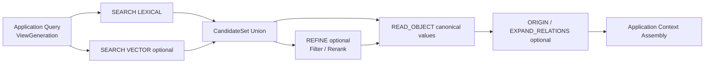

`Context Assembly` 由 Application 按任务、模型与预算完成，不属于 Access Core。

## 26.7 Read-your-write

COMMIT 返回 Repository Commit 后，调用方可以：

```text
READ_OBJECT(repository_commit = returned commit)  直接强一致读取
create Preview/ViewGeneration containing commit   跨 Repo 一致读取
SEARCH(consistency = CANONICAL)                    绕过或等待 Projection
SEARCH(consistency = PROJECTION_OK)                允许旧 Projection，但接收 lag/coverage
```

不能假设 Search Projection 或稳定 View 在 CommitReceipt 返回时已经同步；Repository Commit、Projection Ready 和 Catalog Promote 是三个独立观察点。

## 26.8 贯穿示例：退款政策从创建到持续维护

以下例子把系统所有操作面放在同一条时间线上。

### 阶段 1：创建权威边界与首次发布

```text
Repository CREATE_REPOSITORY public/core
Repository CREATE_REPOSITORY group/payments
Repository CREATE_REPOSITORY personal/alice
Catalog REGISTER_REPOSITORY × 3

Repository PutArtifact(refund-handbook.pdf) → sha256:H1
Ingress COMMIT target=public/core/main parent=p0
  PUT policy/P-103
  PUT artifact-manifest/refund-handbook → H1
→ commit p1, CAS main p0→p1
Repository PUBLISH_RELEASE public/core/release/2026.08 → p1
```

Catalog 定义 `alice-default`，包含 public、payments group 和 alice personal，随后 `RESOLVE_VIEW` 得到 `generation-1 {public:p1, group:g0, personal:u0}` 并 Promote。至此已经有可复现联合视图，但三个 Repo 的历史仍完全独立。

### 阶段 2：查询、引用与本地信息维护

Alice 的客户端先调用 `CAPABILITIES`、`DESCRIBE_SCHEMA` 和 `DESCRIBE_INDEX`，确认 Access 能力、Policy Schema 以及 generation-1 的授权来源；随后：

```text
RESOLVE kc://public/core/policy/P-103
→ public/core@p1 + object policy/P-103

READ_OBJECT / LIST_TREE / SEARCH / EXPAND_RELATIONS
→ 所有命中带 repository_id、commit_id、object_id、scope、provenance

LOG / ORIGIN
→ public 的 Git 历史、Artifact H1 与提交者/理由
```

payments group 认为该政策只适用于生产环境，但没有修改 public：

```text
Ingress COMMIT target=group/payments/main parent=g0
  PUT assertion/A-27 {
    about: kc://public/core/policy/P-103,
    relation: appliesWithin,
    scope: production
  }
→ g1
```

Alice 再在 personal Repo 提交私人操作笔记，引用相同 public KnowledgeRef，得到 u1。Catalog 解析并 Promote `generation-2 {public:p1, group:g1, personal:u1}`。SEARCH 同时返回 public Policy、group 限定 Assertion 和 personal Note；不存在覆盖排序。

### 阶段 3：观察、派生与变更提案

支付系统上报一次退款超时：

```text
Ingress APPEND stream=group/payments/refund-observations event_id=e-91
→ cursor 881
```

评估器在固定 `ViewReadVersion(generation-2 + cursor 881)` 上生成 Derived Diagnosis，并提出修改 public Policy 的建议：

```text
Ingress PROPOSAL target=public/core
  target_ref=main
  candidate_ref=candidates/PR-42
  base_commit=p1
  PUT policy/P-103 {...revised...}
→ candidate commit pc2
```

Proposal Receipt 不改变 public/main，也不改变 generation-2。

### 阶段 4：访问未合并 Branch 并验证完整组合

Catalog 执行：

```text
CREATE_PREVIEW(base=generation-2,
               substitute public/core p1→pc2)
→ preview-3 {public:pc2, group:g1, personal:u1}
```

测试工具对 `preview-3` 调用 `RESOLVE / READ_OBJECT / SEARCH / EXPAND_RELATIONS / DIFF / ORIGIN`，确认 group 的 `about` 引用仍可解析、Schema 兼容、搜索 Projection 可重建、政策与本地限定不矛盾。`ValidationReport` 绑定 preview-3、pc2 和 suite revision S7。

若 Candidate Branch 又提交 pc3，旧报告立即失效；Catalog 必须创建新的 PreviewGeneration 重测。不能让稳定 View 直接跟随 `candidates/PR-42`。

### 阶段 5：合并、发布与 View Promotion

```text
Repository MERGE target=public/core/main
  candidate=pc2 expected_target=p1 validation=preview-3/S7
→ merge commit p2, CAS main p1→p2

Repository PUBLISH_RELEASE release/2026.09 → p2
Catalog RESOLVE_VIEW alice-default → generation-4
Catalog VALIDATE_GENERATION generation-4
Catalog PROMOTE channel=stable expected=generation-2 new=generation-4
```

Projection 构建完成后发出 `Projection Ready`。`WATCH_UPDATES` 消费者收到 RefUpdate、Release、Generation 与 Projection 事件，用游标幂等处理，并调用 `DESCRIBE_INDEX` 和 `DIFF(generation-2,generation-4)` 定位变化。旧 generation-2 仍可用于审计与回归；Promotion 失败时继续服务旧 Generation。

### 阶段 6：回滚、Fork 同步与退役

若新版本有问题，Catalog 可先 `ROLLBACK_PROMOTION` 回 generation-2，而不回写任何 Repo；若 public 内容本身需要撤销，再在 public Repo 执行 `REVERT` 生成 p3，并经过新 Generation 验证/Promote。

若 group 不是引用而是 Fork 了 P-103，则它拥有新的 `group/payments/policy/P-103-local`，并记录 `wasDerivedFrom public/core@p1/P-103`。同步 p2 时才使用：

```text
Base=p1, Upstream=p2, Local=group fork head
→ explicit three-way sync → group candidate → preview → merge
```

最终 Repo 不再维护时执行 `ARCHIVE_REPOSITORY`，Catalog `RETIRE_DEFINITION` 或更新 ViewDefinition；历史 Generation、Commit、Receipt、Validation 与 Promotion Audit 按保留策略继续可追溯。

# 27. 总体模块目录

```text
knowledge-platform/
├── contracts/                       # 纯协议与领域类型，不依赖运行时
│   ├── identity/
│   │   ├── repository-identity
│   │   ├── object-identity
│   │   ├── knowledge-ref
│   │   ├── pinned-knowledge-ref
│   │   ├── file-ref
│   │   ├── knowledge-address
│   │   └── commit-identity
│   ├── catalog/
│   │   ├── repository-registration
│   │   ├── view-definition
│   │   ├── view-generation
│   │   ├── view-read-version
│   │   └── promotion
│   ├── ingress/
│   │   ├── negotiation
│   │   ├── binding
│   │   ├── commit
│   │   ├── proposal
│   │   ├── append
│   │   ├── receipt
│   │   └── errors
│   ├── repository/
│   │   ├── git-objects
│   │   ├── refs-and-releases
│   │   ├── entity
│   │   ├── aspect-binding
│   │   ├── schema
│   │   ├── pattern
│   │   ├── collections
│   │   ├── provenance
│   │   └── capabilities
│   └── access/
│       ├── read-request
│       ├── read-context
│       ├── projection-spec
│       ├── operations
│       ├── candidate-set
│       ├── results
│       └── refine
│
├── catalog/
│   ├── repository-registry/
│   ├── view-resolution/
│   ├── generation-store/
│   ├── promotion/
│   └── authorization-projection/
│
├── ingress/
│   ├── negotiation/
│   ├── binding/
│   ├── canonicalization/
│   ├── idempotency/
│   ├── ordering/
│   ├── validation/
│   ├── dispatch/
│   ├── receipts/
│   └── application/
│       ├── describe-ingress
│       ├── negotiate-write
│       ├── commit
│       ├── propose
│       └── append
│
├── repository/
│   ├── kernel/
│   │   ├── git-object-store
│   │   ├── commit-graph
│   │   ├── ref-cas
│   │   ├── merge-and-release
│   │   ├── address-resolution
│   │   ├── schema-validation
│   │   ├── pattern-enforcement
│   │   ├── reference-validation
│   │   └── read-cut-coordination
│   ├── collections/
│   │   ├── snapshot
│   │   ├── append
│   │   ├── derived
│   │   └── artifact
│   ├── proposal-metadata/
│   ├── artifact-endpoint/
│   ├── checkout/
│   └── export-import/
│
├── access/
│   ├── protocol/
│   ├── planner/
│   ├── providers/
│   ├── projections/
│   ├── result-assembly/
│   ├── explain/
│   └── refine/
│
├── adapters/
│   ├── memory/
│   ├── file-git/
│   ├── sqlite/
│   ├── postgres/
│   ├── object-store/
│   ├── opensearch/
│   └── model-provider/
│
├── interfaces/
│   ├── cli/
│   ├── mcp/
│   ├── http/
│   └── grpc/
│
├── applications/                    # 仅示意，不属于 Core
│   ├── authoring
│   ├── search-ui
│   └── context-assembler
│
├── control-plane/                   # 维护闭环编排；不绕过领域协议
│   ├── watch-and-diff
│   ├── evaluation
│   ├── proposal-generation
│   ├── preview-generation
│   ├── validation
│   ├── review-and-merge
│   ├── promotion
│   └── derivation
│
└── tests/
    ├── protocol-conformance/
    ├── repository-invariants/
    ├── pattern-contracts/
    ├── ingress-idempotency/
    ├── provider-golden/
    ├── multi-repo-view/
    ├── profile-migration/
    ├── failure-injection/
    └── agent-compatibility/
```

## 27.1 依赖方向

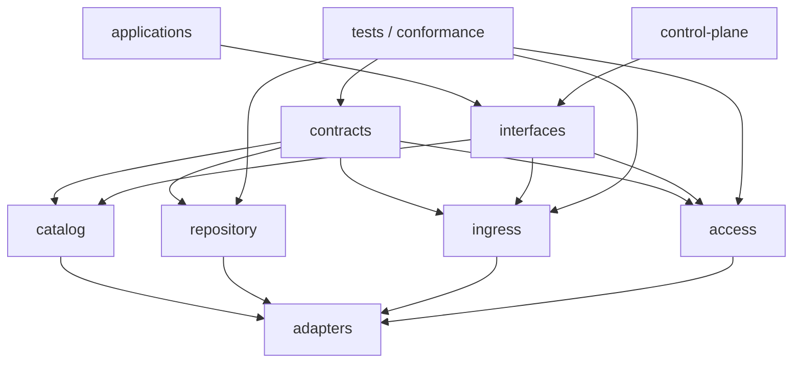

关键限制：

```text
contracts 不依赖任何运行时或 Store
catalog 只登记/解析 Repo 与 View，不写 Repo Canonical State
repository kernel 不依赖 Access Provider
access 不直接写 Canonical Backend
ingress 不依赖 Collector / LLM / Control Plane
applications / control-plane 不依赖具体 Backend
control-plane 只能通过 Catalog/Ingress/Repository Review/Access 协议推进闭环
```

# 28. 推荐 MVP 部署

## 28.1 单机研究型部署

```text
knowledge-cli / local daemon
├── Catalog Registry + View Lock Store
├── multiple independent File+Git Repositories
│   ├── public/core.git
│   ├── group/research.git
│   └── personal/alice.git
├── SQLite Append / Proposal Metadata / Derived / Receipt Adapter
├── Local CAS Artifact Adapter
├── Manifest / Address Map Provider
├── ripgrep SEARCH Provider
├── Git LOG / DIFF Provider
└── optional SQLite FTS5 Provider
```

它能够验证所有核心语义，而无需引入服务编排。

## 28.2 未来协作型 Profile（仅愿景）

```text
Catalog         Registry + immutable ViewGeneration store
Snapshot        multiple Git repositories or equivalent version store
Append/Derived PostgreSQL
Artifact        S3-compatible object storage
Access          PostgreSQL + OpenSearch + optional vector provider
Ingress/Access  stateless service
```

Profile 升级是 Adapter 与 Capacity 变化，不应修改应用的 Write Surface、KnowledgeRef、ViewGeneration 或 Core Access Operation。同一个托管服务可以承载多个 Repo，但必须维持逐 Repo ACL、Commit Graph 与加密/备份隔离策略。

***

# Part VII　MVP 落地与验证

# 29. 实施路线

## Phase 0：Contract 冻结与 Memory Adapter

交付：

```text
RepositoryIdentity / ObjectIdentity / KnowledgeRef / Address / Commit
ViewDefinition / ViewGeneration / ViewReadVersion
3 Write Surfaces + Binding + Receipt
4 Collections + 4 Patterns
12 Access Operations + Typed Results
Memory Adapter
Conformance Test Skeleton
```

退出标准：所有不变量可通过纯内存测试验证。

## Phase 1：Portable File Profile

交付：

```text
Multiple Files + Git Repositories
Catalog Registry + immutable ViewGeneration lock
SQLite WAL for Append / Proposal Metadata / Derived / Receipt
Local Artifact CAS
Address Map
CLI: capabilities/describe-index/resolve/read/list/search/expand/log/diff/origin/watch
CLI: commit/propose/append/put-artifact
```

退出标准：现有 Coding Agent 仅用文件、grep、Git 与 CLI 即可完成读取、编辑和提交。

## Phase 2：Embedded Access

交付：

```text
SQLite Catalog / FTS5 / Relation Adjacency
Capability Manifest
Projection Generation + per-Repo Commit Coverage + Rebuild
Access Result Explain / Authorization / Completeness / Coverage
```

退出标准：Portable Provider 与 Embedded Provider 在 Golden Cases 上语义一致。

## Phase 3：主动维护试点

不设计通用控制平面，只实现一个窄闭环：

```text
APPEND Feedback
→ Evaluation
→ target-repo PROPOSAL + Candidate Commit
→ PreviewGeneration + Validation
→ Human Review + Merge
→ new ViewGeneration + Promote
```

退出标准：Proposal 从未绕过目标 Repo 的 Merge/RefUpdate；Validation 绑定完整 PreviewGeneration；反馈可回链到输入版本、Candidate、Merge Commit 和最终 Promotion。

## Phase 4：可选 Semantic Refinement

实现一个参考 `SEMANTIC_FILTER / SEMANTIC_RERANK` Provider，验证：

```text
Ref-preserving
ViewGeneration binding
UNKNOWN / UNJUDGED
RankGroup
EvaluationProjection boundary
Traceability
```

只有真实任务证明价值后，才将其纳入生产 Profile。

# 30. Conformance 与实验

## 30.1 核心测试

| 编号 | 测试 | 通过标准 |
|---|---|---|
| T1 | Path Move | 文件移动后 ObjectIdentity / KnowledgeRef / Address 不变 |
| T2 | Commit CAS | 旧 parent/expected target Commit 的 PUT 被拒绝 |
| T3 | ChangeSet Atomicity | 任一 Operation 失败时无部分 Commit |
| T4 | Command Idempotency | 精确重试返回原 Receipt |
| T5 | Append Idempotency | 同 Event ID 同内容重放；不同内容冲突 |
| T6 | Proposal Isolation | Candidate Commit 可读，但 Proposal 成功后 target Ref 与稳定 View 不变 |
| T7 | Artifact Dedup | 同 Hash 不重复保存，引用独立 |
| T8 | Derived Revision | 输入 ViewReadVersion/算法变化产生新 Revision，不覆盖历史 |
| T9 | Projection Rebuild | 固定 ViewGeneration 重建结果 Semantic Digest 一致 |
| T10 | Read Version | 所有结果返回 Repo/Commit、ViewReadVersion、授权与 Coverage |
| T11 | Provider Equivalence | File / SQLite Provider 的 Golden Result 等价 |
| T12 | No Silent Fallback | 缺失能力被显式报告 |
| T13 | Refine Closure | 输出 Ref 全部属于输入 CandidateSet |
| T14 | Profile Migration | KnowledgeRef、Address 与协议语义不变 |
| T15 | Independent Repo | group/personal Commit 不改变 public Commit Graph |
| T16 | Cross-repo Reference | public 文件移动后 group KnowledgeRef 在新 Generation 仍可解析 |
| T17 | No Override | public 与 group 冲突断言同时返回，且各自来源完整 |
| T18 | View Lock | ViewDefinition 的 Branch 前移不改变已创建 Generation |
| T19 | Candidate Preview | 直接 Branch 访问先解析 Commit；Validation 绑定完整 PreviewGeneration |
| T20 | Promote Isolation | Catalog Promote 不写任何 Repository；失败可继续使用旧 Generation |
| T21 | ACL Re-evaluation | Generation 不冻结 ACL；权限撤销后相同 Generation 不再泄漏对象 |
| T22 | Watch Closure | Watch 至少一次重放可幂等，能驱动 DESCRIBE_INDEX/DIFF 重读 |
| T23 | Fork Sync | 仅 Fork/Vendor 进入显式 Base/Upstream/Local 三方同步 |

## 30.2 三个纵向试点

### Policy / Procedure

覆盖：

```text
Snapshot Record
Keyed Collection
Effective Time
Artifact Manual
COMMIT / PROPOSAL
LOG / DIFF / ORIGIN
```

### Research Paper

覆盖：

```text
PDF Artifact
Source Snapshot APPEND
Derived Extraction
Fragment Projection
SEARCH / READ_OBJECT / ORIGIN
```

### User / Agent Preference

覆盖：

```text
Raw Episode APPEND
Derived Assertion
Valid Time
Conflict Coexistence
Proposal to Accepted Assertion
Privacy Scope（只做最小约束）
```

## 30.3 MVP 退出标准

- 三个 Write Surface 的语义与 Receipt 可自动验证；
- 四类 Collection 均有一个可运行 Adapter；
- 四个 Pattern 覆盖至少两个差异明显的知识域；
- 十二个 Access Operation 在 Portable Profile 可用；
- Projection 删除后可以从固定 ViewGeneration 重建；
- 未 Merge 的 Candidate 不会改变目标 Ref或稳定 View；
- public/group/personal 作为独立 Repo 演化，联合查询始终保留来源；
- 普通引用升级、Candidate Preview、Catalog Promote 与 Fork 同步四条路径可区分并可验证；
- 已 ACK Append Entry 零丢失且可幂等重放；
- 所有重要 Result 和 Derived Revision 可回链到版本与来源；
- 不需要 Kafka、Graph DB、OpenSearch 或 LLM 即可完成 MVP。

# 31. 主要风险与控制

| 风险 | 控制方式 |
|---|---|
| 概念仍然过多 | 以“Catalog 4 核心对象 + Ingress 3 Surface + Repo Git Kernel/4 Collection + Access 12 Operation”分层冻结；不再引入 Mount/Overlay 同义词 |
| Entity / Aspect 被滥用成万能模型 | Aspect 只按独立维护边界拆分；简单对象允许单 Aspect |
| 文件路径与身份漂移 | KnowledgeRef 由 RepoIdentity+ObjectIdentity 构成；Path 只作 Hint；移动测试进入 Conformance |
| Proposal 积压形成第二套知识库 | Candidate Ref 有 TTL/归档策略；稳定 Access 只通过 Preview 显式读取它 |
| 把多个 Scope 再次做成目录层 | Repo 创建策略校验所有权、ACL、Release 节奏与历史可见性；不一致即拆 Repo |
| 联合结果被误当覆盖栈 | 结果强制返回 Repo/Commit/Scope/Provenance；分歧由本地 Assertion/Resolution 表达 |
| 活动 Branch 导致不可复现测试 | 所有 Branch 访问先解析精确 Commit；Validation 绑定完整 PreviewGeneration |
| View 锁文件被误当权限快照 | Generation 只锁数据；每次访问重新授权并防止旁路泄漏 |
| Derived 被误当 Accepted | Result 与 UI 必须显示 Collection / Role / Provenance |
| 多通道分数被误解 | 保留 ChannelEvidence；Explain 公开 Fusion 策略 |
| Refine 演变成隐式 Agent | 固定 CandidateSet、Projection、输出类型，禁止工具与新 Ref |
| Access Projection 反客为主 | 提供 Canonical READ_OBJECT；Generation 可重建；禁止索引直接写回 |
| Portable Profile 与 Managed Profile 语义分叉 | 同一 Conformance Suite 与 Golden Result Digest |

***
# Part VIII　设计决策与前沿工作

# 32. 关键架构决策

## ADR-001：Catalog 与 Repository 是两个公开领域边界

**决定**：Catalog 管理 Repo Registry、ViewDefinition、ViewGeneration 与 Promotion；Repository 管理自己的 Identity、ACL、Commit Graph、Branch、Release 和内容。  
**理由**：一个联合入口不应吞掉独立权威和维护边界。  
**后果**：public、每个 group、每个 personal 默认是独立 Repo；同一服务可物理托管多个 Repo。

## ADR-002：Ingress 采用三种显式 Surface

**决定**：`COMMIT / PROPOSAL / APPEND`，一个 Binding 只对应一个 Surface 和允许的目标 Repo/Ref 范围。  
**理由**：三者表达不同声明，不能由 Payload 或信任分数隐式推断。  
**重访条件**：出现无法由三者表达且具有独立原子性、幂等和 Receipt 语义的新写入类别。

## ADR-003：Snapshot 复用 Git 状态语义

**决定**：Immutable Object/Commit、Parent、Ref CAS、Branch、Merge、Tag/Release 和 Revert 是 Repository Snapshot 的版本内核。  
**理由**：这些成熟语义足以覆盖创建、修改、协作、测试、发布和回滚。  
**后果**：MVP 不重新发明 Revision Store；Managed Profile 必须提供等价语义。

## ADR-004：Snapshot 变化只使用 PUT / REMOVE

**决定**：不公开通用 Patch。  
**理由**：精确 Address、完整值、Git Diff 和 CAS 已覆盖 MVP；Patch 会泄漏物理表示。  
**重访条件**：真实数据证明大对象完整替换成为主要成本或冲突瓶颈。

## ADR-005：保留四类 Canonical Collection

**决定**：Snapshot、Append、Derived、Artifact。  
**理由**：它们具有不可互换的历史、修正和版本语义；并非所有内容都适合 Git。  
**拒绝**：所有内容进 Git、所有内容进一张表、Projection 成为第五类 Canonical Collection。

## ADR-006：四个 Pattern 只描述结构

**决定**：Record、Keyed Collection、Ordered Artifact、Relation Set。  
**理由**：Pattern 只回答最小维护单元；Append/Derived 已由 Collection 轴表达。  
**后果**：Assertion 是 Schema/Profile，不是新 Pattern。

## ADR-007：Entity / Aspect 是维护内核

**决定**：Entity 提供 Repo 内稳定 ObjectIdentity，Aspect 提供独立维护边界。  
**理由**：同一对象的定义、规则、文档和关系通常由不同来源独立变化。  
**约束**：不为了 UI 或检索随意拆 Aspect。

## ADR-008：KnowledgeRef 不使用 Path 作为身份

**决定**：普通引用为 `RepositoryIdentity + ObjectIdentity`；精确引用再加 Commit；FileRef 才使用 Path/Digest。  
**理由**：文件移动、Checkout 变化和 Profile 迁移不能破坏知识关系。  
**后果**：跨 Repo API 不接受无法确定 RepositoryIdentity 的裸 StableRef。

## ADR-009：ViewDefinition 与 ViewGeneration 分离

**决定**：Definition 可以包含 Branch/Release 选择器；Generation 必须锁定每个 Repo 的精确 Commit。  
**理由**：既要方便跟踪上游，又要可复现查询、评估和回滚。  
**后果**：一个 Generation 中每个 RepoIdentity 只出现一个 Commit。

## ADR-010：联合 View 不是覆盖栈

**决定**：多 Repo 结果保留来源并并存；不定义 personal/group/public 的隐式优先级。  
**理由**：权威范围不同不等于字段覆盖顺序，分歧本身也是知识。  
**后果**：知识语义 OverlayPatch 不进 MVP；本地差异用 Assertion/Relation/Derived Resolution 表达。

## ADR-011：联合 View 不可写

**决定**：每次 COMMIT/PROPOSAL 必须路由到唯一目标 Repo/Ref；不支持跨 Repo 原子写。  
**理由**：所有权、ACL 和 Git 历史需要单一权威落点。  
**后果**：修改 public 必须进入 public Repo；group/personal 不能借 View 写穿上游。

## ADR-012：Proposal 由 Candidate Commit 与非权威 Metadata 构成

**决定**：候选内容进入目标 Repo 的 Candidate Ref/Commit；Review Metadata 独立并锁定精确 Commit。  
**理由**：Proposal 需要真实 Git Diff/merge/rebase，但不能假装已经 Accepted。  
**后果**：普通稳定 View 不包含 Candidate；PreviewGeneration 可显式访问。

## ADR-013：Candidate 测试绑定完整 PreviewGeneration

**决定**：把一个 Repo 的稳定 Commit 替换为 Candidate Commit，生成新的 PreviewGeneration；ValidationReport 绑定整个 Generation。  
**理由**：候选行为依赖其与其他 Repo 的组合环境。  
**后果**：Branch 前移或任何参与 Repo Commit 变化都会使旧报告失效。

## ADR-014：Access 采用十二个固定操作

**决定**：Capability/Schema/View、Resolve/Read/List、Log/Diff/Origin、Search/Expand/Watch 共十二项。  
**理由**：既覆盖普通读取，也覆盖主动维护闭环，同时避免公开通用查询语言。  
**后果**：旧八操作只作为兼容适配名称。

## ADR-015：Projection 归属 Access

**决定**：Catalog Search、Text、Vector、Graph、Fragment 都是可重建 Access State。  
**理由**：索引面向执行效率，不能成为知识权威。  
**后果**：结果同时报告 ViewReadVersion、Projection Generation、Coverage 与 Lag。

## ADR-016：Graph MVP 只保证一跳

**决定**：`EXPAND_RELATIONS(depth=1)`。  
**理由**：多跳需要额外定义循环、路径去重、授权、预算和排序。  
**重访条件**：真实任务持续需要可验证的固定路径表达。

## ADR-017：Semantic Refinement 是可选、Ref-preserving

**决定**：只标准化 Filter/Rerank；Base Profile 可不支持。  
**理由**：模型判断有价值，但不应成为最低兼容前提，也不应创造新 Ref。  
**后果**：Typed Extraction 属于 Derivation，不属于 Access。

## ADR-018：多通道候选保留 ChannelEvidence

**决定**：按 Repo+Object+Address 去重，保留每通道 local rank/score/path。  
**理由**：BM25、向量、图距离和人工 Pin 没有统一尺度。  
**后果**：任何 Fusion 都是 Provider 策略，必须 Explain。

## ADR-019：ViewGeneration 与 ViewReadVersion 分离

**决定**：Generation 锁定 Repo Snapshot Commit；ReadVersion 另外记录 Append Cuts、Derived Heads、Projection Generations 与 Authorization Decision。  
**理由**：不同 Collection 可由不同 Backend 承载，不能伪造跨 Store 全局 Commit。  
**后果**：Generation 锁数据而不冻结 ACL；每次读取重新授权。

## ADR-020：MVP 先实现 Portable Multi-Repo Profile

**决定**：多个 Files/Git Repo + Catalog lock files + SQLite + Local CAS + ripgrep。  
**理由**：它足以验证全部系统语义，并保持 Agent-native 可检查性。  
**重访条件**：容量、并发或延迟指标超过明确阈值。

# 33. 前沿工作与采用边界

本文不是对某一系统的复制。下表列出设计决策的公开参照、采用内容与明确不采用内容。

| 工作 / 规范 | 对本设计的启示 | 采用 | 不直接采用 |
|---|---|---|---|
| Git / Submodule | Commit、Branch、Merge、Tag 及跨 Repo 精确 Commit 指针已经成熟 | 单 Repo 状态内核；可用 gitlink 编码 View Lock | 把目录路径、Submodule 或 Superproject 直接当 Catalog 领域模型 |
| Nix Flake Lock | 符号输入可以解析为完整、不可变的 revision lock graph | `ViewDefinition → ViewGeneration` | 软件包求值、构建沙箱与 Nix 语言 |
| OWL Imports / Version IRI | 稳定 ontology identity 与特定 version identity 分离；import closure 可锁版本 | Stable/Pinned KnowledgeRef、同 Repo 单版本约束 | 把所有知识强制建模为 OWL Ontology |
| RDF Dataset / Named Graph | 多来源可联合查询并保留来源图 | 每个结果保留 Repo/Commit/Object Provenance | 强制内部 RDF 化或用图名代替 ACL |
| Backstage EntityRef / DataHub URN | Catalog 关系指向稳定实体身份而不是文件位置 | Repository+Object Identity、显示名与身份分离 | 直接复用其命名空间作为本系统协议 |
| Quit Store | Git 化 RDF 可支持 Branch/Merge 与 SPARQL | 证明单个 Knowledge Repo 可复用 Git 生命周期 | 其单 Repo Dataset 不等于多 Repo ViewGeneration |
| DVC Import / GitHub reusable workflow | 跨 Repo 文件引用通常是 repo+path+ref/commit+digest | FileRef/Vendor 的底层编码 | 用文件引用代替 KnowledgeRef |
| DataHub Entity / Aspect | Aspect 是 Entity 的独立 facet，也是原子写入单位 | Entity / Aspect 维护边界、Schema 化 Aspect | 把企业元数据模型直接当通用知识本体 |
| DataHub MCP / MCL | 写入请求与处理后的变更日志分离，目标精确到 Aspect | Typed Change Request、请求与结果分离 | 其单 Aspect 原子性作为本系统唯一选择；本设计允许受协商的多 Address ChangeSet |
| Apache Iceberg Spec / REST Catalog | 协议隐藏 Backend，Commit 使用 requirements / updates 与乐观并发 | Capability、Precondition、服务端 Commit 语义、Profile 隔离 | 把 Table/Snapshot 模型直接等同于 Knowledge Repo |
| CloudEvents | `source + id` 对不同 Event 唯一，重复传输可复用 ID | APPEND Entry 幂等与 Source Scope | 用 Event Envelope 替代具有 ChangeSet/CAS 的 COMMIT |
| Airbyte Protocol | `spec / discover / configured catalog` 区分能力发现与实际配置 | `DescribeIngress → NegotiateWrite → WriteBinding` | 把来源 Connector 与 Ingress 合并；Ingress 不负责 Discover Source |
| W3C PROV-O | Entity / Activity / Agent 与 usage / generation 链 | 最小 Provenance Envelope 与导出映射 | 强制内部 RDF 化或完整 PROV 推理 |
| GraphQL Specification | Schema Introspection 与客户端显式字段选择 | DESCRIBE_SCHEMA 与 ProjectionSpec | GraphQL Resolver Runtime 和公开 GraphQL Wire Language |
| SPARQL 1.1 / ISO GQL | 图方向、边、Property Path 的正式语义 | Relation Set 与一跳 EXPAND_RELATIONS 的方向语义 | 任意路径、Join、Subquery 和完整图语言 |
| OpenSearch Hybrid Search | Lexical / Vector 结果需要归一化或 Rank Fusion；策略依任务而异 | ChannelEvidence、Fusion Explain、可选 Hybrid Provider | 把某种归一化视为跨任务真实概率 |
| LOTUS | Natural-language Filter / Top-k / Extract 等 Semantic Operator | Filter / Rerank 的类型化方向 | 完整 DataFrame Operator 集进入 Repo Core |
| Palimpzest | 声明式 AI Workload 与逻辑/物理计划分离 | Semantic Spec 与 Provider 分离 | 在 MVP 中引入全局 AI Query Optimizer |
| DocETL | 复杂文档管线可由声明式 Operator 与 Evaluation 重写 | Derivation 属于上层可规划系统 | 让 Agentic Rewrite 直接改变 Canonical Knowledge |
| Abacus | Semantic Operator 需要在质量、成本、时延之间做物理选择 | Provider 可替换、未来可优化 | 把成本优化器固化为 Access Protocol |
| RankGPT / Permutation Self-Consistency | Listwise Rerank 有输入顺序偏差和不稳定性 | RankGroup、UNJUDGED、顺序稳定性测试 | 把单次 LLM 输出视作校准概率或确定全序 |
| Zep Temporal KG | Episode 与 Semantic Entity 分层，强调双时间 | 原始记录与抽象知识分离；动态事实可用 Valid/System Time | 自动用新边覆盖旧边作为通用 Canonical 规则 |
| MemMachine | 保存完整 Episode，减少有损抽取，区分 episodic 与 profile memory | Raw Evidence 不被摘要替代，Derived 回链原始记录 | 把通用知识底座简化为对话记忆系统 |
| MAGMA | 语义、时间、因果、实体等视图与检索策略解耦 | Representation 与 Access Provider 分离 | 为 MVP 建立多个 Canonical Graph |

## 33.1 参考资料

### 标准与官方文档

- **[R1] DataHub — The Metadata Model**: <https://docs.datahub.com/docs/metadata-modeling/metadata-model>
- **[R2] DataHub — MetadataChangeProposal & MetadataChangeLog Events**: <https://docs.datahub.com/docs/advanced/mcp-mcl>
- **[R3] Apache Iceberg — REST Catalog Specification**: <https://iceberg.apache.org/rest-catalog-spec/>
- **[R4] Apache Iceberg — Table Specification**: <https://iceberg.apache.org/spec/>
- **[R5] CloudEvents Specification**: <https://github.com/cloudevents/spec/blob/main/cloudevents/spec.md>
- **[R6] Airbyte Protocol**: <https://docs.airbyte.com/platform/understanding-airbyte/airbyte-protocol>
- **[R7] W3C PROV-O**: <https://www.w3.org/TR/prov-o/>
- **[R8] GraphQL Specification, September 2025**: <https://spec.graphql.org/September2025/>
- **[R9] W3C SPARQL 1.1 Query**: <https://www.w3.org/TR/sparql11-query/>
- **[R10] ISO/IEC 39075:2024 GQL**: <https://www.iso.org/standard/76120.html>
- **[R11] OpenSearch Hybrid Search**: <https://docs.opensearch.org/latest/vector-search/ai-search/hybrid-search/index/>
- **[R21] Git — Submodules**: <https://git-scm.com/docs/gitsubmodules>
- **[R22] Nix — Flake Lock Files**: <https://nix.dev/manual/nix/latest/command-ref/new-cli/nix3-flake>
- **[R23] OWL 2 Structural Specification — Ontologies, Versions and Imports**: <https://www.w3.org/TR/owl2-syntax/#Ontologies>
- **[R24] SPARQL 1.1 — RDF Dataset / Named Graphs**: <https://www.w3.org/TR/sparql11-query/#rdfDataset>
- **[R25] Backstage — Entity References**: <https://backstage.io/docs/features/software-catalog/references/>
- **[R26] DataHub — GlossaryTerm Entity**: <https://docs.datahub.com/docs/generated/metamodel/entities/glossaryterm>
- **[R27] Quit Store**: <https://github.com/AKSW/QuitStore>
- **[R28] DVC — Import**: <https://dvc.org/doc/command-reference/import>
- **[R29] GitHub — Reuse Workflows**: <https://docs.github.com/en/actions/how-tos/reuse-automations/reuse-workflows>

### 语义算子与检索

- **[R12] LOTUS — A Declarative Model for Rich, AI-based Data Processing**: <https://arxiv.org/abs/2407.11418>
- **[R13] Palimpzest — A Declarative System for Optimizing AI Workloads**: <https://arxiv.org/abs/2405.14696>
- **[R14] DocETL — Agentic Query Rewriting and Evaluation for Complex Document Processing**: <https://arxiv.org/abs/2410.12189>
- **[R15] Abacus — A Cost-Based Optimizer for Semantic Operator Systems**: <https://arxiv.org/abs/2505.14661>
- **[R16] RankGPT — Is ChatGPT Good at Search?**: <https://arxiv.org/abs/2304.09542>
- **[R17] Found in the Middle — Permutation Self-Consistency**: <https://arxiv.org/abs/2310.07712>

### Agent Memory 与知识演化

- **[R18] Zep — A Temporal Knowledge Graph Architecture for Agent Memory**: <https://arxiv.org/abs/2501.13956>
- **[R19] MemMachine — A Ground-Truth-Preserving Memory System for Personalized AI Agents**: <https://arxiv.org/abs/2604.04853>
- **[R20] MAGMA — A Multi-Graph based Agentic Memory Architecture**: <https://arxiv.org/abs/2601.03236>

> 引用边界：这些工作分别支撑局部原则；本文提出的 `Catalog Registry/View Lock + 3 Write Surfaces + Git State Kernel/4 Collections + 4 Patterns + 12 Access Operations` 组合、协议名称和不变量属于本设计。任何标准互操作都需要独立 Adapter 与 Conformance Suite。

***

# Part IX　结论

# 34. 最终结论
本设计最终冻结的不是某一个 Repo 或一次联合查询，而是一套从写入、版本化、组合、读取到维护的完整系统骨架：

```text
Knowledge Catalog
  Repository Registry
  ViewDefinition → immutable ViewGeneration → Promotion

Knowledge Ingress
  COMMIT / PROPOSAL / APPEND
  显式目标 Repo/Ref、单 Surface Binding、可靠执行

Knowledge Repository
  independent public / group / personal authority boundaries
  Git Object / Commit / Ref / Branch / Merge / Release
  Snapshot / Append / Derived / Artifact
  Entity / Aspect + 4 Structural Patterns
  RepositoryIdentity + ObjectIdentity + KnowledgeRef

Knowledge Access
  12 个 Core Operation 覆盖查询与维护
  Typed Result、ViewReadVersion、Authorization、Coverage
  Optional Ref-preserving Semantic Refinement

Control Plane
  WATCH → DIFF/READ/SEARCH → Candidate
  → PreviewGeneration → Validation/Review → Merge → Promote
```

应用和主动控制平面可以持续演化；Files、Git、SQLite、PostgreSQL、OpenSearch 和模型 Provider 可以按规模替换。但以下边界不应改变：

> **Producer 先决定 Surface 与目标 Repo；Ingress 机械执行语义；Repository 用 Git 和分型 Collection 保存可解释状态；Catalog 把授权 Repo Commit 锁成可复现联合视图；Access 在该视图上提供带来源读取；任何分析与主动维护都通过 Candidate、Preview、Merge 和 Promote 回到同一闭环。**

这使 MVP 足够简单：一台机器上用多个 Git Repo、一个 Catalog Lock Store、SQLite、Local CAS 和 grep 即可实现；也使未来扩展仍然合理：规模、索引、模型和控制工作流不会迫使身份、版本、权限与维护语义重写。

***

# Part X　附录

# 附录 A：最小协议对象

```text
Identity / Version
  RepositoryIdentity
  ObjectIdentity
  KnowledgeRef
  PinnedKnowledgeRef
  FileRef
  KnowledgeAddress
  CommitIdentity / BranchRef / RepositoryRelease

Catalog
  RepositoryRegistration
  ViewDefinition
  ViewGeneration
  ViewReadVersion
  ViewPromotion

Ingress
  IngressOffer
  WriteIntent
  WriteBinding
  CommandEnvelope
  CommitChangeSet { PUT | REMOVE }
  SubmitProposal
  AppendEntries
  WriteReceipt
  IngressProblem

Repository
  RepositoryManifest
  RepositoryCapabilities
  EntityManifest
  AspectBinding
  SchemaDefinition
  PatternContract
  ProvenanceEnvelope
  GitObject / Commit / RefUpdate
  AppendRecord
  DerivedRevision
  ArtifactRef
  CandidateRef / ProposalMetadata

Access
  ReadRequest
  ReadContext
  AccessCapabilityManifest
  SchemaDescriptor
  ViewDescriptor
  ResolutionSet
  ProjectionSpec
  RefSummary
  KnowledgeValue
  CandidateSet
  ChannelEvidence
  GraphSlice
  RevisionSummary
  PatternDiff
  ProvenanceTrace / ChangeBatch
  KnowledgeReadResult

Optional Refine
  SemanticOperatorSpec
  RefineRequest
  SemanticFilterResult
  RankedRefSet
  SemanticOperatorTrace
```

# 附录 B：Capability Manifest 示例

```yaml
api_version: knowledge.repo/v1
kind: RepositoryCapabilities
repository_ref: kr://group/research
profile_ref: urn:krepo:profile:portable-file

ingress:
  protocol_versions: [knowledge.ingress/v1]
  surfaces: [COMMIT, PROPOSAL, APPEND]
  changeset_ops: [PUT, REMOVE]
  preconditions:
    - IF_ABSENT
    - IF_OBJECT_EQUALS
    - IF_DIGEST_EQUALS
  producer_ordering:
    - NONE
    - MONOTONIC_PER_PARTITION
  target_repository_required: true

repository:
  collections: [SNAPSHOT, APPEND, DERIVED, ARTIFACT]
  patterns: [RECORD, KEYED_COLLECTION, ORDERED_ARTIFACT, RELATION_SET]
  git_semantics: [OBJECT, COMMIT, REF_CAS, BRANCH, MERGE, TAG, RELEASE]
  derived_revision_history: true
  checkout: true

catalog:
  view_definition: true
  immutable_view_generation: true
  preview_generation: true
  promotion: true

access:
  operations:
    - CAPABILITIES
    - DESCRIBE_SCHEMA
    - DESCRIBE_INDEX
    - RESOLVE
    - READ_OBJECT
    - LIST_TREE
    - LOG
    - DIFF
    - ORIGIN
    - SEARCH
    - EXPAND_RELATIONS
    - WATCH_UPDATES
  search:
    lexical: true
    vector: false
    hybrid: false
    predicates: [EQ, NEQ, IN, EXISTS, LT, LTE, GT, GTE, AND, OR, NOT]
  expand_relations:
    max_depth: 1
  refine:
    supported: false
```

# 附录 C：HTTP Binding 示例

```text
GET  /v1/ingress/offer
POST /v1/ingress/bindings:negotiate
POST /v1/ingress/commits
POST /v1/ingress/proposals
POST /v1/ingress/streams/{stream_ref}/entries

PUT  /v1/repositories/{repo_id}/artifacts/{expected_digest?}
GET  /v1/repositories/{repo_id}/refs/{ref}
POST /v1/repositories/{repo_id}/merges
POST /v1/repositories/{repo_id}/releases

POST /v1/catalog/views:resolve
GET  /v1/catalog/generations/{generation_id}
POST /v1/catalog/generations/{generation_id}:promote

POST /v1/knowledge:read
POST /v1/knowledge:refine          # optional capability
GET  /v1/repositories/{repo_ref}/capabilities
```

独立 Endpoint 的目的不是追求 REST 风格，而是让鉴权、限流、监控、审计、SDK 类型和错误自然按 Surface 分离。

# 附录 D：术语表

| 术语 | 定义 |
|---|---|
| Knowledge Ingress | 可协商、强类型的抽象写入协议边界 |
| Write Surface | Producer 显式选择的 COMMIT / PROPOSAL / APPEND 语义 |
| WriteBinding | 单 Surface 的范围、Schema、保证与幂等契约 |
| Durable Receipt | 表示请求已越过协商持久化边界的结果 |
| Knowledge Catalog | 登记独立 Repo，并创建/发布版本化联合视图的领域边界 |
| Knowledge Repository | 具有独立身份、所有权、ACL、Commit Graph 与 Release 的权威知识边界 |
| Canonical Collection | Snapshot / Append / Derived / Artifact 之一 |
| Candidate Commit | Proposal 在目标 Repo 中的未合并内容版本 |
| Proposal Metadata | 指向 Candidate/Target Commit 的非权威 Review 记录 |
| Entity | 跨版本和物理布局稳定的身份锚点 |
| Aspect | Entity 内的独立维护分区 |
| Pattern | 定义最小结构维护单位、冲突身份和 Diff 语义的 Contract |
| Epistemic Role | 知识在认知上的角色，不决定存储 |
| RepositoryIdentity | Repository 的稳定全局身份 |
| ObjectIdentity | 一个 Repository 内知识对象的稳定身份 |
| KnowledgeRef | RepositoryIdentity + ObjectIdentity；在 ViewGeneration 内解析 |
| PinnedKnowledgeRef | 再包含 CommitIdentity 的可复现知识引用 |
| FileRef | Repository + Commit + Path + 可选 Digest 的原始文件引用 |
| KnowledgeAddress | Entity / Aspect / Member / Relation 等精确逻辑地址 |
| ViewDefinition | 含 Repo 与 Branch/Release 选择器的可变联合视图声明 |
| ViewGeneration | `RepositoryIdentity → CommitIdentity` 的不可变联合快照 |
| PreviewGeneration | 用 Candidate Commit 替换一个或多个来源后用于测试的 Generation |
| ViewReadVersion | Generation 加 Append/Derived/Projection/授权读取边界 |
| Projection | 从固定 ViewGeneration/ReadVersion 可重建的访问状态 |
| Knowledge Access | 十二个固定 Operation、Provider 与 Typed Result 的读取层 |
| CandidateSet | 按 Repo+Object+Address 去重并保留各通道召回证据的候选集合 |
| ChannelEvidence | 某召回通道的局部 Rank、Score、字段或路径证据 |
| Semantic Refinement | 在固定 CandidateSet 上进行 Ref-preserving Filter / Rerank |
| Derived Revision | 带输入版本和算法版本的不可变计算结果 |
| Context Assembly | Application 将 Read Result 变成任务上下文的过程，不属于 Access |
