# Knowledge Catalog 系统设计

> 由 WorkSurface（surface.md + blocks）模板组装生成。
> 权威文档是 WorkSurface 本身；本文件是可分发快照。

---

# Goal

把「Knowledge Catalog 系统设计」从两份源文档整理为结构化工作状态，并在本工作面上完成优化完善。本工作面即新的权威设计文档：surface.md 为骨架，blocks 为正文章节，模板组装即最终结果。已完成：P0→P1→P2 精炼、单一 Catalog 语义收敛、核心契约、模板组装、Git store（Snapshot + Append）、Embedded Access、维护闭环、Semantic Refinement、多 Repo Catalog、v5.1 白皮书与推演；T1–T12 共 40 个测试通过，Repository 相关用例运行在真实 FileGit 上。

# Acceptance Criteria

- 工作面七节齐全。
- 领域 8 block + gap-analysis + refinements（p0/p1/p2）+ minimal-semantic-layer + minimal-core-contracts + ingestion-and-grounding。
- 单一 Catalog 协议 + Repository 接口 + Store 映射已收敛；单 source 是自然退化，不是另一套语义。
- RESOLVE/ORIGIN 最小契约冻结（身份载体决策化解硬骨头 1）。
- 统一 Repository 接口 + FileGit store 已交付；协议层与 store 解耦，Repository 相关 Conformance 运行在真实 FileGit 上。
- 模板组装脚本 + 可分发单文件文档已产出。
- 采集/grounding 参考实现已交付。

# Known Facts and Constraints

- 历史输入材料两份（已降级，不再回写维护）：白皮书 v5.0、全流程推演 v4.0。
- 系统不变量：K-01..K-23（追加 K-24）。
- 已提交工作面 revision：上一版 `sha256:d5b124f2...`；当前工作区继续收敛 Preview、Generation、错误完整性和 Adapter Conformance。
- 代码骨架：Memory 模拟已删除；Git store + JSONL Append + Embedded Projection + ControlPlane + Catalog，typecheck + 40 个 conformance case 通过（T1–T12）。

# Assumptions

- 本工作面是「当前权威设计文档」；两份源 `.md` 是历史输入，不再维护或回写。
- 系统定位：面向「团队/组织共用」的 AI 知识底座；repo-native 是采用层第一性。
- Catalog 语义只有一套；Store adapter（Git/Dolt/PostgreSQL）按数据规模与部署约束替换。
- Phase 0/1 语言 = TypeScript。

# Open Questions

- （无未决开放问题；O20 三个缺口已由统一 Repository 接口、Git candidate branch、JSONL Append 补齐。）

# Current Decisions

- D1 四领域边界 + 两上层职责；逻辑架构与物理 Profile 分离。
- D2 身份与路径分离：KnowledgeRef / PinnedKnowledgeRef / FileRef。
- D3 写入显式路由 + View 只读；一次 ChangeSet 只写一个 target Repo。
- D4 维护闭环：Candidate → PreviewGeneration → Validation → Merge → Promote。
- D5 回滚分层：Projection Rebuild / Catalog ROLLBACK_PROMOTION / Repository REVERT 不可混用。
- D6 工作面结构：surface.md 为索引，blocks/ 承载领域内容与优化产物。
- D7（P0）文档一致性：C1/C2/C3。
- D8（P1）MVP 契约冻结：G2/G3/G6/G7/G9。
- D9（P2）治理契约骨架：G1/G4/G5/G8。
- D10（单一语义/最小新增）：Catalog 协议只有一套；只新增底层 store 没有的身份、来源、写边界，其余由 Repository adapter 映射。
- D11（Phase 0 冻结 + 核心契约）：RESOLVE 身份载体 = object_id 内嵌文件内容；ORIGIN = 最小 provenance 链。
- D12（一序缺口）：INGEST/RECONCILE 是 COMMIT 之上的薄编排；GroundingCitation 是 Access 结果的约定投影。
- D13（superseded by D22）：早期 Memory 骨架用于验证，现已删除；依赖 Repository 的 Conformance 迁移到真实 Git。
- D14（文档定位）：WorkSurface 即新的权威设计文档；源文档降级为历史输入。
- D15（三方向完成）：(1) Phase 1 File+Git Profile（file-git/repository.ts + T6，真实文件+git 验证 repo-native）；(2) 模板组装脚本（scripts/assemble-doc.sh → KNOWLEDGE_CATALOG_DESIGN.md）；(3) 采集/grounding 参考实现（ingestion.ts + T7：ingest/reconcile/groundingCitation）。
- D16（Phase 2 Embedded Access）：SQLite FTS5 投影（embedded/projection.ts + T8）。投影只定位 object_id、值读回 Canonical（非权威）；可重建；记录 basis 与 lag。编入 FTS 的文本可由 `AspectSelector` 裁剪。
- D25（Aspect 读/检索）：写冲突靠 Address；读与检索是另一套形态。Access 提供 Address 级 READ 与拼装 `AspectSelector`。ACL 类 Aspect（permissions）不进 lexical 索引，是特权库 cache。调研与决策：`ASPECT_ACCESS.md`。
- D17（Phase 3 主动维护试点）：ControlPlane 负责 PROPOSAL→完整 Preview→Validate→Merge；Catalog 单独负责 Generation Registry 与 Promote。Validation 绑定完整 Generation，candidate 前移使旧 Validation 失效，Merge 与 Promote 分别 CAS。
- D18（Phase 4 Semantic Refinement）：SEM_FILTER/SEM_RERANK + SemanticOperatorSpec（contracts/refine.ts + api/refine.ts + T10）。Ref-preserving（输出 ⊆ 输入）；FILTER 三值 MATCH/NO_MATCH/UNKNOWN + UNJUDGED；RERANK 用 RankGroup（并列不伪造概率）；SemanticOperatorSpec 协议冻结 Criterion/EvaluationProjection/ContextRefs/OutputContract；run() 按 operator 分派并应用输出契约。judge/scorer 可注入（规则实现，未来接模型）。
- D19（O19 多人多 Repo 展开）：Catalog 落地确定性 Generation Registry、完整 Preview、来源保留联合读、故障传播，以及只允许已注册 Generation 的 Promote/Rollback CAS。
- D20（v5.1 白皮书）：直接重写正式白皮书 WHITEPAPER_v5.1.md，以最小语义层为主线；WorkSurface 保留权威决策留痕，v5.1 是面向读者的可分发结论文档。
- D21（v5.1 推演）：推演按单 source/多 source 重放；结论限定为“被 Conformance 覆盖的参考实现语义闭环”，不等价于生产认证。
- D22（语义/Store 纠正）：Catalog 语义只有一套；协议层只依赖 Repository 接口。删除 Memory 模拟，以 FileGit 为当前 store；Snapshot 用真实 git，Append 用 gitignored JSONL；ControlPlane/Catalog 均 store-agnostic。
- D23（Git adapter 硬化）：Git 参数化调用、祖先+Ref CAS、安全路径、唯一身份、干净工作树、pinned Git tree read、Append canonical digest/expected cursor、DERIVATION 输入与算法约束。
- D24（评审缺口关闭）：增加完整 PreviewGeneration、不可变 Generation Registry、有效 Promotion、联邦错误完整性、VERSION_UNRESOLVED 和 T12 可复用 Repository Contract Test Kit；T1–T12 共 40 case 全绿。


---

# 正文

# 0. 面向读者的设计摘要

历史输入为 MVP 系统设计白皮书 v5.0 与完整系统全流程推演 v4.0；两者已归并并停止单独维护。本正文给出当前结论，前面的 WorkSurface 元数据和附录保留决策轨迹。

## 0.1 核心主张

> Catalog 语义始终只有一套。单 source 是 `RepositoryIdentity → CommitIdentity` Map 只有一个成员的自然退化，多 source 使用同一契约展开联邦；Git、Dolt 或 PostgreSQL 只是统一 Repository 接口的不同实现。

Knowledge Catalog 不是“所有知识进一个数据库”，也不是跨 Repo 文件覆盖系统。它保留独立权威边界，通过精确、不可变、来源不丢失的 ViewGeneration 组合一个或多个 Repository。

在 Repository 边界，底层 Store 无法可靠提供而协议必须补足的三类信息义务是：稳定知识身份、显式来源链、明确写入权限与意图。Commit、Branch、历史、Diff、CAS 与基础读取由 Adapter 映射到成熟 Store；Catalog 的 View、Validation 与 Promotion 是同一协议的组合语义，不是另一套“多人模式”。

## 0.2 当前实现基线

- `Ingress / Access / ControlPlane / Catalog` 只依赖统一 `Repository` 接口。
- `FileGitRepository` 使用参数数组调用 Git，以真实 Commit/Branch/CAS 承载 Snapshot，使用 `.git/info/exclude` 隔离 JSONL Append Stream。
- Git Adapter 校验 Fast-forward 祖先关系、Ref CAS、干净工作树、Repository target、pathHint 边界和 Address 唯一性（`object_id` + `aspect_name` + `member_key`）；Append 使用 canonical digest。
- SQLite FTS5 Projection 可丢失、可重建，并记录 basis 与 lag；命中后回读 Git Canonical 值。
- 早期 Memory 模拟已经删除；T1–T12 共 47 个测试通过，所有依赖 Repository 的测试使用真实 FileGit，T10 为无 Store 的纯语义算子测试，T12 为 Adapter Factory 驱动的共享契约测试。

这些测试证明被覆盖的协议语义，不等价于生产持久性、并发、性能或灾难恢复认证；第 8 章单独列出生产 Adapter 必须补足的保证。

## 0.3 阅读路径

| 读者目标 | 建议章节 |
|---|---|
| 理解设计为何成立 | 第 1 章第一性原理、第 2 章总体架构 |
| 实现协议或 Adapter | 第 3–7 章、第 10–11 章、第 9 章 K/ADR |
| 建设维护与生产部署 | 第 8 章、附录 C–D |
| 接入采集与 AI 引用 | 第 12 章 |
| 追溯旧文档决策 | 附录 A–B |


# 1. 问题定义与第一性原理

## 1.1 从最小可审计知识单元出发

对知识底座而言，“一段文本”不是足够的基本单元。一个可被可靠引用的知识值至少是以下关系：

```text
KnowledgeClaim = Value
               @ StableObjectIdentity
               @ ImmutableVersionCoordinate
               <- Provenance(Source, Actor, Activity)
               under Authority(Repository, Policy)
```

这不是要求所有内容都变成形式化断言，而是定义任何物理格式都不能丢失的信息。Markdown、JSON、数据库行和 PDF 片段都可以是表示；进入可信读取路径后，必须能恢复对象、版本、来源和权威边界。

系统成功不等于“检索到相似内容”，而是同时具备：

| 性质 | 可验证含义 |
|---|---|
| 可寻址 | 文件移动或展示结构变化后，长期引用仍指向同一逻辑对象 |
| 可复现 | Pinned 引用或 ViewReadVersion 能重新得到同一 Canonical 值，或明确报告保留策略结果 |
| 可归因 | 结果能回到来源、行为者、生成活动与证据；派生值能回到固定输入 |
| 可并发维护 | 写入基于显式前置条件；并发变化不会被静默 Last-Write-Wins 覆盖 |
| 多权威不失真 | 不同 Repository 的补充、限定和冲突并存，查询层不擅自裁决真值 |
| 可消费 | Application 把版本和来源传到最终引用，模型推断不伪装成仓库事实 |

这些是可信知识使用的必要条件，不是充分条件；内容是否正确仍依赖来源质量、审查、验证与领域治理。

## 1.2 不可约事实与约束

| ID | 不可约事实 | 若忽略会发生什么 |
|---|---|---|
| F1 | 知识对象会移动、重命名和重组 | Path 成为身份后，引用随目录调整断裂 |
| F2 | 当前值随时间变化，读取与审批必须指向精确状态 | `latest` 漂移，回答、测试和审批无法重放 |
| F3 | 组织内存在多个独立权威与权限边界 | 单库覆盖把分歧误写成优先级，也扩大授权范围 |
| F4 | 权威变更、候选建议和发生过的事件具有不同承诺 | 通用 `write(payload)` 无法判断是否已生效、能否修改、如何重试 |
| F5 | 原始记录、正式状态、派生知识和访问索引的认识论地位不同 | 摘要替代证据，索引错误反向变成事实 |
| F6 | 模型输出是概率性的，状态提交必须确定且可审计 | LLM 判断混入写入内核后，重试与恢复不可预测 |
| F7 | 数据规模、查询形态和部署约束会变化 | 把 Git、SQL 或向量库当领域模型会锁死迁移 |
| F8 | 采用成本是系统约束 | 协议过厚时，Agent 与人会绕过边界，可信保证随之失效 |

F8 给出 repo-native 的准确位置：它是当前 Git Adapter 的采用约束，不是 Catalog 逻辑的自然定律。Adapter 可以替换，但身份、版本、来源、View 和读写结果语义不能改变。

## 1.3 用审计问题反推最小机制

| 审计问题 | 最小机制 | 领域归属 | 关键不变量 |
|---|---|---|---|
| 这是哪个对象？ | Path-independent ObjectIdentity + `RESOLVE` | Repository / Access | K-04 |
| 是哪个状态？ | 不可变 Commit/Revision、PinnedKnowledgeRef、Read Cut | Repository / Access | K-05, K-11 |
| 从哪里来、如何产生？ | Provenance Envelope + `ORIGIN` | Repository / Access | K-12 |
| 谁可以这样写？ | Repository ACL + 单 Surface WriteBinding | Ingress / Repository | K-01, K-21 |
| 这是修改、建议还是事件？ | `COMMIT / PROPOSAL / APPEND` | Ingress | K-07, K-17 |
| 一个或多个来源怎样组成视图？ | ViewDefinition → immutable ViewGeneration | Catalog | K-10, K-13 |
| 并发变化是否覆盖了我？ | Object Precondition + Ref/Promotion CAS | Ingress / Repository / Catalog | K-06, K-18 |
| AI 最终用了哪一条？ | Pinned citation + fragment + provenance summary | Access / Application | K-12, K-20 |
| Store 替换后语义是否仍成立？ | 统一 Repository 接口 + cross-adapter Conformance | Contracts / Adapters | K-23 |

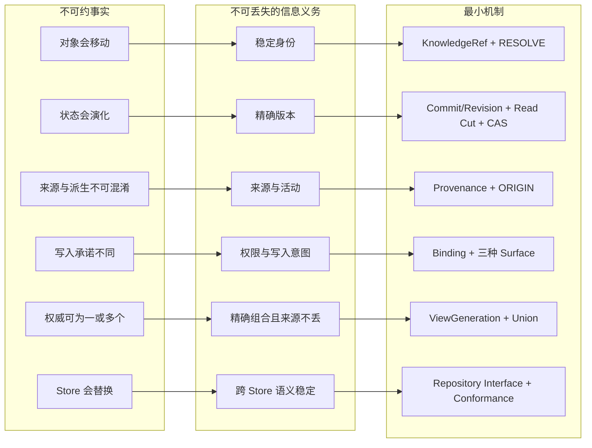

## 1.4 最小性判据

每个候选概念经过三步审查：

1. **信息损失测试**：删除后，上一节的审计问题是否仍能被确定回答？不能则属于协议义务。
2. **Store 映射测试**：底层是否已经提供同等状态语义？若是，由 Adapter 薄映射，不建立第二套内核。
3. **Capability 测试**：能力是否依赖特定索引、模型、顺序或合规设施？若是，冻结输入/输出与降级语义，并显式协商支持状态。

由此得到三层：

| 层 | 内容 | 例子 |
|---|---|---|
| 协议必须定义 | Store 无法可靠恢复的跨实现信息义务 | ObjectIdentity、Provenance、Binding/Surface、View 与结果完整性 |
| Store 原生承载 | Adapter 映射到成熟 Store 的确定状态操作 | Commit/Revision、Branch、CAS、LOG、DIFF、READ |
| 可选 Capability | 语义已冻结，但实现与性能保证可选 | Vector、Graph、Semantic Refine、Monotonic Ordering、Erasure Workflow |

“协议真正新增的三样”特指 Repository 边界缺失的身份、来源和写入治理；Catalog 的 View/Promotion 是系统级组合契约。两者不矛盾，也不能据此把 Catalog 删除或降级成另一套模式。

## 1.5 单一协议与自然退化

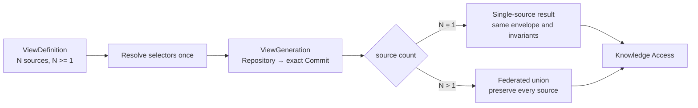

单 source 与多 source 的差异是成员基数，不是身份、版本、错误、授权或维护协议的差异。Store 选择同样不由用户人数决定，而由状态能力、数据规模、查询形态、运维和合规要求决定。

## 1.6 直接设计规则与非目标

1. 身份与位置分离；Canonical 内容携带 object_id，`object_id → path` 只是可重建 Projection。
2. 符号 Ref 只在请求开始解析一次；稳定结果返回 Commit/Generation，不继续跟随 `latest`。
3. View 只读；写命令必须选择唯一 target Repository，禁止跨 Repo 虚假事务。
4. 多来源结果做 union 并保留来源，不按 public/group/personal 静默覆盖。
5. Ingress 只执行显式意图和机械不变量，不做 LLM 抽取、真值判断或自动冲突裁决。
6. 原始 Observation/Evidence 不被摘要替代；Derived 必须记录固定输入和算法活动。
7. Projection 可丢失、可重建，并声明 basis、coverage 与 lag；它不能成为身份或权威来源。
8. 新 Store 只能实现统一接口并通过同一 Conformance，不能把物理限制泄漏成新的协议分支。

MVP 不构建通用本体、大一统 KnowledgeType、通用 PATCH DSL、任意图查询语言、跨 Repo 分布式事务、自动语义冲突裁决、运行时 `latest` 视图、知识 OverlayPatch 或全库 `LLM_QUERY`。


# 2. 总体架构（Architecture）

源：白皮书 §0–§3；推演 §0–§1。

## 系统主张
Knowledge Catalog 不是放大版 Repository，也不是跨 Repo 文件覆盖系统。它是多个独立权威 Knowledge Repository 的注册、发现与版本化联合视图边界。目标是与 Store 无关的逻辑语义：

> 稳定身份 + 精确地址 + 类型化演化语义 + 薄写入协议 + 稳定读取协议。

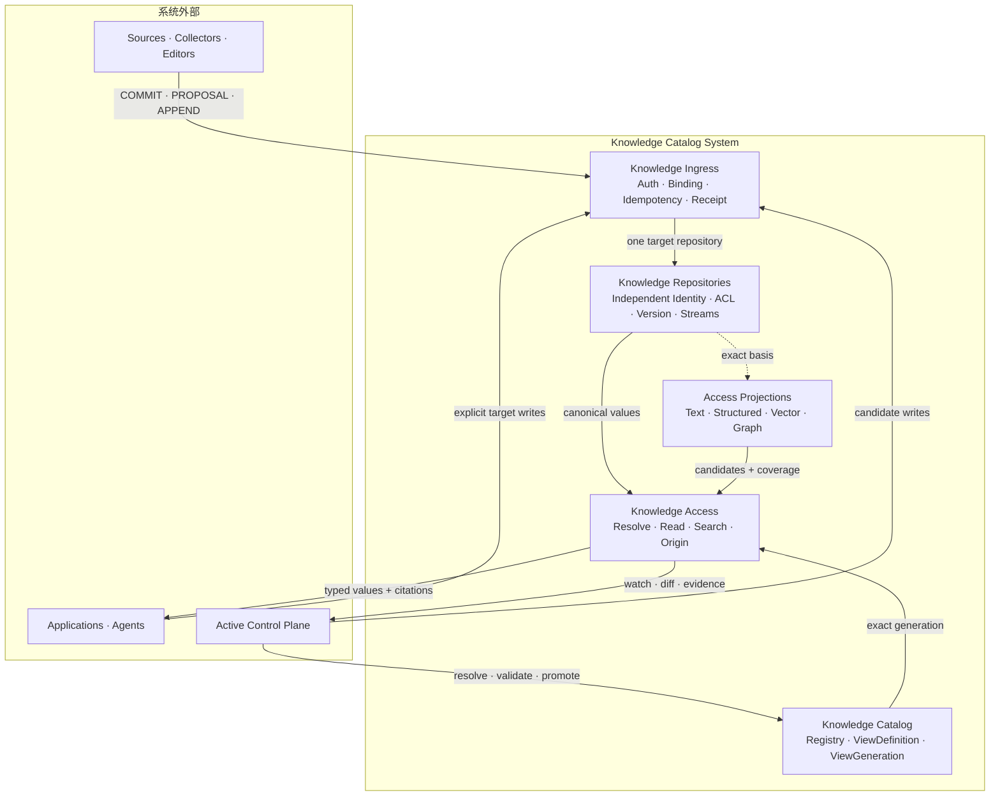

Repository 是唯一知识权威边界；Catalog 只保存成员、组合版本和 Serving 指针；Projection 只保存可重建访问状态。Application 和 Control Plane 可以读写系统，但 Canonical 内容写入必须经过 Ingress，Merge/Promote 必须经过受保护的 Control API，任何调用方都不能直写 Backend/Ref。

## 四个核心领域边界 + 两个上层职责
| 领域 | 承诺 | 明确不做 |
|---|---|---|
| Knowledge Catalog | 登记 Repo、ViewDefinition→ViewGeneration、Promotion | 不拥有成员知识、不写 Repo |
| Knowledge Ingress | 鉴权/Binding/Schema/前置条件/幂等/写路由/Receipt | 不解析内容、不做 LLM 抽取、不判语义冲突 |
| Knowledge Repository | 独立身份/ACL/Snapshot Version/Ref/Release/Stream/保留 | 不判跨 Repo 真值、不做排序 |
| Knowledge Access | 在精确 Version/Generation/ReadVersion 上读取与检索 | 不生成最终回答、不自动派生 |
| Application（上层） | Context Assembly、最终回答 | 不直写 Backend 或 Ref |
| Active Control Plane（上层） | Watch/Diff/评估/提 Proposal/Merge/Promote | 内容写经 Ingress；治理动作经受保护 Control API；不直写 Backend/Ref |

## 四个根本区分（防陷阱）

1. **Ingress Surface ≠ Repository Primitive**：COMMIT/PROPOSAL/APPEND 是协议意图；Snapshot Version/Ref/Append Record 是状态语义，FileGit 再映射为 Git Object/Tree/Commit/Ref。
2. **Catalog ≠ Repository ≠ Projection**：Catalog 组合，Repository 权威，Projection 可丢失可重建（非权威）。
3. **Release ≠ Ref ≠ View Promote**：三个独立、可审计的状态动作；Ref 与 Promote 必须分别 CAS。
4. **Structure ≠ Epistemic Role ≠ Collection**：同一主题可同时以 Append Observation、Derived Assertion、Snapshot Definition 和 Graph Projection 出现。

## MVP 语义压缩

Catalog 4 对象 / Ingress 3 Surface / 不可变 Version+Ref+CAS 内核 / 4 Collection / 4 Pattern / 3 引用 / 2 View 对象 / 12 Access 操作 / 2 语义算子。

## 逻辑 vs 物理

逻辑层只有一套领域对象和协议；Git/Dolt/PostgreSQL/Object Store 是 Repository Adapter，SQLite/OpenSearch/Vector Provider 是 Access Projection Adapter。数据规模与部署可以触发迁移，但不得改变身份、版本和读写语义（K-23）。

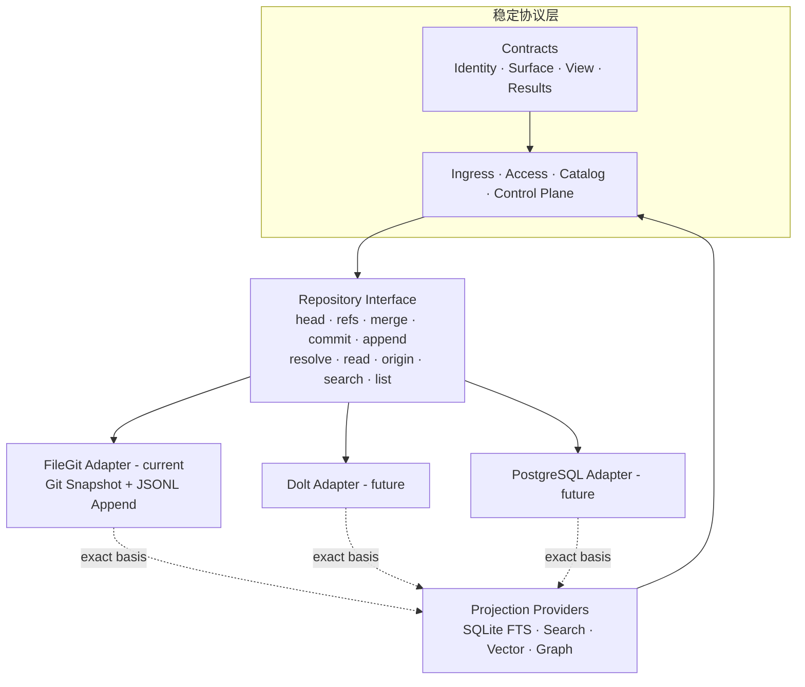

依赖方向必须保持：协议层不 import 具体 Adapter；Repository Kernel 不依赖 Projection；Projection 命中只提供候选，Access 回读 Canonical 值。新 Adapter 必须复用同一 Conformance，不能通过改协议规避不变量。


# 3. 身份、地址与版本（Identity）

源：白皮书 §14、§17A；推演 §0、§2.2。

## 三种跨 Repo 引用
```text
KnowledgeRef       = RepositoryIdentity + ObjectIdentity            # 长期关系，路径无关
PinnedKnowledgeRef = + CommitIdentity                              # 可复现证据/审计/Derived 输入
FileRef            = RepositoryIdentity + Commit + Path + Digest   # 只定位原始文件
```
推论：文件移动不破坏前两者（Path 只是 `path_hint`）；跨 Repo API 不接受裸 StableRef（ADR-008）。

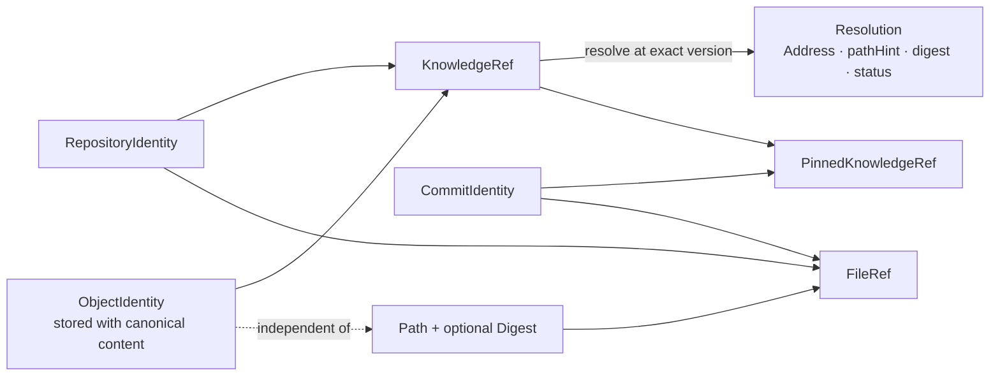

`KnowledgeRef` 表达长期逻辑对象，`PinnedKnowledgeRef` 表达证据使用的精确版本，`FileRef` 只定位原始字节。三者不可互相替代；Adapter 可以改变路径索引方式，不能改变引用含义。

## KnowledgeAddress（Repo 内精确定位）
```text
EntityAddress / AspectAddress / MemberAddress / RelationAddress / RecordAddress
DerivedOutputAddress / ArtifactAddress / FragmentAddress
```
RepositoryIdentity 来自请求上下文或 KnowledgeRef，不能靠 Path 推断。`KnowledgeRef` 定位对象；`KnowledgeAddress` 定位对象内一个维护单元。Access 两者都读：见 `ASPECT_ACCESS.md`。

## Repository 版本对象

CommitIdentity / BranchRef / Tag·Release / AppendCursor / DerivedRevision / ArtifactRevision / ProposalRef。

`CommitIdentity` 是现有协议与代码中的类型名，语义上表示不可变 Snapshot Version Identity；FileGit 使用 Git hash，其他 Adapter 可以使用等价的内容哈希或不可变 Revision ID。Branch 是可移动指针，不能充当可复现证据；Review/Validation/Approval/Release 必须落到精确 CommitIdentity。

## ViewGeneration vs ViewReadVersion

- ViewGeneration = `{RepositoryIdentity → CommitIdentity}` 不可变联合快照，锁定每个 Repository 的精确 Snapshot Version；当前 Git Adapter 用 Git Commit 实现。
- ViewReadVersion = Generation + Append Cuts + Derived Heads Manifests + Projection Generations + AuthorizationDecisionRef。
- 二者不能合并成虚假全局 Commit（ADR-019）；Generation 锁数据，不冻结 ACL（K-20）。

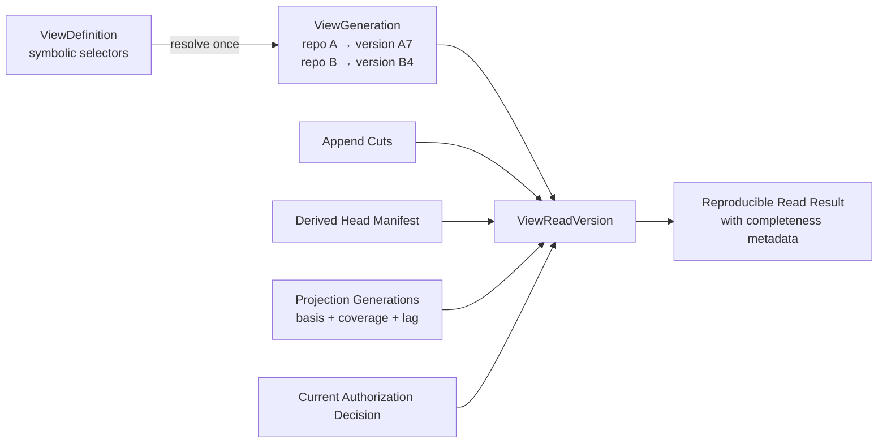

ViewGeneration 只冻结成员 Snapshot；请求还读取 Append、Derived 或异步 Projection 时，必须用 ViewReadVersion 记录完整 Basis。授权每次读取重新计算，结果只记录本次 AuthorizationDecisionRef，不能把旧授权固化为未来访问权。


# 4. 写入边界（Ingress）

源：白皮书 §4–§9；推演 §2、§3、§7。

## 定义
Ingress = 能力协商 + 单 Surface Binding + 类型化写命令 + 契约执行 + 幂等/并发/顺序 + Durable Receipt。语义薄、执行强：不判内容权威，但严格机械执行。

## 三种 Write Surface
| Surface | 语义 | 状态效果 |
|---|---|---|
| COMMIT | 权威当前状态变化 | target Repo Commit + CAS target Ref |
| PROPOSAL | 建议状态变化 | Candidate Branch/Commit + Proposal Metadata |
| APPEND | 记录发生的事件/观察 | 不可变 Entry 追加到 Stream |

Artifact 上传（PutArtifact）不是第四种 Surface，是 Repository 辅助端点；被 COMMIT/PROPOSAL/APPEND 引用后才进入知识语义。

## 变更代数与前置条件
- 变更代数只有 `PUT(address, full_value)` / `REMOVE(address)`；无通用 PATCH（ADR-004）。
- 前置条件：`IF_ABSENT` / `IF_OBJECT_EQUALS` / `IF_DIGEST_EQUALS`。Create=PUT+IF_ABSENT；Update=PUT+IF_*_EQUALS；Upsert=PUT 无目标条件（需 Binding 允许）。

## WriteBinding 不变量
一个 Binding 只对应一个 Surface（最小权限、幂等命名空间稳定、监控/限流/错误分离）。Binding 声明 target_repository、allowed_target_refs、allowed_address_patterns、allowed_schema_refs、allowed_operations、precondition/ordering/idempotency/durability profile、limits。不允许静默降级（`CAPABILITY_UNSATISFIED`）。

## 执行流程与幂等

Transport Decode → Authenticate → Resolve Binding → Verify Surface → Canonicalize+Digest → Idempotency Check → Validate Scope/Schema/Op/Limits → Typed Executor → Atomic Preconditions+Write+Receipt → Return Durable Receipt。

精确重试使用同一 idempotency namespace、command_id 与规范化逻辑 Payload；已成功时返回原 Receipt（REPLAYED），同 ID 异内容返回 IDEMPOTENCY_CONFLICT。

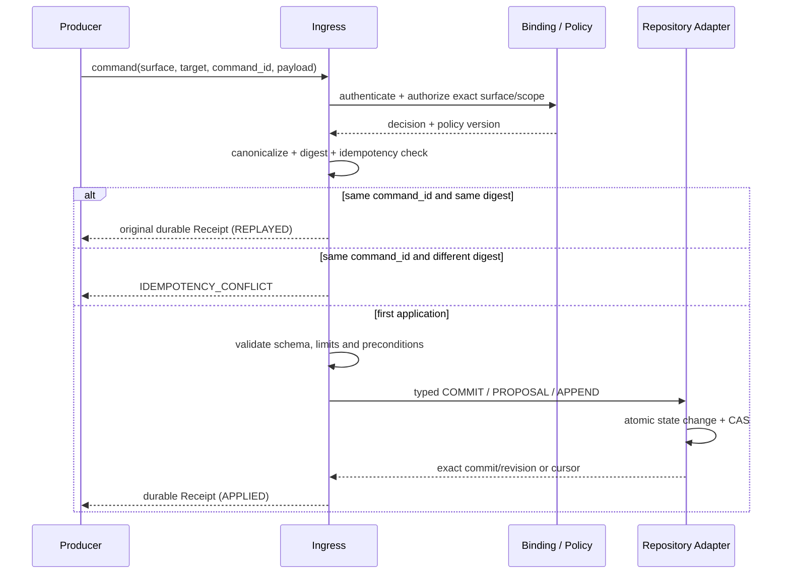

成功 Receipt 表示写入已跨过约定的 Durable Boundary；仅“收到请求”不能作为成功。Ingress 不包含内容分类器、语义路由器或 LLM 冲突判断器。

## 最小错误模型

| 错误 | 含义 | 恢复类别 |
|---|---|---|
| PROTOCOL_UNSUPPORTED | 协议版本不支持 | NON_RETRYABLE |
| BINDING_EXPIRED / BINDING_REVOKED | Binding 不可用 | REFRESH_BINDING |
| SURFACE_MISMATCH / SCOPE_DENIED / TARGET_REPOSITORY_DENIED | Surface、地址或目标超出授权 | NON_RETRYABLE |
| SCHEMA_UNSUPPORTED / SCHEMA_REVISION_UNRESOLVED | Schema 不允许或 pinned revision 不可解析 | FIX_REQUEST |
| WRITE_TARGET_REQUIRED | 未指定唯一 Repository / Ref | FIX_REQUEST |
| PRECONDITION_FAILED / NON_FAST_FORWARD | Object、Digest、Version、Ref 或 Adapter 前置条件失效 | READ_DIFF_REBASE |
| OBJECT_ID_CONFLICT | Repository 内 object_id 不唯一 | FIX_REQUEST |
| POSITION_REGRESSION | Producer Position 回退 | NON_RETRYABLE |
| IDEMPOTENCY_CONFLICT / EVENT_ID_CONFLICT | 相同 ID 被用于不同 Canonical 内容 | NEW_ID_AFTER_FIX |
| CANDIDATE_MOVED / VALIDATION_BASIS_MISMATCH | 候选或完整 Preview Basis 已变化 | REBUILD_AND_REVALIDATE |
| PROMOTION_CAS_FAILED | Serving Channel 已被其他 Generation 前移 | REREAD_AND_DECIDE |
| VIEW_GENERATION_INVALID | Generation 未注册、目标无效或违反解析规则 | FIX_DEFINITION |
| VERSION_UNRESOLVED | 精确 Commit/Revision 不存在或已不可读取 | FIX_REFERENCE_OR_RESTORE |
| KNOWLEDGE_REF_UNRESOLVED | 对象在有效版本中缺失、已移除或不可见 | CONTROLLED_NOT_FOUND |
| CAPABILITY_UNSATISFIED | Adapter 无法满足已协商保证 | CHANGE_CAPABILITY_OR_ADAPTER |
| TEMPORARY_UNAVAILABLE | 临时 Backend 故障 | SAFE_RETRY_SAME_REQUEST |


# 5. 权威状态（Repository）

源：白皮书 §10–§18；推演 §2、§7、§12、§13。

## 核心抽象

RepositoryIdentity/Ownership/ACL + 不可变 Snapshot Version/Ref/CAS/Merge/Release + AddressSpace + 类型化 Collection + 结构契约 + Append/Derived/Artifact 侧集合 + Provenance/Time + CapabilityManifest。FileGit Adapter 把版本内核映射为 Git Object/Tree/Commit/Ref；其他 Adapter 必须提供等价语义，而不要求复制 Git 物理格式。

## 受保护的 Git-like Control API

CREATE_REPOSITORY / CREATE_COMMIT / CREATE_REF / UPDATE_REF(CAS) / MERGE / REBASE_CANDIDATE / PUBLISH_RELEASE / REVERT / ARCHIVE_REPOSITORY。

这些名称描述协议语义。禁止强制覆盖受保护 Ref、删除已发布 Release、跨 Repo 原子 Merge；Adapter 不支持某项可选能力时必须在 Capability 中显式报告。

## 四类 Canonical Collection

| Collection | 适用 | 演化语义 | 是否当前权威 |
|---|---|---|---|
| Snapshot | 定义/政策/流程/断言/关系/Schema | immutable Version + Ref/Release CAS；当前 Adapter 为 Git | 是 |
| Append | 观察/证据/反馈/轨迹 | append-only；修正用 correction/retraction/supersedes | 是真实记录，非当前快照 |
| Derived | 摘要/健康/热度/评估 | 不可变 Revision + Head CAS；invalidate | 仅声明 Derived Head |
| Artifact | PDF/大对象 | 内容 Hash 寻址；Manifest 引用 | 被 Canonical 对象引用后进入语义 |

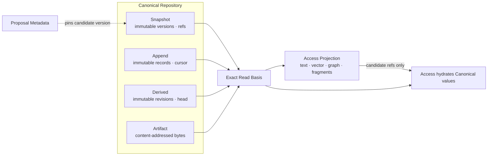

Candidate Version 可以已存在但尚未被 Accepted Ref/Release 指向；Proposal Metadata 只描述治理过程。Projection 从精确 Basis 构建，命中后仍由 Access 回读 Canonical 值，索引内容不能反向写回 Repository。

## 正交知识结构与四个 Structural Pattern

系统不使用一个大 `KnowledgeType` 同时决定结构、存储、权威性和生命周期，而使用正交组合：

```text
Knowledge Unit
  = Epistemic Role      # definition / assertion / observation / evidence / derivation
  × Structural Pattern # 最小独立维护单位
  × Collection Kind    # Snapshot / Append / Derived / Artifact 的演化语义
  × Schema             # 字段与约束
  × Time Semantics     # observed / effective / recorded time
  × Provenance         # source / actor / activity / evidence
```

Entity 是跨版本和物理布局保持稳定身份的 Subject；Aspect 是 Entity 内可独立维护、绑定明确 Pattern 与 Schema 的命名分区。Aspect 的拆分依据是权威来源、变化频率、冲突粒度、Schema、时间/来源义务和访问方式，而不是 UI 分组。

业界对照：DataHub 的原子写是 `(entityUrn, aspectName)`（MCP UPSERT 一个 Aspect，GET Entity 再拼齐）；Unity 用不同 API 改 schema / owner / GRANT；OpenMetadata 靠字段 PATCH。我们不引入通用 PATCH（ADR-004）：`PUT Aspect` 整份替换该分区，等价于 DataHub 写一个 Aspect，不是 JSON Merge Patch。FileGit 一个文件一个维护单元；同一 `object_id` 可以有多份 Aspect/Member 文件。唯一键是 Address，不是裸 `object_id`。`READ(object_id)` 拼出 `{ aspectName: value }`（Member 收成 map）；`readAddress` 只读该单元。Entity blob（无 `aspectName`）保持旧行为，禁止与 Aspect 文件混在同一对象上。Repo 级 `expectedTargetCommit` 仍串行提交；Aspect digest 只防止盖掉该分区。

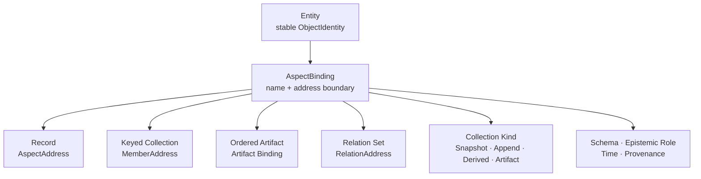

| Pattern | 最小维护/冲突单位 | PUT / REMOVE 语义 | 典型内容 |
|---|---|---|---|
| Record | AspectAddress | 替换或移除完整 Record；按对象/digest 检测冲突 | 定义、配置、单一属性集合 |
| Keyed Collection | MemberAddress(parent, aspect, member_key) | 单 Member upsert/remove；同 key 冲突 | 规则项、字段、术语、公式 |
| Ordered Artifact | Artifact Binding / Revision | 绑定新 ArtifactRef 或退役绑定 | 文档、手册、代码、有序内容 |
| Relation Set | RelationAddress | 单 Relation upsert/remove；qualifier 独立 Diff | 可反向访问、带有效期或来源的连接 |

源文档不应为了检索被强制拆成大量碎片；Fragment 属于 Access Projection。Append-only 是 Collection 演化语义，Derived 是知识地位与版本语义，两者都不是新的 Structural Pattern；Derived Value 仍可使用 Record、Keyed Collection 或 Relation Set。

## 状态转移要点

- COMMIT：验证 Address/Schema/Pattern → 解析 parent + Ref CAS → 创建不可变 Snapshot Version → CAS 移 Ref → Change Event → Receipt；FileGit 将创建步骤映射为 object/tree/commit。
- PROPOSAL：以精确 base version 创建 Candidate Version → CAS 更新 candidate ref → Proposal Metadata 记录；不移动 main/Release。
- APPEND：校验 Stream/Schema/EventID/Cursor → canonical digest 幂等 append → RecordRef/cursor → Receipt。
- Derived：读固定 ViewReadVersion → 外部计算 → 写 DerivedOutputAddress + DerivationEnvelope → 不可变 Revision + Head CAS。

## 冲突语义

同 Repo Ref 前移 → NON_FAST_FORWARD/PRECONDITION_FAILED；同 EventID 异内容 → EVENT_ID_CONFLICT；不同 Repo 断言矛盾 → 并存不覆盖；Fork/Vendor 同步 → Base/Upstream/Local 三方；普通 KnowledgeRef 随上游升级 → 在新 Generation 中重新解析验证，不 merge。

## FileGit Adapter 防护

| 风险 | 防护 |
|---|---|
| Shell 参数注入 | 所有 Git 调用使用 execFile 参数数组，不拼接 Shell 命令 |
| 非 Fast-forward Merge | 先验证 expected target 是 candidate 祖先，再执行 update-ref expected-old CAS |
| 路径逃逸 | pathHint 必须是 Repository Root 内的安全相对路径 |
| 身份歧义 | 扫描时发现重复 Address（object_id + aspect + member）立即返回 OBJECT_ID_CONFLICT；同一 object_id 的不同 Aspect 合法 |
| 用户工作区被覆盖 | 协议 COMMIT 前要求工作树干净；切 Candidate 后恢复原 Ref |
| Stream 名与摘要不稳定 | streamRef 编码为安全文件名；Entry 使用 canonicalDigest |
| 污染用户配置 | Append Side Stream 写入 `.git/info/exclude`，不修改用户 `.gitignore` |


# 6. 版本化联合视图（Catalog）

源：白皮书 §17A；推演 §5、§8–§11。

## public / group / personal
权威、权限、维护边界 → 默认独立 Repo；不是目录层级，没有覆盖优先级。联合结果保留 repository_id/commit_id/object_id/scope/provenance，多来源 Assertion 并存（K-13）。
拆分判断：所有权、ACL、Release 节奏、历史可见性一致时才合并进同一 Repo。

## ViewDefinition → ViewGeneration

- ViewDefinition 含一个或多个可移动选择器（branch/release），表达组合意图；稳定读取先 RESOLVE 成不可变 ViewGeneration。
- ViewGeneration 每 RepoIdentity 只出现一个精确 Version（K-10）；重复出现返回 VIEW_GENERATION_INVALID。
- EffectiveView = union AuthorizedSnapshot(repo_i, version_i, principal)；无覆盖栈（ADR-010）。
- `generation_id = H(definition_revision ‖ sorted(repo_id → version_id))`；相同输入得到相同 ID，并保留 selector、registration 与 resolver version 的解析证据。

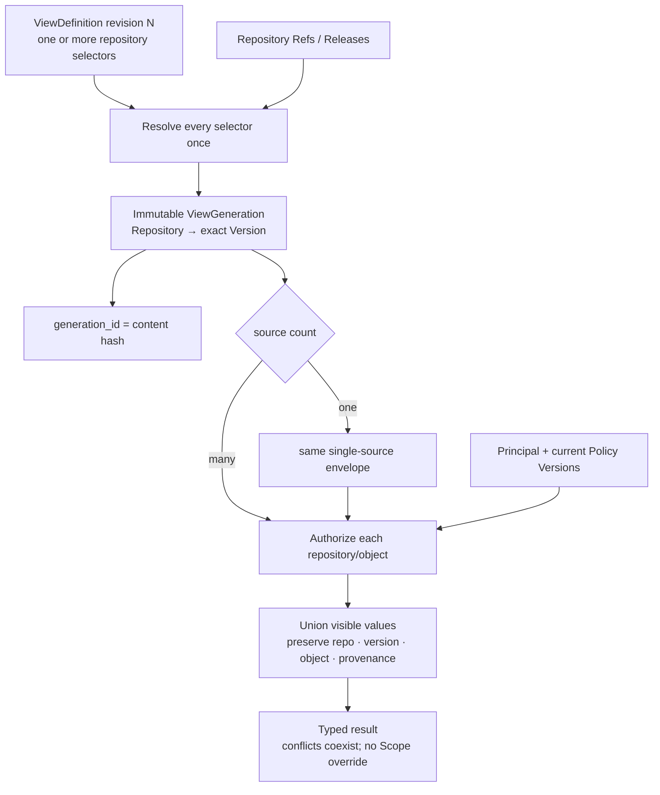

Generation 固定数据坐标，不授予权限，也不把多个 Version 合成虚假全局 Commit。某个来源不可见时，Access 必须防旁路裁剪，不能通过计数、错误差异、片段或关系边泄漏其存在。

## 三种跨 Repo 关系
| 语义 | 本地复制 | 对象身份 | 上游升级 |
|---|---|---|---|
| Reference | 否 | 上游 KnowledgeRef | 新 Generation 重解析验证 |
| Fork | 是 | 新本地身份 + wasDerivedFrom | 显式三方同步，可冲突 |
| Vendor | 是 | 本地只读副本 + 锁 pin | 显式 update，不假装自动跟随 |

普通引用升级无跨 Repo merge（下游 Repo 未被修改）。

## Catalog 动作语义（只改登记/联合视图，不写 Repo）
REGISTER_REPOSITORY / UPDATE_REGISTRATION / DEFINE_VIEW / RESOLVE_VIEW / CREATE_PREVIEW / VALIDATE_GENERATION / PROMOTE_GENERATION / ROLLBACK_PROMOTION / RETIRE_DEFINITION。
PROMOTE 只移 Catalog 指针；失败继续服务旧 Generation。

## 本地分歧表达
group/personal 想补充/限定/反对 public → 写本地 Assertion/Relation（about: kc://public/...）；通用 OverlayPatch 不进 MVP。展示名/排序/高亮等非知识设置可用 Presentation Preference。


# 7. 读取边界（Access）

源：白皮书 §19–§25；推演 §6、§7.2。

## 十二个 Core Operation
```text
CAPABILITIES · DESCRIBE_SCHEMA · DESCRIBE_INDEX
RESOLVE · READ_OBJECT · LIST_TREE
LOG · DIFF · ORIGIN
SEARCH · EXPAND_RELATIONS · WATCH_UPDATES
```
`READ_OBJECT` 的 target = KnowledgeRef（拼装，可选 AspectSelector）或 KnowledgeAddress（单单元）。不新增第 13 个操作。
覆盖：能力发现 / 结构 / 视图组合 / 身份解析 / 精确读 / 浏览 / 历史 / 变化 / 来源 / 检索 / 一跳关系 / 维护通知。

## 结果强制字段
repository/commit/object provenance · view_generation/view_read_version · authorization_decision_ref · complete/partial · coverage/projection_lag · truncated/continuation · missing_capabilities · degradation。

## 零结果语义分层（SEARCH）
EXACT_REF/PATH → 可确定 NOT_FOUND；STRUCTURED/LEXICAL/REGEX → 仅完整且 basis 匹配时可证明；SEMANTIC/HYBRID → 只能说「近似检索未发现」。

## 关键规则
- Branch/Release 符号名只在请求开始解析一次，结果返回 Commit/Generation（可复现）。
- 授权按读取时 Principal + 当前 Policy 重新判断（Generation 锁数据不锁 ACL）。
- 防旁路泄漏：无权 Repo 不得通过计数、错误差异、搜索片段、关系边、Provenance 泄漏。
- EXPAND_RELATIONS 只保证一跳（depth=1）；跨 Repo 边两端独立授权裁剪。
- WATCH_UPDATES 至少一次投递；事件不携带完整 payload，消费者用 DESCRIBE_INDEX/DIFF/READ_OBJECT 取确定状态。

## 结果模型

RefSummary / KnowledgeValue / CandidateSet / GraphSlice / KnowledgeReadResult。所有结果携带精确版本、授权、完整性和降级信息。

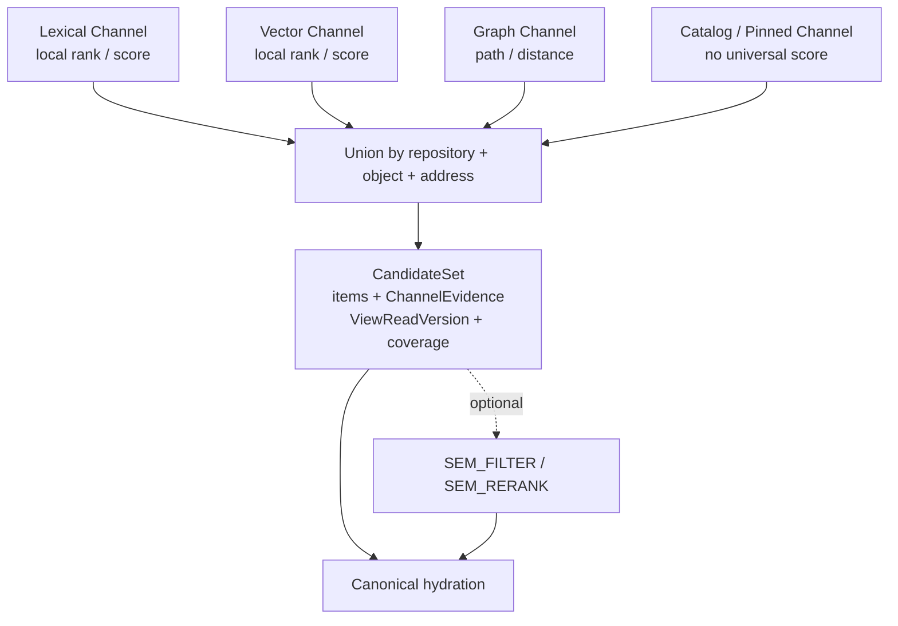

BM25、Cosine、Graph Distance 和人工 Pin 没有天然共同尺度。CandidateSet 保留各通道的 local rank/score、provider 与 matched fields；实现可以排序，但不得伪造统一概率。

## Optional Semantic Refinement（Ref-preserving）

SEMANTIC_FILTER（子集）/ SEMANTIC_RERANK（RankGroup）。Filter 三值：MATCH/NO_MATCH/UNKNOWN，另有 UNJUDGED；输出 Ref 必须是输入 Ref 的子集，不发现新 Ref、不调工具、无副作用。Adapter 不支持时声明 supported:false。

## Projection 归属 Access

Catalog/Text/Vector/Graph/Fragment Projection 均可重建、记录 Source ViewReadVersion、不成为 KnowledgeRef 来源、失败不反写 Repo、切 Generation 显式报告。

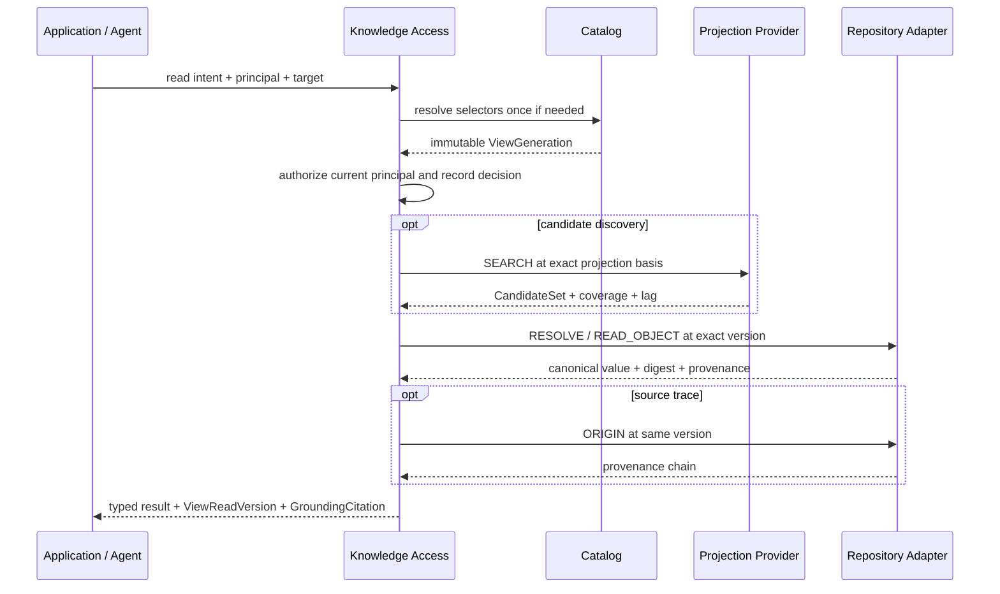

Projection 只负责候选发现；最终上下文由精确 READ_OBJECT hydrate Canonical 值。Application 组装上下文时继续携带 PinnedKnowledgeRef 与来源摘要，不能只保留脱离版本的文本片段。

检索文档的形状不必等于写入单元，也不必等于默认拼装。`AspectSelector`（`include` / `exclude`）同时用于：拼装 READ、Projection 的 `value_text`、hydrate。Entity blob（无 `units`）不受 selector 影响。

ACL / 特权投影（如 `permissions`）按业界惯例 **不进 lexical 索引**：Unity GRANT、Ranger、DataHub Policy 都不是表文档的检索面。写入 Catalog 时它是特权库的 cache（basis + lag），对不上以源库为准。约定：仓储场景 `Projection.build(repo, commit, { exclude: ["permissions"] })`。

`Repository.search` 仍是整包 JSON 包含，不当生产检索。生产走 Projection。Address 级读的契约与决策见 `ASPECT_ACCESS.md`。


# 8. 维护闭环、部署与恢复（Maintenance）

源：白皮书 §26–§31；推演 §7–§15。

## 维护闭环
```text
WATCH_UPDATES → DIFF/READ/SEARCH（发现陈旧/冲突/缺失）
→ PROPOSAL（Candidate Branch/Commit）
→ CREATE_PREVIEW（只替换一个 Repo Commit，其余不变 → 完整 PreviewGeneration）
→ VALIDATE_GENERATION（报告绑定完整 PreviewGeneration，非只绑 Candidate）
→ Review/Approval/MergeGate（绑定精确候选 Commit）
→ Repository MERGE（CAS 移动 main）
→ RESOLVE_VIEW → VALIDATE_GENERATION → PROMOTE_GENERATION（CAS 移动 Catalog 指针）
```
强不变量：测试必须绑完整 PreviewGeneration；Repository Merge 与 Catalog Promote 两步分离；Candidate 前移或任何参与 Repo 变化都使旧 Validation 失效。

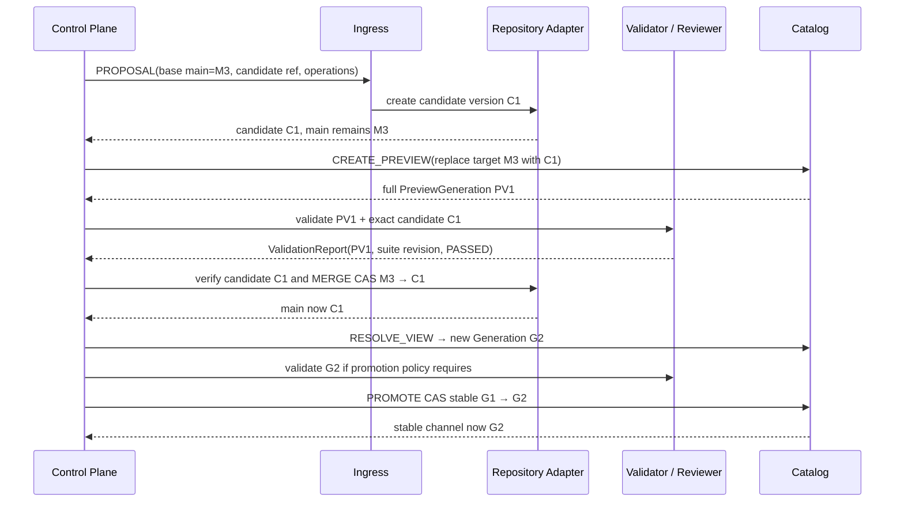

若 Candidate、目标 main、任一 Preview 成员或测试套件版本变化，必须生成新的 Preview/Validation Basis；旧 Approval 只保留审计价值。Repository Merge 成功但 Catalog Promote 失败时，旧 Generation 继续服务，调用方重读 Channel 后再决定是否重验和重试。

## 回滚分层（不可混用）
| 层 | 动作 | 修什么 |
|---|---|---|
| Projection | Rebuild | 索引/访问状态 |
| Catalog | ROLLBACK_PROMOTION | Serving 组合（不动 Repo） |
| Repository | REVERT | 权威内容（保留历史） |

## 三个独立观察点
Repository Commit / Projection Ready / Catalog Promote 是三个独立观察点；CommitReceipt 返回不代表 Search Projection 或稳定 View 已同步。

## 失败恢复（示例）
PRECONDITION_FAILED → READ/DIFF 后重建；NON_FAST_FORWARD → LOG/DIFF + rebase/新 Candidate；CANDIDATE_MOVED → 解析新 Preview 重测；VALIDATION_BASIS_MISMATCH → 对当前完整 PVG 重测；PROMOTION_CAS_FAILED → DESCRIBE_INDEX 后决定保留/重验/再 Promote；任何 Ref CAS 失败不得报告成功。

## 参考实现与生产部署边界

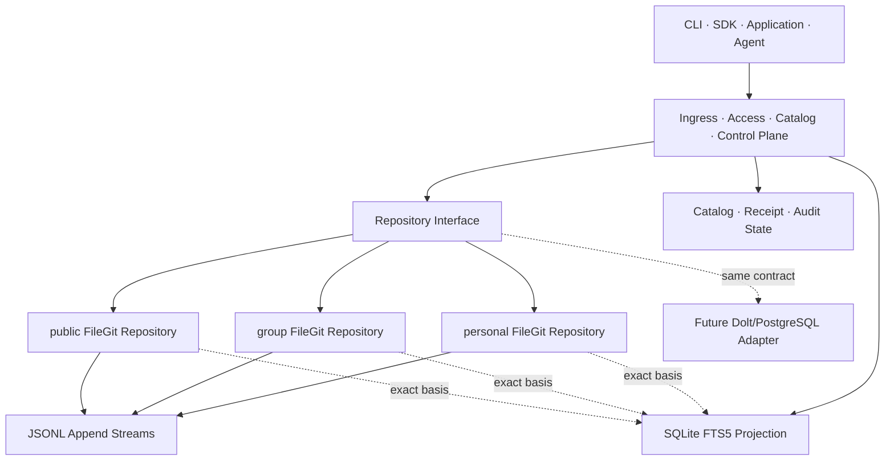

| 状态 | 当前参考实现 | 生产 Adapter 必须保证 |
|---|---|---|
| Snapshot / Ref | 参数化 Git、干净工作树、祖先+CAS、pinned tree read | 进程间并发隔离、原子工作区、fsync/备份与保留策略 |
| Append | JSONL、canonical digest、Event ID、expected cursor | 进程间锁、原子 append、durable cursor、correction/retraction 与恢复 |
| Receipt / Idempotency | 参考实现验证单进程重放语义 | 与写入同一 Durable Boundary，或事务 Outbox；重启后仍可重放 |
| Catalog Generation / Channel | 进程内不可变 Registry、目标有效性与 Channel CAS | durable Generation/Channel Store、审计与恢复 |
| Projection | SQLite FTS5，记录 basis/lag | 可重建、版本切换、coverage、授权裁剪和资源限制 |
| Adapter 迁移 | 统一接口 + T12 共享 Contract Test Kit | Identity/Version 映射、双读校验、切换/回退和跨 Adapter Conformance |

T1–T12 的 40 个用例证明当前实现满足被覆盖的协议不变量，不等价于生产持久性、并发、授权、性能或灾难恢复认证。演进顺序是：语义 Conformance → 单进程参考实现 → 故障注入与并发测试 → Durable Metadata/Append → 授权集成 → 备份恢复演练 → 按负载增加新 Adapter。

## 结束到结束恢复
备份必须同时验证：Repository Object/Commit/Ref + Catalog Definition/Generation/Promotion + Append Cursor + Derived Head + Artifact Digest + Receipt/Audit；仅恢复 Git 目录不能重建完整 ViewReadVersion。


# 9. 架构决策与不变量

源：白皮书 §32（ADR-001..020）、§2.2（K-01..K-23）；本文补充统一 Adapter 决策 ADR-021、FileGit 防护 ADR-022 与 Repository 生命周期 K-24。

## ADR 要点（22 条）

- ADR-001 Catalog/Repository 是两个公开领域边界
- ADR-002 Ingress 使用三 Surface，单 Binding 只对应一个 Surface
- ADR-003 Snapshot 使用不可变 Version/Ref/CAS 语义；FileGit 直接复用 Git
- ADR-004 Snapshot 只 PUT/REMOVE，无通用 PATCH
- ADR-005 保留四类 Canonical Collection
- ADR-006 四 Pattern 只描述结构和最小维护单位
- ADR-007 Entity/Aspect 是维护内核
- ADR-008 KnowledgeRef 不用 Path 作身份
- ADR-009 ViewDefinition 与 ViewGeneration 分离
- ADR-010 联合 View 是来源保留的 Union，不是覆盖栈
- ADR-011 联合 View 不可写
- ADR-012 Proposal = Candidate Version + 非权威 Metadata
- ADR-013 Candidate 测试绑定完整 PreviewGeneration
- ADR-014 Access 使用十二个固定操作
- ADR-015 Projection 归属 Access
- ADR-016 Graph Core 只保证一跳
- ADR-017 Semantic Refinement 可选且 Ref-preserving
- ADR-018 多通道候选保留 ChannelEvidence
- ADR-019 ViewGeneration 与 ViewReadVersion 分离
- ADR-020 MVP 以 FileGit + Embedded Projection 验证完整单/多 source 协议
- ADR-021 协议层只依赖统一 Repository 接口；Store Adapter 可替换且复用同一 Conformance
- ADR-022 FileGit 使用参数化 Git、祖先+CAS 双校验、安全路径、唯一身份、干净工作树与本地 Stream 隔离

## 核心不变量（K-01..K-24）

| # | 不变量 |
|---|---|
| K-01 | 每个 Ingress Command 必须指定唯一 target_repository；View 不可写 |
| K-02 | 每个 Repository 具有独立身份、ACL、Version 图、Ref、Release 和生命周期 |
| K-03 | public/group/personal 是治理 Scope，不是目录优先级 |
| K-04 | KnowledgeRef 不依赖路径；PinnedKnowledgeRef 固定 Version；FileRef 还固定 Path/Digest |
| K-05 | Version 内的 Canonical Object Revision、Snapshot Version、Release 和已接受 Stream Record 不可变；逻辑 Knowledge Object 通过新 Version 演化 |
| K-06 | RefUpdate 必须带 expected-old；Change 必须带 expected Object/Version 前置条件，禁止静默 LWW |
| K-07 | Proposal 指向 Candidate Ref/Version；Proposal Durable 不表示 main 已改变 |
| K-08 | Review、Validation、Approval 与 MergeGate 必须绑定精确 Candidate Version |
| K-09 | ValidationReport 必须绑定完整 PreviewGeneration，而非只绑定 Candidate Version |
| K-10 | ViewGeneration 是 RepositoryIdentity→CommitIdentity 的不可变 Map；同一 Repo 只能出现一次 |
| K-11 | Branch/Release 只可出现在 ViewDefinition 和解析证据中；稳定读取不得运行时跟随 latest |
| K-12 | 联合结果必须保留 source Repository/Version/Object/Scope/Provenance |
| K-13 | 同一主题的多来源 Assertion 并存；不得按 Scope 静默覆盖 |
| K-14 | 普通知识引用升级不修改引用方 Repo，也不产生跨 Repo merge |
| K-15 | Fork 创建新 KnowledgeRef；只有 Fork sync 使用 Base/Upstream/Local 三方比较 |
| K-16 | Vendor 保留来源精确 pin 与只读副本；本地编辑必须转为 Fork |
| K-17 | APPEND Entry 不原地修订；Correction/Retraction 通过新 Entry 表达 |
| K-18 | 相同幂等键与相同 Command Digest 返回原 Receipt；不同 Digest 冲突 |
| K-19 | Projection 不属于 Canonical Repository，必须声明 basis、coverage 和 lag |
| K-20 | ViewGeneration 锁数据不锁权限；授权审计另存 AuthorizationDecisionRef |
| K-21 | 内容写入必须经 Ingress；Merge/Promote 等治理动作必须经受保护的 Repository/Catalog Control API；任何调用方不得直写 Backend/Ref |
| K-22 | 不构造跨 Repository 的虚假单一事务 |
| K-23 | Adapter 迁移不得改变 RepositoryIdentity、KnowledgeRef、版本和读写协议语义 |
| K-24 | 不存在 DELETE_REPOSITORY；领域生命周期终点是 ARCHIVE，物理删除由保留/合规流程处理 |

## 被明确拒绝的设计
Ingress=ETL+LLM；Catalog=Git Repo/PostgreSQL；write(payload) 无 Surface；全 JSON；统一复杂 status；Projection 作权威；通用 PATCH DSL；完整图查询语言；LLM_QUERY(whole_repo)；审批只绑 Branch 名；Knowledge OverlayPatch；View 跟随 latest。


# 10. 单一协议与 Store 映射明细

目标：确认 Catalog 语义只有一套，并识别哪些语义必须由协议新增定义、哪些可以映射到成熟 store。store 的选择由数据规模、查询形态和部署约束决定，不由“单人/多人”决定。

## 10.1 审查原则

1. **可信强制**：AI 只能引用「身份稳定、版本已知、来源保留、写者明确」的知识。
2. **Store 独立**：协议层只依赖统一 `Repository` 接口；Git/Dolt/PostgreSQL 是可替换实现，迁移不得改变身份、版本和读写语义（K-23）。

## 10.2 Catalog 语义唯一

Identity、Write Surface、Repository、Access、ViewDefinition→ViewGeneration、维护闭环、联邦读取均属于同一协议。单 source ViewGeneration 只是 `repo→commit` Map 只有一个成员的自然退化；source 增加时，同一语义完整展开，不切换另一套模式。

## 10.3 Repository 边界的三类新增义务

1. **身份寻址**：ObjectIdentity 与路径解耦，KnowledgeRef 稳定。
2. **来源链**：Provenance/ORIGIN，超出 commit author/message。
3. **写边界**：COMMIT/PROPOSAL/APPEND + Binding，明确谁以什么语义写。

## 10.4 Store 原生映射

| 协议语义 | Git adapter | 其他 adapter 示例 |
|---|---|---|
| Snapshot COMMIT | git commit + update-ref CAS | Dolt commit / DB revision |
| PROPOSAL | candidate branch + commit | Dolt branch / candidate revision |
| LOG/DIFF/READ | git log/diff/show | 版本查询 |
| RESOLVE | frontmatter scan / object index | 主键或索引查询 |
| APPEND | gitignored JSONL side stream | SQLite WAL / event table |
| SEARCH | grep / SQLite FTS5 Projection | SQL/FTS/搜索服务 |

## 10.5 Catalog 操作是协议本体

REGISTER / DEFINE_VIEW / RESOLVE_VIEW / CREATE_PREVIEW / VALIDATE_GENERATION / PROMOTE / ROLLBACK 等操作始终属于 Catalog 协议。它们不是“多人模式”才出现的另一层；当 source 数量为一时，结果自然简化，但语义不变。

## 10.6 统一 Repository 接口

```text
head / getRef / hasCommit / createRef / merge / applyCommit /
append(expectedCursor) / resolve / read / origin / search / list
```

Ingress、Access、ControlPlane、Catalog 只依赖该接口。当前实现为 FileGit；未来新增 Dolt/PostgreSQL adapter 时，协议层一行不动，并复用同一套 conformance。

## 10.7 当前 Git Store

```text
Snapshot   真实文件 + git object/tree/commit/ref/update-ref CAS
Append     streams/<ref>.jsonl（gitignored，非 Git 演化语义）
Projection SQLite FTS5（可重建、非权威、basis/lag）
```

Memory 模拟已删除：git 是版本内核本身，不再维护一套重复的“内存 Git 语义”。

## 10.8 验收标准

- 所有协议层代码不 import 具体 store。
- T1–T12 共 40 个测试通过；Repository 相关用例运行在真实 FileGit 上。
- 新 Store 实现 `Repository` 接口并复用 T12 Contract Test Kit，不修改 Catalog 协议对象与不变量。


# 11. 最小核心契约（RESOLVE 与 ORIGIN）

本章冻结读侧两个不能由 Store 提交元数据替代的核心契约：RESOLVE 负责稳定身份寻址，ORIGIN 负责显式来源回链。写侧第三类新增义务由 Binding、Ingress Surface、Receipt 与 APPEND 契约保证。

## A. RESOLVE（身份寻址）最小契约

### A.1 契约签名
```text
RESOLVE(refs[1..N], commit_id) → ResolutionSet

KnowledgeRef       = (repository_id, object_id)
PinnedKnowledgeRef = (repository_id, commit_id, object_id)
FileRef            = (repository_id, commit_id, path, digest?)

Resolution:
  repository_id, commit_id, object_id
  address: {kind: Entity|Aspect|Member|Relation|Record, object_id, aspect_name?, member_key?}
  path_hint
  digest
  schema_ref
  status: RESOLVED | REMOVED | UNRESOLVED | FORBIDDEN
```
- 普通 KnowledgeRef 在给定 commit 解析；Pinned 只验证目标仍可访问，不重新跟随上游。
- 对象在 commit 中不存在/已删除 → status=REMOVED；引用歧义 → UNRESOLVED；无权 → FORBIDDEN（外部呈现防旁路泄漏）。

### A.2 身份载体决策（化解「硬骨头 1」）
- **ObjectIdentity 的权威载体 = 文件内容里的稳定字段**（frontmatter `object_id` / `ref`），不是路径，也不是独立映射文件。
- `path_hint` 只是展示/便利位置，可移动。
- **address-map（object_id → path）是「可重建 Projection」**，非 Canonical，不进入 git 树，无需独立 CAS；由「扫描每个文件的 object_id 字段」生成，可丢弃重建。

这一决策直接化解第一性原理审查里的「硬骨头 1」（身份 vs 路径一致性）：
> 不存在需要额外一致性契约的「第四类状态」。身份内嵌于 git 树，随同一次 commit 与内容**原子演化**；address-map 降级为可重建 projection，权威永远在 git 树。

相比白皮书 §15.1 的 `.krepo/address-map.json`（独立映射、一致性契约未定义），本决策是对其的最小化修正。

### A.3 唯一性与移动
- repo 内 **Address** 唯一：`(object_id, aspect_name?, member_key?)`。重复 Address → `OBJECT_ID_CONFLICT`。
- 同一 `object_id` 可以对应多个文件（多个 Aspect / Member）。这是 DataHub「一 URN 多 Aspect」在 FileGit 上的落点；旧规则「`object_id` 全局唯一」会与「一个文件一个维护单元」矛盾。
- 移动文件 = 改 path_hint，Address 不变；KnowledgeRef（仍按 object_id）不失效（K-04）。
- 约束：一个文件承载一个维护单元。frontmatter 带 `object_id`，Aspect/Member 另带 `aspect_name` / `member_key`。
- 同一 `object_id` 上禁止混用「无 aspect 的 Entity blob」和 Aspect 文件。

### A.4 Git adapter 落地
```text
index = scan(git tree, extract Address from frontmatter) → {address → path}   # 可重建
RESOLVE(object_id) = 收集该 id 的全部单元 → 拼值 → digest(拼值)
RESOLVE(address)  = 查单单元 → 该单元 digest
PUT Aspect        = 只写/替换该文件；其它 Aspect 不动
```
Git adapter 无需独立 address-map；扫描 frontmatter 即可重建。其他 store 可物化同一 Projection，但 Projection 始终非权威。

## B. ORIGIN（来源链）最小契约

### B.1 契约签名
```text
ORIGIN(target_address, commit_id) → ProvenanceTrace

链（自近及远）:
  Current Value
  ← Repository / Commit / Object
  ← Commit / Append / Derivation Activity
  ← Source Record / Evidence / Artifact / Pinned Input
  ← Principal / System / Algorithm
```
跨 Repo 关系保留双方 KnowledgeRef；MVP 只返回可审计回链，不做完整 PROV 推理。

### B.2 最小 Provenance Envelope（字段冻结）
```yaml
provenance:
  origin_kind: SOURCE | OBSERVATION | EVIDENCE | ASSERTION | DEFINITION | DERIVATION | ...
  actor_ref:             # 谁
  activity_ref:          # 什么活动
  source_refs: []        # 来源
  evidence_refs: []      # 支撑证据
  input_view_read_version_ref:  # 仅 DERIVATION
  algorithm:             # 仅 DERIVATION
    derivation_spec_ref
    model_ref
    code_hash
  produced_at
```

### B.3 Git adapter 落地
- **身份/版本**：git commit 的 author/message/hash —— git 原生，无需新造。
- **显式来源**：文件 frontmatter 的 `provenance` 块记录 source_refs/evidence_refs。
- **DERIVATION 强制**：必须显式 `input_view_read_version_ref` + `algorithm`；缺失时来源链不可复现，Repository 必须拒绝写入。
- ORIGIN = 读 frontmatter provenance + git log + 沿 evidence_refs 回链。

### B.4 按知识族的最小义务
| 知识族 | 最小义务 |
|---|---|
| 定义/断言 | actor + repository + commit + evidence or rationale |
| 观察 | source + observed_at + record identity |
| 派生 | input version + derivation spec + activity |
| Artifact | content hash + media type + capture source |
| 关系 | source or derivation basis（若非纯结构引用） |

## C. 与既有决策的关系

- RESOLVE/ORIGIN 是 Access 基线中需要协议显式定义的两个操作；整个系统还必须显式定义写入治理与 View 组合语义。
- RESOLVE 的身份载体决策补全 ADR-008：不仅统一引用语法，也统一 Git Adapter 中身份的 Canonical 载体。
- ORIGIN 与授权决策都使用 actor/activity/evidence 形态，但 Provenance 不能被 AuthorizationDecision 替代。
- 其他 Adapter 可以改变索引与物理载体，不能改变状态、唯一性和回链结果。

## D. 契约 Conformance

1. Git Adapter 下，只熟悉 Git、文件与文本检索的 Agent 能完成：`RESOLVE → READ → ORIGIN → edit → COMMIT`。
2. 移动文件后 RESOLVE 仍命中同一 object_id；重复 Address 被拒绝；同一 object_id 的不同 Aspect 合法。
3. 从未存在返回 UNRESOLVED；历史存在但目标版本已删除返回 REMOVED；无权访问按防旁路策略返回 FORBIDDEN 或等价外部错误。
4. DERIVATION 缺少固定输入或算法活动时写入被拒绝；ORIGIN 不伪造缺失链路。
5. 新 Adapter 对相同 Canonical Fixture 返回等价的 Resolution/ProvenanceTrace。


# 12. 低摩擦采集与 Grounding

可信语义只有进入端到端路径才有价值：采集必须足够低摩擦，读取结果中的版本与来源也必须完整传到最终界面。本章用 Ingress 之上的薄编排和 Access 结果投影补齐两端，不增加新的 Write Surface。

## A. 低摩擦采集（Ingestion）

Git Adapter 下最自然的摄入单位是文件/目录；数据库或远端来源可以使用 Connector，但输出仍是同一种带身份、digest、provenance 与前置条件的 ChangeSet Preview。采集方式可以变化，Ingress 契约不变。

### A.1 两个薄工具（都在 COMMIT 之上，不是新 Surface）

```text
INGEST(dir, scope, schema_map) → 预览 + ChangeSet（确认后 COMMIT）
  扫描目录 → 识别维护单元（一个文件 = 一个 Address；无 aspect 时即 Entity blob）
  → 生成 object_id（稳定）、path_hint、schema_ref
  → provenance: {origin_kind: SOURCE, source_refs: [...], produced_at}
  → 产出 ChangeSet，预览后由调用方 COMMIT

RECONCILE(external_snapshot, scope, base_commit) → ChangeSet 预览
  外部快照 = 权威当前状态（结构化，如数据库全部表）
  → set-diff（新增→PUT+IF_ABSENT；更新→PUT+IF_OBJECT_EQUALS；删除→REMOVE）
  → 只产出 ChangeSet，不自动提交（确认后 COMMIT）
```

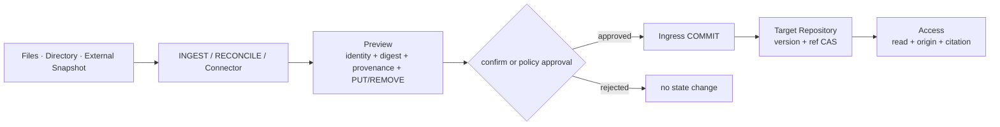

### A.2 关键约束
- INGEST / RECONCILE **都产出 COMMIT ChangeSet，不绕过 Ingress**（K-21）；它们属于 Application/Control Plane 在 Ingress 之上的编排，不是第四种 Surface。
- 二者**不判断内容正确性**（Ingress 语义薄）；只做「外部状态 → 目标地址 → PUT/REMOVE」的机械翻译。
- provenance 必须标注 source_refs（来源），否则 ORIGIN 链断。
- RECONCILE 的 diff 判定按「身份 + digest」：同 object_id 不同 digest = 更新；外部缺失且 repo 存在 = 删除（REMOVE，保留 Git 历史）。

### A.3 解决的问题
- 来源 Connector 与 Scope Snapshot Reconciliation 复用同一协议：本地目录用 INGEST/RECONCILE，远端或大规模来源由 adapter/connector 提供同样的 ChangeSet。
- 之前观察到的「缺少批量对账面」→ 用 RECONCILE 解决，但**不新增 Surface**，只是规范化「采集器如何构造 COMMIT」。

## B. Grounding 消费路径

消费端必须继续回答“用了哪个对象、哪个版本、哪个片段、来自哪里”。如果 Application 只把脱离版本的文本交给模型，Access 已保留的可信信息会在最后一跳丢失。

### B.1 GroundingCitation（最小字段冻结）

```yaml
GroundingCitation:
  knowledge_ref        # 稳定身份
  pinned_ref           # 版本 + 对象（PinnedKnowledgeRef）
  digest
  fragment             # 可选；段落、代码行或其他稳定片段定位
  provenance_summary:
    actor_ref
    source_refs
    origin_kind
```

### B.2 消费端不变量

> AI 的每个事实性断言，要么携带基于同一 ReadVersion 的 PinnedKnowledgeRef、片段与来源，要么被显式标记为未引用的模型推断；两者不能混淆。

- 模型推断不是协议错误，但 UI 必须让它与有依据的陈述明确可区分。
- `fragment` 必须由 Pinned 对象和 digest 约束，不能只保存会随内容漂移的行号。
- Citation 展示仍受当前读取权限约束；不得借 provenance 摘要泄漏已撤销权限的来源。
- 模型不能把推断伪装成 Repository 已接受知识；推断进入 Canonical State 必须另走 COMMIT 或 PROPOSAL。

### B.3 三层消费路径

| 层 | 职责 | 必须保留 |
|---|---|---|
| Access | 返回精确值、版本、完整性与来源 | repository / version / object / provenance / authorization decision |
| Application | 组装上下文并维护“片段 → Citation”映射 | pinned_ref / digest / fragment / provenance summary |
| UI / API Consumer | 展示依据、版本和来源，区分引用与推断 | 可复核 Citation 或显式 inference marker |

### B.4 与核心契约的关系

- GroundingCitation 复用 ORIGIN 的 Provenance Envelope，是面向消费端的受控摘要。
- PinnedKnowledgeRef 是 Citation 的版本锚；普通 KnowledgeRef 只用于在新 ReadVersion 下解析当前对象。
- 不新增 Access 操作；它是 READ_OBJECT / SEARCH / ORIGIN 结果的约定投影。

## C. 最小闭环验收（采集 → 消费）
1. 用户把目录/文件 INGEST 进来（标注 source_refs）→ 生成 Commit。
2. AI SEARCH/READ 命中 → 返回 PinnedKnowledgeRef + fragment + provenance。
3. UI 显示「该结论依据 X（版本 Y，来源 Z）」，点击可复核原文。
4. 模型没有依据的推断，被显式标为「推断」，不与引用混淆。

这条闭环是「真实用户可用」的一序命脉：它决定**底座是否被填满**（A）与**可信是否传到眼前**（B）。


# 附录 A. 历史缺口关闭台账

本附录只记录两份历史输入与当前 Baseline 之间的决策轨迹。正文与 K/ADR 是规范来源；旧文档中的冲突表述不再构成并行契约。

## A.1 已关闭的跨文档差异

| ID | 历史差异 | 当前决议 | 规范落位 |
|---|---|---|---|
| C1 | 推演 v4.0 与白皮书 v5.0 容易被理解成同一版本线 | 两份文档独立版本；明确“推演 v4.0 对应白皮书 v5.0” | 文档首页与附录 B |
| C2 | 白皮书 K-01..K-23 与推演 12 条不变量没有映射 | K 编号是唯一规范编号；推演条目只作场景映射；新增 K-24 | 第 9 章与附录 B |
| C3 | `urn:knowledge:` 与 `kc://` 混用 | 跨 Repo 统一 `kr://` / `kc://` / `file://`；裸 URN 只在 Repo 上下文内作别名 | 第 3、11 章与附录 B |
| C4 | Projection 同时指字段裁剪和可重建索引 | Projection 专指带 basis/coverage 的可重建访问状态；字段裁剪写作 Evaluation Projection | 第 2、5、7 章 |

## A.2 设计缺口关闭索引

| ID | 最终决议 | 状态 | 规范落位 |
|---|---|---|---|
| G1 授权 | 冻结统一 AuthorizationDecision；WriteBinding 是同一策略的写侧投影 | 契约已定，策略引擎由部署实现 | 附录 D |
| G2 Generation 幂等 | `generation_id = H(definition_revision ‖ sorted(repo→version))`，保留解析证据 | 已并入 Baseline | 第 6 章、附录 C |
| G3 保留与 GC | Release/Generation 默认保留；Artifact 7d grace；Candidate 30d 可归档；Stream 按 Policy | 默认值已定，可覆盖 | 附录 C |
| G4 Erasure | 不把合规擦除伪装成 Snapshot REMOVE；使用独立 ErasureRequest | 仅契约骨架，实现前需独立 ADR | 附录 D |
| G5 Derived invalidate | Head CAS 与 Revision invalidation 分离；历史 Revision 仍可审计 | 契约已定，可选 Capability | 附录 D |
| G6 Repository 删除 | 无 DELETE_REPOSITORY；领域生命周期终点是 ARCHIVE | 已加入 K-24 | 第 9 章、附录 C |
| G7 Schema 自举 | schema_ref 必须 pin 到已提交 Revision，并由 Binding 白名单冻结 | 已并入 Baseline | 附录 C |
| G8 悬挂引用 | Repository 报告受控 unresolved；检测与修复 Proposal 属于 Control Plane | 责任边界已定 | 附录 D |
| G9 Producer Ordering | `(partition, position)` 单调；回退报 POSITION_REGRESSION；NONE 显式无保证 | 契约已定，可协商 | 附录 C |

## A.3 实现闭环台账

| ID | 推演或测试暴露的裂缝 | 关闭方式 | 证据 |
|---|---|---|---|
| I1 | 协议层曾耦合 Memory Store | 统一 Repository 接口，删除 Memory 模拟，增加共享 Adapter Contract Kit | ADR-021、T12 |
| I2 | FileGit 曾缺 Candidate Ref 与 Merge | 实现真实 Git Branch、祖先检查与 update-ref CAS | T9、D23 |
| I3 | FileGit 曾缺 Append 顺序约束 | 隔离 JSONL、canonical digest、Event ID 幂等与 expected cursor | T5、D23 |
| I4 | Git 命令、路径、身份和版本读取边界不够硬 | 参数化调用、安全路径、重复 ID 拒绝、干净工作树、pinned tree read | T6、ADR-022 |
| I5 | Preview 只含 Candidate Repo | 从已注册 Base Generation 替换成员并保留其余成员 | T9、D24 |
| I6 | Channel 可指向未知 Generation | 不可变 Registry + Promote/Rollback 目标有效性校验 | T11、D24 |
| I7 | 联邦读吞掉完整性与 Backend 故障 | 只忽略对象缺失，其他错误传播 | T11、D24 |

“契约骨架”表示责任和字段已经冻结，但当前参考实现不声称具备完整策略、合规或生产持久性。能力必须显式声明，不能静默降级；生产化剩余保证见第 8 章部署边界表。


# 附录 B. 跨文档规范化决策（原 P0）

本附录保留历史输入的规范化记录，便于解释旧示例；当前规则已并入正文，旧文档不再回写。

## P0-1（C1）版本标签对齐
- 决议：推演版号与白皮书版号相互独立，二者不联动。
- 推演前言改为：
  > **推演 v4.0 · 对应白皮书 v5.0（两条独立版本线）**
- 规则：白皮书 x.y 每次语义修订 +0.1；推演仅在案例/表述变化时 +0.1。读者不应把「推演 v4.0」读成「比白皮书 v5.0 旧」。

## P0-2（C2）不变量映射表
把推演 §0 的 12 条不变量映射到白皮书 K 编号，并列出推演未覆盖的 K。

| 推演 # | 措辞 | 映射 K | 备注 |
|---|---|---|---|
| 1 | 三 Repo 独立 ACL/Commit 图/Branch/Release/生命周期 | K-02 | K-01 的 target 约束见 #6 |
| 2 | KnowledgeRef 不含 Path | K-04 | — |
| 3 | Pinned +Commit；FileRef +Path/digest | K-04 | — |
| 4 | ViewDefinition 可写 Branch/Release；读前解析 VG | K-10, K-11 | K-09 见 #8 |
| 5 | 联合保留来源，不按 Scope 覆盖 | K-12, K-13 | — |
| 6 | View 不可写；一次 ChangeSet 一个 target Repo | K-01, K-22 | — |
| 7 | 本地分歧是 Assertion 非 Overlay | K-13 | — |
| 8 | ValidationReport 绑完整 PreviewGeneration | K-09 | — |
| 9 | 普通升级只新 Generation；Fork/Vendor 才有上游更新 | K-14, K-15, K-16 | — |
| 10 | VG 锁数据不冻结 ACL | K-20 | — |
| 11 | Snapshot 复用 Git；Append/Derived/Artifact 非 Git | K-05, K-17 | — |
| 12 | Commit / Projection Ready / Promote 三观察点 | K-19 | 呼应白皮书 §26.7 |

历史推演未显式覆盖以下 K；当前设计直接以第 9 章 K 编号为准：
K-03（scope 非目录优先级）、K-06（expected-old/expected 前置条件）、K-07（Proposal 不改 main）、K-08（审批绑精确 Commit）、K-18（幂等键冲突）、K-21（不绕 Ingress）、K-23（Profile 迁移不变）。

决议：本 Baseline 只维护一套 K 编号；历史推演条目通过上表映射，不形成第二套规范。

## P0-3（C3）身份语法统一
规范语法：
```text
RepositoryIdentity  kr://<org>/<scope>/<name>
KnowledgeRef        kc://<repo-short>/<object-id>
PinnedKnowledgeRef  kc://<repo-short>@<commit>/<object-id>
FileRef             file://<repo-short>@<commit>/<path>#<digest>
```
urn 映射规则：
- `urn:knowledge:<object-id>` 等价于 `kc://<repo>/<object-id>`，仅在 RepositoryIdentity 由上下文确定时允许。
- 跨 Repo API 禁止裸 `urn:`（必须补齐 RepositoryIdentity，ADR-008）。
- 全库示例统一为 `kc://` 形式；`urn:` 只作「Repo 内紧凑 ObjectIdentity」别名。


# 附录 C. MVP 契约冻结决策（原 P1）

以下决议已进入 MVP 契约；部署可以覆盖明确标注的默认值，但不能改变其语义。

## P1-1（G2）ViewGeneration 确定性与幂等
冻结公式：
```text
generation_id = H( definition_revision ‖ sorted({ repo_id → commit_id }) )
```
- H 为内容寻址哈希（sha256）；sorted 使 Repo 顺序无关。
- 同 (definition_revision, map) → 同 generation_id（幂等、可重放、可缓存、可审计）。
- resolution_evidence 必须记录 {resolver_version, selectors, registration_basis}。
- 例外：Definition 含 Optional Source Policy 产生 Degradation 时，Generation 必须显式带 degradation 标记，不得静默。

## P1-2（G3）保留与 GC 默认值（可被 Profile/Policy 覆盖）
| 对象 | 默认 | 覆盖点 |
|---|---|---|
| 孤儿 Artifact | 7d 未引用回收 | RepositoryProfile |
| 已发布 Release / Generation | 永久，直至显式归档/退役 | Catalog Policy |
| Candidate Ref | 30d 未活动可归档（Commit 保留在 Git） | RepositoryProfile |
| Append Stream | 按 StreamPolicy（默认永久） | StreamPolicy |
| Receipt / Audit | 与幂等保留期一致（默认 P30D） | Binding.idempotency_retention |

## P1-3（G6）无 DELETE_REPOSITORY
新不变量（追加 K-24）：
> 不存在 DELETE_REPOSITORY 领域操作；Repository 生命周期终点是 ARCHIVE_REPOSITORY（禁写、保留可审计历史、Catalog 新 Resolve 默认不选入）。物理删除是保留策略/合规的下游动作，不暴露为领域 API。

## P1-4（G7）Schema 自举
- schema_ref 必须 pin 到已提交 Schema Revision（`urn:schema:...:vN` 或 `kc://<repo>/schema/...@<commit>`）。
- Ingress 校验用 WriteBinding.allowed_schema_refs 白名单（Binding 协商时预解析并冻结）。
- Schema 变更走普通 COMMIT/PROPOSAL，与依赖它的写入共用 Ref CAS / 前置条件；不支持运行时解析未 pin 的 Schema。
- 新增错误码：`SCHEMA_REVISION_UNRESOLVED`（白名单内但版本缺失）。

## P1-5（G9）Producer Ordering
- partition key = Binding 声明或命令字段（默认 source_ref）；单调性按 (partition, position) 判定。
- 乱序/回退 → POSITION_REGRESSION（NON_RETRYABLE）。
- ordering_profile=NONE 时不保证顺序、不做回归检查。
- Base Capability 可以仅声明 `NONE`；支持 `MONOTONIC_PER_PARTITION` 时必须实现上述拒绝语义并显式协商。


# 附录 D. 治理与合规契约骨架（原 P2）

以下项目已冻结责任边界和最小字段，但不属于参考实现的完整能力承诺；启用前必须声明 Capability，并在要求处补充独立 ADR。

## P2-1（G1）授权决策契约
```yaml
AuthorizationDecision:
  principal_ref: ...
  policy_versions: {repo_id: version}
  resource: KnowledgeRef | Address
  action: READ | WRITE | RESOLVE
  decision: ALLOW | DENY
  authorization_decision_ref: AR-xxx
  evidence: {...}   # 命中策略/规则引用
```
- WriteBinding = Repo ACL 在 Ingress 的投影（同一策略引擎，非第二套权限）。
- Access 的 AR = 读取决策快照（可审计，K-20）。
- Baseline 冻结字段契约；策略求值器与策略语言由部署实现。

## P2-2（G4）隐私 Erasure 契约占位
```yaml
ErasureRequest:
  target_ref        # Append Record / Artifact / Projection 副本
  scope
  reason
  policy_ref
```
- Snapshot 不做无痕删除（Git 不可变，K-05）。
- Erasure 作用于 Append 记录 / Artifact / Projection 副本；保留逻辑审计语义。
- Baseline 只保留契约骨架；实现前必须补充覆盖备份、副本、密钥与审计要求的独立 ADR。

## P2-3（G5）Derived invalidation 语义
- Head CAS 前移：新 Revision 成为 Head，旧 Revision 保留可审计。
- Invalidation：显式标记某 Revision `status=invalid` + reason，不改历史；get_head 跳过 invalid，get_revision 仍可读。
- DerivedRevision.status ∈ {valid, stale, invalid}：
  - valid = 当前算法 + 输入下有效
  - stale = 输入或算法已变但未重算
  - invalid = 显式撤回
- `status` 是可选 Capability；未实现时必须显式报告不支持 invalidation。

## P2-4（G8）悬挂引用检测契约
- 归属：Control Plane（非 Repository 强制）。
- Repository 义务：REMOVE 必须可审计 replacement/reason（已有）。
- Access 表现：引用断裂 → KNOWLEDGE_REF_UNRESOLVED（受控错误），不静默跳过。
- Control Plane 流程：SEARCH/EXPAND 反查 about/from/to → 生成目标 Repo Proposal。
- 不进入 Repository Core；主动检测由 Control Plane Capability 声明。
