# Knowledge Catalog 系统设计

> 权威设计：从不可约事实推导最小协议，再落到契约与参考实现。
> 第 1 章是第一性原理；其后各章是同一推导的领域展开。附录只留决策轨迹，不是第二套规范。

---

# Goal

从不可约事实推导面向团队/组织共用的 AI 知识底座。
一段可被 Agent 与人共同引用的知识，必须同时携带：

- 稳定身份
- 不可变版本
- 显式来源
- 权威边界

系统成功不是「检索到相似文本」，而是：

- 可寻址
- 可复现
- 可归因
- 并发写入不静默覆盖
- 多权威组合不失真
- 可消费（版本和来源传到最终引用）

Catalog 语义只有一套；单 source 是 Workspace 成员数为 1 的自然退化。
协议层在 Repository 边界只补 Store 无法可靠提供的三项：

- 身份
- 来源
- 写边界

Catalog 的 Workspace / 结构校验是 ① 组合契约，不是另一套模式（第 1.4 节）。发布是推知识仓分支，不另建 Catalog 对象。
协议先分 ⓪ 操作语义（git Snapshot + 有序段 Append）→ ① Catalog 组合 → ② 知识内容（Aspect）→ ③ 检索派生，见第 0.15 节与 `docs/LAYERS.md`。
Adapter 映射的是 ⓪ 的介质与 ③ 的引擎（`local/` 与 `scale/`），不是把 Aspect 焊进挂仓口。
repo-native 是采用层约束，不是 Catalog 逻辑定律。

# Assumptions

- 系统定位：团队/组织共用的 AI 知识底座。
  不是个人笔记库，不是检索应用，也不是某个开源元数据产品的 fork。
- Catalog 语义只有一套。单 source 不是另一套模式。
  Store adapter 按下列约束替换：数据规模、查询形态、部署条件。
- Application 必须把 pinned 版本和来源传到最终引用。
  丢掉这一跳，协议层已保留的可信信息会在消费端丢失。
- MVP 不构建：
  - 通用本体
  - 通用 PATCH DSL
  - 任意图查询
  - 跨 Repo 分布式事务
  - 自动语义冲突裁决
  - 一次命令中途跟随 `latest`
  - 全库 `LLM_QUERY`

# Known Facts and Constraints

- 不可约事实 F1–F8：
  - 对象会移动
  - 状态会演化
  - 组织内存在多个独立权威
  - 权威变更 / 候选建议 / 事件的承诺不同
  - 原始记录、正式状态、派生知识和索引的认识论地位不同
  - 模型输出是概率性的
  - 数据规模与部署会变
  - 采用成本是系统约束
- 系统不变量 K-01..K-24。
  逻辑 Knowledge Object 通过新 Version 演化；Version 内 Canonical 不可变。
  不存在 `DELETE_REPOSITORY`，领域终点是 ARCHIVE。
- repo-native 是当前 Git Adapter 的采用约束，不是协议自然定律。
  Adapter 可替换，但下列语义不能变（K-23）：
  - 身份
  - 版本
  - 来源
  - Workspace
  - 读写结果
- 当前参考实现：按 ⓪–③ 分层（第 0.15 节）。`Repository` = SnapshotStore + Knowledge；APPEND 是独立 Stream。
  组成：
  - FileGit / DoltRepository / gitea.Repository（三种 Snapshot 实现）
  - JSONLStream
  - SQLite FTS5 Projection
  - ControlPlane
  - Catalog
  T1–T12 在真实 Snapshot Adapter 上通过（FileGit、原生 Dolt、Gitea 各跑 T12）。
  这证明被覆盖的协议语义，不等价于：
  - 生产持久性
  - 跨进程并发
  - 灾难恢复认证
- 参考实现语言 = Go。
  历史白皮书 v5.0 与推演 v4.0 是推导输入，已停止单独维护，不再回写。
- 契约已定、参考实现未做（不是语义未决）：
  - 完整 WorkspaceVersion 组装（当前只强制 DERIVATION 的 `inputWorkspaceVersionRef`）
  - `WATCH_UPDATES` / `EXPAND_RELATIONS` / `CAPABILITIES` 独立操作
  - 跨进程幂等、MCP 网关
- HTTP facade 已落地为 `kc serve`（动词 JSON，`X-Kc-As` → `--as`，`X-Kc-Request-Id` → `--request-id`）。
- `kc allow` / `--as`、`kc hook-*`、`kc gate-*` 已在参考实现落地（见 `PERMISSIONS.md` / `HOOKS.md` / `GATES.md`）。
  决策留痕见附录 E。


---

# 正文

# 0. 面向读者的设计摘要

本文件从不可约事实出发，推导 Knowledge Catalog 的最小协议与当前参考实现。第 1 章是第一性原理；其后各章是同一推导的领域展开。附录只保留决策轨迹，不是第二套规范。

## 0.1 核心主张

> Catalog 语义始终只有一套。单 source 是 `RepositoryIdentity → CommitIdentity` Map 只有一个成员的自然退化，多 source 使用同一契约展开联邦。
>
> 分层：⓪ git Snapshot + 有序段 Append（Append 不是 git、不是仓）→ ① Catalog 钉 `{仓 → commit}` 与附属 stream cursor → ② 文件内容约定（`object_id` / Aspect / 来源 / schema）→ ③ AccessHints 检索派生。挂用户 git 停在 ⓪+①，不拿走正文。Aspect 从 ② 才感知。Catalog 不解知识协议。

Knowledge Catalog 不是“所有知识进一个数据库”，也不是跨 Repo 文件覆盖系统。它保留独立权威边界，通过 Workspace 组合一个或多个 Repository；一次读命令内把已发布 selector 解成精确、来源不丢失的 `{仓 → commit}`。

公司级统一底座默认是 **一套协议 + 一间 Catalog**（`kr://<org>/catalog`）+ **多个 Repository**。统一的是发现面和组合治理，不是一份 ACL。知识 ACL 在仓（`kc allow --repo`）；表 GRANT **强制**永远在源系统；仓内 `permissions` 是关于 GRANT 的 SOURCE 知识，与 `structure` 同构。`define-workspace` 不发权。拆第二间 Catalog 仅当 define-workspace 权或成员名单可见性本身是另一治理域（隔离舱）。个人仓发表到团队仓：目标仓 `propose` 新对象并贴来源信封，不 merge Workspace、不把 public 拷进 personal。

在 ② 知识边界，底层 git 无法可靠提供而协议必须补足的三类信息义务是：稳定知识身份、显式来源链、明确写入权限与意图。Commit、Ref、CAS 属于 ⓪，由 Adapter 映射到 git / Dolt；Catalog 的 Workspace、Preview 与 Validation 是 ①，不是另一套“多人模式”。

## 0.15 协议分层（⓪–③）

先有操作语义和组合，再有「文件必须长成知识」。完整表、入侵检查与包映射见 `docs/LAYERS.md`。不要和 `STORE_ADAPTERS.md` 的权威/索引/缓存/投影介质梯子混名。

```text
③ 检索派生     IndexPlan / AccessHints / 命中后回读 Canonical     ← 上层包装
② 知识内容     object_id、Aspect、来源信封、schema/*              ← 上层包装
① 组合平面     Catalog：承认仓、Workspace 配方、跟已发布分支；解 {仓 → commit} + AppendCuts
⓪ 操作语义     Snapshot = git；Append = 有序段（不是 git、不是仓）
```

- Catalog **不是**文件仓库（那是 SnapshotStore），也 **不是**知识协议。知识包装在 writer / reader / index。要再封装，加包，不要往 `catalog/` 里长。
- **挂仓**（git 链接 + 读授权，不把正文收进登记表）是 ⓪+①。Catalog 不解析 Aspect / `object_id`。
- **发布**是推知识仓已发布分支（COMMIT / merge）。Catalog 只声明消费跟哪根 selector。
- **知识 READ / PUT Aspect / schema** 是 ②。消费：`ResolveWorkspace` → `reader.Open` → Serving。调用方不传仓 / commit。
- **SEARCH** 是 ③。消费 SEARCH 锁在同一次 Workspace 坐标上。
- **APPEND** 停在 ⓪ Stream。Catalog 只冻结成员上已有流的 cursor（`ResolvedWorkspace.AppendCuts`），不读 payload。`kc stream --workspace` 用这次 cut。不要 `repo-add --driver stream`。
- 本机 FileGit 旁的 JSONL 是 ⓪ 两种权威的落盘同居，不是「流 = git 仓」，也不是 Catalog 子模块。

## 0.2 当前实现基线

- Catalog 成员口是 `repository.SnapshotStore`（pin 只需 `HasCommit` / `Head`）。Writer `COMMIT`/`PROPOSAL` 打 SnapshotStore；`APPEND` 打 `repository.Stream`。知识 `READ`/`PUT` 是 ②，目前仍由 git 形 Snapshot 解析 frontmatter。`repository.Repository` = SnapshotStore + Knowledge。COMMIT 之后的 from→to 事件仍叫 `Snapshot`（`snapshot.go`），不要和 SnapshotStore 口混名。
- `FileGitRepository` 使用参数数组调用 Git，以真实 Commit/Branch/CAS 承载 Snapshot，并用 `.git/info/exclude` 隔离 JSONL Append Stream。`DoltRepository` 用 Dolt `kc_files` 版本表、commit、branch 与 `AS OF` 承载同一 Snapshot 语义，不创建 `.git`。`gitea.Repository` 走 Gitea HTTP（tree/blob + 分支 CAS），无工作区。
- Git Adapter 校验 Fast-forward 祖先关系、Ref CAS、干净工作树、Repository target、pathHint 边界和 Address 唯一性（`object_id` + `aspect_name` + `member_key`）；Append 使用 canonical digest。
- SQLite FTS5 Projection 可丢失、可重建，并记录 basis 与 lag；命中后回读 Git Canonical 值。规模化全文是 ES；列过滤/聚合是 StarRocks（协议根未做）。Redis 目标是热尾缓存，不是比较引擎。
- 两套 store 目录：`local/`（FileGit + JSONLStream + SQLite）与 `scale/`（DoltRepository + stream stub + ES + SR stub + Redis 缓存）。
- 早期 Memory 模拟已经删除；T1–T12 在真实 Snapshot Adapter 上通过（T10 为无 Store 的纯语义算子测试，T12 为 Adapter Factory 驱动的共享契约测试，FileGit、原生 Dolt、Gitea 各一份）。不要用用例个数当版本号。

这些测试证明被覆盖的协议语义，不等价于生产持久性、并发、性能或灾难恢复认证；第 8 章单独列出生产 Adapter 必须补足的保证。

## 0.3 阅读路径

| 读者目标 | 建议章节 |
|---|---|
| 哪一层感知 git / Catalog / Aspect | 第 0.15 节、`docs/LAYERS.md` |
| 理解设计为何成立 | 第 1 章第一性原理、第 2 章总体架构 |
| 实现协议或 Adapter | 第 3–7 章、第 10–11 章、第 9 章 K/ADR |
| 读协议、检索与来源分责 | 第 7 章、第 11 章、`ASPECT_ACCESS.md` |
| 建设维护与生产部署 | 第 8 章、附录 C–D |
| 接入采集与 AI 引用 | 第 12 章 |
| 追溯旧文档决策 | 附录 A–B、E |


# 1. 问题定义与第一性原理

## 1.1 从最小可审计知识单元出发

对知识底座而言，“一段文本”不是足够的基本单元。一个可被可靠引用的知识值至少是以下关系：

```text
KnowledgeClaim = Value
               @ StableObjectIdentity
               @ ImmutableVersionCoordinate
               <- Provenance(Source, Actor, Activity)
               under Authority(Repository, Policy)
```

这不是要求所有内容都变成形式化断言，而是定义任何物理格式都不能丢失的信息。Markdown、JSON、数据库行和 PDF 片段都可以是表示；进入可信读取路径后，必须能恢复对象、版本、来源和权威边界。

系统成功不等于“检索到相似内容”，而是同时具备：

| 性质 | 可验证含义 |
|---|---|
| 可寻址 | 文件移动或展示结构变化后，长期引用仍指向同一逻辑对象 |
| 可复现 | 一次命令内解开的 `{仓 → commit}` 能重新得到同一 Canonical 值，或明确报告保留策略结果。完整 WorkspaceVersion 是契约骨架，见第 3 章 |
| 可归因 | 结果能回到来源、行为者、生成活动与证据；派生值能回到固定输入 |
| 可并发维护 | 写入基于显式前置条件；并发变化不会被静默 Last-Write-Wins 覆盖 |
| 多权威不失真 | 不同 Repository 的补充、限定和冲突并存，查询层不擅自裁决真值 |
| 可消费 | Application 把版本和来源传到最终引用，模型推断不伪装成仓库事实 |

这些是可信知识使用的必要条件，不是充分条件；内容是否正确仍依赖来源质量、审查、验证与领域治理。

## 1.2 不可约事实与约束

| ID | 不可约事实 | 若忽略会发生什么 |
|---|---|---|
| F1 | 知识对象会移动、重命名和重组 | Path 成为身份后，引用随目录调整断裂 |
| F2 | 当前值随时间变化，读取与审批必须指向精确状态 | `latest` 漂移，回答、测试和审批无法重放 |
| F3 | 组织内存在多个独立权威与权限边界 | 单库覆盖把分歧误写成优先级，也扩大授权范围 |
| F4 | 权威变更、候选建议和发生过的事件具有不同承诺 | 通用 `write(payload)` 无法判断是否已生效、能否修改、如何重试 |
| F5 | 原始记录、正式状态、派生知识和访问索引的认识论地位不同 | 摘要替代证据，索引错误反向变成事实 |
| F6 | 模型输出是概率性的，状态提交必须确定且可审计 | LLM 判断混入写入内核后，重试与恢复不可预测 |
| F7 | 数据规模、查询形态和部署约束会变化 | 把 Git、SQL 或向量库当领域模型会锁死迁移 |
| F8 | 采用成本是系统约束 | 协议过厚时，Agent 与人会绕过边界，可信保证随之失效 |

F8 给出 repo-native 的准确位置：它是当前 Git Adapter 的采用约束，不是 Catalog 逻辑的自然定律。Adapter 可以替换，但身份、版本、来源、Workspace 和读写结果语义不能改变。

## 1.3 用审计问题反推最小机制

| 审计问题 | 最小机制 | 领域归属 | 关键不变量 |
|---|---|---|---|
| 这是哪个对象？ | Path-independent ObjectIdentity + `RESOLVE` | Repository / Reader | K-04 |
| 是哪个状态？ | 不可变 Commit/Revision、PinnedKnowledgeRef、Read Cut | Repository / Reader | K-05, K-11 |
| 从哪里来、如何产生？ | Provenance Envelope + `GET_PROVENANCE` | Repository / Reader | K-12 |
| 谁可以这样写？ | `kc allow`（仓级 ACL；`--cmd` 用 `put` / `propose` / `append` 区分写面） | Writer / Repository | K-01, K-21；`PERMISSIONS.md` |
| 这是修改、建议还是事件？ | `COMMIT / PROPOSAL / APPEND` | Writer | K-07, K-17 |
| 一个或多个来源怎样组成视图？ | WorkspaceDefinition → 命令内 ResolvedWorkspace | Catalog | K-10, K-13 |
| 并发变化是否覆盖了我？ | Object Precondition + Ref CAS | Writer / Repository / Catalog | K-06, K-18 |
| AI 最终用了哪一条？ | Pinned citation + fragment + provenance summary | Reader / Application | K-12, K-20 |
| Store 替换后语义是否仍成立？ | 统一 Repository 接口 + cross-adapter Conformance | Contracts / Adapters | K-23 |

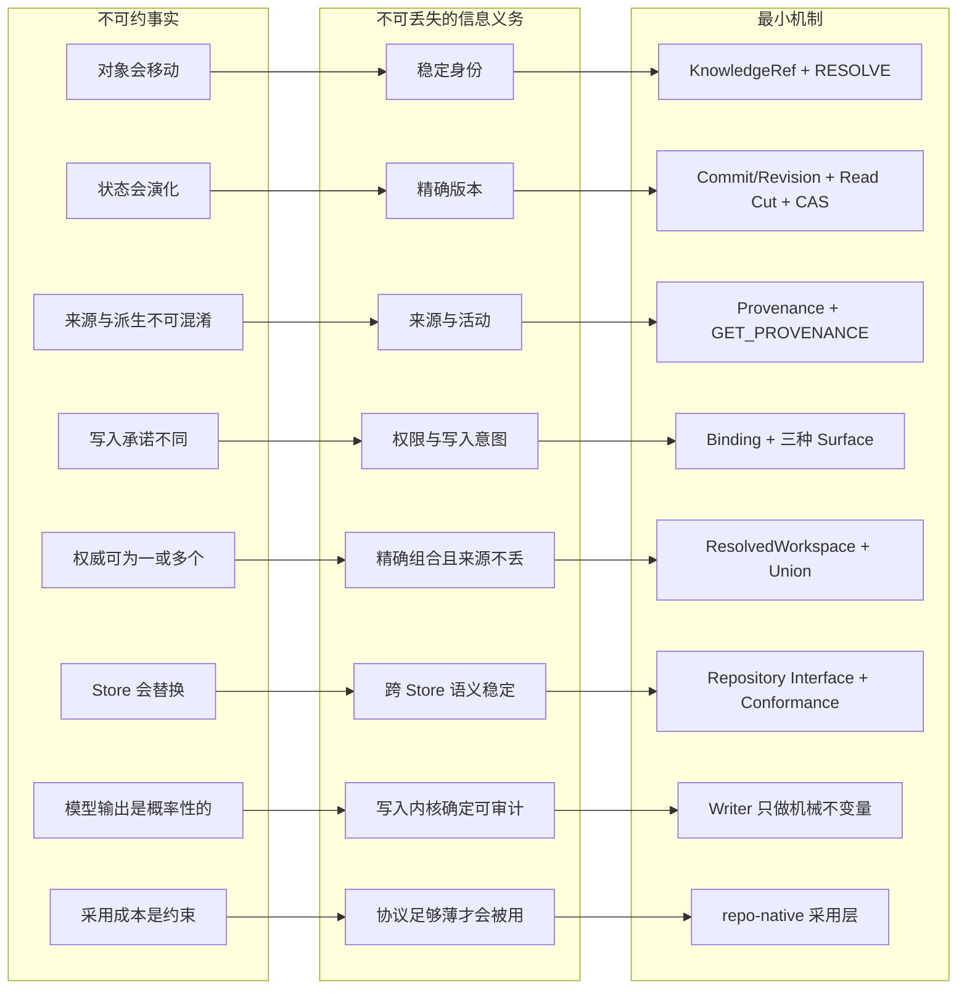

## 1.4 最小性判据

每个候选概念经过三步审查：

1. **信息损失测试**：删除后，上一节的审计问题是否仍能被确定回答？不能则属于协议义务。
2. **Store 映射测试**：底层是否已经提供同等状态语义？若是，由 Adapter 薄映射，不建立第二套内核。
3. **Capability 测试**：能力是否依赖特定索引、模型、顺序或合规设施？若是，冻结输入/输出与降级语义，并显式协商支持状态。

由此得到三层：

| 层 | 内容 | 例子 |
|---|---|---|
| 协议必须定义 | Store 无法可靠恢复的跨实现信息义务 | ObjectIdentity、Provenance、Binding/Surface、Workspace 与结果完整性 |
| Store 原生承载 | Adapter 映射到成熟 Store 的确定状态操作 | Commit/Revision、Branch、CAS、LOG、DIFF、READ |
| 可选 Capability | 语义已冻结，但实现与性能保证可选 | Vector、Graph、Semantic Refine、Monotonic Ordering、Erasure Workflow |

“协议真正新增的三样”特指 Repository 边界缺失的身份、来源和写入治理；Catalog 的 Workspace 组合是系统级契约。两者不矛盾，也不能据此把 Catalog 删除或降级成另一套模式。

## 1.5 单一协议与自然退化

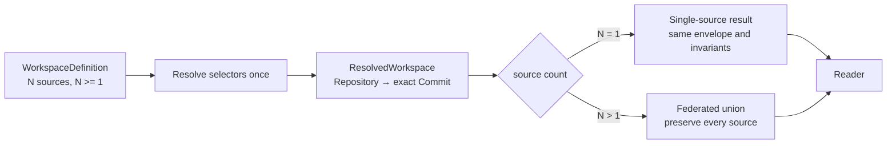

单 source 与多 source 的差异是成员基数，不是身份、版本、错误、授权或维护协议的差异。Store 选择同样不由用户人数决定，而由状态能力、数据规模、查询形态、运维和合规要求决定。

## 1.6 直接设计规则与非目标

1. 身份与位置分离；Canonical 内容携带 object_id，`object_id → path` 只是可重建 Projection。
2. 符号 Ref 只在请求开始解析一次；稳定结果返回 Commit，命令内不继续跟随 `latest`。跨命令跟 Workspace 的已发布 selector。
3. Workspace 只读；写命令必须选择唯一 target Repository，禁止跨 Repo 虚假事务。
4. 多来源结果做 union 并保留来源，不按 public/group/personal 静默覆盖。
5. Writer 只执行显式意图和机械不变量，不做 LLM 抽取、真值判断或自动冲突裁决。
6. 原始 Observation/Evidence 不被摘要替代；Derived 必须记录固定输入和算法活动。
7. Projection 可丢失、可重建，并声明 basis、coverage 与 lag；它不能成为身份或权威来源。
8. 新 Store 只能实现统一接口并通过同一 Conformance，不能把物理限制泄漏成新的协议分支。

MVP 不构建通用本体、大一统 KnowledgeType、通用 PATCH DSL、任意图查询语言、跨 Repo 分布式事务、自动语义冲突裁决、一次命令中途跟随 `latest`、知识 OverlayPatch 或全库 `LLM_QUERY`。


# 2. 总体架构（Architecture）

源：白皮书 §0–§3；推演 §0–§1。

## 系统主张
Knowledge Catalog 不是放大版 Repository，也不是跨 Repo 文件覆盖系统。它是多个独立权威 Knowledge Repository 的注册、发现与版本化联合视图边界。目标是与 Store 无关的逻辑语义：

> 稳定身份 + 精确地址 + 类型化演化语义 + 薄写入协议 + 稳定读取协议。

```mermaid
%% diagram:system-context
flowchart TB
  subgraph Actors[系统外部]
    SRC[Sources · Collectors · Editors]
    APP[Applications · Agents]
    CP[Active Control Plane]
  end

  subgraph System[Knowledge Catalog System]
    ING[Writer<br/>Auth · Binding · Idempotency · Receipt]
    CAT[Knowledge Catalog<br/>Registry · WorkspaceDefinition]
    REP[Knowledge Repositories<br/>Independent Identity · ACL · Version · Streams]
    PRJ[Reader Projections<br/>Text · Structured · Vector · Graph]
    ACC[Reader<br/>Resolve · Read · Search · Provenance]
  end

  SRC -->|COMMIT · PROPOSAL · APPEND| ING
  APP -->|explicit target writes| ING
  CP -->|candidate writes| ING
  ING -->|one target repository| REP
  REP -. exact basis .-> PRJ
  CAT -->|resolved {repo → commit}| ACC
  REP -->|canonical values| ACC
  PRJ -->|candidates + coverage| ACC
  ACC -->|typed values + citations| APP
  ACC -->|watch · diff · evidence| CP
  CP -->|define-workspace · preview · validate| CAT
```

Repository 是唯一知识权威边界；Catalog 只保存成员与 Workspace 配方；Projection 只保存可重建访问状态。Application 和 Control Plane 可以读写系统，但 Canonical 内容写入必须经过 Writer，Merge 必须经过受保护的 Control API，任何调用方都不能直写 Backend/Ref。

## 四个核心领域边界 + 两个上层职责
| 领域 | 承诺 | 明确不做 |
|---|---|---|
| Knowledge Catalog | 登记 Repo、WorkspaceDefinition；消费时 ResolveWorkspace | 不拥有成员知识、不写 Repo、不落盘 Pin/published branch |
| Writer（写 API；旧称 Ingress） | 鉴权/Binding/Schema/前置条件/幂等/写路由/Receipt | 不解析内容、不做 LLM 抽取、不判语义冲突 |
| Knowledge Repository | 独立身份/ACL/Snapshot Version/Ref/Stream/保留 | 不判跨 Repo 真值、不做排序 |
| Reader（读 API；旧称 Access） | 在精确 Version / 这次解开的 `{仓 → commit}` / ReadVersion 上读取与检索 | 不生成最终回答、不自动派生 |
| Application（上层） | Context Assembly、最终回答 | 不直写 Backend 或 Ref |
| Active Control Plane（上层） | Watch/Diff/评估/提 Proposal/Merge | 内容写经 Writer；治理动作经受保护 Control API；不直写 Backend/Ref |

## 四个根本区分（防陷阱）

1. **Write Surface ≠ ⓪ Primitive**：COMMIT/PROPOSAL/APPEND 是写意图；Snapshot Version/Ref 与 Append Record 是 ⓪ 状态。PUT Aspect 是 ② 的变更代数，经 COMMIT 落成 git commit。FileGit 的 JSONL 同居不是「流是 git」。
2. **① Catalog ≠ ⓪ Snapshot ≠ ③ Projection**：Catalog 组合配方；一次命令内解坐标；Snapshot 是 hangable git；知识形态在 ②；Projection 可丢失可重建。
3. **Workspace 配方 ≠ 仓 Ref ≠ Preview**：三个独立、可审计的状态动作；Ref CAS 是仓的事；Workspace 只改配方；Preview 只写 ControlState。
4. **Structure ≠ Epistemic Role ≠ Collection**：同一主题可同时以 Append Observation（⓪ 流）、Derived Assertion、Snapshot Definition 和 Graph Projection 出现。

## MVP 语义压缩

Catalog 登记 WorkspaceDefinition / Writer 3 Surface / 不可变 Version+Ref+CAS 内核 / 4 Collection / 4 Pattern / 3 引用 / WorkspaceDefinition + 命令内 ResolvedWorkspace / Reader 十二项任务语义（另加 READ_STREAM / OPEN_WORKSPACE 切面） / 2 语义算子。当前 I/O 名与收窄见 D26、第 7 章。

## 逻辑 vs 物理

逻辑层按 ⓪–③ 分层（第 0.15 节）。Snapshot 权威是 FileGit/Dolt，APPEND 权威是有序段（闭段可对象存储）——二者都是 ⓪，不是同一个仓概念。实现分 `local/` 与 `scale/`。SQLite FTS / Elasticsearch / StarRocks / Redis 是 ③ 的引擎。数据规模与部署可以触发迁移，但不得改变身份、版本和读写语义（K-23）。

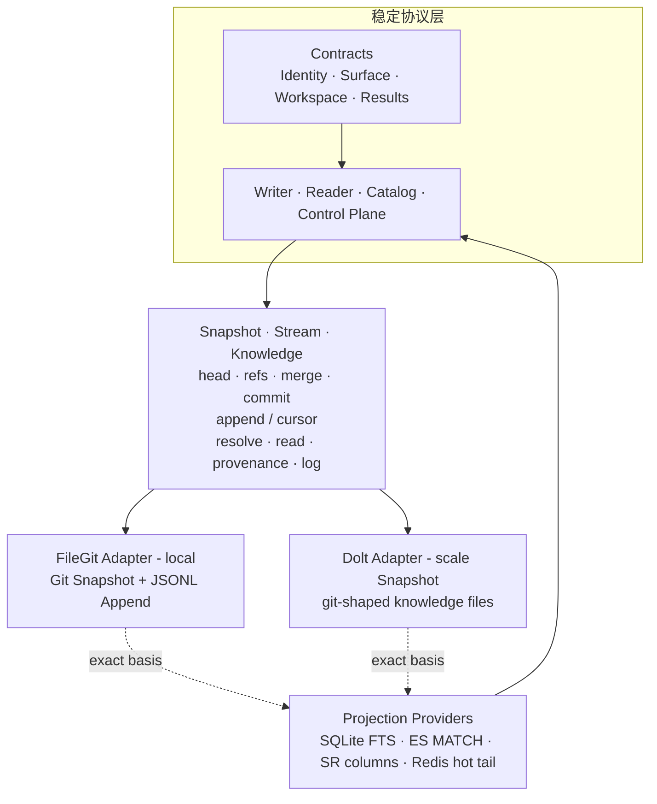

依赖方向必须保持：协议层不 import 具体 Adapter；Repository Kernel 不依赖 Projection；Projection 命中只提供候选，Reader 回读 Canonical 值。新 Adapter 必须复用同一 Conformance，不能通过改协议规避不变量。


# 3. 身份、地址与版本（Identity）

源：白皮书 §14、§17A；推演 §0、§2.2。

## 三种跨 Repo 引用
```text
KnowledgeRef       = RepositoryIdentity + ObjectIdentity            # 长期关系，路径无关
PinnedKnowledgeRef = + CommitIdentity                              # 可复现证据/审计/Derived 输入
FileRef            = RepositoryIdentity + Commit + Path + Digest   # 只定位原始文件
```
推论：文件移动不破坏前两者（Path 只是 `path_hint`）；跨 Repo API 不接受裸 StableRef（ADR-008）。

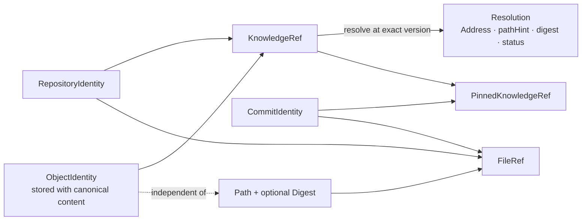

`KnowledgeRef` 表达长期逻辑对象，`PinnedKnowledgeRef` 表达证据使用的精确版本，`FileRef` 只定位原始字节。三者不可互相替代；Adapter 可以改变路径索引方式，不能改变引用含义。

## KnowledgeAddress（Repo 内精确定位）
```text
EntityAddress / AspectAddress / MemberAddress / RelationAddress / RecordAddress
DerivedOutputAddress / ArtifactAddress / FragmentAddress
```
RepositoryIdentity 来自请求上下文或 KnowledgeRef，不能靠 Path 推断。`KnowledgeRef` 定位对象；`KnowledgeAddress` 定位对象内一个维护单元。Reader 两者都读：见 `ASPECT_ACCESS.md`。

## Repository 版本对象

CommitIdentity / BranchRef / TagRef / AppendCursor / DerivedRevision / ArtifactRevision / ProposalRef。

`CommitIdentity` 是现有协议与代码中的类型名，语义上表示不可变 Snapshot Version Identity；FileGit 使用 Git hash，其他 Adapter 可以使用等价的内容哈希或不可变 Revision ID。Branch 是可移动指针，不能充当可复现证据；Review / Validation / Approval 必须落到精确 CommitIdentity。

## ResolvedWorkspace vs WorkspaceVersion

- ResolvedWorkspace = `{仓 → commit}` **加上** 成员上已有流的 `AppendCuts`（`{仓 → {streamRef → cursor}}`）。一次命令开始时 `ResolveWorkspace` 解一次；**命令内不可变、不落登记表**。Catalog 只取 `GetRef` / `StreamCursor`，不读文件、不读 payload。**已实现**（`catalog.ResolveWorkspace`；消费 `reader.Open`）。
- WorkspaceVersion 仍是更大的契约骨架：ResolvedWorkspace + Derived Heads + Projection versions + AuthorizationDecisionRef。参考实现不假装已经组装完整 VRV；DERIVATION 只强制 `inputWorkspaceVersionRef` 字符串。授权每次读取重新计算（K-20）。
- 不要把 Snapshot commit 和 Stream cursor 合成一个虚假全局 Commit（ADR-019）。发布是推仓分支，不是 Catalog 落盘 Pin。

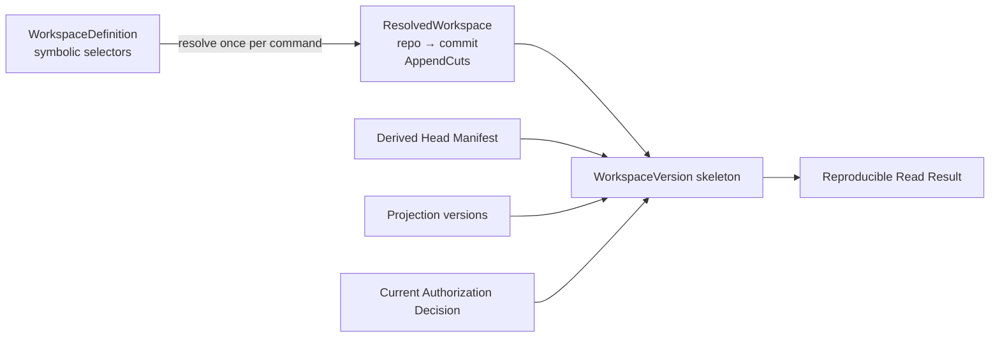

ResolvedWorkspace 冻结成员 Snapshot commit，并冻结该命令看到的 stream cursor。Derived / 异步 Projection / 授权决定仍不进这次 pin。不能把旧授权固化为未来访问权。


# 4. 写入边界（Writer / Ingress）

源：白皮书 §4–§9 的描述框架（三 Surface、Binding、机械执行、Receipt）；I/O 名是 Writer（D26）。

## 定义
Writer（领域名仍可称 Ingress）= 能力协商 + 单 Surface Binding + 类型化写命令 + 契约执行 + 幂等/并发/顺序 + Durable Receipt。语义薄、执行强：不判内容权威，但严格机械执行。写授权的用户面是 `kc allow --cmd put|propose|append`（见 `docs/PERMISSIONS.md`）；缺规则时不得假装已做最小权限隔离。

## 三种 Write Surface
| Surface | 语义 | 状态效果 |
|---|---|---|
| COMMIT | 权威当前状态变化 | target Repo Commit + CAS target Ref |
| PROPOSAL | 建议状态变化 | Candidate Branch/Commit + Proposal Metadata |
| APPEND | 记录发生的事件/观察 | 不可变 Entry 追加到 Stream |

Artifact 上传（PutArtifact）不是第四种 Surface，是 Repository 辅助端点；被 COMMIT/PROPOSAL/APPEND 引用后才进入知识语义。

## 变更代数与前置条件
- 变更代数只有 `PUT(address, full_value)` / `REMOVE(address)`；无通用 PATCH（ADR-004）。
- 前置条件：`IF_ABSENT` / `IF_OBJECT_EQUALS` / `IF_DIGEST_EQUALS`。Create=PUT+IF_ABSENT；Update=PUT+IF_*_EQUALS；Upsert=PUT 无目标条件（需 Binding 允许）。

## 写授权（契约骨架）
一条 `kc allow` 的 `--cmd` 只落在一个写面上：`put,remove,commit` 或 `propose` 或 `append`（最小权限、幂等键稳定、监控/限流/错误分离）。规则声明 `--repo`、`--ref`、`--object`/`--aspect`（Address 模式，不是路径）。不允许静默降级（`CAPABILITY_UNSATISFIED`）。完整权限模型（拆仓、挂载不发权、读侧 `--as`）见 `docs/PERMISSIONS.md`。`kc allow` / `--as` 求值 `.kc/allow.json`；不带 `--as` 是工作区主人。FileGit 本身不另做 ACL。

## 执行流程与幂等

Transport Decode → Authenticate → Resolve Binding → Verify Surface → Canonicalize+Digest → Idempotency Check → Validate Scope/Schema/Op/Limits → Typed Executor → Atomic Preconditions+Write+Receipt → Return Durable Receipt。

精确重试使用同一 command_id 与规范化逻辑 Payload；已成功时返回原 Receipt（REPLAYED），同 ID 异内容返回 IDEMPOTENCY_CONFLICT。

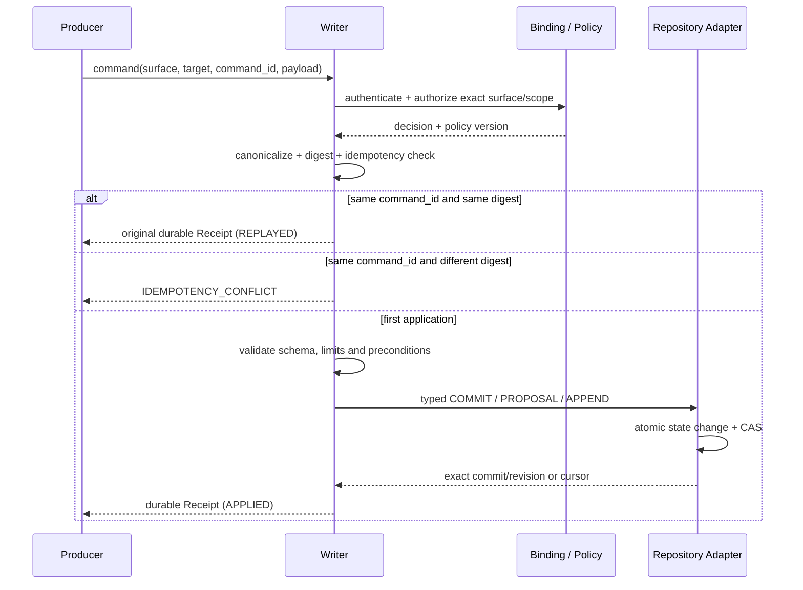

成功 Receipt 表示写入已跨过约定的 Durable Boundary；仅“收到请求”不能作为成功。Writer 不包含内容分类器、语义路由器或 LLM 冲突判断器。

## 命令信封、Receipt 与当前 Writer

公共信封只保留执行所需字段：`command_id`、target Repository/Ref 或 Stream、规范化后的 ChangeSet/Entries、可选 `provenance`。可信身份由认证上下文解析；请求体里的 `actor_ref` / `source_ref` 只是声明，须与未来 Binding 核对。

```text
CommitReceipt    APPLIED | REPLAYED
                 repositoryId, commitId, targetRef, oldCommit, newCommit
AppendReceipt    APPLIED | REPLAYED
                 repositoryId, streamRef, cursor, appended[]
```

`Writer.commitIntent` / `appendIntent`：首次从当前 Ref/cursor 填 CAS；重试复用已存请求的 CAS 并比对其余字段。CAS 属于 command body；重试时再取一遍「当前 head」是另一条命令。

**已实现（参考 Writer）**

COMMIT、PROPOSAL、APPEND、`command_id` 幂等、Intent 填 CAS / stream cursor、空 ChangeSet 拒写、单进程 Receipt。PROPOSAL 由 `Writer.Propose` 写 Candidate Ref（Control Plane 只编排 Preview / validate / Merge）。CLI：`kc put|remove|commit|append`；`kc ingest` 只出 ChangeSet 预览（frontmatter `object_id` 优先）；`kc receipt` 查幂等日志。`put` 可带 `IF_ABSENT` / `IF_DIGEST_EQUALS`、`schema_ref`、完整 provenance（含 DERIVATION）。**写入校验 `schema_ref`**：必须解析为 target 仓内的 `schema/*`（带 pin 则该 commit 存在且 RESOLVED；不带 pin 则在写基线 RESOLVED，或同一次 ChangeSet 已 PUT 该对象）；`kc://` 指向别的仓 → `SCHEMA_REVISION_UNRESOLVED`。

**语义已定义、实现延后**

`DescribeIngress` / `NegotiateWrite`、跨进程幂等与写入同 Durable Boundary、MCP 网关、Artifact 二进制上传、低基数 Metrics/Audit Outbox。HTTP facade 是 `kc serve`（已实现）。缺 `allow` 规则时不得假装已做最小权限隔离；权限模型见 `docs/PERMISSIONS.md`，生产缺口见第 8 章。

## 最小错误模型

信封 `{error:{code,message}}`。`code` 给程序分支（恢复类别），`message` 给人和 agent：主语 + 不满足的条件 + expected/actual。选码见 `kernel/errors.go`。

| 错误 | 含义 | 恢复类别 |
|---|---|---|
| USAGE_INVALID | 请求/旗标/本机 home 形状：缺 flag、未知命令、空 changeset、search/stream 形状、未挂载仓/流 | FIX_REQUEST |
| PROTOCOL_UNSUPPORTED | 协议版本不支持 | NON_RETRYABLE |
| BINDING_EXPIRED / BINDING_REVOKED | Binding 不可用 | REFRESH_BINDING |
| SURFACE_MISMATCH / SCOPE_DENIED / TARGET_REPOSITORY_DENIED | Surface、地址或目标超出授权 | NON_RETRYABLE |
| SCHEMA_UNSUPPORTED / SCHEMA_REVISION_UNRESOLVED | Schema 不允许或 pinned revision 不可解析 | FIX_REQUEST |
| WRITE_TARGET_REQUIRED | 未指定唯一 Repository / Ref | FIX_REQUEST |
| PRECONDITION_FAILED / NON_FAST_FORWARD | Object、Digest、cursor 或 Ref 前置条件失效（不是缺 flag） | READ_DIFF_REBASE |
| OBJECT_ID_CONFLICT | Repository 内 object_id 不唯一 | FIX_REQUEST |
| POSITION_REGRESSION | Producer Position 回退 | NON_RETRYABLE |
| IDEMPOTENCY_CONFLICT / EVENT_ID_CONFLICT | 相同 ID 被用于不同 Canonical 内容 | NEW_ID_AFTER_FIX |
| CANDIDATE_MOVED / VALIDATION_BASIS_MISMATCH | 候选或完整 Preview Basis 已变化 | REBUILD_AND_REVALIDATE |
| WORKSPACE_INVALID | Workspace 配方不能用：未知/已 retire、selector 无此 ref、同一仓出现两次。这是配方错误 | FIX_DEFINITION |
| VERSION_UNRESOLVED | 精确 Commit/Ref 不存在或已不可读取 | FIX_REFERENCE_OR_RESTORE |
| KNOWLEDGE_REF_UNRESOLVED | 对象在有效版本中缺失、已移除或不可见 | CONTROLLED_NOT_FOUND |
| CAPABILITY_UNSATISFIED | Adapter 无法满足已协商保证 | CHANGE_CAPABILITY_OR_ADAPTER |
| TEMPORARY_UNAVAILABLE | 临时 Backend 故障（可原样重试）。未挂载不是这个码 | SAFE_RETRY_SAME_REQUEST |


# 5. 权威状态（Repository）

源：白皮书 §10–§18；推演 §2、§7、§12、§13。

## 核心抽象

RepositoryIdentity/Ownership/ACL + 不可变 Snapshot Version/Ref/CAS/Merge + AddressSpace + 类型化 Collection + 结构契约 + Append/Derived/Artifact 侧集合 + Provenance/Time + CapabilityManifest。FileGit Adapter 把版本内核映射为 Git Object/Tree/Commit/Ref；其他 Adapter 必须提供等价语义，而不要求复制 Git 物理格式。

## 受保护的 Git-like Control API

CREATE_REPOSITORY / CREATE_COMMIT / CREATE_REF / UPDATE_REF(CAS) / MERGE / REBASE_CANDIDATE / REVERT / ARCHIVE_REPOSITORY。

这些名称描述协议语义。禁止强制覆盖受保护 Ref、跨 Repo 原子 Merge；Adapter 不支持某项可选能力时必须在 Capability 中显式报告。

## 四类 Canonical Collection

| Collection | 适用 | 演化语义 | 是否当前权威 |
|---|---|---|---|
| Snapshot | 定义/政策/流程/断言/关系/Schema | immutable Version + Ref CAS；当前 Adapter 为 Git | 是 |
| Append | 观察/证据/反馈/轨迹 | append-only；修正用 correction/retraction/supersedes | 是真实记录，非当前快照 |
| Derived | 摘要/健康/热度/评估 | 不可变 Revision + Head CAS；invalidate | 仅声明 Derived Head |
| Artifact | PDF/大对象 | 内容 Hash 寻址；Manifest 引用 | 被 Canonical 对象引用后进入语义 |

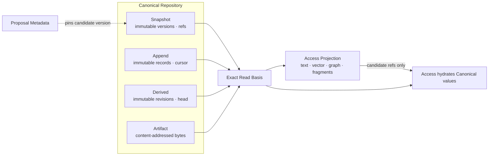

Candidate Version 可以已存在但尚未被 Accepted Ref 指向；Proposal Metadata 只描述治理过程。Projection 从精确 Basis 构建，命中后仍由 Access 回读 Canonical 值，索引内容不能反向写回 Repository。

## 正交知识结构与四个 Structural Pattern

系统不使用一个大 `KnowledgeType` 同时决定结构、存储、权威性和生命周期，而使用正交组合：

```text
Knowledge Unit
  = Epistemic Role      # definition / assertion / observation / evidence / derivation
  × Structural Pattern # 最小独立维护单位
  × Collection Kind    # Snapshot / Append / Derived / Artifact 的演化语义
  × Schema             # 字段与约束
  × Time Semantics     # observed / effective / recorded time
  × Provenance         # source / actor / activity / evidence
```

Entity 是跨版本和物理布局保持稳定身份的 Subject；Aspect 是 Entity 内可独立维护、绑定明确 Pattern 与 Schema 的命名分区。Aspect 的拆分依据是权威来源、变化频率、冲突粒度、Schema、时间/来源义务和访问方式，而不是 UI 分组。

业界对照：DataHub 的原子写是 `(entityUrn, aspectName)`（MCP UPSERT 一个 Aspect，GET Entity 再拼齐）；Unity 用不同 API 改 schema / owner / GRANT；OpenMetadata 靠字段 PATCH。我们不引入通用 PATCH（ADR-004）：`PUT Aspect` 整份替换该分区，等价于 DataHub 写一个 Aspect，不是 JSON Merge Patch。FileGit 一个文件一个维护单元；同一 `object_id` 可以有多份 Aspect/Member 文件。唯一键是 Address，不是裸 `object_id`。`READ(object_id)` 拼出 `{ aspectName: value }`（Member 收成 map）；`readAddress` 只读该单元。Entity blob（无 `aspectName`）保持旧行为，禁止与 Aspect 文件混在同一对象上。Repo 级 `expectedTargetCommit` 仍串行提交；Aspect digest 只防止盖掉该分区。

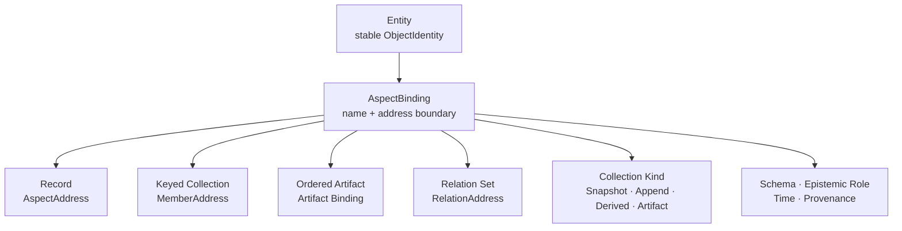

| Pattern | 最小维护/冲突单位 | PUT / REMOVE 语义 | 典型内容 |
|---|---|---|---|
| Record | AspectAddress | 替换或移除完整 Record；按对象/digest 检测冲突 | 定义、配置、单一属性集合 |
| Keyed Collection | MemberAddress(parent, aspect, member_key) | 单 Member upsert/remove；同 key 冲突 | 规则项、字段、术语、公式 |
| Ordered Artifact | Artifact Binding / Revision | 绑定新 ArtifactRef 或退役绑定 | 文档、手册、代码、有序内容 |
| Relation Set | RelationAddress | 单 Relation upsert/remove；qualifier 独立 Diff | 可反向访问、带有效期或来源的连接 |

源文档不应为了检索被强制拆成大量碎片；Fragment 属于 Access Projection。Append-only 是 Collection 演化语义，Derived 是知识地位与版本语义，两者都不是新的 Structural Pattern；Derived Value 仍可使用 Record、Keyed Collection 或 Relation Set。

## Epistemic Role、时间与来源义务

`epistemic_role_ref` / `origin_kind` 是可扩展词汇，**不决定存储**。系统不得从 Role 自动推断「是否可信」；可信来自 Collection、Revision、Binding 与 Provenance。

| Role | 含义 | 常见 Collection |
|---|---|---|
| `SOURCE` | 原始文档、快照、工具原始输出 | Artifact + Append Manifest；采集默认 |
| `OBSERVATION` / `EVIDENCE` | 某时观察到什么；支撑或反驳 | Append |
| `ASSERTION` | 关于对象、属性或关系的主张 | Snapshot / Derived / Append 均可能 |
| `DEFINITION` / `NORM` / `PROCEDURE` | 正式定义、政策、步骤 | Snapshot（文档可挂 Artifact） |
| `DERIVATION` / `SIGNAL` | 基于固定输入和算法的计算值 | Derived |
| `META` | Schema、Pattern、词汇 | Snapshot |

同一主题可以同时以 Append Observation、Derived Assertion、Snapshot Definition 和 Graph Projection 出现；这就是第 2 章「Structure ≠ Role ≠ Collection」。

领域时间按 Schema 声明，不要求全库双时态：

| 语义 | 字段 | 适用 |
|---|---|---|
| System Time | recorded_at / committed_at | 所有状态，系统分配 |
| Event Time | observed_at | Observation、Event、工具输出 |
| Valid / Effective Time | valid_from/to、effective_from/to | 动态事实、政策 |

来源信封字段与 DERIVATION 强制约束见第 11 章 B。GET_PROVENANCE 只返回贴在该对象上的信封；时间线本身由 LOG 与 Stream cursor 表达。

## 状态转移要点

- COMMIT：验证 Address/Schema/Pattern → 解析 parent + Ref CAS → 创建不可变 Snapshot Version → CAS 移 Ref → Change Event → Receipt；FileGit 将创建步骤映射为 object/tree/commit。
- PROPOSAL：以精确 base version 创建 Candidate Version → CAS 更新 candidate ref → Proposal Metadata 记录；不移动 main。
- APPEND：校验 Stream/Schema/EventID/Cursor → canonical digest 幂等 append → RecordRef/cursor → Receipt。
- Derived：读固定 WorkspaceVersion → 外部计算 → 写 DerivedOutputAddress + DerivationEnvelope → 不可变 Revision + Head CAS。

## 冲突语义

同 Repo Ref 前移 → NON_FAST_FORWARD/PRECONDITION_FAILED；同 EventID 异内容 → EVENT_ID_CONFLICT；不同 Repo 断言矛盾 → 并存不覆盖；Fork/Vendor 同步 → Base/Upstream/Local 三方；普通 KnowledgeRef 随上游升级 → 下次 ResolveWorkspace 重新解析验证，不 merge。

## FileGit Adapter 防护

| 风险 | 防护 |
|---|---|
| Shell 参数注入 | 所有 Git 调用使用 execFile 参数数组，不拼接 Shell 命令 |
| 非 Fast-forward Merge | 先验证 expected target 是 candidate 祖先，再执行 update-ref expected-old CAS |
| 路径逃逸 | pathHint 必须是 Repository Root 内的安全相对路径 |
| 身份歧义 | 扫描时发现重复 Address（object_id + aspect + member）立即返回 OBJECT_ID_CONFLICT；同一 object_id 的不同 Aspect 合法 |
| 用户工作区被覆盖 | 协议 COMMIT 前要求工作树干净；切 Candidate 后恢复原 Ref |
| Stream 名与摘要不稳定 | streamRef 编码为安全文件名；Entry 使用 canonicalDigest |
| 污染用户配置 | Append Side Stream 写入 `.git/info/exclude`，不修改用户 `.gitignore` |


# 6. 版本化联合视图（Catalog）

源：白皮书 §17A；推演 §5、§8–§11。

## public / group / personal
Repository 是权威边界：一份身份、一张 Snapshot 图。不是目录层级，没有覆盖优先级。联合结果保留 repository_id/commit_id/object_id/scope/provenance，多来源 Assertion 并存（K-13）。
拆仓看四件事是否一致：所有权、ACL、Ref 节奏（这根指针能否单独 CAS）、历史可见性。「维护」= 能独立调指针，是拆仓条件，不是 Repo 的定义。Catalog 不再另做对着 Pin 的 Serving 指针；读者跟 Workspace 的已发布 selector。

组织级默认拓扑（一间 Catalog，多仓）：

```text
kr://example/catalog              发现/组合；默认一间
kr://example/org/reference        外部或组织事实；多数 Agent 只读
kr://example/org/policies         组织定义；独立发布节奏
kr://example/groups/<team>        团队补充（指向公共对象，不复制）
kr://example/restricted/<set>     仅当读者真子集；不要写进全员 Workspace
kr://example/personals/<user>     草稿；发表走目标仓 propose，不是 merge Workspace
```

共享 Workspace 只拼目标读者都可读的仓；受限仓另做 Workspace。Agent 用 `kc` 读取知识，外部系统的实时操作仍由外部系统授权。`permissions` 一类的外部授权快照可以作为 SOURCE 知识，但不当 `kc read` 闸门，也不能替代实时强制系统。

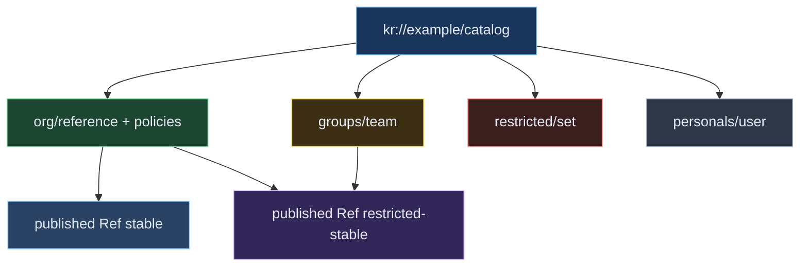

### Catalog 拆分谓词

默认不拆 Catalog。再开一间只因为 **组合治理本身** 是另一域，不是因为多了几个仓或几张表：

| 拆 | 不拆 |
|---|---|
| 另一批人决定谁可 `define-workspace` / 看见成员名单 | 多 Repo、多 Workspace |
| 连「有哪些成员仓」都不能给另一批人看（隔离舱） | 同一批 steward 管全部组合 |
| 法务/并购后的独立登记表 | 按 Ranger/Unity 表 GRANT 再开一间 |

`repo-add` / `define-workspace` 不发权。权在仓：`kc allow --repo`。表 SELECT 在源系统，不进 `allow.json`。

### 知识平面 vs 数据平面

Catalog 不在查询路径上。同一张物理表有两套独立授权：一套问说明能不能看，一套问行能不能取。

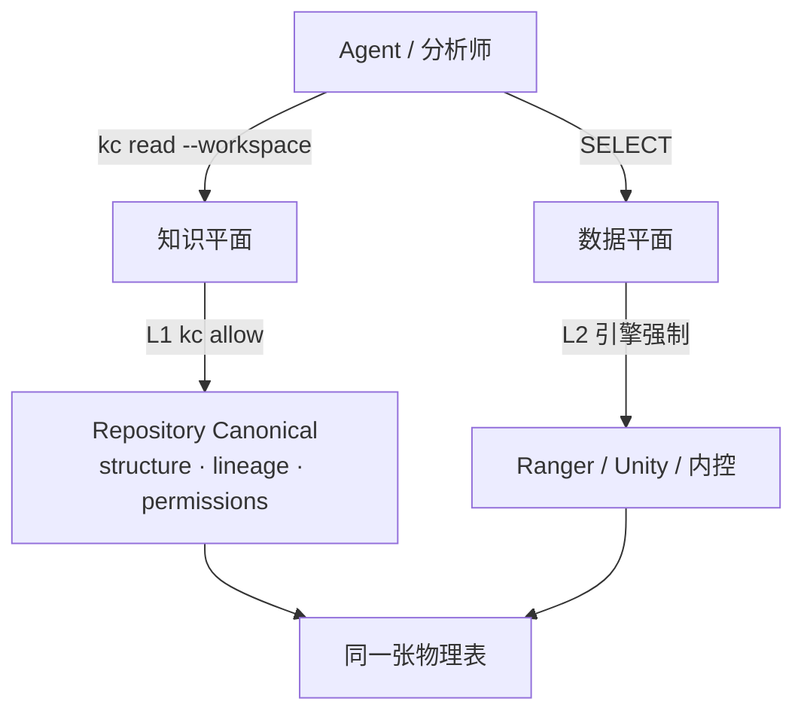

| 平面 | 问的是 | 仓内权威 | 不是 |
|---|---|---|---|
| **知识** | 这张表/指标/作业的说明、血缘、语义、GRANT 快照 | Repository + Workspace（这次解开的 commit） | 用这份知识放行 `SELECT` |
| **数据** | 谁能 `SELECT` 这些行 | 源系统特权（仓外） | `kc allow`、Workspace 成员名单 |

`permissions` 与 `structure` 同构：`COMMIT` 进 Canonical，允许落后，消费方可拿去过滤候选。真正放行仍问引擎。不要按 GRANT 拆知识仓，也不要把 GRANT 写进 `allow.json`。细则：`PERMISSIONS.md` §1.1、`ASPECT_ACCESS.md`。

## WorkspaceDefinition → ResolvedWorkspace

- WorkspaceDefinition 含一个或多个可移动选择器（已发布 branch），表达组合意图；一次读命令开始时 RESOLVE 成 ResolvedWorkspace，**不落盘**。
- ResolvedWorkspace 每 RepoIdentity 只出现一个精确 Version（K-10）；重复出现返回 WORKSPACE_INVALID。
- EffectiveView = union AuthorizedSnapshot(repo_i, version_i, principal)；无覆盖栈（ADR-010）。
- 内容哈希可用于 Preview：`previewId = H(workspaceId ‖ overlay ‖ sorted(repo_id → version_id))`。消费读不登记 pin_id。

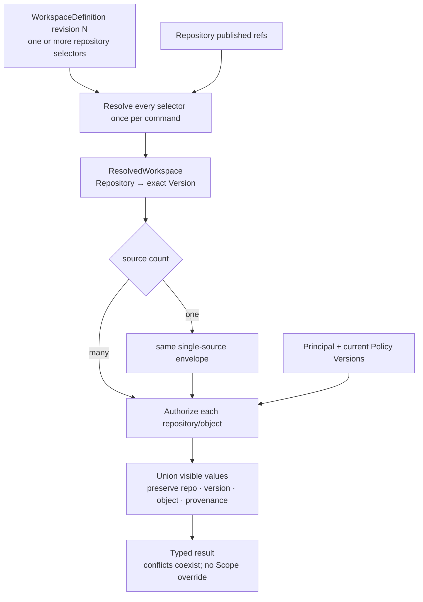

ResolvedWorkspace 固定**这次命令**的数据坐标，不授予权限，也不把多个 Version 合成虚假全局 Commit。某个来源不可见时，Access 必须防旁路裁剪，不能通过计数、错误差异、片段或关系边泄漏其存在。跨命令跟已发布 selector。

## 三种跨 Repo 关系
| 语义 | 本地复制 | 对象身份 | 上游升级 |
|---|---|---|---|
| Reference | 否 | 上游 KnowledgeRef | 下次 ResolveWorkspace 重解析验证 |
| Fork | 是 | 新本地身份 + wasDerivedFrom | 显式三方同步，可冲突 |
| Vendor | 是 | 本地只读副本 + 锁 pin | 显式 update，不假装自动跟随 |

普通引用升级无跨 Repo merge（下游 Repo 未被修改）。

个人仓的草稿要变成团队/公共知识：**在目标仓 `propose`（或有写权则 `commit`）一个新对象**，信封写 `wasDerivedFrom` / `sourceRefs` 指向个人仓的 pinned ref。不要 merge Workspace、不要把 public 拷进 personal。这就是 Fork 的发表路径；EXPAND / 自动三方 sync 仍未落地，发表先走 Writer。

## Catalog 动作语义（只改登记/联合视图，不写 Repo）

| 操作 | 当前动词 | 效果 |
|---|---|---|
| 登记仓 | `REGISTER_REPOSITORY`（CLI `repo-add` 是工作区挂载） | 身份唯一；不复制内容 |
| 定义配方 | `DEFINE_WORKSPACE` | 保存带符号 selector 的 WorkspaceDefinition revision |
| 打开消费读 | `OPEN_WORKSPACE` | 每个 selector 解析一次 → 命令内 ResolvedWorkspace；失败不产生部分结果 |
| 候选预览 | `CREATE_PREVIEW` | 在当前 Workspace 解析上 overlay `{仓 → candidate}`；内容哈希当 `previewId`，只写 ControlState |
| 结构检查 | `CheckResolved` / `validateStructure` | 仓已挂载且 commit 存在；再 `recordValidation` |
| 外部套件 | `recordValidation` | 只绑定传入 PASSED/FAILED，不跑测试 |
| 退役配方 | `RETIRE_DEFINITION` | 禁止再 `OpenWorkspace`；不删审计 |
| 归档空间 | `ARCHIVE_CATALOG` | 这间 Catalog 禁新 define-workspace |

登记表默认是独立 FileGit（身份如 `kr://acme/catalog`），`define-workspace` 历史即该 Registry 的版本历史；它不是成员 Workspace 的 source，也不拥有对象内容。

请求进来就对已指名的 Catalog / Repository 操作。不需要 Host、进程或工作区作为协议对象。`.kc` 只是本机 `kc` 用来找到 Registry 和成员库目录的文件布局；服务化后是连接配置，同样不是领域层。本机每条 `kc` 动词追加 `.kc/audit.jsonl`（facade：argv、`--as`、`init` / `allow`）。协议面（Writer / Catalog / ControlPlane / Reader）追加 `.kc/system.jsonl`，Go API 同样写，不经过 CLI 也会留痕。这两份都是本机过程账，不是知识。Catalog 改动的记录就是登记表 git（`kc audit`）；当前组合空间是 `kc read --catalog`。`--as` / `--request-id` 写进 commit。知识写入的记录在该 Repository 的 git 里。`kc audit --layer kc|system` 分开读本机两份过程账。

`REGISTER_REPOSITORY` 把 **repo id** 记入这间 Catalog（不复制内容）。落盘是登记表 `repository-*.yaml`，与 `WorkspaceDefinition.sources` 不是同一份名单：`kc read --catalog` 的 `repositories` 是「这间 Catalog 承认哪些仓可以入配方」；Workspace 的 sources 是某条配方此刻组合哪些仓；一次 `ResolveWorkspace` 才把 selector 解成 `{仓 → commit}` 并钉附属 `AppendCuts`。CLI `repo-add` 只是本机把该库的 FileGit 打开，并默认 `register` 到第一间 Catalog。`CheckResolved` 要的是：这间 Catalog 的配方里有这个仓，并且这个 id 此刻解得到、commit 还在；pin 里的流仍挂着。

`kc init --catalog <id>` 创建第一间（`kr://acme/catalog` 或 `acme/catalog` 都是同一间）。公司级默认就用这一间。再开一间用 `catalog-add --catalog <id>`。

Catalog 和 Repository 一样：**没有 DELETE**。抹掉空间等于毁掉重放。收场分层，不要一个「冻结 Catalog」：

| 对象 | 收场 | 不是 |
|---|---|---|
| WorkspaceDefinition | `RETIRE_DEFINITION`：不能再 OpenWorkspace | 删掉审计 |
| Catalog | `ARCHIVE_CATALOG`：整间只读历史 | `DELETE_CATALOG`、按团队拆掉重建 |

「冻结」只指一次命令内的 `{repo → commit}`，不是 Catalog 的状态机。`RETIRE_DEFINITION` / `ARCHIVE_CATALOG` / `ARCHIVE_REPOSITORY` 已实现（`kc retire-workspace` / `archive-catalog` / `archive-repo`）。

Repo 删除、归档、权限变化或不可达时，Catalog 不在运行时偷偷换成「最新可用版本」。新的 `OpenWorkspace` 必须显式失败或按 Optional Source Policy 带 Degradation。

## 本地分歧表达
group/personal 想补充/限定/反对 public → 写本地 Assertion/Relation（about: kc://public/...）；通用 OverlayPatch 不进 MVP。展示名/排序/高亮等非知识设置可用 Presentation Preference。


# 7. 读取边界（Reader / Access）

源：白皮书 §19–§25 的**描述框架**（公共读上下文、固定操作面、类型化结果、Projection 非权威、Refine 封闭）；语义以 D11 / D16 / D18 / D25 / D26 / D29 为准，不回写 v5.0 的 ORIGIN 爬链或通用查询语言。

对外入口按读目标分：维护方是 **Reader**（单仓 pinned commit）；消费方是 **reader.Serving**（`ResolveWorkspace` → `reader.Open`）。领域名仍叫 Access：读取协议，不必是远程服务。Portable Profile 可以是进程内 Library / CLI；Managed Profile 可以是独立服务。传输不得改变版本、授权、来源和 Coverage 语义。

## 7.1 定义：Access 回答什么

> Reader 在精确 Repository Commit 上解释 ②；reader.Serving 在这次 `ResolvedWorkspace`（commit + AppendCuts）上做同一套知识任务。索引只是 Projection。Derived / 授权仍不进这次 pin。

它只回答稳定用户任务：

```text
系统此刻能做什么、对象结构是什么、视图锁了哪些 Repo/Commit
某个 KnowledgeRef 在此版本指向什么
某个 Address 的 Canonical 值是什么
一个仓里直接有哪些对象
对象怎样演化、两个版本之间变了什么
该对象各单元上贴了什么来源信封
哪些对象满足条件或与文本相关
与某个对象直接相连的关系是什么
哪个 Ref / 这次解开的 commit / Projection 发生了更新
```

它不负责：最终业务回答、任务规划、把结果压成 Prompt、知识写入、自动派生。Context Assembly 属于 Application（第 12 章 B）。

Access 应暴露**任务**，而不是执行流水线。`RESOLVE` / `READ` / `SEARCH` 是稳定任务；Locate、Index Scan、Hydrate、Rerank 是内部阶段或可选扩展。不公开 SQL / GraphQL / SPARQL / 任意图路径语言，也不提供 `LLM_QUERY(prompt, whole_repo)`。

## 7.2 公共 Read Protocol

所有读操作共享同一上下文约束。未实现独立 `ReadRequest` 对象时，CLI / SDK 仍必须把这些字段落到参数上。消费请求只带 `--workspace`（可选 `--catalog`）；维护请求才带 `--repo` 与 `--commit` / `--ref`。

```text
ReadContext
  principal_context_ref          # 每次读取重新授权；ResolvedWorkspace 不冻结 ACL（K-20）
  read_target:
    REPOSITORY_COMMIT            # 单 Repo 精确 commit；测试 Candidate 或直读
    WORKSPACE                         # 配方 id → 命令开始时 ResolveWorkspace
  consistency                    # CANONICAL | PROJECTION_OK
  scope                          # 可选：限制可见 repo / catalog / address 前缀
  page / budget                  # items · edges · bytes · timeout；不是 LLM token
  explain                        # NONE | BASIC | FULL
  fallback_policy                # 显式降级；禁止静默伪装（T12）
```

规则：

1. **符号名只解析一次。** `--ref refs/heads/main` 或 Workspace 的 selector 在请求开始解析；结果必须带回实际 `commit_id`。命令内不得跟随 `latest`（K-11）。消费方 `kc read --workspace`（不要 `--repo` / `--commit` / `--ref`）；维护方才 `read --repo --commit|--ref`。Agent 配置保存 `catalog` + `workspace`，不自己跟仓 `HEAD` 中途换 commit。
2. **`read_target` 约束本次所有 Canonical hydrate。** SEARCH 命中后的 READ 必须使用同一 commit / ResolvedWorkspace，不能 silently 改去读 HEAD。
3. **授权按读取时 Principal + 当前 Policy 重算。** 结果可记录 `authorization_decision_ref`；一次命令内的坐标不能把当时的允许固化为未来访问权。
4. **无权来源防旁路。** 不得通过计数、错误差异、搜索片段、关系边或 provenance 摘要泄漏隐藏 Repo / 对象。
5. **能力缺失必须显式。** 不支持 Vector / Refine / 多跳时声明 `supported: false` 或 `CAPABILITY_UNSATISFIED`，不能用 grep 结果冒充向量命中。
6. **成功结果必须能回答审计问题。** 至少带 repository / commit / object；联合读带这次解开的各仓 commit；Projection 命中还带 basis / coverage / lag。

两种读目标不是两套协议：

| 目标 | 入口 | 语义 |
|---|---|---|
| 单 Repo Commit | `Reader.resolve/read/log/diff` | 维护方：精确版本上的对象任务 |
| Workspace | `ResolveWorkspace` → `reader.Open` → `Serving` | 消费方：成员 union，保留每条来源；对象缺失跳过，完整性/Backend 错误传播。调用方不传 `--repo` / `--commit` / `--ref`。CLI `read --workspace` |

## 7.3 三个易混术语

白皮书把「结果字段投影」和「可重建索引」都叫 Projection。当前协议拆开，避免 C4 混用。Store 派生再拆四层（详见 `STORE_ADAPTERS.md`）：权威 ≠ 索引 ≠ 缓存 ≠ 投影。规模化引擎冻结为：Snapshot FileGit/Dolt、APPEND 有序段、全文 ES/SQLite FTS、列过滤/聚合 StarRocks、热尾 Redis。实现分 `local/` 与 `scale/`。

| 名称 | 是什么 | 不是什么 |
|---|---|---|
| `AspectSelector` | 读/编索引时对拼装对象的 aspect `include`/`exclude` | 不是写粒度，不是身份 |
| `EvaluationProjection` | Refine 时 judge/scorer **可见字段**白名单 | 不是检索文档，不是索引 |
| 索引 | AccessHints 的 `key`/`filter`/`text`/`sort` 车道：定位 ID/偏移 | 不是 Canonical；不是 `summary`/`stored` |
| 投影 | `summary`/`stored`/分析列：可读窄行，点开仍回读 | 不是 posting list；不是缓存 |
| 缓存 | 可丢热拷贝（Redis 热尾） | 不是权威；miss 必须回仓 |

`READ(ref)` 默认拼 `{ aspectName: value }`；调用方用 `AspectSelector` 裁。`readAddress` 读单维护单元。Entity blob（无 `units`）不受 selector 影响。写冲突仍靠 Address。细节与业界对照：`ASPECT_ACCESS.md`。包名 `index/` 当前本地 SQLite 同时承载索引和 filter 列，不代表两层是一层。

## 7.4 操作面：十二项任务 + 两个切面

白皮书冻结十二个 Core Operation，覆盖能力发现、精确读、维护变化和检索。当前协议**保留这十二项任务语义**，并按 D26 改名、收窄或落到 Catalog；另外补两个切面读，不把它们算成第十三、十四个发现类操作。

| 任务 | 当前动词 | 参考实现 | 语义要点 |
|---|---|---|---|
| 能力发现 | `CAPABILITIES` | 未单独暴露；Profile 隐式为 FileGit + 可选 FTS + Refine | 描述实现能力，不等于已授权。缺失必须显式 |
| 结构内省 | `DESCRIBE_SCHEMA` | `Reader.DescribeSchema`；消费：`Serving.DescribeSchema` | 读这次解开的 commit 上的 `schema/*`。消费走 `--workspace` |
| 视图/索引描述 | `DESCRIBE_INDEX` | 部分：`Projection.DescribeIndex` 的 basis/lag；`index.Index.Describe` 是 live 工作投影；`SearchAt` 用这次解开的 commit 投影，不回绕 live；`reader.PlanIndex` 是配方不是 built 索引 | 授权后可见的来源、Commit、Plan / coverage；隐藏 Repo 不出现 |
| 身份解析 | `RESOLVE` | `Reader.resolve`；消费：`Serving.Resolve` | 维护方给定 commit；消费方在这次 Serving 解开的坐标上。见第 11 章 A |
| 精确读 | `READ` | `Reader.read`；消费：`Serving.Read` | 拼装或单单元 Canonical。消费 target = Workspace，不新增操作 |
| 浏览 | `LIST` | `Reader.list`；消费：`Serving.List` | 协议目标是 `LIST_TREE`（只枚举直接子级）。当前扁平 list 是小库简化，不得把路径当身份 |
| 对象历史 | `LOG` | `Reader.log`；消费：`Serving.Log` | 该对象各 digest 的**引入 commit**。消费 `kc log --workspace --object`（钉在这次解开的坐标）。登记表 git 是 `kc audit`，不是对象 LOG。Catalog 当前态是 `kc read --catalog` |
| 对象差分 | `DIFF` | `Reader.diff` | 两个 pinned commit 上同一对象的值。消费面不暴露 `--workspace --from/--to`（那是维护口） |
| 来源信封 | `GET_PROVENANCE` | `Reader.getProvenance`；消费：`Serving.GetProvenance` | **本对象各单元信封**。不爬 `sourceRefs`，不是 git log（D11） |
| 检索 | `SEARCH` | 生产 = Projection FTS 定位 + Canonical hydrate；消费：`--workspace` 按 IndexPlan 扇出，`SearchAt` 这次解开的 commit | 见 7.7。命中后回读必须用同一次 ResolveWorkspace；不得 `Ensure` live 到旧 commit |
| 一跳关系 | `EXPAND_RELATIONS` | 未实现 | depth=1；跨 Repo 边两端独立授权；半边不可见则整边不返回 |
| 维护通知 | `WATCH_UPDATES` | 未实现 | 至少一次投递；事件不带未授权 payload；消费者再用 DESCRIBE_INDEX/DIFF/READ 取确定状态。投递端是 `post` hook，见 `docs/HOOKS.md` |
| Append 切面 | `READ_STREAM` | `Reader.QueryStream`；消费：`--workspace` 用这次 `AppendCuts` | 先 `continue` / `lookup`；cut 是 ResolveWorkspace 钉的 cursor。见 7.4.1 |
| Serving 切面 | `OPEN_WORKSPACE` | `catalog.ResolveWorkspace` + `reader.Open`；CLI `read --workspace` | Workspace id → 命令内坐标 → Serving |

当前任务映射（这些是语义任务，不是 CLI 别名）：

| 任务 | 当前实现 |
|---|---|
| Access（领域） | 读协议总称。消费实现 `reader.Serving`；单仓实现 Reader |
| Workspace 消费读 | `ResolveWorkspace` + `reader.Open`；CLI `read --workspace` |
| `READ_OBJECT` | `READ` / `readAddress` / `Serving.Read` |
| `LIST_TREE` | `LIST`（实现仍简化） |
| `ORIGIN` | `GET_PROVENANCE`（收窄：不爬链、不是 log） |
| Workspace 坐标 | `ResolveWorkspace`（命令内解 selector，不落盘） |
| `GET` | `RESOLVE` + `READ` |
| `FIND` | `SEARCH` |
| `HISTORY` / `PROVENANCE` | 分别是 `LOG` 与 `GET_PROVENANCE`，不可互换 |
| `DESCRIBE` | `CAPABILITIES` / `DESCRIBE_SCHEMA` / `DESCRIBE_INDEX` |

## 7.4.1 事件流读语义（先接续，再点查）

`LOG` 是 snapshot 对象历史。这里是 APPEND 流。调用方不点名 JSONL、Redis、切段、Iceberg、冷热。换介质不得换这张口（K-23）。

流存在是因为**事情按顺序发生、消费者要能接着读**。写侧已经是 `APPEND` + `eventId` + `expectedCursor` → Receipt。读侧先对齐这两件事，别的后做。

| 先做 | 面 | 为什么先做 |
|---|---|---|
| P0 | `continue` | 流的本义：从这个 cursor 起下 N 条整包。和写侧同一个不透明 cursor。 |
| P1 | `lookup` | 写已经以 `eventId` 为幂等键；对应「这一条落了没有 / 内容是什么」。 |

| 后做 | 面 | 为什么后做 |
|---|---|---|
| 后 | `window` | 审计完备窗。要切段才扫得动；不能用投影回答「少没少一条」。 |
| 后 | `search` | 事件 schema 上的定位。要 AccessHints 索引，且是 `indexed`（可 lag），不能当接续。 |
| 后 | `cut` | 一次 Workspace 解析上钉流端。`ResolvedWorkspace.AppendCuts` 已组装；`QueryStream.Cut` / `kc stream --workspace` 按这次 cursor 截断，不是 live head。 |

无界 `ReadStream`（整段倒出）只是小流调试，不是产品语义。人看「最近 N 条」也先不做：cursor 不透明，不能自己从 head 往回减；那是以后的 `tail`，不是把 `continue` 的 limit 改成从尾算。

坐标（用户只看见这些）：

```text
repository + streamRef     哪一条流
cursor                     不透明；只许把 nextCursor 原样传回
eventId                    lookup
```

| 面 | 问什么 | 完备性 | 「没有」可以声称什么 |
|---|---|---|---|
| `continue` | 从这个 cursor 起下 N 条**整包** | `durable`：返回区间无洞 | 到头了（`hasMore=false`） |
| `lookup` | 这个 `eventId` 的那一条 | `durable` | `KNOWLEDGE_REF_UNRESOLVED` |

结果是 `StreamPage`：`face`、`completeness`、`records`、`headCursor`、`nextCursor`。缓存命中、热段还是对象存储，不得出现在结果里。

## 7.5 历史三问：为什么拆开 LOG / DIFF / GET_PROVENANCE

白皮书用一个 `ORIGIN` 串「当前值 ← Git ← 来源链」。这把三件不同的事绑在一起，FileGit 上会把 commit author 和知识来源混读，也会把「沿 evidence 爬图」做成隐式 Agent。当前协议拆成三问：

```text
LOG              这个对象在 Snapshot 历史上何时变成各 digest？   → ObjectRevision[]
DIFF             两个 pinned commit 上这个对象的值差是什么？     → ObjectDiff
GET_PROVENANCE   这个对象在该 commit 上各单元贴了什么信封？     → ProvenanceTrace.chain
```

| | LOG | DIFF | GET_PROVENANCE |
|---|---|---|---|
| 问的是 | 引入事件（commit 序列） | 两个坐标上的对象值 | 写入时声明的来源信封 |
| 坐标 | 单对象 + tip commit，向祖先折叠 | 两 commit | 单对象 + 一 commit |
| 折叠 | 同 digest+status 塌成引入 commit | 无折叠，两侧独立 READ | 无折叠；每单元一份信封 |
| 不是 | 不是 git log 全文、不是来源 | 不是文件 diff、不是跨 Workspace 解析 Diff 的全部 | 不是 git log、不 walk `sourceRefs` |
| 缺信息时 | 从未存在 → 空或 UNRESOLVED | 该侧不可读 → 该侧省略 | 无信封 → `chain=[]`，不伪造 |

跨两次 `OpenWorkspace` 的 Workspace Diff 仍是 Catalog/维护任务：先报 Repo Added/Removed/Commit Changed，再对调用方有权且可比较的 Repo 展开对象 DIFF。当前参考实现提供对象级 `diff`；完整 ViewDiff 由 Control Plane 组合。

`GET_PROVENANCE` 不做 PROV 推理。若 Application 要沿 `evidence_refs` 再读，必须对每个引用另发 `RESOLVE`/`READ`/`GET_PROVENANCE`，并受当时授权约束。契约字段见第 11 章 B。

## 7.6 精确读：拼装、单单元、联邦

```text
READ(ref, commit, selector?)      → 拼装后按 AspectSelector 裁
READ(address, commit)             → 单单元 Canonical（digest 是该单元）
federatedRead(workspace, id)           → 各成员 repo 的值 union；保留 repository+commit
OPEN_WORKSPACE(workspace, id)               → 解 selector 后再联邦读
```

- 批量只是传输优化，不提供跨 target 事务。
- 联合结果不得按 public/group/personal 覆盖（K-13）。同题多来源并存。
- `federatedRead` 只跳过对象缺失（`KNOWLEDGE_REF_UNRESOLVED`）；成员未挂载或 commit 不存在必须传播（T11）。
- 拼装是**读策略**，不是存储形状。FileGit 一文件一 Address；调用方不必知道路径。

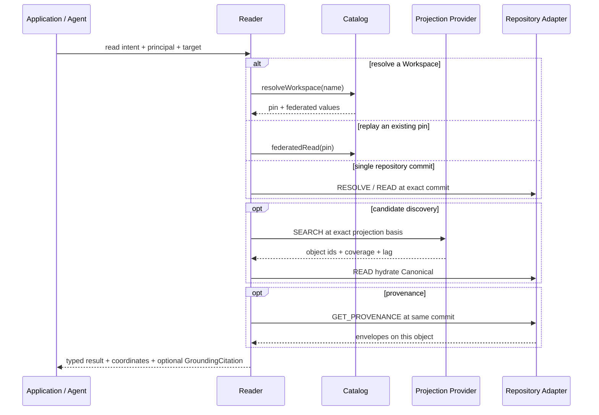

## 7.7 SEARCH：定位不是权威

检索文档的形状 ≠ 写入单元 ≠ 默认拼装。

```text
生产路径    Projection.build(repo, commit, selector) → 只定位 object_id
            → READ Canonical（可再用同一 selector hydrate）
调试路径    Repository.search = 整包 JSON 包含；不当生产检索
可选通道    VECTOR / HYBRID（Capability；当前 FileGit Profile 不支持）
```

`Projection` 记录 `basisRepository` + `basisCommit`，并报告是否落后于 head（lag）。命中集合不因 selector 改变而改写 Canonical。编哪些字段看 `schema/*` AccessHints。`permissions` 是 SOURCE 知识，GRANT 正文通常不声明 `text`（Unity GRANT、Ranger、DataHub Policy：特权不是表文档的检索面）。仓储约定：`Projection.Build(..., { exclude: ["permissions"] })`。消费方过滤候选时再 `READ` 该 Aspect。

协议层的 `SEARCH` 结果应是带来源的引用 + 轻量 Summary（CandidateSet），默认不 hydrate 全对象。去重键至少是 `RepositoryIdentity + ObjectIdentity + Address`；不同 Repo 同标题不得合并。

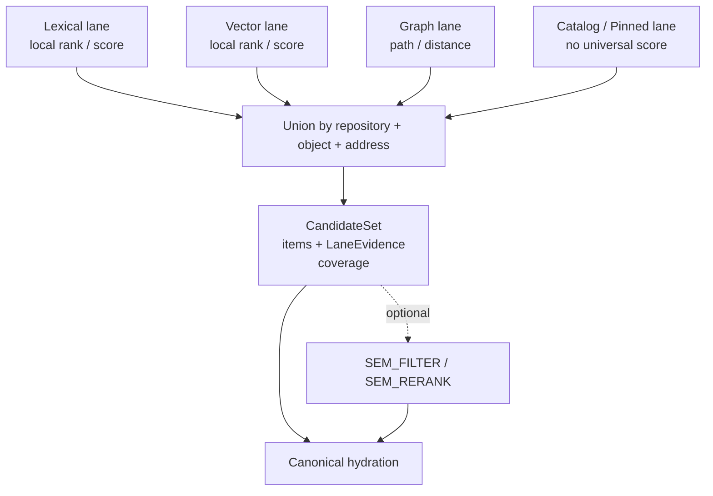

BM25、Cosine、Graph Distance 和人工 Pin 没有共同尺度。实现可以排序，但必须保留各 lane 的 local rank/score/provider/matched fields，不得伪造统一概率（ADR-018）。检索 lane 不是 Workspace pin 的旧称 Channel。当前 FTS 参考实现尚未物化完整 CandidateSet 对象；语义仍按上图冻结，T8 验证的是「定位 + Canonical 回读 + 可重建」；GRANT 正文通常无 `text` Hint。

索引声明在属性上：`access[]` + `type` 是检索面（`text` / `filter` / `key` / `sort` / `summary` / `stored`），不是谓词白名单。对照：BM25F 字段加权、ES mapping 的 `text`≠`keyword`、DataHub `@Searchable.fieldType`。查询侧原子算子（无 RQL）：`MATCH` / `EQ` / `IN` / `NEQ` / `EXISTS` / `GT|GTE|LT|LTE` / `SORT`；clause 隐式 AND，最多一条 SORT。`AllowsOp` 从声明推出：`text|summary`→MATCH；`filter|key`→EQ/IN/NEQ/EXISTS；再加 comparable type→比较；`sort`→SORT。错位是 `CAPABILITY_UNSATISFIED`，不得降级成 JSON 包含。OR / NOT / 括号留给以后的查询语言。

## 7.8 类型化结果

最小对象结果（当前代码）：

```text
Resolution        repository, commit, objectId, address, pathHint, digest?, schemaRef?,
                  status ∈ {RESOLVED, REMOVED, UNRESOLVED, FORBIDDEN}

KnowledgeValue    knowledgeRef, repository, commit, address, value, provenance?, units?

ObjectRevision    commit, status, digest?          # LOG
ObjectDiff        objectId, fromCommit, toCommit, from?, to?
ProvenanceTrace   repository, commit, objectId, chain[]   # 本对象信封
StreamSlice       repository, streamRef, cursor, records[]          # adapter 全量切片；不是用户口
StreamPage        repository, streamRef, face, completeness,
                  headCursor, nextCursor, hasMore, cut?, records[]  # QueryStream
StreamReadRequest streamRef, face?, cut?, fromCursor?, limit?,
                  eventId?, fromRecordedAt?, toRecordedAt?, clauses[]
FederatedValue    repository, commit, objectId, value
IndexDescriptor   basisRepository, basisCommit, objectCount, headCommit, lagBehindHead
SchemaReport      repository, commit, schemas[]   # DESCRIBE_SCHEMA
  SchemaDescription objectId, entity?, aspect?, pattern?, fields[{path, type?, access[]}], digest
IndexPlan         pinId, definitionRevision, projections[]   # 派生，不进登记表
  IndexProjection repository, commit, schemaDigest, schemas[], fields[], lanes[]
SearchRequest     clauses[]   # 原子算子，隐式 AND
  SearchClause    op ∈ {MATCH,EQ,IN,NEQ,EXISTS,GT,GTE,LT,LTE,SORT}, path?, value?, values[], order?
```

协议仍要求联合/检索结果在完整 Profile 上携带：

```text
workspace_pin / workspace_version
authorization_decision_ref
completeness { COMPLETE | PARTIAL } + reasons
coverage / projection_lag
truncated / continuation
missing_capabilities / degradation
```

当前单 Repo `READ` 把坐标放进 `KnowledgeValue` 本身；联邦读放进每条 `FederatedValue`。未实现的完整性字段不能 silently 填 `COMPLETE`。

**零结果分层（尤其 SEARCH）**

| 查询形态 | 「没有」可以声称什么 |
|---|---|
| 精确 Ref / Address / Path | 该版本上可确定不存在或不可见（`UNRESOLVED` / `REMOVED` / `FORBIDDEN`） |
| 结构化谓词 / LEXICAL / REGEX | 仅当通道 `complete` 且 basis 等于本次 Read Cut 时，可说「索引范围内未命中」 |
| SEMANTIC / HYBRID / Refine | 只能说「近似检索未发现」；不得当证明 |

FORBIDDEN 的外部呈现必须遵守防旁路策略，不能用与 UNRESOLVED 可区分的错误证明隐藏对象存在。

## 7.9 Optional Semantic Refinement

Refine 是可选 Capability，不是 Base 读操作。路径：

```text
SEARCH / EXPAND / Pinned Refs → CandidateSet → REFINE { FILTER | RERANK } → READ / GET_PROVENANCE
```

只标准化两个 Ref-preserving 算子：

| 算子 | 输出 | 判断 |
|---|---|---|
| `SEMANTIC_FILTER` | 输入 Ref 的子集 | `MATCH` / `NO_MATCH` / `UNKNOWN`；预算截断为 `UNJUDGED` |
| `SEMANTIC_RERANK` | RankGroup（允许并列） | 不输出伪概率；未判断进 `unjudged` |

`UNKNOWN`（已看、不可判定）与 `UNJUDGED`（没看完）必须分开。`SemanticOperatorSpec` 冻结 Criterion、EvaluationProjection、ContextRefs、OutputContract；模型名、Prompt、Batch、Cascade 属于 Provider。

| | Semantic Operator | Application / Agent |
|---|---|---|
| 输入候选 | 调用前固定 | 可继续 SEARCH |
| 可见字段 | EvaluationProjection 固定 | 可继续 READ |
| 输出 | 子集 / 排序 | 任务答案、计划、建议 |
| 新 Ref | 禁止 | 可通过 Access 发现 |
| 工具 / 副作用 | 禁止 | 副作用只经 Writer |

`EXTRACT_TYPED` 会产生新值，属于 Derivation，不进 Access。不支持时 `refine.supported: false`。参考实现：`reader/refine.go` + T10。

## 7.10 Projection 与 Provider

Projection 属于 Access 实现状态（ADR-015 / K-19）：

- 记录 Source commit / WorkspaceVersion；联合视图还记录逐 Repo Commit。
- 可从 Canonical 重建；删除索引不得改变知识事实。
- 不成为 `object_id` / KnowledgeRef 来源。
- 失败不得反写 Repository。
- 下次 `OpenWorkspace` 解到不同 commit 时显式报告 basis 变化与 lag。

Schema 只声明稳定 AccessHints（`key / filter / text / sort / summary / stored`）和 `type`，不绑定 HNSW/GIN/分析器/Embedding，也不在字段上枚举查询算子。算子由 `AllowsOp` 从检索面推出。`grep` 是合法 Provider，但必须把路径映射回 RepositoryIdentity + ObjectIdentity + Address，并声明无语义分词、同义词和跨 Repo 全局排名保证。参考实现：`kc checkout --workspace` 把这次 `ResolveWorkspace` 的拼装 `List` 落成 `layout.checkouts/<workspace>/`（路径 = 仓目录 / `object_id`，联邦不覆盖；`.kc-pin.json` 还原坐标）。不是 ③ FTS，也不是向量。不要把 `.kc/repos` 或 `kc serve` 的 tree 当 Workspace。

索引是 **Repo 之上** 的派生层（K-19）：一仓一份工作投影，键是 `repository`，basis 是该仓 commit，Hints 来自该仓 `schema/*`。不进 git 树，不进 Catalog 登记表，也不在 `Repository` 接口上。`schema/*` 是知识对象（META / Snapshot）。字段上的 `access` 就是 AccessHints。`DESCRIBE_SCHEMA` 在该仓这次解开的 commit 上读出它们。Workspace 级 **IndexPlan** 只列出各成员仓的配方（各一份），不是联邦大索引：

```text
ResolvedWorkspace {repo → commit}
  → 各成员 DESCRIBE_SCHEMA
  → 只编 AccessHints 声明过的 path（permissions 的 schema 默认不声明 text）
  → lanes = {key, filter, text, sort} ∩ 出现过的 hints
  → schemaDigest = H(planned fields)
```

IndexPlan 可重建、不进 Catalog 登记表、不写成员仓。工作投影在独立包 `index/`（`.kc/projections/*.sqlite`），经 Store Snapshot → `Catalog.Hook` 增量编译，不进 Writer / Catalog 核心，也不由 facade 补通知。两种变更必须分开：

```text
content  知识值变了、AccessHints 没变  → 只重抽变更 object_id（incremental）
schema   schema/* 的 access[] 变了     → schemaDigest 变，按新 Spec 全量重抽（rebuild）
```

`schema/*` 本身也是知识：只改 title/说明不算 schema。同一 commit 里两种都有 → 走 schema。PROPOSAL 不碰工作投影。Serving 钉这次 `ResolveWorkspace`。命中后回读 Canonical。无 AccessHints 时不得把对象整包 JSON 灌进 FTS；裸 MATCH 需要 text/summary 面，否则 `CAPABILITY_UNSATISFIED`。`schema/*` 是配方不是检索文档。对象 `schema_ref` 绑定向哪份 schema 抽字段。`DESCRIBE_INDEX` 返回工作投影在 basis 上编译出的 fields / lanes。

`schema/*` 文档最小形状（Entity blob 或带 `fields` 的 Aspect 值）：

```text
entity, aspect, pattern ∈ {record, keyed_collection, ordered_artifact, relation_set}
fields: { <path>: { type?, access: AccessHint[] } }
     或 [ { path|name, type?, access } ]
```

| 操作 | 当前 Portable / Embedded | 未来 Managed |
|---|---|---|
| RESOLVE / READ / LIST | frontmatter 扫描 + pinned tree read | Repository Service |
| DESCRIBE_SCHEMA | 读 `schema/*` / `schema_ref` → AccessHints | 同语义 |
| IndexPlan | Workspace 这次解析上派生成员投影配方 | 同语义 |
| SEARCH lexical | 工作投影 SQLite FTS5 + filter 列（增量）；T8 仍是进程内 contains | OpenSearch 等 |
| SEARCH vector | unsupported | vector provider |
| LOG / DIFF | Git 对象历史折叠 / 两点 READ | 等价版本查询 |
| GET_PROVENANCE | 各单元 frontmatter 信封 | 同语义，可物化列 |
| READ_STREAM | JSONL scan | WAL / event table |
| EXPAND / WATCH | 未实现 | 邻接表 / CDC |
| REFINE | 进程内规则 judge（T10） | model / reranker |

## 7.11 冻结、已实现、延后

**协议必须保持**

```text
精确版本读取（一次命令内不得跟随 latest）
RESOLVE / READ / LIST / LOG / DIFF / GET_PROVENANCE / DESCRIBE_SCHEMA
来源坐标留在结果上
Projection 非权威、可重建；IndexPlan 钉在这次 ResolvedWorkspace 上，命令内不跟随 latest
编索引用 AccessHints + 可选 AspectSelector
联合读 union、不覆盖、错误完整性
Refine 若存在则 Ref-preserving
能力缺失显式报告
```

**参考实现已覆盖**

Reader 单 Repo 路径、READ_STREAM、对象 LOG/DIFF、`DESCRIBE_SCHEMA`、reader.Serving（`read`/`list`/`search`/`log`/`provenance`/`resolve`/`describe-schema --workspace`）、Workspace `IndexPlan`、工作投影 `index/`（SQLite FTS5，经 Catalog.Hook 增量；这次解开的 commit 另开一份不回绕 live）、lexical 投影（T8）、Refine（T10）。CLI 消费口：`kc read --workspace`（不要 `--repo` / `--commit`）。`kc checkout --workspace` 是这次坐标的只读 grep 树。维护口仍 `--repo --commit|--ref`。

**语义已定义、实现延后**

`CAPABILITIES` 独立清单、完整 `DESCRIBE_INDEX`（这次 ResolvedWorkspace 上的 built 快照 vs 工作投影）、`LIST_TREE` 父子枚举、生产 CandidateSet 对象、RQL（OR/NOT/括号）、`EXPAND_RELATIONS`、`WATCH_UPDATES`、Vector/Hybrid、授权求值器、跨两次 OpenWorkspace 的 ViewDiff。缺这些时走显式 Capability，不改协议分支。原子 SEARCH 算子已在 `reader.SearchRequest`。


# 8. 维护闭环、部署与恢复（Maintenance）

源：白皮书 §26–§31；推演 §7–§15。

## 维护闭环
```text
发现陈旧/冲突/缺失（DIFF / READ / SEARCH；WATCH_UPDATES 是契约骨架，未作为独立操作暴露）
→ PROPOSAL（Candidate Branch/Commit）
→ CREATE_PREVIEW（在当前 Workspace 解析上 overlay 一个 Repo Commit → 完整 Preview，只写 ControlState）
→ VALIDATE（报告绑定完整 Preview，非只绑 Candidate）
→ Review/Approval/MergeGate（绑定精确候选 Commit；清单见 `docs/GATES.md`）
→ Repository MERGE（CAS 移动 main）
→ 下次 OPEN_WORKSPACE 解已发布 selector，读到新 HEAD
```
强不变量：测试必须绑完整 Preview；Candidate 前移或任何参与 Repo 变化都使旧 Validation 失效。`WATCH_UPDATES` 语义见第 7.4 节（投递端 `docs/HOOKS.md`）；`merge` 的必过清单见 `docs/GATES.md`。没有第二步 Catalog 发布对象。

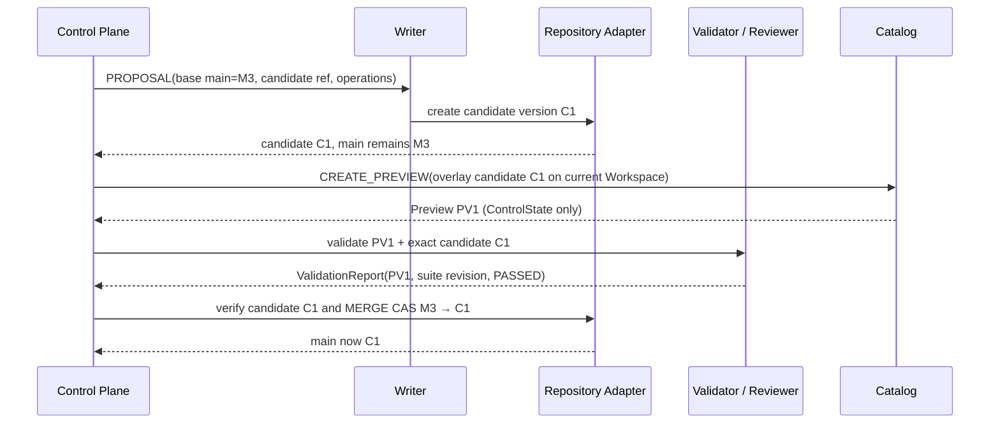

若 Candidate、目标 main、任一 Preview 成员或测试套件版本变化，必须生成新的 Preview/Validation Basis；旧 Approval 只保留审计价值。Merge 成功后，下次 `OpenWorkspace` 解已发布 selector，读到新 HEAD。

## 回滚分层（不可混用）
| 层 | 动作 | 修什么 |
|---|---|---|
| Projection | Rebuild | 索引/访问状态 |
| Catalog | `define-workspace` 改配方 | 组合哪些仓 / 跟哪根已发布分支 |
| Repository | REVERT / 再 COMMIT | 权威内容（保留历史） |

## 三个独立观察点
Repository Commit / Projection Ready / 下次 OpenWorkspace 是三个独立观察点；CommitReceipt 返回不代表 Search Projection 已同步。

## 其他端到端路径（与维护闭环并列）

维护闭环见上一节。下列路径共用同一 Writer/Reader/Catalog，不另开协议。

**权威写入（Collector / 受权编辑器）**

```text
外部状态 → connector.Preview 或 INGEST/RECONCILE 预览 ChangeSet（第 12 章）
→ Writer COMMIT（唯一 target Repo + PUT/REMOVE + expectedTargetCommit）
→ Git Commit + Ref CAS
→ 下次 OpenWorkspace 解已发布分支（不会因 COMMIT 另做 Catalog 指针）
→ Projection 按这次解开的 commit 重建
```

Collector 在 Writer 之前完成来源解析与地址编码；Writer 不判断内容是否「更权威」。

**用户编辑**

```text
READ(target, commit) → 本地改全量值 → COMMIT PUT + IF_OBJECT_EQUALS / IF_DIGEST_EQUALS
```

有目标 Repo 写权时用 COMMIT，不强制 PROPOSAL。无 public 写权则在自己的 Repo 写 Assertion/Fork，或向 public 提 PROPOSAL。联合 Workspace 不可写。

**Observation / 反馈**

```text
APPEND durable record → 立即 AppendReceipt
→ 可选异步抽取 / Derived / 目标 Repo PROPOSAL
```

原始记录的 Durable ACK 不等待模型、Projection 或正式知识变化。修正用新 Entry（correction/retraction），不 UPDATE 旧记录。

**发现 → 精炼 → 精确读**

```text
ReadContext(Workspace)
→ SEARCH lexical（Projection 定位）
→ 可选 SEM_FILTER / SEM_RERANK（输入候选固定）
→ READ / GET_PROVENANCE hydrate Canonical
→ Application 组装上下文并保留 GroundingCitation
```

**Read-your-write**

COMMIT 返回 commit 后，调用方可：

```text
READ(..., commit=returned)     单 Repo 强一致
federatedRead / 新 OpenWorkspace      跨 Repo 读这次解开的 commit
SEARCH(CANONICAL)               绕过或等待 Projection
SEARCH(PROJECTION_OK)           允许旧索引，但必须看见 lag/coverage
```

## 失败恢复（示例）
PRECONDITION_FAILED → READ/DIFF 后重建；NON_FAST_FORWARD → LOG/DIFF + rebase/新 Candidate；CANDIDATE_MOVED → 解析新 Preview 重测；VALIDATION_BASIS_MISMATCH → 对当前完整 Preview 重测；任何 Ref CAS 失败不得报告成功。

## 参考实现与生产部署边界

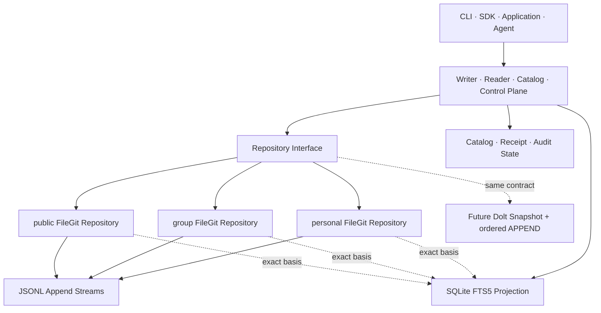

| 状态 | 当前参考实现 | 生产 Adapter 必须保证 |
|---|---|---|
| Snapshot / Ref | 参数化 Git、干净工作树、祖先+CAS、pinned tree read | 进程间并发隔离、原子工作区、fsync/备份与保留策略 |
| Append | JSONL、canonical digest、Event ID、expected cursor | 进程间锁、原子 append、durable cursor、correction/retraction 与恢复 |
| Receipt / Idempotency | 参考实现验证单进程重放语义 | 与写入同一 Durable Boundary，或事务 Outbox；重启后仍可重放 |
| Catalog Workspace / Registry | 独立 FileGit 登记表、目标有效性 | durable Workspace Store、审计与恢复 |
| Projection | SQLite FTS5，记录 basis/lag | 可重建、版本切换、coverage、授权裁剪和资源限制 |
| Adapter 迁移 | 统一接口 + T12 共享 Contract Test Kit | Identity/Version 映射、双读校验、切换/回退和跨 Adapter Conformance |

T1–T12 的用例证明当前实现满足被覆盖的协议不变量，不等价于生产持久性、并发、授权、性能或灾难恢复认证。演进顺序是：语义 Conformance → 单进程参考实现 → 故障注入与并发测试 → Durable Metadata/Append → 授权集成 → 备份恢复演练 → 按负载增加新 Adapter。

## 结束到结束恢复
备份必须同时验证：Repository Object/Commit/Ref + Catalog Definition + Append Cursor + Derived Head + Artifact Digest + Receipt/Audit；仅恢复 Git 目录不能重建完整 WorkspaceVersion。


# 9. 架构决策与不变量

源：白皮书 §32（ADR-001..020）、§2.2（K-01..K-23）；本文补充统一 Adapter 决策 ADR-021、FileGit 防护 ADR-022 与 Repository 生命周期 K-24。

## ADR 要点（22 条）

- ADR-001 Catalog/Repository 是两个公开领域边界
- ADR-002 Writer 使用三 Surface，单 Binding 只对应一个 Surface（历史名 Ingress）
- ADR-003 Snapshot 使用不可变 Version/Ref/CAS 语义；FileGit 直接复用 Git
- ADR-004 Snapshot 只 PUT/REMOVE，无通用 PATCH
- ADR-005 保留四类 Canonical Collection
- ADR-006 四 Pattern 只描述结构和最小维护单位
- ADR-007 Entity/Aspect 是维护内核
- ADR-008 KnowledgeRef 不用 Path 作身份
- ADR-009 WorkspaceDefinition 与 WorkspacePin 分离
- ADR-010 联合 Workspace 是来源保留的 Union，不是覆盖栈
- ADR-011 联合 Workspace 不可写
- ADR-012 Proposal = Candidate Version + 非权威 Metadata
- ADR-013 Candidate 测试绑定完整 Preview
- ADR-014 Access 使用十二个固定任务语义；当前 I/O 按 D26/D29 命名与收窄，见第 7 章
- ADR-015 Projection 归属 Access
- ADR-016 Graph Core 只保证一跳
- ADR-017 Semantic Refinement 可选且 Ref-preserving
- ADR-018 多 lane 候选保留 LaneEvidence（历史名 ChannelEvidence；与 Workspace pin 无关）
- ADR-019 WorkspacePin 与 WorkspaceVersion 分离
- ADR-020 MVP 以 FileGit + Embedded Projection 验证完整单/多 source 协议
- ADR-021 协议层按 Snapshot / Stream / Knowledge 分口；FileGit 可合一。Store Adapter 可替换且复用同一 Conformance
- ADR-022 FileGit 使用参数化 Git、祖先+CAS 双校验、安全路径、唯一身份、干净工作树与本地 Stream 隔离

## 核心不变量（K-01..K-24）

| # | 不变量 |
|---|---|
| K-01 | 每个 Writer 命令必须指定唯一 target：COMMIT/PROPOSAL → Snapshot，APPEND → Stream；Workspace 不可写 |
| K-02 | 每个 Repository 具有独立身份、ACL、Version 图、Ref 和生命周期。仓内 tag 是 Ref 族，不是 Catalog Workspace |
| K-03 | public/group/personal 是治理 Scope，不是目录优先级 |
| K-04 | KnowledgeRef 不依赖路径；PinnedKnowledgeRef 固定 Version；FileRef 还固定 Path/Digest |
| K-05 | Version 内的 Canonical Object Revision、Snapshot Version、已接受的 Ref 和已接受 Stream Record 不可变；逻辑 Knowledge Object 通过新 Version 演化 |
| K-06 | RefUpdate 必须带 expected-old；Change 必须带 expected Object/Version 前置条件，禁止静默 LWW |
| K-07 | Proposal 指向 Candidate Ref/Version；Proposal Durable 不表示 main 已改变 |
| K-08 | Review、Validation、Approval 与 MergeGate 必须绑定精确 Candidate Version（用户面 `gate-add --on merge`，见 `GATES.md`） |
| K-09 | ValidationReport 必须绑定完整 Preview，而非只绑定 Candidate Version |
| K-10 | ResolvedWorkspace 是 RepositoryIdentity→CommitIdentity 的 Map；同一 Repo 只能出现一次；一次命令内不可变 |
| K-11 | 已发布 Branch 只可出现在 WorkspaceDefinition；一次命令内 ResolveWorkspace 冻结坐标，不得中途跟随 latest。跨命令跟 selector |
| K-12 | 联合结果必须保留 source Repository/Version/Object/Scope/Provenance |
| K-13 | 同一主题的多来源 Assertion 并存；不得按 Scope 静默覆盖 |
| K-14 | 普通知识引用升级不修改引用方 Repo，也不产生跨 Repo merge |
| K-15 | Fork 创建新 KnowledgeRef；只有 Fork sync 使用 Base/Upstream/Local 三方比较 |
| K-16 | Vendor 保留来源精确 pin 与只读副本；本地编辑必须转为 Fork |
| K-17 | APPEND Entry 不原地修订；Correction/Retraction 通过新 Entry 表达 |
| K-18 | 相同幂等键与相同 Command Digest 返回原 Receipt；不同 Digest 冲突 |
| K-19 | Projection 不属于 Canonical Repository，必须声明 basis、coverage 和 lag |
| K-20 | ResolvedWorkspace 锁本次读的数据不锁权限；授权审计另存 AuthorizationDecisionRef |
| K-21 | 内容写入必须经 Writer；Merge 等治理动作必须经受保护的 Repository/Catalog Control API；任何调用方不得直写 Backend/Ref |
| K-22 | 不构造跨 Repository 的虚假单一事务 |
| K-23 | Adapter 迁移不得改变 RepositoryIdentity、KnowledgeRef、版本和读写协议语义 |
| K-24 | 不存在 DELETE_REPOSITORY；领域生命周期终点是 ARCHIVE，物理删除由保留/合规流程处理 |

## 被明确拒绝的设计
Writer=ETL+LLM；Catalog=Git Repo/PostgreSQL；write(payload) 无 Surface；全 JSON；统一复杂 status；Projection 作权威；通用 PATCH DSL；完整图查询语言；LLM_QUERY(whole_repo)；审批只绑 Branch 名；Knowledge OverlayPatch；一次命令中途跟随 latest。


# 10. 单一协议与 Store 映射明细

目标：确认 Catalog 语义只有一套，并识别哪些语义必须由协议新增定义、哪些可以映射到成熟 store。store 的选择由数据规模、查询形态和部署约束决定，不由“单人/多人”决定。

## 10.1 审查原则

1. **可信强制**：AI 只能引用「身份稳定、版本已知、来源保留、写者明确」的知识。
2. **Store 独立**：① 依赖 Snapshot 坐标；APPEND 依赖 Stream；② 解释 Snapshot 上的文件。FileGit/Dolt 与有序段是 ⓪ 的目标实现（`local/` / `scale/`）。迁移不得改变身份、版本和读写语义（K-23）。

## 10.2 Catalog 语义唯一

Identity、Write Surface、Repository、Access、WorkspaceDefinition→ResolvedWorkspace、维护闭环、联邦读取均属于同一协议。单 source Workspace 只是 `repo→commit` Map 只有一个成员的自然退化；source 增加时，同一语义完整展开，不切换另一套模式。

## 10.3 Repository 边界的三类新增义务

1. **身份寻址**：ObjectIdentity 与路径解耦，KnowledgeRef 稳定。
2. **来源信封**：Provenance / GET_PROVENANCE，超出 commit author/message；不爬引用、不是 git log。
3. **写边界**：COMMIT/PROPOSAL 打 Snapshot；APPEND 打 Stream；ChangeSet 的 PUT/REMOVE（含 Aspect）是 ②。

## 10.4 Store 原生映射

| 协议语义 | Git adapter | 其他 adapter 示例 |
|---|---|---|
| Snapshot COMMIT | git commit + update-ref CAS | Dolt commit（不是 PG/MySQL） |
| PROPOSAL | candidate branch + commit | Dolt branch / candidate revision |
| LOG/DIFF/READ | git log/diff/show | 版本查询 |
| RESOLVE | frontmatter scan / object index | 主键或索引查询 |
| APPEND 权威 | gitignored JSONL side stream | 有序段 / WAL；冷段可对象存储，不是 Iceberg |
| APPEND 分析投影 | 无，或 SQLite 只抽事件 Hints | StarRocks / Iceberg 列投影（AccessHints；不是冷权威） |
| SEARCH 全文 | grep / SQLite FTS5 Projection | Elasticsearch MATCH（不是 SR） |
| SEARCH 列过滤/聚合 | SQLite `fields` | StarRocks（不是 PG/MySQL/Redis） |

## 10.5 Catalog 操作是协议本体

REGISTER / DEFINE_WORKSPACE / OPEN_WORKSPACE / CREATE_PREVIEW / VALIDATE / MERGE 等操作始终属于 Catalog / ControlPlane 协议。它们不是“多人模式”才出现的另一层；当 source 数量为一时，结果自然简化，但语义不变。

## 10.6 口：SnapshotStore / Stream / Knowledge

```text
SnapshotStore  head / getRef / hasCommit / createRef / merge / applyCommit / archive
Stream         append(expectedCursor) / streamCursor / readStream
Knowledge      resolve / read / resolveAddress / readAddress / getProvenance / log / diff / list
               （②：解释 SnapshotStore 在某 commit 上的文件；Catalog ResolveWorkspace 不经过这里）
```

Catalog 成员是 SnapshotStore。Writer COMMIT/PROPOSAL → SnapshotStore；APPEND → Stream。维护方知识读 → Reader → Knowledge。消费方 → `ResolveWorkspace` + `reader.Open`（在这次 commit 上调 Knowledge；流用 AppendCuts）。from→to 事件类型仍是 `Snapshot`。

当前 `local.FileGit` 实现 Snapshot+Knowledge；APPEND 是 `JSONLStream`，经 `Store.AddStream` 按仓 id 绑定。远程：`gitea.Repository`（同一 Snapshot 口，无工作区）。规模化：`scale.DoltRepository`（同一 Snapshot 口）、`scale.OpenStream`（Stream stub）。不要 `repo-add --driver stream`。T12：`RepositoryContract` 跑 FileGit、Dolt 与 Gitea；`StreamContract` 跑 JSONL。

## 10.7 当前 Git Store

```text
Snapshot   真实文件 + git object/tree/commit/ref/update-ref CAS
Append     streams/<ref>.jsonl（gitignored，非 Git 演化语义）
Projection SQLite FTS5 + fields（可重建、非权威、basis/lag；规模化全文 ES、列索引 SR）
```

Memory 模拟已删除：git 是版本内核本身，不再维护一套重复的“内存 Git 语义”。

## 10.8 验收标准

- 所有协议层代码不 import 具体 store。
- T1–T12 通过；Snapshot 相关用例运行在 FileGit、Dolt 与 Gitea 上；APPEND 运行在 JSONLStream 上。
- 新 Store：Snapshot 实现 Snapshot 口并复用 T12；Stream 实现 Stream 口。不要把有序段伪装成可 pin 的 git 成员。


# 11. 最小核心契约（RESOLVE 与 GET_PROVENANCE）

本章冻结读侧两个不能由 Store 提交元数据替代的核心契约：RESOLVE 负责稳定身份寻址，GET_PROVENANCE 负责显式来源信封。对象演化时间线是 LOG/DIFF（第 7.5 节），不并进本契约。写侧第三类新增义务由 Binding、Writer Surface、Receipt 与 APPEND 契约保证。

## A. RESOLVE（身份寻址）最小契约

### A.1 契约签名
```text
RESOLVE(refs[1..N], commit_id) → ResolutionSet

KnowledgeRef       = (repository_id, object_id)
PinnedKnowledgeRef = (repository_id, commit_id, object_id)
FileRef            = (repository_id, commit_id, path, digest?)

Resolution:
  repository_id, commit_id, object_id
  address: {kind: Entity|Aspect|Member|Relation|Record, object_id, aspect_name?, member_key?}
  path_hint
  digest
  schema_ref
  status: RESOLVED | REMOVED | UNRESOLVED | FORBIDDEN
```
- 普通 KnowledgeRef 在给定 commit 解析；Pinned 只验证目标仍可访问，不重新跟随上游。
- 对象在 commit 中不存在/已删除 → status=REMOVED；引用歧义 → UNRESOLVED；无权 → FORBIDDEN（外部呈现防旁路泄漏）。`FORBIDDEN` 在类型里已有；FileGit 无 ACL，不会返回。

### A.2 身份载体决策（化解「硬骨头 1」）
- **ObjectIdentity 的权威载体 = 文件内容里的稳定字段**（frontmatter `object_id` / `ref`），不是路径，也不是独立映射文件。
- `path_hint` 只是展示/便利位置，可移动。
- **address-map（object_id → path）是「可重建 Projection」**，非 Canonical，不进入 git 树，无需独立 CAS；由「扫描每个文件的 object_id 字段」生成，可丢弃重建。

这一决策直接化解第一性原理审查里的「硬骨头 1」（身份 vs 路径一致性）：
> 不存在需要额外一致性契约的「第四类状态」。身份内嵌于 git 树，随同一次 commit 与内容**原子演化**；address-map 降级为可重建 projection，权威永远在 git 树。

相比白皮书 §15.1 的 `.krepo/address-map.json`（独立映射、一致性契约未定义），本决策是对其的最小化修正。

### A.3 唯一性与移动
- repo 内 **Address** 唯一：`(object_id, aspect_name?, member_key?)`。重复 Address → `OBJECT_ID_CONFLICT`。
- 同一 `object_id` 可以对应多个文件（多个 Aspect / Member）。这是 DataHub「一 URN 多 Aspect」在 FileGit 上的落点；旧规则「`object_id` 全局唯一」会与「一个文件一个维护单元」矛盾。
- 移动文件 = 改 path_hint，Address 不变；KnowledgeRef（仍按 object_id）不失效（K-04）。
- 约束：一个文件承载一个维护单元。frontmatter 带 `object_id`，Aspect/Member 另带 `aspect_name` / `member_key`。
- 同一 `object_id` 上禁止混用「无 aspect 的 Entity blob」和 Aspect 文件。

### A.4 Git adapter 落地
```text
index = scan(git tree, extract Address from frontmatter) → {address → path}   # 可重建
RESOLVE(object_id) = 收集该 id 的全部单元 → 拼值 → digest(拼值)
RESOLVE(address)  = 查单单元 → 该单元 digest
PUT Aspect        = 只写/替换该文件；其它 Aspect 不动
```
Git adapter 无需独立 address-map；扫描 frontmatter 即可重建。其他 store 可物化同一 Projection，但 Projection 始终非权威。

## B. GET_PROVENANCE（来源信封）最小契约

### B.1 契约签名
```text
GET_PROVENANCE(object_id, commit_id) → ProvenanceTrace

ProvenanceTrace:
  repository, commit, objectId
  chain: ProvenanceEnvelope[]    # 该对象各单元在此 commit 上贴的信封
```

`chain` **不是**走出来的证据图，也不是 git log。信封里的 `source_refs` / `evidence_refs` 是声明，Reader 不自动解析。Application 若要沿引用再读，必须另发 `RESOLVE` / `READ` / `GET_PROVENANCE`，并受当时授权约束。不做完整 PROV 推理。

与白皮书 `ORIGIN` 的关系：v5.0 把「坐标 + 活动 + 沿证据回链」合成一条操作。当前协议把坐标留给结果对象，把活动/来源留给信封，把时间线留给 LOG；这是收窄，不是改名。

### B.2 最小 Provenance Envelope（字段冻结）
```yaml
provenance:
  origin_kind: SOURCE | OBSERVATION | EVIDENCE | ASSERTION | DEFINITION | DERIVATION | ...
  actor_ref:             # 谁
  activity_ref:          # 什么活动
  source_refs: []        # 来源声明（不自动 crawl）
  evidence_refs: []      # 支撑证据声明（不自动 crawl）
  input_workspace_version_ref:  # 仅 DERIVATION
  algorithm:             # 仅 DERIVATION
    derivation_spec_ref
    model_ref
    code_hash
  produced_at
```

### B.3 Git adapter 落地
- **身份/版本**：git commit 的 author/message/hash —— git 原生，走 LOG/DIFF，不塞进 GET_PROVENANCE。
- **显式来源**：各单元 frontmatter 的 `provenance` 块。
- **DERIVATION 强制**：必须显式 `input_workspace_version_ref` + `algorithm`；缺失时 Repository 拒绝写入。
- GET_PROVENANCE = 收集该对象各单元信封。无信封则 `chain=[]`，不伪造 git author，不 walk refs。

### B.4 按知识族的最小义务
| 知识族 | 最小义务 |
|---|---|
| 定义/断言 | actor + repository + commit + evidence or rationale |
| 观察 | source + observed_at + record identity |
| 派生 | input version + derivation spec + activity |
| Artifact | content hash + media type + capture source |
| 关系 | source or derivation basis（若非纯结构引用） |

## C. 与既有决策的关系

- RESOLVE / GET_PROVENANCE 是 Reader 基线中需要协议显式定义的两个操作；LOG/DIFF 由 Store 版本语义映射。整个系统还必须显式定义写入治理与 Workspace 组合。
- RESOLVE 的身份载体决策补全 ADR-008：不仅统一引用语法，也统一 Git Adapter 中身份的 Canonical 载体。
- Provenance 与授权决策都使用 actor/activity/evidence 形态，但信封不能被 AuthorizationDecision 替代，也不能替代 LOG。
- 其他 Adapter 可以改变索引与物理载体，不能改变状态、唯一性和信封结果。

## D. 契约 Conformance

1. Git Adapter 下，只熟悉 Git、文件与文本检索的 Agent 能完成：`RESOLVE → READ → GET_PROVENANCE → edit → COMMIT`；需要时间线时另用 `LOG` / `DIFF`。
2. 移动文件后 RESOLVE 仍命中同一 object_id；重复 Address 被拒绝；同一 object_id 的不同 Aspect 合法。
3. 从未存在返回 UNRESOLVED；历史存在但目标版本已删除返回 REMOVED；无权访问按防旁路策略返回 FORBIDDEN 或等价外部错误。
4. DERIVATION 缺少固定输入或算法活动时写入被拒绝；GET_PROVENANCE 不伪造缺失信封，也不把 git log 填进 `chain`。
5. 新 Adapter 对相同 Canonical Fixture 返回等价的 Resolution/ProvenanceTrace。


# 12. 低摩擦采集与 Grounding

可信语义只有进入端到端路径才有价值：采集必须足够低摩擦，读取结果中的版本与来源也必须完整传到最终界面。本章用 Writer 之上的薄编排和 Reader 结果投影补齐两端，不增加新的 Write Surface。

## A. 低摩擦采集（Ingestion）

Git Adapter 下最自然的摄入单位是文件/目录；数据库或远端来源可以使用 Connector，但输出仍是同一种带身份、digest、provenance 与前置条件的 ChangeSet Preview。采集方式可以变化，Writer 契约不变。

### A.1 两个薄工具（都在 COMMIT 之上，不是新 Surface）

```text
INGEST(dir, scope, schema_map) → 预览 + ChangeSet（确认后 COMMIT）
  扫描目录 → 识别维护单元（一个文件 = 一个 Address；无 aspect 时即 Entity blob）
  → 生成 object_id（稳定）、path_hint、schema_ref
  → provenance: {origin_kind: SOURCE, source_refs: [...], produced_at}
  → 产出 ChangeSet，预览后由调用方 COMMIT

RECONCILE(external_snapshot, scope, base_commit) → ChangeSet 预览
  外部快照 = 权威当前状态（结构化，如数据库全部表）
  → set-diff（新增→PUT+IF_ABSENT；更新→PUT+IF_OBJECT_EQUALS；删除→REMOVE）
  → 只产出 ChangeSet，不自动提交（确认后 COMMIT）
```

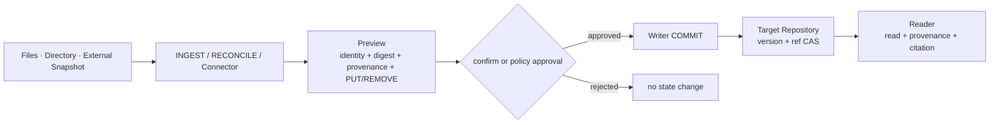

### A.2 关键约束
- INGEST / RECONCILE **都产出 COMMIT ChangeSet，不绕过 Writer**（K-21）；它们属于 Application/Control Plane 在 Writer 之上的编排，不是第四种 Surface。
- 二者**不判断内容正确性**（Writer 语义薄）；只做「外部状态 → 目标地址 → PUT/REMOVE」的机械翻译。
- provenance 必须标注 source_refs（来源声明），否则 GET_PROVENANCE 的信封不完整。
- RECONCILE 的 diff 判定按「身份 + digest」：`writer.Reconcile` 按 object_id（T7）；`connector.Preview` 按 Address，REMOVE 宇宙是这次传入的 Observed∩Scope（见 `CONNECTORS.md`）。

### A.3 解决的问题
- 来源 Connector 与 Scope Snapshot Reconciliation 复用同一协议：本地目录用 INGEST/RECONCILE，远端或大规模来源由 adapter/connector 提供同样的 ChangeSet。
- 之前观察到的「缺少批量对账面」→ 用 RECONCILE 解决，但**不新增 Surface**，只是规范化「采集器如何构造 COMMIT」。

### A.4 Connector kit（入站）

远端源的权威在外部。Connector 是独立进程（可墙外维护）：感知变更 → 拉源当前态 → 译成 Address 全量值 → `connector.Preview`（`patch` / `reconcile`）→ Writer COMMIT（`origin_kind=SOURCE`）。规范见 `CONNECTORS.md`。不新增 Surface；无插件宿主；源客户端不进协议仓。`writer.Reconcile` 仍是 object_id 实体对账。

## B. Grounding 消费路径

消费端必须继续回答“用了哪个对象、哪个版本、哪个片段、来自哪里”。如果 Application 只把脱离版本的文本交给模型，Reader 已保留的可信信息会在最后一跳丢失。

### B.1 GroundingCitation（最小字段冻结）

```yaml
GroundingCitation:
  knowledge_ref        # 稳定身份
  pinned_ref           # 版本 + 对象（PinnedKnowledgeRef）
  digest
  fragment             # 可选；段落、代码行或其他稳定片段定位
  provenance_summary:
    actor_ref
    source_refs
    origin_kind
```

### B.2 消费端不变量

> AI 的每个事实性断言，要么携带基于同一 ReadVersion 的 PinnedKnowledgeRef、片段与来源，要么被显式标记为未引用的模型推断；两者不能混淆。

- 模型推断不是协议错误，但 UI 必须让它与有依据的陈述明确可区分。
- `fragment` 必须由 Pinned 对象和 digest 约束，不能只保存会随内容漂移的行号。
- Citation 展示仍受当前读取权限约束；不得借 provenance 摘要泄漏已撤销权限的来源。
- 模型不能把推断伪装成 Repository 已接受知识；推断进入 Canonical State 必须另走 COMMIT 或 PROPOSAL。

### B.3 三层消费路径

| 层 | 职责 | 必须保留 |
|---|---|---|
| Access | 返回精确值、版本、完整性与来源 | repository / version / object / provenance / authorization decision |
| Application | 组装上下文并维护“片段 → Citation”映射 | pinned_ref / digest / fragment / provenance summary |
| UI / API Consumer | 展示依据、版本和来源，区分引用与推断 | 可复核 Citation 或显式 inference marker |

### B.4 与核心契约的关系

- GroundingCitation 复用 GET_PROVENANCE 的 Provenance Envelope，是面向消费端的受控摘要。
- PinnedKnowledgeRef 是 Citation 的版本锚；普通 KnowledgeRef 只用于在新 ReadVersion 下解析当前对象。
- 不新增 Reader 操作；它是 READ / SEARCH / GET_PROVENANCE 结果的约定投影。

## C. 最小闭环验收（采集 → 消费）
1. 用户把目录/文件 INGEST 进来（标注 source_refs）→ 生成 Commit。
2. AI SEARCH/READ 命中 → 返回 PinnedKnowledgeRef + fragment + provenance。
3. UI 显示「该结论依据 X（版本 Y，来源 Z）」，点击可复核原文。
4. 模型没有依据的推断，被显式标为「推断」，不与引用混淆。

这条闭环是「真实用户可用」的一序命脉：它决定**底座是否被填满**（A）与**可信是否传到眼前**（B）。


# 附录 A. 历史缺口关闭台账

本附录只记录两份历史输入与当前 Baseline 之间的决策轨迹。正文与 K/ADR 是规范来源；旧文档中的冲突表述不再构成并行契约。

## A.1 已关闭的跨文档差异

| ID | 历史差异 | 当前决议 | 规范落位 |
|---|---|---|---|
| C1 | 推演 v4.0 与白皮书 v5.0 容易被理解成同一版本线 | 两份文档独立版本；明确“推演 v4.0 对应白皮书 v5.0” | 文档首页与附录 B |
| C2 | 白皮书 K-01..K-23 与推演 12 条不变量没有映射 | K 编号是唯一规范编号；推演条目只作场景映射；新增 K-24 | 第 9 章与附录 B |
| C3 | `urn:knowledge:` 与 `kc://` 混用 | 跨 Repo 统一 `kr://` / `kc://` / `file://`；裸 URN 只在 Repo 上下文内作别名 | 第 3、11 章与附录 B |
| C4 | Projection 同时指字段裁剪和可重建索引 | Access Projection 专指带 basis/coverage 的可重建访问状态；读侧 aspect 裁剪写作 `AspectSelector`；Refine 可见字段写作 Evaluation Projection | 第 2、5、7 章 |

## A.2 设计缺口关闭索引

| ID | 最终决议 | 状态 | 规范落位 |
|---|---|---|---|
| G1 授权 | 治理边界 = Repository；动作 = `kc` 动词；部署用 `kc allow` 配规则。写侧规则即原 WriteBinding | `kc allow` / `--as` 已求值 `.kc/allow.json` | `docs/PERMISSIONS.md`、附录 D |
| G2 Preview 哈希 | `previewId = H(workspaceId ‖ overlay ‖ sorted(repo→version))`，不落登记表 | 已并入 Baseline | 第 6 章、附录 C |
| G3 保留与 GC | Workspace 配方默认保留直至退役；Artifact 7d grace；Candidate 30d 可归档；Stream 按 Policy | 默认值已定，可覆盖 | 附录 C |
| G4 Erasure | 不把合规擦除伪装成 Snapshot REMOVE；使用独立 ErasureRequest | 仅契约骨架，实现前需独立 ADR | 附录 D |
| G5 Derived invalidate | Head CAS 与 Revision invalidation 分离；历史 Revision 仍可审计 | 契约已定，可选 Capability | 附录 D |
| G6 Repository 删除 | 无 DELETE_REPOSITORY；领域生命周期终点是 ARCHIVE | 已加入 K-24 | 第 9 章、附录 C |
| G7 Schema 自举 | schema_ref 必须 pin 到已提交 Revision，并由 Binding 白名单冻结 | 已并入 Baseline | 附录 C |
| G8 悬挂引用 | Repository 报告受控 unresolved；检测与修复 Proposal 属于 Control Plane | 责任边界已定 | 附录 D |
| G9 Producer Ordering | `(partition, position)` 单调；回退报 POSITION_REGRESSION；NONE 显式无保证 | 契约已定，可协商 | 附录 C |

## A.3 实现闭环台账

| ID | 推演或测试暴露的裂缝 | 关闭方式 | 证据 |
|---|---|---|---|
| I1 | 协议层曾耦合 Memory Store | 统一 Repository 接口，删除 Memory 模拟，增加共享 Adapter Contract Kit | ADR-021、T12 |
| I2 | FileGit 曾缺 Candidate Ref 与 Merge | 实现真实 Git Branch、祖先检查与 update-ref CAS | T9、D23 |
| I3 | FileGit 曾缺 Append 顺序约束 | 隔离 JSONL、canonical digest、Event ID 幂等与 expected cursor | T5、D23 |
| I4 | Git 命令、路径、身份和版本读取边界不够硬 | 参数化调用、安全路径、重复 ID 拒绝、干净工作树、pinned tree read | T6、ADR-022 |
| I5 | Preview 只含 Candidate Repo | 从当前 Workspace 解析 overlay 成员并保留其余成员；只写 ControlState | T9、D24 |
| I6 | 消费读落盘 Workspace pin | 不落登记表；`ResolveWorkspace` 命令内解 selector | T11 |
| I7 | 联邦读吞掉完整性与 Backend 故障 | 只忽略对象缺失，其他错误传播 | T11、D24 |

“契约骨架”表示责任和字段已经冻结，但当前参考实现不声称具备完整策略、合规或生产持久性。能力必须显式声明，不能静默降级；生产化剩余保证见第 8 章部署边界表。


# 附录 B. 跨文档规范化决策（原 P0）

本附录保留历史输入的规范化记录，便于解释旧示例；当前规则已并入正文，旧文档不再回写。

## P0-1（C1）版本标签对齐
- 决议：推演版号与白皮书版号相互独立，二者不联动。
- 推演前言改为：
  > **推演 v4.0 · 对应白皮书 v5.0（两条独立版本线）**
- 规则：白皮书 x.y 每次语义修订 +0.1；推演仅在案例/表述变化时 +0.1。读者不应把「推演 v4.0」读成「比白皮书 v5.0 旧」。

## P0-2（C2）不变量映射表
把推演 §0 的 12 条不变量映射到白皮书 K 编号，并列出推演未覆盖的 K。

| 推演 # | 措辞 | 映射 K | 备注 |
|---|---|---|---|
| 1 | 三 Repo 独立 ACL/Commit 图/Branch/Tag/生命周期 | K-02 | K-01 的 target 约束见 #6 |
| 2 | KnowledgeRef 不含 Path | K-04 | — |
| 3 | Pinned +Commit；FileRef +Path/digest | K-04 | — |
| 4 | WorkspaceDefinition 可写 Branch/Tag；读前解析 VG | K-10, K-11 | K-09 见 #8 |
| 5 | 联合保留来源，不按 Scope 覆盖 | K-12, K-13 | — |
| 6 | Workspace 不可写；一次 ChangeSet 一个 target Repo | K-01, K-22 | — |
| 7 | 本地分歧是 Assertion 非 Overlay | K-13 | — |
| 8 | ValidationReport 绑完整 Preview | K-09 | — |
| 9 | 普通升级下次 ResolveWorkspace 重解析；Fork/Vendor 才有上游更新 | K-14, K-15, K-16 | — |
| 10 | ResolvedWorkspace 锁数据不冻结 ACL | K-20 | — |
| 11 | Snapshot 复用 Git；Append/Derived/Artifact 非 Git | K-05, K-17 | — |
| 12 | Commit / Projection Ready / 下次 OpenWorkspace 三观察点 | K-19 | 呼应白皮书 §26.7 |

历史推演未显式覆盖以下 K；当前设计直接以第 9 章 K 编号为准：
K-03（scope 非目录优先级）、K-06（expected-old/expected 前置条件）、K-07（Proposal 不改 main）、K-08（审批绑精确 Commit）、K-18（幂等键冲突）、K-21（不绕 Ingress）、K-23（Profile 迁移不变）。

决议：本 Baseline 只维护一套 K 编号；历史推演条目通过上表映射，不形成第二套规范。

## P0-3（C3）身份语法统一
规范语法：
```text
RepositoryIdentity  kr://<org>/<scope>/<name>
KnowledgeRef        kc://<repo-short>/<object-id>
PinnedKnowledgeRef  kc://<repo-short>@<commit>/<object-id>
FileRef             file://<repo-short>@<commit>/<path>#<digest>
```
urn 映射规则：
- `urn:knowledge:<object-id>` 等价于 `kc://<repo>/<object-id>`，仅在 RepositoryIdentity 由上下文确定时允许。
- 跨 Repo API 禁止裸 `urn:`（必须补齐 RepositoryIdentity，ADR-008）。
- 全库示例统一为 `kc://` 形式；`urn:` 只作「Repo 内紧凑 ObjectIdentity」别名。


# 附录 C. MVP 契约冻结决策（原 P1）

以下决议已进入 MVP 契约；部署可以覆盖明确标注的默认值，但不能改变其语义。

## P1-1（G2）ResolvedWorkspace / Preview 内容哈希
冻结公式：
```text
previewId = H( workspaceId ‖ overlay ‖ sorted({ repo_id → commit_id }) )
```
- H 为内容寻址哈希（sha256）；sorted 使 Repo 顺序无关。
- Preview 绑 Workspace + overlay，只写 ControlState，不落登记表。
- 消费读不登记 pin_id；一次 `ResolveWorkspace` 内 `{仓 → commit}` 与 AppendCuts 冻结。
- 例外：Definition 含 Optional Source Policy 产生 Degradation 时，ResolvedWorkspace 必须显式带 degradation 标记，不得静默。

## P1-2（G3）保留与 GC 默认值（可被 Profile/Policy 覆盖）
| 对象 | 默认 | 覆盖点 |
|---|---|---|
| 孤儿 Artifact | 7d 未引用回收 | RepositoryProfile |
| 已发布 Workspace 配方 | 永久，直至显式退役 | Catalog Policy |
| Candidate Ref | 30d 未活动可归档（Commit 保留在 Git） | RepositoryProfile |
| Append Stream | 按 StreamPolicy（默认永久） | StreamPolicy |
| Receipt / Audit | 与幂等保留期一致（默认 P30D） | Binding.idempotency_retention |

## P1-3（G6）无 DELETE_REPOSITORY
新不变量（追加 K-24）：
> 不存在 DELETE_REPOSITORY 领域操作；Repository 生命周期终点是 ARCHIVE_REPOSITORY（禁写、保留可审计历史、Catalog 新 Resolve 默认不选入）。物理删除是保留策略/合规的下游动作，不暴露为领域 API。

## P1-4（G7）Schema 自举
- `schema_ref` 指向 target 仓内的 `schema/*`（`schema/foo`、`schema/foo@<commit>`，或 `kc://<repo>@<commit>/schema/foo`）。
- 写入校验（COMMIT / PROPOSAL / APPEND）：空则跳过；解析失败、指向别的仓、pin 的 commit 存在但对象不是 RESOLVED、基线上对象不是 RESOLVED → `SCHEMA_REVISION_UNRESOLVED`。同一次 ChangeSet 已 PUT 该 schema 对象且无 pin → 通过（自举；APPEND 无此路径，按当前 HEAD）。按身份限制可用 schema 是可选的 `kc allow` 扩展，不是拆仓条件（见 `docs/PERMISSIONS.md`）。
- Schema 变更走普通 COMMIT/PROPOSAL，与依赖它的写入共用 Ref CAS / 前置条件；不支持运行时解析未提交、也解析不到的 Schema。
- 错误码：`SCHEMA_REVISION_UNRESOLVED`（白名单内但版本缺失，或根本不是 schema 对象）。

## P1-5（G9）Producer Ordering
- partition key = Binding 声明或命令字段（默认 source_ref）；单调性按 (partition, position) 判定。
- 乱序/回退 → POSITION_REGRESSION（NON_RETRYABLE）。
- ordering_profile=NONE 时不保证顺序、不做回归检查。
- Base Capability 可以仅声明 `NONE`；支持 `MONOTONIC_PER_PARTITION` 时必须实现上述拒绝语义并显式协商。
- 当前 Go 参考实现固定为 `NONE`：`AppendEntry` 不接收 partition/position，顺序只由 Stream cursor CAS 保证。数仓 connector 的 binlog checkpoint 单调性属于场景侧，在提交 APPEND/COMMIT 前独立校验；不得据此声称通用 Stream 已支持 `MONOTONIC_PER_PARTITION`。


# 附录 D. 治理与合规契约骨架（原 P2）

以下项目已冻结责任边界和最小字段，但不属于参考实现的完整能力承诺；启用前必须声明 Capability，并在要求处补充独立 ADR。

## P2-1（G1）授权决策契约

规范正文是 `docs/PERMISSIONS.md`。用户面动作是 `kc` 动词（`put` / `read` / `read-workspace` / …），不是 `READ | WRITE | RESOLVE`。资源默认是 `--repo` / `--catalog`；写约束可收到 Address（`--object` / `--aspect`），不是路径。

```yaml
# kc allowed 一次求值的结果（可审计，K-20）
AuthorizationDecision:
  principal: ...          # --as / --principal
  cmd: put | read | read-workspace | ...
  resource: repo | catalog
  constraints: {ref, object, aspect, stream, ref}
  decision: allow | deny
  rule_id: alw_...        # 命中的 kc allow 规则
```

- 写侧 `kc allow --cmd put|propose|append` = 原 WriteBinding，同一张规则表，不是第二套权限。
- `define-workspace` 不授予权限；每次 `read` / `read --workspace` 重算。
- 求值器由部署实现；FileGit 今天不拒权。

## P2-2（G4）隐私 Erasure 契约占位
```yaml
ErasureRequest:
  target_ref        # Append Record / Artifact / Projection 副本
  scope
  reason
  policy_ref
```
- Snapshot 不做无痕删除（Git 不可变，K-05）。
- Erasure 作用于 Append 记录 / Artifact / Projection 副本；保留逻辑审计语义。
- Baseline 只保留契约骨架；实现前必须补充覆盖备份、副本、密钥与审计要求的独立 ADR。

## P2-3（G5）Derived invalidation 语义
- Head CAS 前移：新 Revision 成为 Head，旧 Revision 保留可审计。
- Invalidation：显式标记某 Revision `status=invalid` + reason，不改历史；get_head 跳过 invalid，get_revision 仍可读。
- DerivedRevision.status ∈ {valid, stale, invalid}：
  - valid = 当前算法 + 输入下有效
  - stale = 输入或算法已变但未重算
  - invalid = 显式撤回
- `status` 是可选 Capability；未实现时必须显式报告不支持 invalidation。

## P2-4（G8）悬挂引用检测契约
- 归属：Control Plane（非 Repository 强制）。
- Repository 义务：REMOVE 必须可审计 replacement/reason（已有）。
- Access 表现：引用断裂 → KNOWLEDGE_REF_UNRESOLVED（受控错误），不静默跳过。
- Control Plane 流程：SEARCH/EXPAND 反查 about/from/to → 生成目标 Repo Proposal。
- 不进入 Repository Core；主动检测由 Control Plane Capability 声明。


# 附录 E. 决策留痕

本附录只记录决策编号与实现缺口，不是第二套规范。语义以正文和第 9 章为准。

## 开放问题

- 协议层无未决开放问题。O20 曾缺的统一 Repository 接口、Git candidate branch、JSONL Append 已补齐。
- 实现层缺口见 Known Facts「契约已定、参考实现未做」与第 8 章。

## Current Decisions

- D1 四领域边界 + 两上层职责；逻辑架构与物理 Profile 分离。
- D2 身份与路径分离：KnowledgeRef / PinnedKnowledgeRef / FileRef。
- D3 写入显式路由 + Workspace 只读；一次 ChangeSet 只写一个 target Repo。
- D4 维护闭环：Candidate → Preview → Validation → Merge。
- D5 回滚分层：Projection Rebuild / Workspace 配方修正 / Repository REVERT 不可混用。
- D6 本文从问题→机制→契约展开：第 1 章第一性原理为推导骨架，第 2–12 章为同一推导的领域展开，附录只留决策轨迹。
- D7 术语与不变量编号唯一：跨 Repo 用 `kr://` / `kc://` / `file://`；K-01..K-24 是唯一规范编号。
- D8（P1）MVP 契约冻结：G2/G3/G6/G7/G9。
- D9（P2）治理契约骨架：G1/G4/G5/G8。G1 用户面见 `PERMISSIONS.md`：动作是 `kc` 动词，边界是 `--repo`，发权是 `kc allow`。
- D10（单一语义/最小新增）：Catalog 协议只有一套；只新增底层 store 没有的身份、来源、写边界，其余由 Repository adapter 映射。
- D11（核心契约）：RESOLVE 身份载体 = object_id 内嵌文件内容；GET_PROVENANCE = 本对象信封，不爬链。
- D12（采集与引用）：INGEST/RECONCILE 是 COMMIT 之上的薄编排；GroundingCitation 是 Reader 结果的约定投影。远端外部权威的入站对账在 `connector/`（D32）。
- D13（superseded by D22）：早期 Memory 骨架用于验证，现已删除；依赖 Repository 的 Conformance 迁移到真实 Git。
- D14 本文件是当前权威设计；历史白皮书 v5.0 与推演 v4.0 不再回写，也不构成并行契约。
- D15 FileGit 参考实现 + 采集/grounding 薄编排：`repository/filegit.go`（T6）验证 repo-native 采用路径；`writer/preview.go`（T7）只出 ChangeSet 预览，不新增 Write Surface。GroundingCitation 在 `reader/citation.go`。
- D16（Embedded Reader Projection）：lexical 投影（`reader/projection.go` + T8）。投影只定位 object_id、值读回 Canonical（非权威）；可重建；记录 basis 与 lag。编入索引的文本可由 `AspectSelector` 裁剪。
- D17（主动维护）：ControlPlane 负责 PROPOSAL→完整 Preview→Validate→Merge。Validation 绑定完整 Preview，candidate 前移使旧 Validation 失效；merge 推已发布 Ref，新任务重新解 Workspace。
- D18（Semantic Refinement）：SEM_FILTER/SEM_RERANK + SemanticOperatorSpec（`reader/refine.go` + T10）。Ref-preserving（输出 ⊆ 输入）；FILTER 三值 MATCH/NO_MATCH/UNKNOWN + UNJUDGED；RERANK 用 RankGroup（并列不伪造概率）。
- D19（多 Repo Catalog）：`ResolveWorkspace` 生成确定性 pin；联邦读保留来源并传播成员故障，命令内不跟随移动 Ref。
- D20 本文件即面向读者的权威设计，不再平行维护第二份白皮书。
- D21 推演按单 source/多 source 重放；结论限定为“被 Conformance 覆盖的参考实现语义闭环”，不等价于生产认证。
- D22（语义/Store 纠正）：Catalog 语义只有一套；⓪ Snapshot 与 Stream 分开，② 解释文件。删除 Memory 模拟，以 FileGit 为当前 store；Snapshot 用真实 git，Append 用 gitignored JSONL 同居；ControlPlane/Catalog 均 store-agnostic。
- D23（Git adapter 硬化）：Git 参数化调用、祖先+Ref CAS、安全路径、唯一身份、干净工作树、pinned Git tree read、Append canonical digest/expected cursor、DERIVATION 输入与算法约束。
- D24（评审缺口关闭）：完整 Preview、Workspace pin、联邦错误完整性、VERSION_UNRESOLVED 和 T12 可复用 Repository Contract Test Kit。
- D25（Aspect 读/检索）：写冲突靠 Address；读与检索是另一套形态。Reader 提供 Address 级 READ 与拼装 `AspectSelector`。`permissions` 是 SOURCE 知识，与其他 Aspect 同构；检索面走 AccessHints（GRANT 正文通常不声明 `text`）。调研与决策：`ASPECT_ACCESS.md`。仓级 ACL 见 `PERMISSIONS.md`。
- D26（术语对齐 I/O）：对外只使用 Workspace：`WorkspaceDefinition` / `ResolveWorkspace` / `WorkspacePin` / `--workspace`。`GET_PROVENANCE` 只返回本对象信封，不爬链；`recordValidation` 只记录外部套件结果。
- D27（CLI 暴露的缺口）：Catalog 登记表由 `CatalogRegistry` 持久化，与成员 Repository 分开。Writer `commitIntent`/`appendIntent`：首次从当前 Ref/cursor 填 CAS，重试复用已存请求的 CAS。
- D28（登记表进 git + 真校验 + 对象历史）：默认 Catalog 登记表是独立 FileGit（`kr://acme/catalog`）。`CheckResolved` / `validateStructure` 检查成员 repo 已挂载且 commit 存在。`Repository.log` / `diff` 补对象级历史。
- D29（Reader 语义展开）：第 7 章按 Access 框架写当前 Reader 协议。`EXPAND_RELATIONS` / `WATCH_UPDATES` / `DESCRIBE_*` 语义已定义，参考实现未作为独立操作暴露。
- D30（Hook）：出站接用户系统；现有 `kc` 动词 × pre/post。规范见 `HOOKS.md`。
- D31（Gate）：`merge` 上绑 Preview 的证据清单，不是 hook。入站证据口是 `record-validation`。规范见 `GATES.md`。
- D32（Connector 入站）：外部权威镜像是独立进程；协议只提供 ChangeSet ABI + Address 级 Scope 对账（`connector/`）。不是 hook，不是第四种 Surface。规范见 `CONNECTORS.md`。
