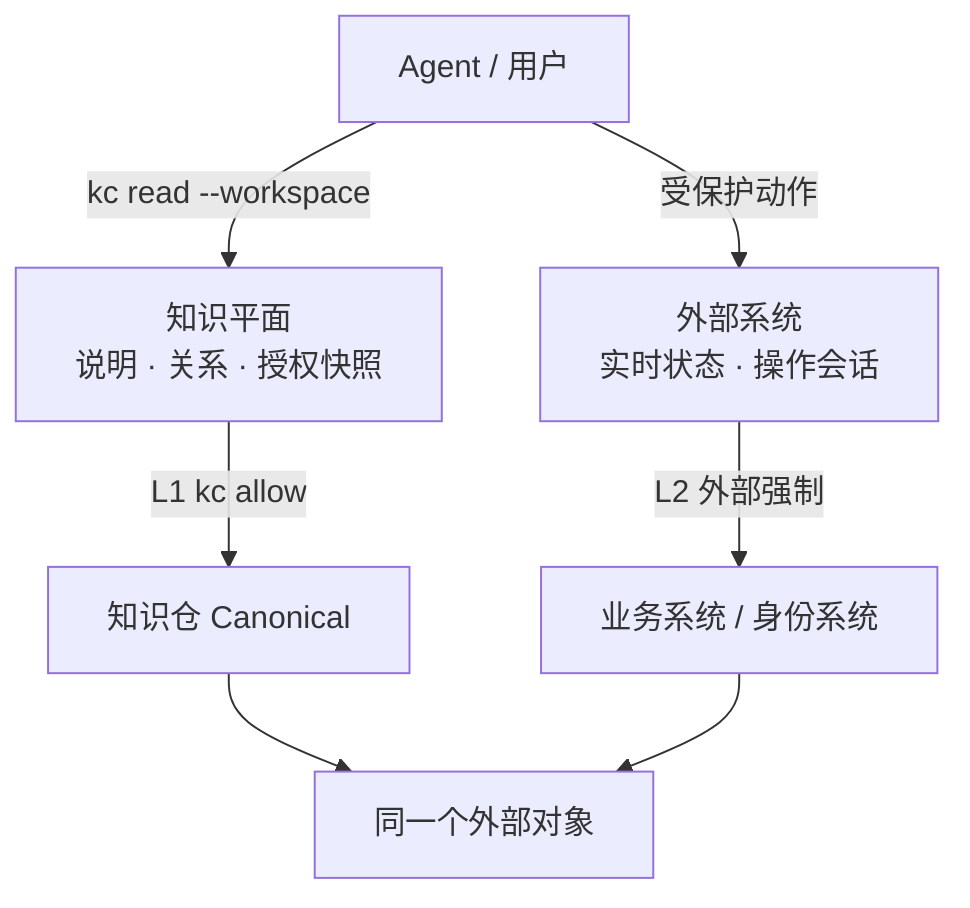
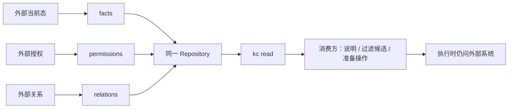

# 权限模型：按仓隔离、挂载组合、`kc allow` 发权

日期：2026-08-20  
范围：谁能对哪份知识跑哪条 `kc` 命令（L1）。不是外部业务系统授权的**强制**（L2），也不是检索形态。
对照：Git 托管 ACL、Microsoft Purview collections、Unity Catalog 隔离单元、Dataplex attach、dbt Mesh、DataHub policies。  
前置：`KNOWLEDGE_CATALOG_DESIGN.md`（F3、K-02、K-03、K-20、K-21、K-22）；`ASPECT_ACCESS.md`（`permissions` Aspect 是 SOURCE 知识，与 `structure` 同构）；`CONNECTORS.md`（入站镜像）；`HOOKS.md` / `GATES.md`（自定义检查不是 `allow`）；`WALKTHROUGH_v5.1.md`（现有 `kc` 闭环）。

本文回答四件事：权限边界为什么等于 Repository；Git 能接到哪；挂载组合什么；对外提供哪些 `kc` 命令。调用方标识一律用 CLI 动词，不再另造一套授权枚举。仓内的外部授权快照怎么写、怎么读，见 §1.1 与 `ASPECT_ACCESS.md`。

`kc allow` / `--as` 会求值 `.kc/allow.json`。不带 `--as` 当作工作区主人（开发态，与现有 CLI 测试兼容）。带 `--as` 时默认拒绝，必须有匹配规则。缺规则不得假装全开放。

---

## 0. 主张

底座封装操作语义、访问语义和 store。用户拿去接 Agent，权限自己配。

因此协议只做三件事：

1. **把治理边界做成 Repository**（一份独立身份、ACL、版本图、保留策略）。
2. **用已有组合命令拼消费面**（`define-workspace` / `read --workspace`），组合不发权。
3. **用 `kc allow` 声明哪个身份能跑哪些现有动词**。策略内容由部署填写，不是底座里的 RBAC 产品。

默认粒度：

| 问题 | 默认 |
|---|---|
| 正文安全边界 | 整仓 `--repo`（谁能打开这张 Snapshot 图） |
| 组合治理 | `--catalog`：谁能 `define-workspace` / `retire-workspace`；**不**发成员读权。公司级默认 **一间** `kr://<org>/catalog` |
| 写约束 | 可以收到 `--ref`、`--object`、`--aspect`、`--stream`（Address，不是路径） |
| 读约束 | 整仓。敏感差拆仓，不在同一仓内做对象级读 ACL。全员 Workspace 不含密级仓 |
| 外部操作强制 | 外部系统；不要写进 `allow.json` |
| 外部授权快照 | 可 `COMMIT` 成 `permissions` Aspect（知识，§1.1）；不当 `kc read` 闸门 |

---

## 1. 先拆开三套「权限」

口语里的权限在这里不是同一个东西。混在一起会把外部系统的细粒度授权做成几千个知识仓，或把 GitHub CODEOWNERS 当成读隔离。

| 层 | 管什么 | 权威 | `kc` 上的位置 |
|---|---|---|---|
| **Store 门禁** | 谁碰得了这份 git remote / `.kc/repos/<id>` 目录 | Git 托管、文件系统 | `repo-add` 打开 store；clone/deploy key 由用户自配 |
| **协议授权** | 谁能对哪个仓跑哪条命令 | `.kc/allow.json`（部署填写） | `allow` / `revoke` / `allowed`；现有动词加 `--as` |
| **外部操作强制** | 谁能在外部系统执行受保护动作 | 外部系统当场求值 | 不进 `allow.json`。仓内可有关于它的知识（§1.1） |

用户自己配的是前两层。第三层的**放行**永远是外部系统的事。仓内那份授权快照是知识，不是第三套 Catalog ACL。



Catalog 不在外部操作路径上。BROWSE ≠ USE。两套授权可以指向同一个外部对象，不要合成一条 `allow`。

### 1.1 仓内的外部授权快照是知识

`permissions` Aspect 与其他外部事实同构：Address、Writer `COMMIT`、`originKind=SOURCE`、在这次 `ResolveWorkspace` 解开的 commit 上可读、可 `READ` / `LOG` / `GET_PROVENANCE`。仓里记的是“某次 `producedAt` 外部系统对谁开放了什么”。落后、来自外部、消费方可拿去过滤——这是所有 SOURCE 知识的通性，不是特权子系统。



三句话：

1. **进 Canonical。** connector 对账后 `PUT permissions`，不是只能放 Redis。单独一仓仅当四元组要求（ACL / 所有权 / published branch 节奏 / 历史可见性），和分类知识同一招。
2. **允许晚于实际。** 同步周期 + 读者一次命令内冻结。露出 `sourceRefs` / `producedAt`。不要把“跟外部系统实时对齐”当 Catalog 成功条件。
3. **真正放行在仓外。** 副本说行、外部系统说不行，操作仍应拒绝。Catalog digest 不是外部授权的 GT。消费方可以用这份知识缩小候选，但不能绕过外部强制。

谁能看见这份知识，只问 L1 `kc allow`。不要用 Aspect 内容反过来当知识仓 ACL。检索面走 `schema/*` AccessHints：授权正文通常不声明 `text`；声明了 `filter` 才进入 IndexPlan。见 `ASPECT_ACCESS.md`。

---

## 2. 第一性原理

### 2.1 不可约事实

从 F3 出发，只有两件事不能丢：

1. **权威可独立。** 不同人对同一主题可以补充、限定、反对；查询层不得把分歧写成覆盖优先级（K-13）。
2. **授权范围不能被组合放大。** 把 ACL 不同的东西放进同一份可变状态，读者一拿就拿到不该有的历史、邻接对象和索引。

加上版本事实（F2 / K-05）：**一个 Repository 只有一张 Snapshot 图。** 一次 `put`/`commit`、一份 clone、一段 `log`、一次 CAS、一套保留，都作用在这张图上。

推论：

> 若 A、B 的读者集合、写者集合或历史可见性不同，却共用一张版本图，则「能打开这张图」这件事本身就会扩大授权。

对象上贴 ACL、按文件 path 授权，与这张推论不兼容：每次 `read` / `log` / `diff` / 投影 / 备份都要过滤；Git 适配器做不到（clone 是整仓）；索引要么按人建、要么事后裁。DataHub 用 Domain 做 workspace 边界时，每次授权要递归解析父域——这是「对象贴标签」路线的代价。

反过来：ACL 边界 = Repository，授权退化成「这个 `--as` 现在能不能对这个 `--repo` 跑这个命令」。复杂度是 O(成员仓)，不是 O(对象)。FileGit、backup、Retention 自然对齐。这就是按仓拆权限在原理上成立的原因。

K-20 是同一推论的读侧：`ResolveWorkspace` 解出的是 `repo → commit`，不授予权限。每次 `read` / `read --workspace` 按当前规则重算。一次命令内的坐标不能把当时的允许固化为未来访问权。

### 2.2 拆仓谓词（四元组）

所有权、ACL、Ref 节奏、历史可见性 **一致时才合并** 进同一仓。权限是硬条件，不是唯一条件。

| 不一致 | 若强行同仓 | 做法 |
|---|---|---|
| **ACL** | clone / `log` / 投影泄漏 | 拆仓 |
| **所有权 / 写权威** | 冲突被当成覆盖 | 拆仓；分歧写成另一仓对象，用引用指向公共对象 |
| **Ref 节奏** | 无法独立推已发布分支（物理小时级、语义周级绑在同一次 commit 历史上） | 拆仓；`define-workspace` 里各跟各的 selector |
| **历史可见性** | Git 不能对部分人藏旧 commit | 拆仓，或接受「能读现况就能读历史」 |

不要只按这些拆仓：源系统、文件类型、微服务、消费者人数、某一个 Agent、外部系统的单条细粒度授权。

经验规则（同类：dbt Mesh「跨项目若每周都要协同改，边界划错了」）：

- 两仓若必须经常在同一次变更里一起改，它们不是独立权威，应合并。
- 两仓若只是同一主题的不同断言，应保持拆开，不要合并成一个对象再靠文件 ACL 区分。
- 同一仓、同一 ACL、不同 Agent 的最小写权限 → `allow --cmd … --object …`，不是新仓。

**不要按外部系统的单条授权拆知识仓。** 那是第三层。否则一个外部对象一个仓，基数会爆。知识仓的基数目标是治理域或团队级的少量仓，不是对象级的几千仓。

### 2.3 同一对象、不同敏感度

优先拆成另一仓里的另一条知识（指向公共对象），而不是同一 `object_id` 上做 Aspect 级读 ACL。

例：物理仓里有表的 `schema`（采集写、多数 Agent 读）；分类/PII 标签若读者真是前者的真子集，放到 `kr://…/restricted/classif`，只给需要的身份 `allow --cmd read`。问答 Agent 没有这条规则，就拼不出它。

这就是「文件粒度大多不需要」的完整理由：敏感差若真到了安全边界，它已经不是同一权威下的一个 Aspect。

---

## 3. Git 能接到哪

Git **原生**安全粒度几乎只有：整仓、一条 Ref、推送是否允许、评审路由（CODEOWNERS：谁该审，不是谁不能读）。

| 已有 / 将有的 `kc` | Git 能对上 |
|---|---|
| 独立 `--repo` | 一个 remote / 一组 collaborators |
| `put` / `commit` + expected 旧值 | `update-ref` CAS / 禁非快进 |
| `propose` | candidate branch |
| `allow … --ref` | branch protection / rulesets |
| 仓门（clone、deploy key） | GitHub/GitLab 团队、PAT |

对不上的同样硬：

| 协议需要 | Git 做不到 |
|---|---|
| 每次 `read` 按当前规则重算（K-20） | 旧 clone 仍有全部历史字节 |
| `append` | 侧流是 gitignored JSONL |
| `read-workspace` 跨仓联合且防旁路 | Git 没有 Workspace |
| `--as` 身份 | `GIT_AUTHOR` 可伪造；签名是完整性不是授权 |
| 换 store（K-23） | CODEOWNERS 没有 PostgreSQL 对应物 |

结论：**版本 / CAS / 写入口可以对 Git；授权决策不能等于 Git。** FileGit 是 Adapter。GitHub 权限是一种部署门禁，与 `allow` 同向，不是另一套模型。

给 Agent 的是 `kc`，不要发成员仓 remote。人若直接 clone，仓门是 Git 托管——文件级 `read` 在这一层已经漏光。只有 Agent 永远不持有 clone 时，Address 级 **写** 约束才有意义；Address 级 **读** 仍默认不做。

CODEOWNERS、按 path 的 push ruleset，最多当 `propose` 的评审提示，不是 `read` 闸门。不要在协议里解释 GitHub 文件 ACL。

---

## 4. 业界对照

名字乱，结构同构。本仓库的 Catalog **不是** Unity 的 `catalog.schema.table` 容器（见 `catalog/README.md`）。

| 系统 | 硬隔离 / 治理原子 | 组合 / 发现面 | 和本模型 |
|---|---|---|---|
| **Purview** | Collection = metadata 的 security boundary；搜索只返回有权资产 | Unified Catalog；Governance Domain 与 collection 多对多 | `--repo` ≈ collection；`define-workspace` ≈ 组合面 |
| **Unity Catalog** | 数据隔离从 **catalog** 开始，不是 metastore；`USE CATALOG` 挡住「看见里面有什么」 | 三层 GRANT 是 **数据** 特权（`SELECT`）；另有 `READ METADATA` | Unity 的 catalog ≈ 我们的 `--repo`；我们的 `--catalog` ≈ 发现/组合 |
| **Dataplex** | lake / zone 是管理与安全边界 | 从别的 project **attach** asset（不拷数据） | attach ≈ `repo-add` + `define-workspace --source`（引用，不复制） |
| **dbt Mesh** | project = 所有权边界；安全要求高则一项目一 git repo | cross-project `ref`，不 import 源码 | project ≈ `--repo` |
| **GitHub** | repo 是 ACL 原子 | org / 多 repo | CODEOWNERS 是「不肯拆仓」的逃逸口，不提供读隔离 |
| **GCP / AWS** | project / account 是硬隔离 | folder / OU 组合 | 用资源 IAM 冒充隔离是公认反模式 |
| **DataHub** | Policy 按 Domain / platform instance 过滤；Policy 是另一类实体 | 单一图 + 事后授权 | 能细，但 Domain 做 workspace 边界时授权贵 |
| **Atlas / Ranger** | Ranger 独立特权库 | Atlas 搜实体 | 领域 GRANT ≠ 元数据 ACL |

Purview 实践几乎可当拆仓手册：按业务域建 collection，不要按组织架构嵌八层；collection 管「谁能碰这份元数据」，Unified Catalog 管「怎么找」；一个产品跨多个 collection 是正常的 many-to-many。

Databricks 把「隔离单元」和「表 GRANT」分开。按表 GRANT 拆知识仓，就是把 Unity 的第三层误当成第一层。

dbt 的垂直切分（PII 与下游、staging 与 mart）对应「受限断言另仓 + 公开对象保持稳定身份」。

**不抄：** Unity / Purview 的父级授权向下继承。那是目录树，和 K-03（scope 不是目录优先级）冲突。组合是 union：`read-workspace` 对每个成员仓单独 `allowed --cmd read`，不是子仓继承父仓。

---

## 5. 挂载、组合、发权是三个命令

口语都叫「挂载」，代码里早就不是一件事。

| 命令 | 语义 | 是否授权 |
|---|---|---|
| `kc repo-add --repo …` | 本机进程能打开这份 FileGit | 否。工作区能力 |
| `kc define-workspace --source <repo>=<selector>` | 这条配方 **打算** 包含它 | 否。意图 |
| `kc allow` | 某个 `--principal` 此刻能否跑某些 `--cmd` | **是。每次调用重算** |

`repo-add` 把登记表 id（例如 `kr://acme/catalog`）加进去会被拒绝：登记表不是成员 Workspace 的 source。

挂载是引用，不拷贝。对标 Dataplex attach、dbt cross-project `ref`，不对标 git submodule。产品形态：用户给 git 链接、授权平台只读（⓪+①），登记表不收正文。当前 `repo-add` 仍是本机新建 FileGit。拷贝会复制 ACL 边界。

产品上冻死：

1. **`define-workspace --source` ≠ 这条配方的所有读者都能看见该仓。** 无仓权的成员对这个 `--as` 不存在，且不能靠计数、错误码、边泄漏。无权与不存在对外不可区分。
2. **不要靠静默裁剪当 UX。** 给财务 Agent 单独一条只含它有权仓的 workspace 和对应 `allow`。把受限仓写进全员可见的配方再靠运行时抠掉，配方本身就会泄漏（谁能 `read --catalog` 谁就能看见当前 source 列表）。
3. **一次 `commit` / `put` 仍只打一个 `--repo`（K-01）。** 没有跨仓事务（K-22）。若业务觉得必须原子，说明边界划错了，应合并仓。
4. **配方的可见性 = 配方载体的可见性。** 第 1 条约束的是**中心化列表**：不该从公司登记表里枚举出自己无权的仓。它不约束**用户主动分享的 Workspace 定义**——alice 把配方提交进自己的仓、bob clone 到它，bob 因此知道那几个仓存在，这是 alice 的自由。要保护的是**内容**，由那些仓自己的 ACL 保证：bob 拉不到就是拉不到。此时如实报告「这条 mount 你拉不到」比假装它不存在更合适，因为他手里的配方已经写着它了。见 `COMPOSITION.md`。

---

## 6. 操作面

### 6.1 现有动词就是动作表

不引入 READ / WRITE / COMMIT 这种授权枚举。动作就是这些命令：

| 组 | 命令 | 规则挂在 |
|---|---|---|
| 工作区 | `init` `catalog-add` `repo-add` `status` | 本机 `.kc/`，**不是**知识 ACL |
| 写仓 | `put` `remove` `commit` | `--repo`（同一写面：改 Snapshot 并推 Ref） |
| 提案 | `propose` | `--repo`（只写 candidate，不改 `main`） |
| 合入 | `merge` | `--repo`（快进目标 Ref；下次 `read --workspace` 可见） |
| 事件 | `append` | `--repo` + `--stream` |
| 读仓 | `resolve` `read` `list` `log` `diff` `provenance` | `--repo` + 版本（维护方） |
| 读流 | `stream` | `--repo` + `--stream` |
| 改组合 | `define-workspace` `preview` `validate` `record-validation` `retire-workspace` | `--catalog` |
| 读组合 | `read --catalog`（allow `--cmd read-catalog`）`read --workspace`（allow `--cmd read-workspace`；含 `list`/`search`/`log`/`provenance`/`checkout --workspace`）`audit` | `--catalog`；消费读再加 `--workspace`，再按成员仓 `read` 裁剪 |

一条 `allow` 的 `--cmd` 不得跨写面混装。可一起写的组：

```text
put,remove,commit                         # 权威 Snapshot
propose                                   # 建议
merge                                     # 合入（可与 preview,validate 一起，若约束相同）
append                                    # 事件
resolve,read,list,log,diff,provenance     # 读仓
stream                                    # 读流
define-workspace,retire-workspace                   # 改登记表
preview,validate,record-validation        # 维护闭环（Preview 在 ControlState）
read-catalog,read-workspace,audit              # 读 Catalog 当前态 / Workspace / 登记表记录
```

`put` 与 `propose` 不能写在同一条规则里：幂等键、监控和「是否已进 main」不同。这就是原先「一个 Binding 一个 Surface」，用 `--cmd` 表达，不另做一个对象。

### 6.2 新增四个命令

| 命令 | 干什么 |
|---|---|
| `kc allow` | 加一条规则 |
| `kc revoke` | 按规则 id 删掉 |
| `kc allowed` | 列出规则，或问「这次调用过不过」 |
| `kc whoami` | 打印当前 `--as`（或默认身份） |

现有写/读/组合命令加 `--as <principal>`。网关从 token 填。本地不传则等于工作区主人（能写 `.kc/` 的人），行为与现在兼容。

**不加：** `grant`（避免和表特权混）、`role` / `group`（组在 IdP）、`bind`、`--path`、继承、按对象默认 `read` ACL。

元权限：谁能改规则 = 谁能写 `.kc/`（文件系统）。`kc allow` 只是改那份文件。Agent 拿不到 `.kc/` 的写权限。

### 6.3 一条规则

```text
kc allow --principal <who> --cmd <verbs> --repo <kr://...>
         [--ref <ref>] [--object <glob>] [--aspect <name>] [--stream <name>]
```

组合空间把 `--repo` 换成 `--catalog`：

```text
kc allow --principal <who> --cmd <verbs> --catalog <kr://...>
         [--workspace <id>]
```

| 旗标 | 含义 |
|---|---|
| `--principal` | 被授权身份（producer、alice、IdP 的 `user:…`）。不是 git author |
| `--cmd` | 逗号分隔的 **CLI 动词** |
| `--repo` / `--catalog` | `--repo` 管正文动词；`--catalog` 管组合动词。登记表 id 如 `kr://acme/catalog`，不要 `repo-add` |
| `--ref` | 写才有意义。例如 `put` 只许 `refs/heads/main`；`propose` 只许 candidate |
| `--object` / `--aspect` | Address 约束，**不是路径**。读默认不要加 |
| `--stream` | 只约束 `append` / `stream` |
| `--workspace` | 消费读（`read` / `list` / `search` / `log` / `provenance` / `checkout`）能碰哪条配方。`read --workspace` 的 allow 动词是 `read-workspace`。`audit --workspace` 仍是登记表 git，不走这条 |

默认拒绝。没有匹配规则就不能做。`repo-add` 之后只有工作区主人不受这张表限制——否则自己锁死自己。Agent 必须有规则。

```text
kc revoke --id alw_…
kc allowed --principal producer
kc allowed --as producer --cmd put --repo kr://example/org/reference \
  --object Record:item-1 --aspect facts
kc whoami
```

`allowed` 带齐调用参数时：过则 exit 0，不过则 exit 非 0。`put --as ingest-bot …` 等于先跑同一条 `allowed` 再执行。

### 6.4 一次 `read --workspace` 怎么过

```text
kc read --workspace team-space --object Record:item-1 --as consumer
```

1. `allowed --as consumer --cmd read-workspace --catalog kr://example/catalog --workspace team-space`
   不过则整个命令失败（解不了配方）。消费动词 `read` / `list` / `search` / `log` / `provenance` / `checkout --workspace` 走这条 allow 面。`read --catalog` 走 `--cmd read-catalog`。`audit` 读登记表 git，不走 `read-workspace`。
2. 这次 `ResolveWorkspace` 变成 `{ reference → C1, policies → C2, personal → C3 }`（命令内冻结）。
3. 对每个成员：`allowed --as consumer --cmd read --repo <成员>`。
   过 → 在这次解开的 commit 上 `read`。不过 → **当这个来源不存在**。
4. `define-workspace` 把额外成员写进配方，**不**让 consumer 因此能读。

写更短：

```text
kc put --as producer --repo kr://example/org/reference --object Record:… --aspect facts …
```

只问 `allowed --cmd put --repo … --ref … --object … --aspect …`。一次 `put` 仍是「改一个 Address 并提交」；授权看的是动词 `put`。

### 6.5 调用可观测性

Agent 的身份不是自定义 JSON，就是这次调用的 `--as`（HTTP：`X-Kc-As`）。关联一次网关/会话用 `--request-id`（HTTP：`X-Kc-Request-Id`），只是指针，不是档案。

Catalog 改动少，记录就是登记表 git 提交：作者是 `--as`（空则 `owner`），说明里带 `Request-Id` / `Rule-Id`。当前态是 `kc read --catalog`；历史是 `kc audit`。知识写入记在那个仓库自己的 git 里。不要另开 ops 流。

成功的读不进 git。拒绝（FORBIDDEN）只在本机 `.kc/audit.jsonl`。

Agent 是谁、属于哪队、用哪个模型：要当知识读就 `COMMIT` 成仓内对象。组在 IdP。网关负责把 token 写成 `--as` + `--request-id`。

---

## 7. 默认与落盘

```text
.kc/
  layout.yaml         # 本机目录（repos / catalogs / projections / checkouts）
  stores.yaml         # 引擎 + 托管 host（无密码）
  audit.jsonl         # kc facade 时间线（含 init / allow）；不是知识
  system.jsonl        # 协议面过程账（Writer / Catalog / ControlPlane / Reader）；不是知识
  writer.json         # command_id 幂等（已有）
  allow.json          # 本文件的规则；不是知识，不进成员仓，不进 FTS
  catalogs/
    <encoded-catalog-id>   # 这一间登记表 git：catalog.yaml / workspace-*.yaml / …
  repos/
    <encoded-repo-id>
  checkouts/
    <workspace-id>/             # kc checkout --workspace；可丢；不是权威
```

规则不是知识，不 `put` 进 public 仓。以后若要审计版本，可另开 `kr://acme/policy`，仍然用仓级 `allow` 管谁能改它——现在不必。

默认：

- 无 `allow.json` 或空表：仅工作区主人可调用。这是开发态，与当前 CLI 测试兼容。
- 缺规则不得静默当成「全开放」。生产网关必须带 `--as`，且 Agent 不持有成员仓 remote。
- `repo-add` 不产生任何 `allow` 行。
- `*` 或「世界可读」必须显式写一条 `--principal` 规则，不要靠缺省。

与旧契约的关系（`KNOWLEDGE_CATALOG_DESIGN.md` 附录 D / G1）：

- 用户看见的 action 是 `kc` 动词，不是 `READ | WRITE | RESOLVE`。
- 写侧规则（`--cmd put,remove,commit` / `propose` / `append` + `--repo` + `--ref` + `--object`）就是原先 WriteBinding 的投影，同一张表，不是第二套权限。
- `kc allowed` 的一次结果就是原先 AuthorizationDecision（principal、cmd、repo、allow/deny、命中的规则 id）。需要审计时记下规则 id 与当时 `allow.json` 的版本；一次 `ResolveWorkspace` 不冻结这份决策（K-20）。

---

## 8. 接 Agent：通用配置原则

通常是一间组织 Catalog、若干按治理边界拆分的 Repository、若干 Workspace 和一组显式 `allow`。主人先挂载 Repository、写入知识并定义 Workspace，再向 Agent 身份发放所需动作；`repo-add` 和 `define-workspace` 都不隐式发权。

```text
kc allow --principal producer \
  --cmd put,remove,commit \
  --repo kr://example/org/reference \
  --ref refs/heads/main

kc allow --principal reviewer \
  --cmd propose,preview,validate,merge \
  --repo kr://example/org/policies \
  --catalog kr://example/catalog

kc allow --principal consumer \
  --cmd resolve,read,list,log,diff,provenance \
  --repo kr://example/org/reference
kc allow --principal consumer \
  --cmd read-workspace \
  --catalog kr://example/catalog \
  --workspace team-space
```

Agent 只通过 `kc` 或等价 facade 进入，不持有成员仓 remote。Workspace 包含多个成员时，principal 必须分别拥有所需成员仓的读取动作；无权成员不能因为被写入配方而变得可见。

外部系统自己的授权决定与 `kc allow` 分开：外部权限快照可以作为知识写入，但不能替代实时强制系统，也不能放行 `kc` 动词。具体场景的身份、Repository 和 Aspect 配方由各 scene 的 validation 文档维护；数仓示例在 `scene/data-warehouse:validation/docs/INTEGRATION_BOUNDARIES.md`。

---

## 9. 明确不做

- 不在协议里做 GitHub 式文件 ACL / CODEOWNERS 解释器。
- 不做 `--path` 授权。路径不是身份（K-04）；对象会移动（F1）。
- 不把 `permissions` Aspect 当成能不能 `kc read` 的依据（L1 只问 `allow`）。
- 不按表 GRANT 拆知识仓、不按 Agent 拆仓、不按消费者 workspace 拆仓。
- 不把仓内 `permissions` digest 当成 SELECT 放行。
- 不把 `define-workspace` / `repo-add` 当成发权。
- 不做角色对象、组对象、继承树。要组，在 IdP 里做成一个 `--principal`，或重复几条 `allow`。
- 不把对象级 / 文件级 **读** ACL 当主模型。那会让版本图不再是安全边界，和 Git 适配、K-20、防旁路、可替换 store 一起打架。
- 不给 Agent 发成员仓 clone 再谈对象级只读。
- 不新增跨仓事务来「补」拆仓的代价。

这 10% 用别的机制，不靠拆仓硬盖：

| 缺口 | 处理 |
|---|---|
| 同一仓、同一 ACL，不同 Agent 写不同 Address | `allow --object` / `--aspect` |
| 外部受保护动作 | 问外部系统。仓内 `permissions` 是知识：消费方用来过滤候选，不当放行 |
| 90% 读者重叠、10% 多看一个受限集 | 受限集单独一仓；特权 workspace 多一个 `--source` |
| 想「子仓继承父仓权限」 | 两条独立 `allow` + 一条 `define-workspace` union |
| 自定义检查 / CI / 审批 | 出站见 `HOOKS.md`；清单与 `record-validation` 见 `GATES.md` |

---

## 10. 实现与验收

当前：`kc allow` / `--as` / `.kc/allow.json` 已求值。FileGit 本身无 ACL；无权由 facade 返回 `FORBIDDEN`。`permissions` Aspect 的写入走 Writer（与其他 SOURCE 知识相同）；IndexPlan 只编 AccessHints 声明过的 path。WALKTHROUGH 从 `init` 到 `read --workspace` 的闭环仍可按主人身份（不带 `--as`）走。出站 hook 与 merge gate 见 `HOOKS.md` / `GATES.md`。外部授权镜像见 `CONNECTORS.md`。

验收（已覆盖部分）：写路径认 `--as`；`read-workspace` 按成员仓裁剪（Workspace 不发权）；省略 `--catalog` 时与第一间 Catalog 的 `allow` 对齐；主人无 `--as` 仍能跑现有 CLI 测试。HTTP facade 是 `kc serve`：把 `X-Kc-As` 变成 `--as`，不要在网关里另做一套角色树。MCP 仍属 Application 缺口。
