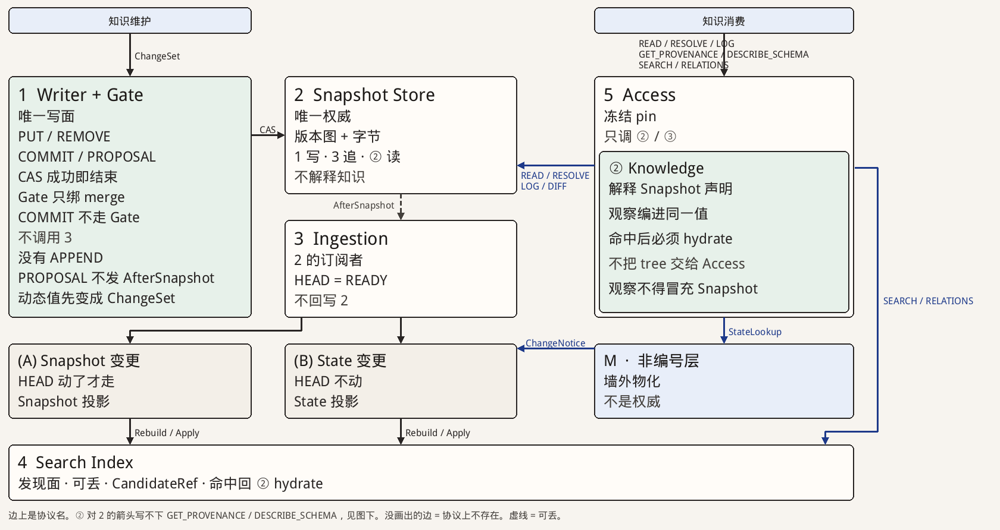

# 系统核心架构

定位：整理稿。回答运行时核心分成哪几面、为什么是这个结构。编号 **1–5 是运行面**，不是协议分层 ⓪ Snapshot → ① Catalog → ② Knowledge → ③ Retrieval。边上的名字取自已有公开合同。**5 Access 是应用入口，不是第④协议层。** 不写适配器、包名、引擎或操作步骤。

核心判断：1 与 3 都骑在 2 上，不是「写入 → Snapshot → Ingestion」一条写流水线。写在 **CAS 成功** 时结束。消费从 Access 进入：精确读走 ②，发现走 ③ Retriever（碰 4）只拿 CandidateRef，命中后必须回 ② hydrate。Access 不直连 2 / M / (B)，也不把 4 当正文。墙外 M 不是编号层。① Catalog 在图上压进 AfterSnapshot 这条虚线：2 发出 `Advanced`，Catalog Hook 名叫 AfterSnapshot，3 经订阅接到坐标。

本页只覆盖核心运行面。鉴权、出站 Hook、访问证据、宿主挂载、CLI/HTTP 是外围：可以挡住或包装这些面，不能成为新的核心编号层，也不能改失败语义。

组织：1 与 2 同排（CAS 横写）。3 挂在 2 下（订阅，不是下一刀）。5 与 1 同为入口。绿色是 ②。虚线可丢。

---

## 边上的语义

图上每条边都对应一条已有公开合同（类型或端口方法），不是为画图起的名字。**没有画出的调用表示协议禁止或不存在**（尤其是 1↛3、5↛2、5↛M、5↛B、3↛2 写回）。3 到 (A)/(B) 的连线只表示控制器里的两条 lane，不是第三条协议。3 编译投影时复用同一套 ② 精确读（不另画，避免看起来像 3 有自己的读面）。

| 记号 | 从 → 到 | 语义 |
|---|---|---|
| **ChangeSet** | 维护 → 1 | 不可信输入变成一次写意图。动态值要版本化，必须先成为 ChangeSet。没有 APPEND。 |
| **CAS** | 1 → 2 | 条件提交。成功 = Receipt = 权威已推进。写在这条边上结束。投影尚未追上，不撤回这条边。 |
| **AfterSnapshot** | 2 → 3（虚线） | 这是压缩后的订阅缝，不是 Store 调用 Ingestion。⓪ 发出 `Advanced`（from / to，无 object_id）；① `catalog.Hook.AfterSnapshot` 同形；sidecar 再叫醒 3。可丢，不回滚 2。PROPOSAL 不发。Desire 是控制器内部挂号，不是这条边。 |
| （无新协议名） | 3 → (A) / 3 → (B) | AfterSnapshot 进 Snapshot 投影 lane；(B) 消化 ChangeNotice。 |
| **Rebuild / Apply** | (A) → 4；(B) → 4 | `ProjectionMaintainer` 的写口。Snapshot 投影跟 commit；State 投影跟 observation basis。两条 lane 不共用 READY。4 没有自己的写面。 |
| **READ / RESOLVE / LOG / GET_PROVENANCE / DESCRIBE_SCHEMA / SEARCH / RELATIONS** | 消费 → 5 | ② 精确读与 ③ 发现。一次请求开始时冻结 pin，中途不跟随 HEAD。`DIFF` 是维护向的对象历史三问之一，不走消费入口。`Refine` 是 SEARCH 之后的收窄，不是新入口。 |
| **READ / RESOLVE / LOG / DIFF** | ② → 2 | Knowledge 按冻结坐标解释 Snapshot 上的 unit。**不是** Access 直连 Snapshot。图上这条短缝写不下 `GET_PROVENANCE` / `DESCRIBE_SCHEMA`，与消费入口是同一套 ② 合同。 |
| **SEARCH / RELATIONS** | 5 → 4 | 两条缝不要并成一条：③ Retriever 只返回 CandidateRef；公开 SearchResult 在 ② hydrate 之后才带 KnowledgeValue。图上这条蓝线是发现半段。命中回 ② 不另画「正文边」，避免看起来像 Index 在返回知识。 |
| **StateLookup** | ② → M | 消费时按 Binding 取当前观察，编进同一个 KnowledgeValue。(B) 投影刷新走同一端口，不是第二条 runtime 协议；图上只画消费向。 |
| **ChangeNotice** | M → (B) | 只定位、不带正文；再按 Binding 取观察。这是投影通道，**不是读口**。消费走 StateLookup，不走这条边。 |

A 与 B 是 3 的两条 lane，不是第 6、第 7 层。

---

## 跨层判断

- 权威只在 2。4 可删可重建；丢 2 则知识不可恢复。
- 1 与 3 彼此不调用。接缝只有 AfterSnapshot 里的坐标。正确性是 `published HEAD ≟ provider READY`，不靠把 AfterSnapshot 做可靠。
- 写只经 1。Collector、runtime、4、5 都不得直写 2，也不得直写 4。
- 消费只经 5 调 ② 与 ③。5 不解释 tree，不进 B，不直连 M，不把 4 当正文。5 可以经 Retriever **碰** 4，那是发现口，不是权威口。
- 动态观察有两个用法、同一套 Binding：StateLookup 给读；ChangeNotice 只定位，再按 Binding 取观察，只给投影抽检索字段。
- ③ 命中后必须回 ②。Index 文档、缓存、observation 都不能冒充 Canonical。
- 组合配方在 5 冻结 pin 时变成坐标，不是与 2 并列的另一种 Store。

---

## 1. Write & Governance

**定位。** 维护端入口。不可信输入在这里变成可复现的写意图。写面就是 ② Writer；Gate 回答治理跃迁，不回答「Index 里有没有」。

**语义。** 一次一个 target；代数只有 PUT/REMOVE；Surface 只有 COMMIT 与 PROPOSAL。Binding 只版本化访问声明，这里不调用 runtime、不写入瞬时观察。Gate 绑在 Preview 上，走 merge，不走 COMMIT，也不拦 READ。COMMIT 成功才有 Receipt，并才可能发 AfterSnapshot；PROPOSAL 停在提案，不发 AfterSnapshot。

**失败。** 未提交，或形成提案。没有「写进一半、4 当权威」。

---

## 2. Snapshot Store

**定位。** 唯一权威：不可变版本图加上该版本上的字节。1 写它，3 追它，② 读它。它两边都不认识。

**语义。** 成功提交产生新的不可变坐标。它不解释 unit / Schema / Binding，不建索引，不存 runtime checkpoint。挂上 2 不等于内容可被 READ / SEARCH。适配器可换；没有版本图与 CAS 的对象桶不能冒充本层。旧坐标必须仍能读回；容量收敛不靠删历史冒充「已替换」。

**失败。** CAS 冲突、缺能力、坐标不存在。不得把「4 里还有」当成权威还在。

---

## 3. Ingestion

**定位。** 2 的派生订阅者，不是写面的下一站。没有它，4 就会被 1、Collector 和查询同时改，或在查询时现场重建。

**语义。** 与 1 的接缝只有 AfterSnapshot 上的坐标（可丢）。对账的真相是 published HEAD 与 provider READY；控制器自己的队列不是真相。A / B 共用调度，不共用 basis 与进度。声明（Schema、Binding 句柄）仍在 2 里，不是第三条变更通道。查询路径不 build，也不靠一次性 Open 冒充追赶。

**失败。** 未追上则不宣称 READY。SEARCH 看见的是不可检索，不是「权威里没有」。投影失败不回滚 2。

---

## 4. Search Index

**定位。** 发现面。让 SEARCH 不必扫描权威正文。它自己不是知识。

**语义。** Snapshot 投影跟 commit，State 投影跟 observation basis；不能合成一个 READY。查询只返回无正文候选。命中后走 ② hydrate：静态从 2 解释，动态经 StateLookup 编进同一值。缺 READY 或 basis 不对时失败关闭，不得把 BUILDING 当成空结果。

**失败。** 不可检索，而不是「权威里没有」。权威在不在只由 2 回答。

---

## 5. Access

**定位。** 消费入口。不是解释器，也不是与 2 并列的控制面。

**语义。** 上列读/发现合同进入后冻结 pin，只调 ② 与 ③。精确读的取值在 ②（需要时加 StateLookup）。SEARCH / RELATIONS 的发现在 4（CandidateRef），取值仍回 ②；调用方看见的 SearchResult 已经 hydrate，不是 Index `_source`。动态值同时带声明 basis 与观察 basis。`ResolveBinding` / Binding 观察是 ② 声明口加 StateLookup，不是新的编号入口。鉴权若发生，在 hydrate 之后、返回之前，不得用「没权」改候选身份。

**失败。** 坐标不存在、basis 冲突、4 未就绪。不得说成「没有这条知识」，除非 2 上确实没有可解释的 ② 对象。

---

## 否决

把 `ChangeSet → 1 → 2 → 3 → 4` 当成一次写事务或发布工序。那种模式把「4 里有了」做成发布成功，投影失败会回压或回滚权威。选定的结构是：CAS 结束写入；AfterSnapshot 可丢；A/B 是 3 的派生 lane。

---

## 外围（本页不展开）

鉴权、交付遮罩、出站 Hook、访问证据、宿主文件投影、CLI/HTTP 适配。它们不得直写 2、不得直写 4、不得把采样当成访问证据、不得把挂载变成 COMMIT。

---

## 下一步

下一篇只写 **Snapshot Store**：合同、能力声明、禁止越过的边界。
