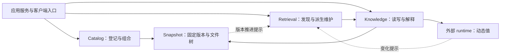

# 架构总览

Knowledge Catalog 是通用知识底座。它让使用者能确定一份知识的身份、版本与来源，控制它
怎样被修改，并把不同来源组合起来消费。检索是发现手段，外部运行时是动态值的来源，
两者都不因此取得知识仓的写权。

系统复杂度主要来自边界被混用：把索引当正文、把组合当发权、把观察当知识版本、把后台恢复
塞入一次请求。设计应消除这些混用，不再增加一套运行面编号。

它不是检索应用，不是个人笔记库，也不是某个开源元数据产品的改包装：知识同时面向人与
Agent，可寻址、可复现、可归因、可维护。接入面与消费面是两种边界，不能合成一层：接入
接受不可信输入并改变事实，失败语义只有「未提交」或「形成提案」；消费不得改变权威状态，
先固定版本坐标再逐请求鉴权。两者的权限模型、流量模型与扩展方向都不同，压成一层会掩盖
差异，诱发把消费请求当写入通道或把写入当查询优化的设计。

## 四个核心边界

| 组件 | 拥有什么 | 边界的理由 |
|---|---|---|
| Snapshot | 不可变版本、文件树与条件推进 | 固定版本必须独立于知识解释和检索存在 |
| Catalog | Repository 登记与 Dataset 发布 | 组合文件不需要先理解文件中的知识 |
| Knowledge | 身份、Schema、来源、读写与治理语义 | 同一份知识不能随路径、存储介质或入口改变解释 |
| Retrieval | 候选定位、查询计划与派生维护 | 检索可以替换、重建，不能决定正文是否已发布 |

原有 ⓪–③ 仍指这些协议边界，不表示每次请求依次经过四个步骤。Catalog 和 Knowledge
分别使用 Snapshot；Knowledge 不因为组合层持有仓连接就把解释职责交给 Catalog。

图表示职责之间的协作，不是 Go import 图。两个 Snapshot 使用方可以连接不同仓；
外部 runtime 通过 Knowledge 拥有的窄端口被访问。应用服务负责装配与政策执行，
不是新的协议层。具体依赖限制仍由现有架构守卫维护。

## 协议边界之内还要分清组件责任

四个协议边界不能代替完整组件设计。声明式索引决定知识允许怎样被查，索引控制使派生状态
满足持续服务需求，检索执行本次查询；三者分别承接声明变化、后台恢复与请求正确性。
Dataset 则管理消费范围和发布版本，与单个来源的写入生命周期分开。

权限体系决定身份与访问边界，应用服务在各入口强制执行。Hook 调用外部系统，Gate 检查
精确预览证据；二者协作但互不替代。CLI 负责用户怎样理解与完成任务，服务负责这些任务
如何调用同一应用能力。上述责任各有可独立评审的设计，不因为在同一进程里就压成一个段落。

对象组装的公开语义只有一条实现路径：保留两份组装实现靠人工同步，是提供方语义分叉的
入口。unit 代数只产出对象级变更，不包含路径、扩展名或序列化细节；文件编码只属于文件
提供方的编码层，让新提供方不必接受「文件」概念。跨请求的知识对象缓存也不属于协议边界
本身：Snapshot、Catalog 与 Reader 不持有其具体实现，读取侧只暴露 Knowledge 拥有的同版本
hydrate 窄端口，完整对象与地址缓存由上层缓存组件实现并经应用装配根注入；该端口不提供
候选定位、知识写入、后台扫描或动态观察缓存。

## 三条路径足以解释运行

**发布知识。** 接入方把变更交给 Writer；校验和单仓条件提交成功，知识便已发布。
投影可以稍后追上，不能因为索引或通知失败撤销已经接受的提交。需要评审时先形成提案，
对固定预览取得证据，再合并目标仓。

**消费知识。** 应用服务先确定主体、授权和本次范围。已知身份直接读取；不知道身份时先
检索候选，再按候选的同一依据回读正文。Dataset 在请求开始时固定文件清单，读取、分页
和回读不能中途改用新的来源版本。

**维护派生状态。** 后台从固定版本或动态观察构建投影。通知只缩短延迟，对账承担恢复。
一次请求只选择可用能力；没有合适投影时明确失败，不能临时扫描全库或同步建索引。

动态观察的完整值可能需要独立保留，以支持原依据重读。这份证据与可删除的搜索索引不同，
但仍不成为 Snapshot 中的知识版本。需要把观察变成知识时，显式选择内容并经 Writer 发布。

## Snapshot 为什么保持简单

Snapshot 不解释知识身份、Schema 或查询。不可变版本让旧引用可复核，条件推进让并发写入
不会互相覆盖；只有文件读写、没有版本与条件提交的介质不能冒充它。能力不足应由协议明确
拒绝，而不是由上层猜测或模拟成功。

更换 Snapshot 底座的目标是新增适配器，而不是重写上层：判定对象是能力与跨提供方对拍
证据，不是接口形状相似。缺能力若不能在装配与一致性检查期暴露，只会在亿级对象上以全量
扫描或内存耗尽的形式暴露。替换若需要修改 Reader 或 Writer 的公开语义，即判定为抽象
破损——先修合同，不顺势改协议。变化识别（在两个固定坐标之间求差）因此是一等能力而
非可选性能件：缺失时退化是仓总量级的双全量比较，建投影路径必须显式失败，不得静默退化
为全量对账。规模权威提供方不得暴露绕过知识不变量的原始路径写入口；普通文件能力由明确
命名的适配层承担，不留在权威提供方上。公开消费面也不提供对象实例列举，全量遍历只属于
显式维护入口，其工作量受变更与目标规模约束。

当前部署采用 lakeFS。存储适配器决定怎样实现这些保证，不改变上层语义，也不要求本轮
扩展其它适配器。要更换后端时，采用条件同样是能力性的：有界读取、单仓原子写入、历史
可迁移与恢复要求，并用带环境与输入来源的规模证据验收；不能仅凭选型名称推出容量上限，
也不能反过来为迁就新介质修改知识协议。权威介质上的对象保留是一等约束：不得配置会清除
已提交历史版本的保留策略——按天数清理「已替换的已提交对象」会让旧版本坐标读不到正文，
即使版本图仍在也不满足固定依据回读的承诺。容量收敛由仓的代际边界承担，不由删历史承担；
垃圾回收只针对未提交残留与已废弃分支。

持续运行不押注单个版本图无限增长：活动仓分代有界，旧代只读归档。旧版本坐标仍可显式
挂载读取，普通应用只见活动代；归档改变写入与生命周期边界，不等于物理压缩，垃圾回收
不能被描述成对仍可达历史的压缩承诺。

Catalog 自己的登记历史同样使用独立 Snapshot，不混入成员知识仓。

## 使用者应当看到的结果

- 接入方发布后能按回执版本读取知识；索引尚未追上时，看到的是检索未就绪，而不是写入失败。
- 消费方组合两个来源时仍能分辨各自身份与版本；同名对象不会因加载顺序覆盖。
- 外部状态改变可以更新动态查询，但知识仓版本和固定文件视图保持不变。
- 替换服务实例后恢复原登记与授权；丢失派生索引可以重建，丢失权威或承诺保留的证据不能假装初始化成功。

## 协议入口

[Snapshot Store](../../snapshot/store.go) 与 [包用法](../../snapshot/README.md)、
[Catalog](../../catalog/README.md)、[Knowledge](../../knowledge/README.md)、
[Retrieval](../../retrieval/README.md) 是可执行边界的入口。
源码依赖由 [架构守卫](../../internal/arch/README.md) 约束。本文不复制方法、字段、错误码或
适配器配置；也不以当前包拆分数量决定设计书篇数。
