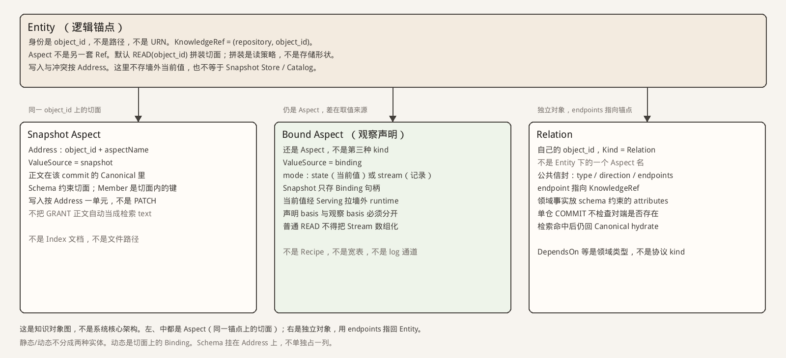

# 核心概念（知识对象）

定位：整理稿。回答 **知识长什么样**：谁是锚点、切面怎么挂、动态值存在哪、关系是不是切面。

这不是系统核心架构。运行分层、Snapshot、Ingestion、Index、Access 见 [`core-architecture.md`](core-architecture.md)。本页不画那些盒子。

结构可以对着常见的「实体 → 静态切面 / 动态契约 / 关系」来读，但名称和边界以本系统为准：

- 锚点是 `object_id`，不是 URN，也不是 Snapshot 路径。`KnowledgeRef` 是 `(repository, object_id)`。Aspect 不是另一套 Ref。
- 左、中两列都是 **Aspect**（可再拆 Member）。差别只在 `ValueSource`：`snapshot` 的值在 commit 里；`binding` 只把观察句柄版本化，当前值经 Knowledge Serving 去墙外。
- 右列 **Relation** 是独立对象（自己的 `object_id`），用 endpoints 指向 `KnowledgeRef`。它不是 Entity 上名为 DependsOn 的 Aspect。领域关系类型由 Schema 约束，不是协议 kind。
- Schema 挂在 Address 上，不单独占一列。拼装是读策略，不是另一种 Store。

否决：把动态切面做成第三种 Address kind；把 Recipe / TTL / 宽表写进对象图；把 Relation 画成 Entity 的附属字段；把这张图叠进核心架构。

独立验收以后写在 Knowledge / Binding observation 能力篇。本页只定对象图。
